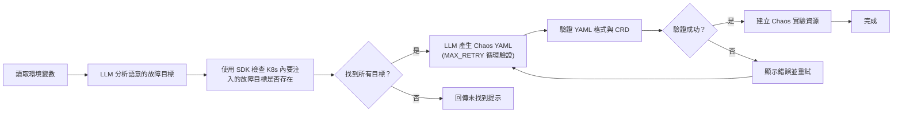
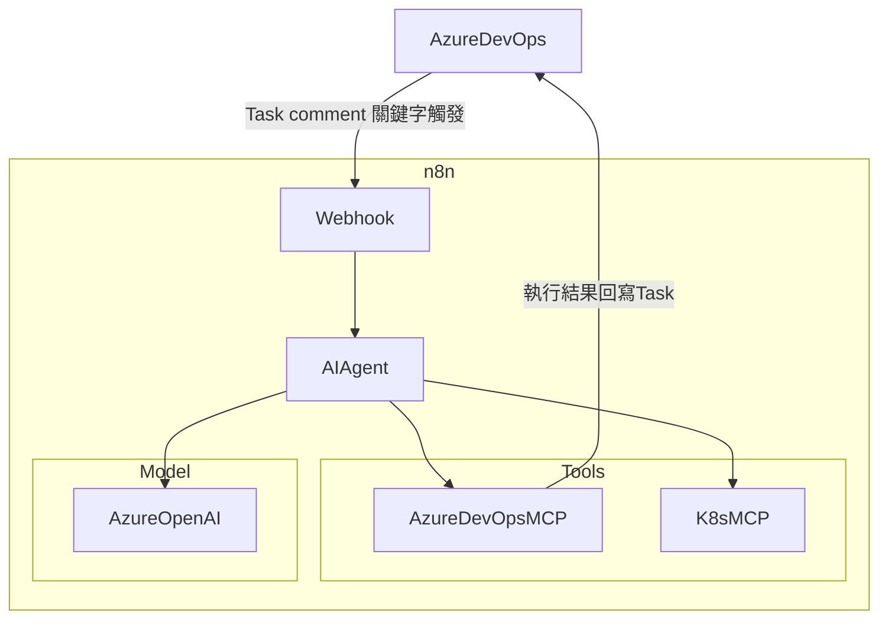

# 自然語言注入混沌工程

### 什麼是混沌工程？

**混沌工程（Chaos Engineering）**並非刻意製造混亂，而是一種系統性的實驗方法。它的核心是透過在受控環境中**主動注入故障**（如網路延遲、CPU 壓力、服務崩潰），來觀察系統的反應，從而識別出潛在的弱點和故障模式。最終目標是提升系統的**韌性（Resilience）**。

### 簡單案例：測試系統韌性

舉個簡單的例子：

假設你運營一個電商網站。在一個重要的促銷活動前，你決定進行一場混沌實驗。你向系統發出指令：「**模擬資料庫服務的網路延遲增加 300 毫秒。**」接著，你觀察購物車、結帳等核心服務是否能自動切換到備援機制、是否會出現服務超時，以及用戶體驗是否受到影響。

### 傳統自動化的「僵化」困境

為了頻繁且大規模地進行這類實驗，工程師們很快就導入了**自動化**。大家通常會使用如 Chaos Mesh 這樣的工具，並撰寫程式腳本來執行這些實驗，文章後面的實作會以 Chaos Mesh 為範例。

然而，這種基於腳本或 YAML 模板的自動化，帶來了一個嚴重的問題：**僵化**。

1.  **缺乏探索性**：你的腳本只能執行預先寫好的故障模式。如果想測試一個**從未見過的複雜情境**，例如：「在購物車服務的 Pod 隨機終止的同時，對結帳服務注入 I/O 延遲，但只針對在下午 1 點到 3 點之間的流量」，工程師就必須**停止手邊的工作，去修改或撰寫新的程式碼**。
2.  **流程難以客製化**：當實驗流程需要多個步驟時（例如：先檢查目標 Pod $\rightarrow$ 注入故障 $\rightarrow$ 觀察 $\rightarrow$ 清理實驗），你必須自己編寫複雜的流程控制邏輯，讓自動化腳本來管理。
3.  **門檻依然存在**：即使有模板，工程師仍需了解 Chaos Mesh 的複雜語法和底層 Kubernetes 資源的細節，才能準確地替換參數。

這限制了混沌工程的**探索廣度**和**執行速度**。那麼，我們如何才能讓混沌實驗像與人對話一樣流暢和富有彈性呢？答案是：**自然語言注入混沌工程（Natural Language Injection for Chaos Engineering）**。

-----

## 自訂流程的自動化

自然語言注入混沌工程的核心是利用 **LLM (大型語言模型)** 作為翻譯和流程助手。第一種設計模式，我們稱之為「**自訂流程**」，強調的是**高度的可控性與客製化**。

在這個架構中，我們選擇**自行撰寫程式**來定義整個混沌實驗的執行邏輯和流程控制。**LLM 扮演的角色是智能的語義分析器和 YAML 生成器，但流程始終掌握在工程師手中。**

### 自訂流程架構：嚴謹的驗證與重試機制

自訂流程的執行猶如一個精心設計的、具備多重安全檢查點的自動化流水線。它確保實驗在開始前，所有的先決條件都已滿足，並且在生成關鍵的 Chaos YAML 時，能透過程式進行**循環驗證**。

#### 流程解析：

1.  **意圖解讀與實時目標檢查**：程式會先利用 LLM 分析自然語言指令，提取精確的**故障目標**和**故障類型**。隨後，程式會主動查詢 K8s 集群，驗證所有目標 Pod 或資源是否**確實存在**。這是由**程式碼控制**的關鍵檢查點。
2.  **安全性分支**：如果目標不存在，流程將會安全終止，並向使用者**回傳未找到的提示**，避免對錯誤或不存在的目標盲目注入故障。
3.  **YAML 生成與循環驗證**：這是自訂流程最核心的價值體現。LLM 生成 Chaos YAML 後，程式會嚴格執行**格式與 CRD 規範的驗證**。如果驗證失敗，程式會將錯誤訊息回傳給 LLM，讓它在預設的最大重試次數（`MAX_RETRY`）內**修正並重新生成**，直到成功為止。只有在驗證成功後，才會進入下一步，**建立 Chaos 實驗資源**。

### 實作

為了將上述流程化為實際行動，筆者將流程程式碼封裝，並透過 **Azure DevOps Pipeline** 作為執行入口。這讓工程師能夠在熟悉的 CI/CD 環境中，以自然語言觸發混沌實驗。

#### 1\. Pipeline 啟動與自然語言輸入

在啟動 Pipeline 時，我們只需輸入三個核心**環境變數**：

| 變數名稱 | 說明 | 範例輸入（自然語言指令） |
| :--- | :--- | :--- |
| **FAULT\_SITUATION** | 描述故障情境的自然語言指令 | `front-end 服務對 catalogue 網路延遲 5000ms` |
| **DURATION** | 實驗持續時間 | `1m` |
| **NAMESPACE** | 目標服務所在的 K8s Namespace | `sock-shop` |

下圖即為 Azure DevOps Pipeline 執行時輸入變數的畫面：

> 

#### 2\. LLM 生成與注入 Chaos YAML

Pipeline 啟動後，**自訂流程程式**會讀取這些變數，並將 `FAULT_SITUATION` `DURATION` `NAMESPACE` 傳遞給 LLM 進行解析。

在 Pipeline 日誌中，我們可以看到程式成功執行了關鍵步驟：**檢查目標是否存在** (`targets in K8s` 檢查通過)，然後由 LLM 成功**生成 Chaos YAML** 並**注入**到 Kubernetes 中。

下圖展示了生成並注入 Chaos Mesh 腳本的 Pipeline 執行日誌：

> 

#### 3\. 實驗運行與結果驗證

當 Chaos YAML 被注入 K8s 後，**Chaos Mesh Dashboard** 會確認實驗正在運行。

從下圖的 **Chaos Mesh Dashboard** 中，我們可以看到名為 `sock-shop-frontend-to-catalogue-delay-chaos-agent` 的 **NetworkChaos** 實驗正在運行（Running），類型是延遲（Delay），持續時間為 1 分鐘（Duration: 1m）。這證明了 LLM 成功理解並執行了我們的自然語言指令。

> 

最後，最重要的是實驗的**成效驗證**。透過 **Grafana Dashboard**，我們觀察到服務延遲的急劇上升：在故障注入（約 14:14）後，**Frontend 延遲**（Frontend latency）指標迅速飆高，同時 **QPS (Query Per Second)** 下降，這完美地驗證了我們的混沌實驗是**有效且可量化**的。

> 

**這種模式適用於需要嚴謹流程控制和深度整合 CI/CD 的團隊。它確保了每個環節都在工程師的掌握之中，程式碼控制流程，LLM 著重在產生結果後交給程式。**

---

## 透過 MCP 實現流程自動化

在筆者的團隊，專案管理和工作流程主要依賴 **Azure DevOps**。我們希望將混沌實驗與現有的 Task 管理系統結合，實現實驗紀錄、追蹤的管理。

所以，要達成**透過 Azure DevOps Task 就能簡單觸發 LLM 產生和注入混沌實驗**，同時讓 **LLM 能使用 Model Context Protocol (MCP) 標準化工具**的能力，筆者想到了 **n8n** 這類流程自動化平臺來搭建 AI Agent。接下來，我們將透過 n8n 來完成我們的目標。

#### MCP 架構：LLM 總指揮與標準化工具

我們將整個實驗的 **工作流以系統提示詞（System Prompt）** 的方式交給 LLM 來全權處理。

在這個模式下，我們不需要撰寫流程控制邏輯，而是透過 **System Prompt** 告訴 LLM 如何執行任務。 根據我們的目標，可以先拆成以下任務：

- **觸發與輸入** : 設定 Azure DevOps service hook，透過 Azure DevOps Task 中的**特定關鍵字留言**（例如圖中的「實驗開始」）觸發 **Webhook**。Webhook 會傳送 Task 的詳細資訊（包Task含描述中的自然語言指令）給 n8n 的 webhook。

- **Agent 配置**:我們在 n8n 中配置 **Webhook**，接收訊息給 **AI Agent**，串接 **Azure OpenAI** 作為 LLM（大腦），以及 **K8s MCP** 和 **Azure DevOps MCP** 作為可執行的工具。

- **System Prompt** : **提示詞** 定義了 LLM 必須遵守的嚴格流程和規則

### 實作

筆者將展示如何透過一個留言，讓 LLM 自動完成整個混沌實驗，並將結果回寫到原始的專案管理任務中。

#### 1\. 任務發起：留言即指令

工程師只需在 Azure DevOps 的 Work Item Task 內，清晰描述實驗情境（通常寫在 Description 欄位），然後輸入關鍵字留言（例如「實驗開始」）即可觸發整個流程 (請先設定 Azure DevOps service hook)。

  * **自然語言輸入：** Task 描述中寫道：「`front-end 服務對 carts 網路延遲 10000ms`」
  * **觸發機制：** 關鍵字留言觸發 Webhook。

>

#### 2\. n8n 流程執行與 LLM 推理

Webhook 收到訊息後，n8n 流程被喚醒。AI Agent 根據User Prompt 和 System Prompt 進行推理和工具調用。

> 

User Prompt: 需要從 webhook 傳來的資訊中擷取有用的訊息，例如：實驗描述和 task id

> 

System Prompt: 由於內容過長，所以大致描述System Prompt的架構 
1. 語意分析：萃取持續時間、情境、Namespace
2. 資源萃取與驗: 使用 K8s MCP 確認資源存在
3. 組織 Chaos YAML： 遵循 Chaos Mesh CRD 規範 
4. 執行與回饋： 使用 K8s MCP 注入 yaml，並用 Azure DevOps MCP 將 YAML 及結果**回寫到原始 Task**。

#### 3\. AI agent 串接 Model 和 MCP 工具 

這裡就不贅述，按照 n8n 的 AI agent 設定即可

> 

#### 4\. 測試流程

當 Webhook 被 Azure DevOps 呼叫後, 可以在 n8n 執行的流程下方看到 Log，LLM 會根據提示詞自動呼叫需要的 MCP Tool 完成任務。

> 

最後回到 Azure DevOps Task 查看，可以看到LLM 把注入的 yaml 寫入到 Task，方便未來追蹤混沌實驗注入內容

> 

#### 5\. 混沌成效驗證

一樣透過 **Grafana Dashboard** 觀察實驗成效。下圖顯示，在故障注入後，**Catalogue Latency（延遲）** 指標瞬間飆升，而 **QPS (Query Per Second)** 急劇下降至接近零。這強有力地證明了 LLM 注入的混沌實驗是成功且有效的。

> 

透過 AI Agent 搭配 MCP 的方式，我們幾乎完全擺脫了程式撰寫的負擔。只需精心設計你的 Prompt，就能實現高度自動化且靈活的混沌實驗，特別適合追求快速迭代和無程式碼自動化的團隊。

---

## 結論

自然語言注入混沌工程，是將混沌工程從「僵化的腳本」帶向「流暢的對話」的關鍵一步。它解放了工程師的時間，讓他們能專注於更具戰略性的任務：**設計更複雜的實驗情境**、**分析系統的邊緣行為**，並**提升產品的穩定性**。

我們探討了兩種實戰模式，它們各有優勢：

* 如果你的團隊需要**精確控制**每一個環節的錯誤處理和客製化邏輯，並將混沌實驗深度整合到現有 CI/CD 中，那麼**自訂流程**是你的首選。
* 如果你追求**極致的快速迭代**、**最小化的程式碼維護**，並信任 LLM 的推理能力來編排流程，那麼基於 **Model Context Protocol (MCP)** 的 **AI Agent 工具編排架構**將是你的理想選擇。

依照目前AI和工具發展的速度，這裡筆者可以大膽的想像以下場景：

如果我們能將系統的**架構圖、服務相依性、歷史監控數據，甚至業務邏輯**都作為上下文（Context）提供給 LLM，那麼它將能夠：

1.  **自動生成多元且關鍵的故障假設**：LLM 將不再等待你的指令，而是主動分析服務間的耦合關係，識別出「如果服務 A 延遲，最可能導致服務 C 失敗」的邊緣情境，並自動設計出複雜的**連鎖故障（Chaos Scenarios）**。
2.  **客製化設計實驗參數**：根據系統負載和流量特性，LLM 可以動態決定注入 $500\text{ms}$ 延遲還是 $1000\text{ms}$ 更具測試價值，發展出**更貼近生產環境**的多元混沌實驗。
3.  **智能編排複雜工作流**：未來，LLM 可以自動編排包含**前置狀態檢查 $\rightarrow$ 故障注入 $\rightarrow$ 自動擴容反應觀察 $\rightarrow$ 清理 $\rightarrow$ 結果摘要**的端到端實驗，完全擺脫人工介入。

無論你選擇哪條道路，LLM 已經準備好，將混沌工程的門檻降低，並開啟一個全新的、由 AI 驅動的韌性測試時代。

