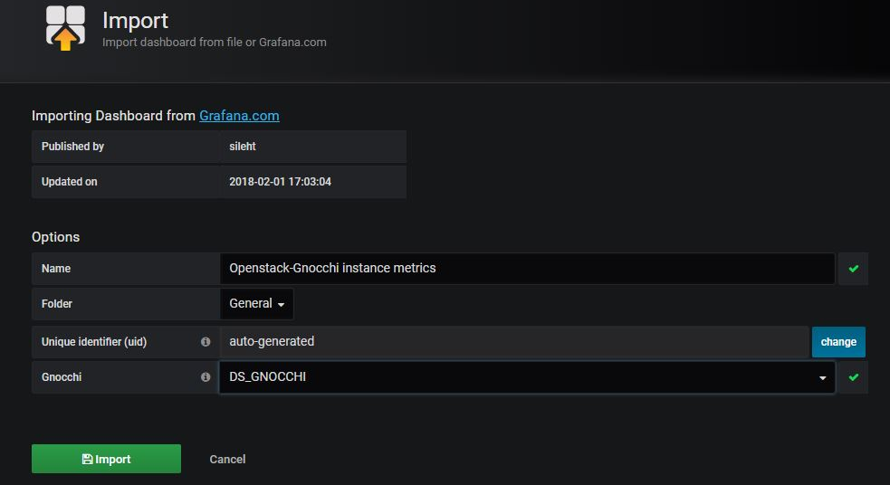
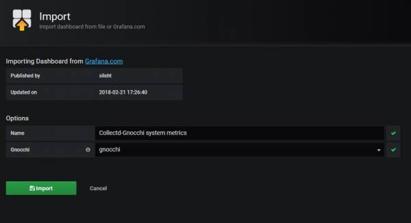
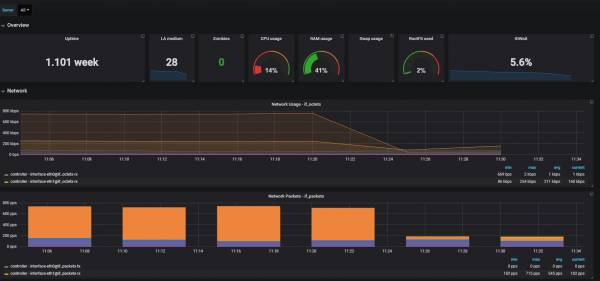

# Gnocchi Integration Collectd

collectd是個監測後台的程式 ，可以監測CPU、記憶體、網路等等，可以將收集的資料儲存到不同的資料庫，以下透過collectd蒐集資料，並儲存到gnocchi資料庫，再利用grafana畫出。

目前支援 gnocchi 版本 &gt; 4.1，相當於OpenStack Queens版

### 預先準備

1. 安裝 grafana  
2. 安裝 gnocchi

### 設定 collectd

安裝 colletcd

```text
# apt install collectd 
```

安裝collectd gnocchi套件

```text
# pip install collectd-gnocchi
```

Gnocchi 新增policy

```text
# gnocchi archive-policy create -d granularity:0:05:00,points:8640 rate:low -m rate:last
# gnocchi archive-policy-rule create -m "interface-*@if_*" -a rate:low network-interface-rate
```

在/etc/collectd/collectd.conf.d/ 新增collectd\_gnocchi.conf  
hostname 為實體機的 hostname  
gnocchi 和 keystone 認證根據自己的環境修改

```text
Hostname "controller"

FQDNLookup false
Interval 10
Timeout 2
ReadThreads 5

LoadPlugin aggregation
<Plugin aggregation>
  <Aggregation>
    Plugin "cpu"
    Type "percent"
    GroupBy "Host"
    GroupBy "TypeInstance"
    CalculateNum false
    CalculateSum false
    CalculateAverage true
    CalculateMinimum false
    CalculateMaximum false
    CalculateStddev false
  </Aggregation>
</Plugin>

LoadPlugin cpu
<Plugin cpu>
  ReportByCpu true
  ReportByState true
  ValuesPercentage true
</Plugin>

LoadPlugin df
<Plugin df>
    ReportInodes true
    ValuesPercentage true
</Plugin>

LoadPlugin disk

LoadPlugin memory
<Plugin memory>
    ValuesAbsolute true
    ValuesPercentage true
</Plugin>

LoadPlugin processes
LoadPlugin uptime

LoadPlugin interface
LoadPlugin load
LoadPlugin network

LoadPlugin python
<Plugin python>
  Import "collectd_gnocchi"
  <Module collectd_gnocchi>
    Endpoint "http://10.40.0.151:8041"
    User gnocchi

    Auth_Mode keystone
    Auth_Url "http://10.40.0.151:5000/"
    Username admin
    Project_Name admin
    Password openstack
    Project_Domain_Name Default
    User_Domain_Name Default
   </Module>
</Plugin>
```

重啟collectd

```text
# service collectd restart
```

### Grafana dashboard

匯入grafana dashboard，這裡使用別人上傳至官網的dashboard，id為 3939



設定 datasource



完成後可以看到監控圖



