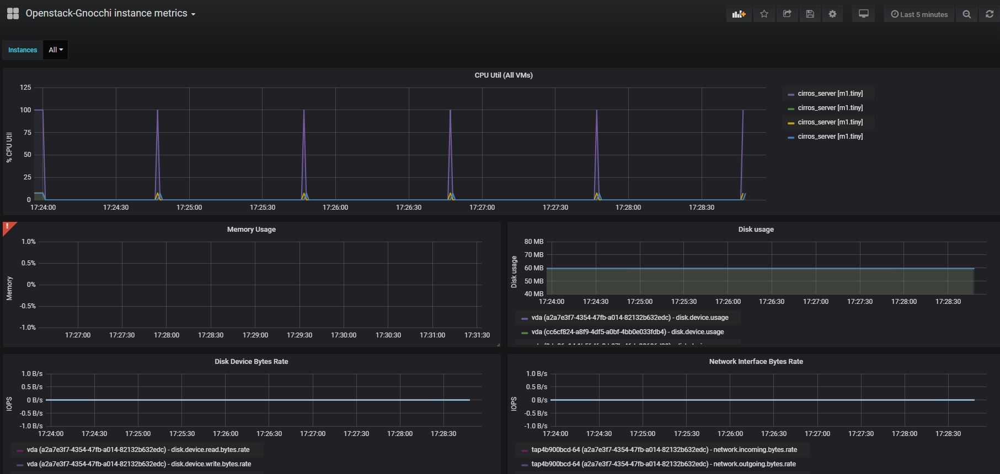
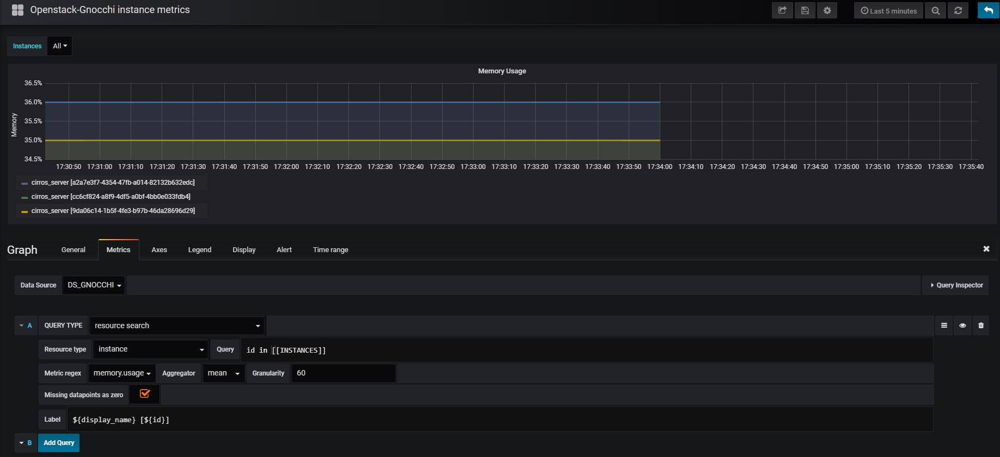
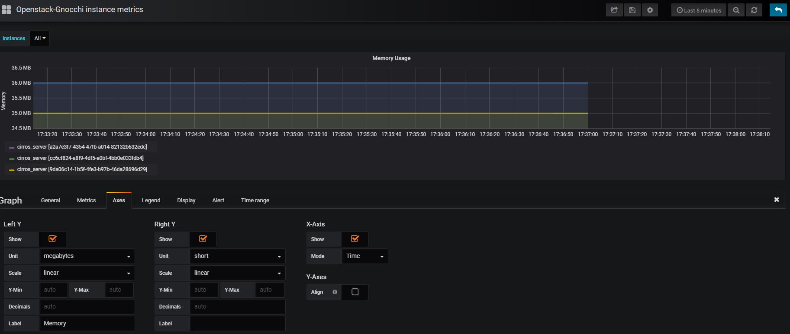
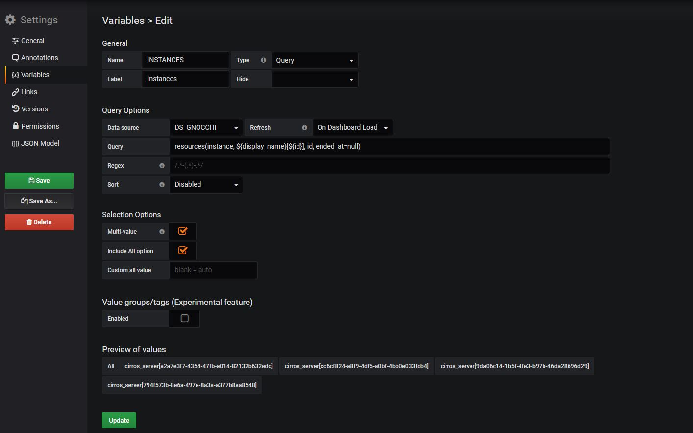
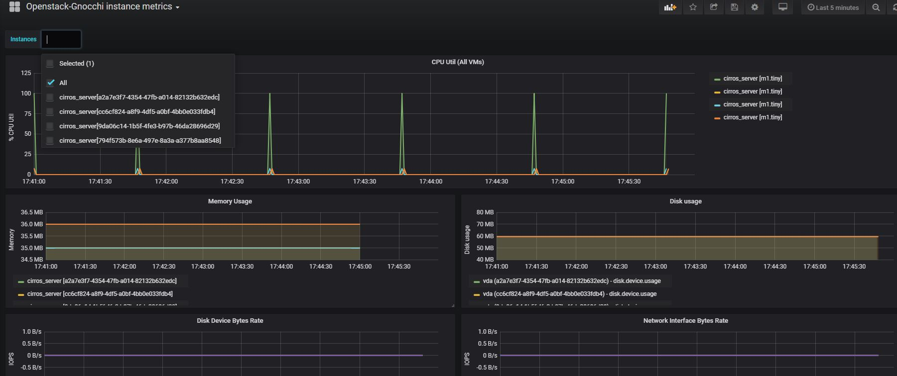

# Grafana Integration Gnocchi

Grafana 的安裝可以使用套件的方式，或是使用 docker 來啟動，使用 docker 啟動方便又快速，所以以下教學使用 docker 啟動


請先安裝 docker，如果還沒安裝，可以使用此指令安裝 

 curl -sSL [https://get.docker.com/](https://get.docker.com/) \| sh


## 建立 docker volume

建立 docker volume 以便儲存 grafana 的資料 

```text
# docker volume create grafana-storage
```

## 啟動 grafana

啟動時可以帶入要安裝的 plugin 參數，這裡帶入 gnocchi 的 plugin，還有密碼的參數

```text
docker run \
  -d \
  -p 3000:3000 \
  --name=grafana \
  -e "GF_SECURITY_ADMIN_PASSWORD=admin" \
  -e "GF_INSTALL_PLUGINS=gnocchixyz-gnocchi-datasource" \
  -v grafana-storage:/var/lib/grafana \
  grafana/grafana
```

啟動後可以進入 grafana dashboard，帳號為 admin

 http://docker\_host:3000


## 新增 Datasource


新增 gnocchi datasource 之前，請先修改 /etc/keystone/keystone.conf 以及 /etc/gnocchi/gnocchi.conf，加入以下內容，IP 為 grafana dashboard


```text
[cors]
allowed_origin = http://10.50.2.10:3000
```

重啟服務

```text
# service apache2 restart
# service gnocchi-metricd restart
```

登入後點選 create data source ，Type 選擇 gnocchi，之後設定依照下圖，填寫完成後，可以按下 Test 測試是否連結成功。


URL 的 IP 為 Controller IP，Keystone 參數請依照環境填寫



## 匯入 dashboard

Grafana 的官網有提供其他作者上傳的 dashboard，可以根據各種類型搜尋 [https://grafana.com/dashboards](https://grafana.com/dashboards)

這裡匯入編號 4569 的 dashboard， [https://grafana.com/dashboards/4569](https://grafana.com/dashboards/4569)

並選擇剛剛新增的 gnocchi datasource


## 修改 Dashboard

匯入後會看到已存在 VM 的監測值，在 Memory 那欄會出現驚嘆號，這是因為原作者要顯示 Memory 使用率，但是 Memory 的 query 有誤，所以需要修改。



點選 Memory usage 旁的箭頭，選 edit，並依照下圖修改



這裡 Memory 的單位是錯誤的，所以也要修改，改為 MegaByte



## 修改 Variables

Grafana 有提供 Variables 的功能，可以依據客製的 Variables 來顯示 dashboard 的直，此範例預設為顯示所有 VM 的監測值，點擊左上角的 Instance，會發現有錯誤，無法列出所有 VM ，因此需要修改 Variables 。

點選上方 設定 -&gt; Variables -&gt; 選擇變數\($INSTANCES\)

修改 Query，改為以下

```text
resources(instance, ${display_name}[${id}], id, ended_at=null)
```

成功的話可以看到下面會列出所有 VM



這樣就可以點選左上角的 INSTANCE 來選擇要顯示的 VM監控值了，記得要存檔喔



