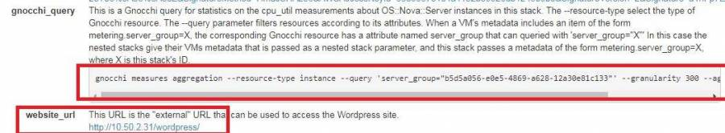

# Heat Auto scaling

## 說明

* 要使用 Auto scaling ，需要安裝以下 project :
  * ceilometer
  * gnocchi 
  * aodh 
  * heat
* 透過 heat 的 template 來選擇要建立 VM 的各種設定、網路、負載平衡、警告條件等等，以下為 template 的架構圖以及 yaml 範例
* yaml 檔案內容:
  * parameters: 指定 VM 的參數
  * resources: 定義 db 的規格還有 cloud init 的腳本
  * asg: 要自動擴展的群組最大最小 VM 數、VM 規格及 cloud init 的腳本
  * web\_server\_scale\_policy: 設定擴展冷卻時間及一次擴展多少台
  * cpu\_alarm: 設定警告值，granularity 為監測間隔時間，threshold 為警告值


## Heat Template

此範例取至 OpenStack Heat template \([https://github.com/openstack/heat-templates/blob/master/hot/autoscaling.yaml](https://github.com/openstack/heat-templates/blob/master/hot/autoscaling.yaml)\)


請根據你的環境，修改各參數的ID




```
heat_template_version: 2016-10-14
description: AutoScaling Wordpress
parameters:
  image:
    type: string
    description: Image used for servers
    default: centos
  key:
    type: string
    description: SSH key to connect to the servers
    default: test
  flavor:
    type: string
    description: flavor used by the web servers
    default: m1.small
  database_flavor:
    type: string
    description: flavor used by the db server
    default: m1.small
  network:
    type: string
    description: Network used by the server
    default: 8658fdbe-10bb-4d24-b658-6d1b064b0d78
  subnet_id:
    type: string
    description: subnet on which the load balancer will be located
    default: 40d8d48c-72be-40c6-9624-bfa5d01120cd
  database_name:
    type: string
    description: Name of the wordpress DB
    default: wordpress
  database_user:
    type: string
    description: Name of the wordpress user
    default: wordpress
  external_network_id:
    type: string
    description: UUID of a Neutron external network
    default: b6fc9587-97b7-4084-a036-3743d475ae4e
resources:
  database_password:
    type: OS::Heat::RandomString
  database_root_password:
    type: OS::Heat::RandomString
  db:
    type: OS::Nova::Server
    properties:
      flavor: {get_param: database_flavor}
      image: {get_param: image}
      key_name: {get_param: key}
      networks: [{network: {get_param: network} }]
      user_data_format: RAW
      user_data:
        str_replace:
          template: |
            #!/bin/bash -v
            yum install -y epel-release
            sudo sed -i "s/metalink=https/metalink=http/" /etc/yum.repos.d/epel.repo
            yum -y install mariadb mariadb-server
            systemctl enable mariadb.service
            systemctl start mariadb.service
            mysqladmin -u root password $db_rootpassword
            cat << EOF | mysql -u root --password=$db_rootpassword
            CREATE DATABASE $db_name;
            GRANT ALL PRIVILEGES ON $db_name.* TO "$db_user"@"%"
            IDENTIFIED BY "$db_password";
            FLUSH PRIVILEGES;
            EXIT
            EOF
          params:
            $db_rootpassword: {get_attr: [database_root_password, value]}
            $db_name: {get_param: database_name}
            $db_user: {get_param: database_user}
            $db_password: {get_attr: [database_password, value]}
  asg:
    type: OS::Heat::AutoScalingGroup
    properties:
      min_size: 1
      max_size: 3
      resource:
        type: lb_server.yaml
        properties:
          flavor: {get_param: flavor}
          image: {get_param: image}
          key_name: {get_param: key}
          network: {get_param: network}
          subnet: {get_param: subnet_id}
          pool_id: {get_resource: pool}
          metadata: {"metering.server_group": {get_param: "OS::stack_id"}}
          user_data:
            str_replace:
              template: |
                #!/bin/bash -v
                yum install -y epel-release
                sudo sed -i "s/metalink=https/metalink=http/" /etc/yum.repos.d/epel.repo
                yum -y install httpd wordpress
                systemctl enable httpd.service
                systemctl start httpd.service
                setsebool -P httpd_can_network_connect_db=1

                sed -i "/Deny from All/d" /etc/httpd/conf.d/wordpress.conf
                sed -i "s/Require local/Require all granted/" /etc/httpd/conf.d/wordpress.conf
                sed -i s/database_name_here/$db_name/ /etc/wordpress/wp-config.php
                sed -i s/username_here/$db_user/ /etc/wordpress/wp-config.php
                sed -i s/password_here/$db_password/ /etc/wordpress/wp-config.php
                sed -i s/localhost/$db_host/ /etc/wordpress/wp-config.php

                systemctl restart httpd.service
              params:
                $db_name: {get_param: database_name}
                $db_user: {get_param: database_user}
                $db_password: {get_attr: [database_password, value]}
                $db_host: {get_attr: [db, first_address]}
  web_server_scaleup_policy:
    type: OS::Heat::ScalingPolicy
    properties:
      adjustment_type: change_in_capacity
      auto_scaling_group_id: {get_resource: asg}
      cooldown: 60
      scaling_adjustment: 1
  web_server_scaledown_policy:
    type: OS::Heat::ScalingPolicy
    properties:
      adjustment_type: change_in_capacity
      auto_scaling_group_id: {get_resource: asg}
      cooldown: 60
      scaling_adjustment: -1
  cpu_alarm_high:
    type: OS::Aodh::GnocchiAggregationByResourcesAlarm
    properties:
      description: Scale up if CPU > 80%
      metric: cpu_util
      aggregation_method: mean
      granularity: 300
      evaluation_periods: 1
      threshold: 80
      resource_type: instance
      comparison_operator: gt
      alarm_actions:
        - str_replace:
            template: trust+url
            params:
              url: {get_attr: [web_server_scaleup_policy, signal_url]}
      query:
        list_join:
          - ''
          - - {'=': {server_group: {get_param: "OS::stack_id"}}}
  cpu_alarm_low:
    type: OS::Aodh::GnocchiAggregationByResourcesAlarm
    properties:
      description: Scale down if CPU < 15% for 5 minutes
      metric: cpu_util
      aggregation_method: mean
      granularity: 300
      evaluation_periods: 1
      threshold: 15
      resource_type: instance
      comparison_operator: lt
      alarm_actions:
        - str_replace:
            template: trust+url
            params:
              url: {get_attr: [web_server_scaledown_policy, signal_url]}
      query:
        list_join:
          - ''
          - - {'=': {server_group: {get_param: "OS::stack_id"}}}
  lb:
    type: OS::Neutron::LBaaS::LoadBalancer
    properties:
      vip_subnet: {get_param: subnet_id}
  listener:
    type: OS::Neutron::LBaaS::Listener
    properties:
      loadbalancer: {get_resource: lb}
      protocol: HTTP
      protocol_port: 80
  pool:
    type: OS::Neutron::LBaaS::Pool
    properties:
      listener: {get_resource: listener}
      lb_algorithm: ROUND_ROBIN
      protocol: HTTP
      session_persistence:
        type: SOURCE_IP
  lb_monitor:
    type: OS::Neutron::LBaaS::HealthMonitor
    properties:
      pool: { get_resource: pool }
      type: TCP
      delay: 5
      max_retries: 5
      timeout: 5
  # assign a floating ip address to the load balancer
  # pool.
  lb_floating:
    type: OS::Neutron::FloatingIP
    properties:
      floating_network_id: {get_param: external_network_id}
      port_id: {get_attr: [lb, vip_port_id]}

outputs:
  scale_up_url:
    description: >
      This URL is the webhook to scale up the autoscaling group.  You
      can invoke the scale-up operation by doing an HTTP POST to this
      URL; no body nor extra headers are needed.
    value: {get_attr: [web_server_scaleup_policy, alarm_url]}
  scale_dn_url:
    description: >
      This URL is the webhook to scale down the autoscaling group.
      You can invoke the scale-down operation by doing an HTTP POST to
      this URL; no body nor extra headers are needed.
    value: {get_attr: [web_server_scaledown_policy, alarm_url]}
  pool_ip_address:
    value: {get_attr: [lb, vip_address]}
    description: The IP address of the load balancing pool
  website_url:
    value:
      str_replace:
        template: http://host/wordpress/
        params:
          host: { get_attr: [lb_floating, floating_ip_address] }
    description: >
      This URL is the "external" URL that can be used to access the
      Wordpress site.
  gnocchi_query:
    value:
      str_replace:
        template: >
          gnocchi measures aggregation --resource-type instance
          --query 'server_group="stackval"'
          --granularity 300 --aggregation mean -m cpu_util
        params:
          stackval: { get_param: "OS::stack_id" }
    description: >
      This is a Gnocchi query for statistics on the cpu_util measurements about
      OS::Nova::Server instances in this stack. The --resource-type select the
      type of Gnocchi resource. The --query parameter filters resources
      according to its attributes. When a VM's metadata includes an item of the
      form metering.server_group=X, the corresponding Gnocchi resource has a
      attribute named server_group that can queried with 'server_group="X"' In
      this case the nested stacks give their VMs metadata that is passed as a
      nested stack parameter, and this stack passes a metadata of the form
      metering.server_group=X, where X is this stack's ID.
```





```
heat_template_version: 2016-10-14
description: A load-balancer server
parameters:
  image:
    type: string
    description: Image used for servers
  key_name:
    type: string
    description: SSH key to connect to the servers
  flavor:
    type: string
    description: flavor used by the servers
  pool_id:
    type: string
    description: Pool to contact
  user_data:
    type: string
    description: Server user_data
  metadata:
    type: json
  network:
    type: string
    description: Network used by the server
  subnet:
    type: string
    description: Subnet used by the server

resources:
  server:
    type: OS::Nova::Server
    properties:
      flavor: {get_param: flavor}
      image: {get_param: image}
      key_name: {get_param: key_name}
      metadata: {get_param: metadata}
      user_data: {get_param: user_data}
      user_data_format: RAW
      networks: [{network: {get_param: network} }]
  member:
    type: OS::Neutron::LBaaS::PoolMember
    properties:
      pool: {get_param: pool_id}
      address: {get_attr: [server, first_address]}
      protocol_port: 80
      subnet: {get_param: subnet}

outputs:
  server_ip:
    description: IP Address of the load-balanced server.
    value: { get_attr: [server, first_address] }
  lb_member:
    description: LB member details.
    value: { get_attr: [member, show] }

```



## 建立 Stack

建立一個stack \(autoscaling.yaml 和 lb\_server.yaml 需在同一目錄\)

```text
openstack stack create -f yaml -t autoscaling.yaml autoscaling
```

stack 建立完成後，等待 VM 執行完 cloud init 腳本，完成後可由 horizon 的 stack overview 或指令 **opesntack stack show STACK\_ID**  得到 wordpress 網址以及查看此 stack 的 cpu使用率的 gnocchi 指令



使用 gnocchi 指令查看 stack 的 cpu 使用率

```text
# gnocchi measures aggregation --resource-type instance --query 'server_group="60cf8c8b-8d82-432c-b169-b06227396e1a"' --granularity 60 --aggregation mean -m cpu_util
+---------------------------+-------------+----------------+
| timestamp                 | granularity |          value |
+---------------------------+-------------+----------------+
| 2018-05-04T03:12:00+00:00 |        60.0 |  24.4630478097 |
| 2018-05-04T03:13:00+00:00 |        60.0 | 0.308446298992 |
+---------------------------+-------------+----------------+
```

## 驗證 Auto scaling

根據 ceilometer 設定的監測間隔，使用 openstack alarm lis t指令來查看 aodh 的警示是否有狀態，如果 state 狀態為 ok 或 alarm，代表 aodh 有得到監測值，如果是 insufficient data，代表兩種可能，一種是 ceilometer 每5分鐘監測一次，但是還沒有5分鐘，因此還在收集資料，另一種是在 heat template 的 cpu\_alarm 中granularity 設定錯誤，導致無法取得監測值

```text
# openstack alarm list
+--------------------------------------+--------------------------------------------+-----------------------------------------+-------+----------+---------+
| alarm_id                             | type                                       | name                                    | state | severity | enabled |
+--------------------------------------+--------------------------------------------+-----------------------------------------+-------+----------+---------+
| 9a914faa-731e-4dc7-9141-7ed8a0865677 | gnocchi_aggregation_by_resources_threshold | autoscaling-cpu_alarm_high-yuvxqnp37qte | ok    | low      | True    |
| 0f6eef1d-2d15-4193-b1ad-b7bf44a65d3d | gnocchi_aggregation_by_resources_threshold | autoscaling-cpu_alarm_low-ppos7sorcnw3  | alarm | low      | True    |
+--------------------------------------+--------------------------------------------+-----------------------------------------+-------+----------+---------+
```

接下來進入 wordpress 的 vm，安裝 stress，並使用 stress 讓 cpu 到達100%

```text
# yum install -y stress
# stress -c 4
```

再使用 openstack alarm list 查看 cpu\_alarm\_high 的 state是否為 high，是的話VM 就會自動增加一台，反之減少

```text
# openstack alarm list
+--------------------------------------+--------------------------------------------+-----------------------------------------+-------+----------+---------+
| alarm_id                             | type                                       | name                                    | state | severity | enabled |
+--------------------------------------+--------------------------------------------+-----------------------------------------+-------+----------+---------+
| 9a914faa-731e-4dc7-9141-7ed8a0865677 | gnocchi_aggregation_by_resources_threshold | autoscaling-cpu_alarm_high-yuvxqnp37qte | alarm | low      | True    |
| 0f6eef1d-2d15-4193-b1ad-b7bf44a65d3d | gnocchi_aggregation_by_resources_threshold | autoscaling-cpu_alarm_low-ppos7sorcnw3  | ok    | low      | True    |
+--------------------------------------+--------------------------------------------+-----------------------------------------+-------+----------+---------+
```

