# Kubernetes 建立 pipeline


本文紀錄時間為2019/01/30，內容請斟酌參考


## 前言

當初使用 Rancher2.0 時，發現有pipeline功能，於是抱著嘗試的心態玩看看，發現也太神奇了吧，然後就看看Rancher2.0是怎麼建立pipeline的流程，於是就參考他所有的架構，仿造出一個pipeline。

* 以下範例使用Jenkins、gitlab和私有docker registry。
* 也就是當 git 有新的 commit，就會自動打包成 docker images，並上傳到私有docker registry， 然後再用 k8s 佈署所做好的 images 至 pod。

建立流程如下:


簡單的說就是開發者只需要 commit程式到 git，你的程式就會自動佈署到指定的環境，不要再去管其他事情啦

## 事前準備

* 請先建立好 k8s，此篇不說明如何安裝 k8s
* 此篇的 k8s 和 OpenStack 介接，使用 cinder 的 StorageClass 來動態產生儲存區，如果沒有和OpenStack 介接，請自行使用 PV 和 PVC 建立儲存區
* 與 OpenStack 介接，需在/etc/kubernetes/cloud-config裡設定OpenStack

```text
[Global]
auth-url    = http://10.50.2.10:5001/v3
username    = k8s
password    = openstack
tenant-id   = 5d1a1f6823a149dab1d32391376a4fd1
domain-name = default

[LoadBalancer]
subnet-id           = 91782201-7436-4ae1-b83e-24ecfe6f3f1c
floating-network-id = d0456ee8-c9a9-4e0c-8be1-0974f1d13ac0

[BlockStorage]
bs-version       = v2
ignore-volume-az = true

[Route]
router-id = 30532231-9971-4c08-9c3f-4d6e58b65417

[Metadata]
```

### Gitlab <a id="gitlab"></a>

* 這裡使用已有的 Gitlab，先自行建立新的 project，再將範例裡所有的檔案複製到剛剛新增的專案
* 範例程式: [https://github.com/dommgifer/hello-world](https://github.com/dommgifer/hello-world)
* 檔案結構如下:

  ```text
  hello-world/
  ├── deployment.yaml
  ├── Dockerfile
  ├── Jenkinsfile
  ├── main.go
  ├── main_test.go
  └── README.md
  ```

* Dockerfile: jenkins 根據 Dockerfile，將目錄下的檔案包成 docekr images。
* Jenkinsfile: jenkins 根據 jenkinsfile，執行 pipeline 流程。
* deployment.yml: kubernetes 佈署此應用程式所需。
* 複製完後 push 回 gitlab

### Container Registry

請自行建立 container registry，本範例是用 Harbor

## 建立 jenkins

* 這裡利用 k8s 的 helm來啟動jenkins，首先安裝helm

  ```text
  # wget -qO- https://kubernetes-helm.storage.googleapis.com/helm-v2.12.0-linux-amd64.tar.gz| tar -zx
  # sudo mv linux-amd64/helm /usr/local/bin/
  # helm version
  ```

* 初始化helm

  ```text
  # kubectl -n kube-system create sa tiller
  # kubectl create clusterrolebinding tiller --clusterrole cluster-admin --serviceaccount=kube-system:tiller
  # helm init --service-account tiller
  ```

* 檢查 Tiller Server 是否建立成功

  ```text
  # kubectl get po,svc -n kube-system -l app=helm
  NAME                                 READY   STATUS    RESTARTS   AGE
  pod/tiller-deploy-778f674bf5-9kxb7   1/1     Running   0          69d

  NAME                    TYPE        CLUSTER-IP     EXTERNAL-IP   PORT(S)     AGE
  service/tiller-deploy   ClusterIP   10.43.174.24   <none>        44134/TCP   69d
  ```

* jenkins需要永久儲存區，這裡設定 cinder 為預設的 storage class，新增 storage.yml

  ```text
  apiVersion: storage.k8s.io/v1
  kind: StorageClass
  metadata:
    name: cinder
    annotations:
      storageclass.beta.kubernetes.io/is-default-class: "true"
      storageclass.kubernetes.io/is-default-class: "true"
  provisioner: kubernetes.io/cinder
  ```

* 建立 storage class

  ```text
  # kubectl create -f storage.yml
  # kubectl get storageclass
  NAME               PROVISIONER            AGE
  cinder (default)   kubernetes.io/cinder   2m
  ```

* 設定 jenkins 參數，設定密碼以及安裝 gitlab plugin

  ```text
  # vim config.yml

  Master:
    AdminPassword: openstack
    InstallPlugins:
      - kubernetes:1.14.0
      - workflow-job:2.31
      - workflow-aggregator:2.6
      - credentials-binding:1.17
      - git:3.9.1
      - gitlab-plugin:1.5.11
  ```

* 啟動 jenkins

  ```text
  # helm install -f config.yml --name jenkins stable/jenkins
  ```

* 取得 jenkins UI IP

  ```text
  # kubectl get svc
  NAME                  TYPE           CLUSTER-IP      EXTERNAL-IP   PORT(S)          AGE
  jenkins-tzfry         LoadBalancer   10.43.26.57     10.50.2.21    8080:30074/TCP   5d
  jenkins-tzfry-agent   ClusterIP      10.43.92.235    <none>        50000/TCP        5d
  ```

* 建立 jenkins admin權限

  ```text
  # kubectl create clusterrolebinding jenkins-admin --clusterrole=admin --serviceaccount=default:default
  ```

* serviceaccount: 冒號左邊為namespace，右邊是serviceaccount，由於預設k8s會有一個初始的default的serviceaccount，然後我們又是在default namespace，所以都填default
* 登入UI 帳號: admin 密碼: openstack


## 設定 jenkins-slave pod <a id="&#x8A2D;&#x5B9A;_jenkins-slave_pod"></a>

* jenkins 需要 slave 做事，而 k8s 的 jenkins slave 是動態產生的，只有進行工作時才會建立，由於我們需要讓 jenkins-slave 可以幫我們打包 docker images，再佈署至 k8s 上，所以 slave 需要有 docker 和kubectl 指令，預設的 slave 沒有這兩這指令，所以要修改 image 來源
* 點選左方管理jenkins → 右方設定系統 → 找到 Kubernetes 的 images
* 修改 Pod Template，修改 name 為 **jenkins-slave** \(比較好辨認\)和 images 為 **bash8989/jnlp-slave-docker:3.26-1** ，\(此 image 去docker hub上隨意找的，實際上應該要自己打包比較安全\)

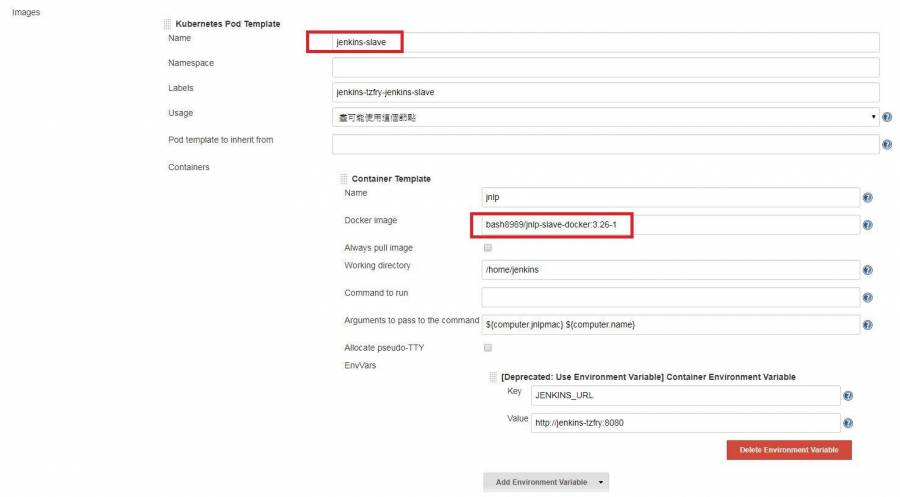

* 這裡要修改一下記憶體限制，預設只能使用 256MB，但是在打包的時候記憶體會不夠用，所以請點選下方的**進階**，然後修改記憶體為 512MB \(或是更大\)

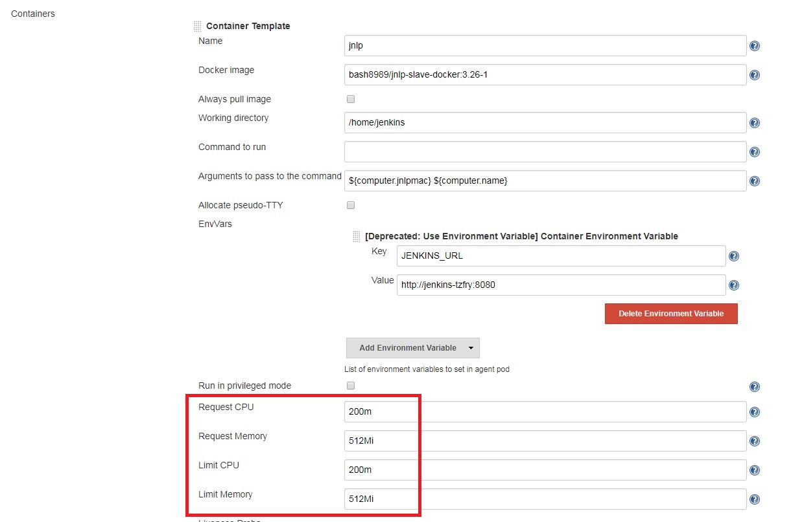

* 後再點選下方的 **Add Container**，再新增一個 container，是可以使用kubectl指令的container， 名稱為 **jenkins-slave-kubectl**，image 是使用 **lachlanevenson/k8s-kubectl:v1.10.12**

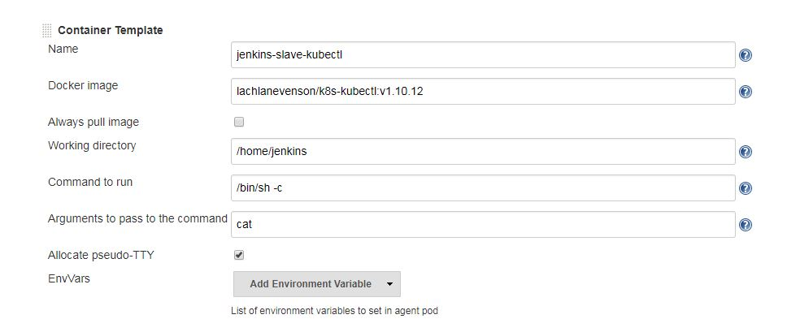

* 接下來新增 volume
  * Host path Volume: 需要將 host 上的 docker 行程 mount 至 slave，這樣 slave 的 docker 指令才能正常運作。 路徑為 **/var/run/docker.sock**
  * Secret volume: 新增 docker registry 的 CA 認證，由於 slave 跟 docker registry 只能走 https， 因此需要 CA 證書，這裡的 Secret name 先填入 **registry**，稍後會在 k8s 裡新增 secret， 至於 Mount path，根據你的 docker registry 的 IP 修改就好，路徑為 **/etc/docker/certs.d/10.40.1.175/**
  * Secret volume: 新增 kubeconfig，讓 kubectl 可以幫你佈署程式至你的 k8s ，Secret name 先填入 **kubeconfig**，稍後會在 k8s 新增，Mount path 為 **/home/jenkins/.kube**，

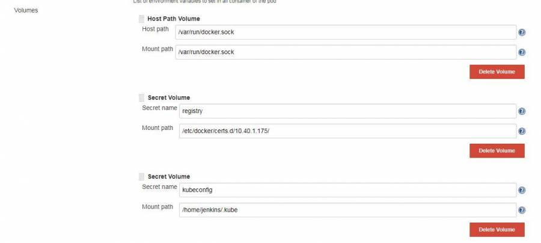

## Kubernetes 新增 secret

* 新增 docker registry CA 證書，證書請自行產生，kubernetes 的 secret 要先用 base64 加密，新增 secret.yml

內容如下:

```text
apiVersion: v1
kind: Secret
metadata:
  name: registry
type: Opaque
data:
  ca.crt: LS0tLS1CRUdJTiBDRVJUSUZJQ0FURS0tLS0tCk1JSUYzakNDQThhZ0F3SUJBZ0lKQUpWVUU3cHpXalBoTUEwR0NTcUdTSWIzRFFFQkN3VUFNSHd4Q3pBSkJnTlYKQkFZVEFsUlhNUTh3RFFZRFZRUUlEQVpVWVdsM1lXNHhEekFOQmdOVkJBY01CbFJoYVhCbGFURU1NQW9HQTFVRQpDZ3dEU1VsSk1Rd3dDZ1lEVlFRTERBTkpTVWt4RERBS0JnTlZCQU1NQTBsSlNURWhNQjhHQ1NxR1NJYjNEUUVKCkFSWVNhbVZtWm5ocFpVQnBhV2t1YjNKbkxuUjNNQ0FYRFRFNU1ERXlOREEyTVRNek5Wb1lEekl3Tmprd01URXgKTURZeE16TTFXakI4TVFzd0NRWURWUVFHRXdKVVZ6RVBNQTBHQTFVRUNBd0dWR0ZwZDJGdU1ROHdEUVlEVlFRSApEQVpVWVdsd1pXa3hEREFLQmdOVkJBb01BMGxKU1RFTU1Bb0dBMVVFQ3d3RFNVbEpNUXd3Q2dZRFZRUUREQU5KClNVa3hJVEFmQmdrcWhraUc5dzBCQ1FFV0VtcGxabVo0YVdWQWFXbHBMbTl5Wnk1MGR6Q0NBaUl3RFFZSktvWkkKaHZjTkFRRUJCUUFEZ2dJUEFEQ0NBZ29DZ2dJQkFQWDN5dHBySWdzWTlZNE56ZTVVS2Z6Q2NRQmxvbGpmNEhmMApYYldNZXBwQVpwUEQrNTlNeFZIaVVUNGNDZm9saUMyR2FhZkxDVCtYb2lSUnpGejUzUURvNi90N3RmcUgzTFYrCmljVUkvZkUvSUZERm1EWGUyRTc4RFZrNlE1REFqTG1odi9EYm53T1BtdGNmS0JsWTJ0RmdITzR3MVVaSUxaZWIKbVg0U1RFU0poY1NrZXRRcXpZV2VvTmhzNXA3VGJMSjU5bk9HNjBaNkFmQ0tjQzFabGpwWjZ5b2JrQlcvL1F4agpxNWdtL2xZNGdMQlpxZmphQmZNZ3VBTE96YnFnMHMwQStTQ3RkU0NSZjQ2Q2phOW9vVDRRS0ptY1kyejdrcHV6CjBQbzh3VGhQTEdlczd4U05MRXM1T25mV3k2djJxL0FhbklKL25PampBb0hMSmdCMDRwdDBNaXR3RUxySXkvU04KM3hPTitxaG5vMDNYaCswTzgxOVI5RDJvcVdjSzUvNE1udTZyVFZ5QVdNeVoyZ0UvRFpsc3RqOVNBZ0R6UkpiWApJOHIxUlhhQWQrL013VjJKaUg0bTJoMGtpWGNCLzBiUmdnVFNxaVdZeUd5WkdRazZ0Rk5iZkdCck53dm1NSVJvCnZiK3hMWDNMSTBuYU1aZGdPeHQvb0xBQzd6bFQ5eGtUQWFuU0N3anFYSkdsMi82M1RsSlQ3Vk81SUhpOEFUbG8KUmhMaFZNTFowL3FzR2txdHIvWUU2L0FSVHVjMjgwMThhRDlKVlVrZ2ZVRzBqSCtVQmJhT0p4NE45MkxKZGp3aQo0cVVZMlFBOUpJNTNvYy8xQzA0ZDEvalpNR1liWXZrSi8wMVVFckhtT01pMmpjbmRqc3JhNjNVMFUydUJERERKCjFHSWlJZFpOQWdNQkFBR2pZVEJmTUIwR0ExVWREZ1FXQkJUMU91OXZpQ1pOcGt5Y0IzVkVhcE5wMWNldTREQWYKQmdOVkhTTUVHREFXZ0JUMU91OXZpQ1pOcGt5Y0IzVkVhcE5wMWNldTREQU1CZ05WSFJNRUJUQURBUUgvTUE4RwpBMVVkRVFRSU1BYUhCQW9vQWE4d0RRWUpLb1pJaHZjTkFRRUxCUUFEZ2dJQkFBRmZUaDEvUWZFRk9RVDdGeUcvCnhLTlFadjliSHFWUVkxWGdndnM5cEhlUFVZcFpSS1R1N0NBMWNVSEJuSC9DdEpyY0tkbytydDBtLzI4bjN6eFMKMVpUeFkzSmErcVJqZDg1QXB6ZUFvQUtTRGd3WWwza3hIOGwwMnhDL1RsNGI3V2tDN3NoL2tjSnBORlc0MmJKeQoxeE9LUFNqaTRtZ0czbkZTM3RveHB1TDhmQVZFT3FhRkY2WXhJKzVlZUVWbUExdHNwS056WURQN3Q3aGxwSDdJCklXOHhXZU00dWxuS1ZxZ2VYZFQwbkNJY1pqeGhYZ2p3TkhwaVN5M1hIUkkrQ1RXUXNCUHRMNVE1TUhYaDlCMzYKNUFSNU5TWWt0TzdDeXgycmNnRDYrSW5Dc2J2NGFaUXJBRnJybEpUeUg4d3ZWUU5scGlVQzV2ZHRteU1Bb2ZHbwpzYS94eXFaamxXcXlVZ3hMYzIrUFp1MHdVeTdVZEhJb1M5YW03V01ha05ralVCbGI4Z05oZk1PakJZV0FEQnZKCkdNWkkzYkxZT0JoWUpHNnZrMC82U0N4U3ZSZTIwcnYrVW1JM2xtVGdGSlRZejAvWEx1aE5zemUxUmJuK2JleUgKV0plTXhmMTM1RUx3TTBHT2dHWUR3SjMxM1hkbnN5MUdNM3dpd3B2VGVJZU4ra05MRC90WVZxN1BxdVRsdGI5QgpLMm91ellVSzJheDRCWUd0SUNwWmJwajRCaVE4MEpFbWlHcGV0WEpIRlpVMlhRSFVwTzNOeFV4RVpOREQrNkFHCmdsV09RN3dkN1haWTM3c0hya0R0U1oydjFJb2ZxR2ErS2ZmZWpEa0F2K0lLYUY4RWNwQ1J4cUlVRzBBS3JhcVYKZnY4ZjJIRUlGK3FiWWF0L2duRmZPS0R1Ci0tLS0tRU5EIENFUlRJRklDQVRFLS0tLS0K
```

* 新增 kubeconfig ，請先將 kubeconfig 內容用 base64 加密，再新增至 secretkube.yml 的 config 處

  ```text
  apiVersion: v1
  kind: Secret
  metadata:
    name: registry
  type: Opaque
  data:
    config: YXBpVmVyc2lvbjogdjEKa2luZDogQ29uZmlnCmNsdXN0ZXJzOgotIG5hbWU6ICJrO........
  ```


## 新增 docker registry 帳密 <a id="&#x65B0;&#x589E;_docker_registry_&#x5E33;&#x5BC6;"></a>

* 由於需要知道 docker registry 的帳號密碼，所以要新增認證
* 點選左側Credentials → 右方global → 左側 Add Credentials，選擇username and password， 然後填入你的 registry 帳號密碼，ID 可以自行填入好記的名稱，如果不填他會隨機產生 ID

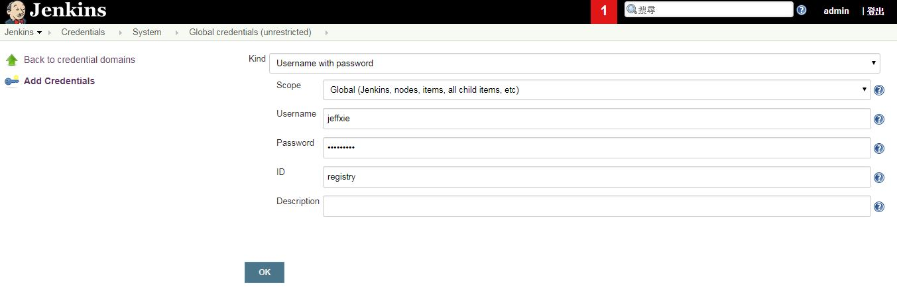

## 更改 Jenkinsfile

* 修改 gitlab 上的 Jenkinsfile，修改認證ID，此範例原先沒有自行填入ID，所以是使用隨機的ID，因此需修改，將 ID 改為 新增 docker registry 帳密 步驟的 ID ，上圖範例 ID 是 registry


自行更換gitlab IP


```text
docker.withRegistry('https://10.40.1.175', 'registry')
```

* 可以根據應用程式佈署在哪個 k8s 的 namespace，此篇是用預設 default ，所以請將這行 -n jenkins移除

  ```text
  sh('kubectl apply -f deployment.yaml)
  ```

* 改完後請commit and push


## 新增作業

* 點選左側新增作業 → Multibranch Pipeline，名稱自取。
* 在 branch source 填入 git project 網址，然後儲存


請自行更換 gitlabIP


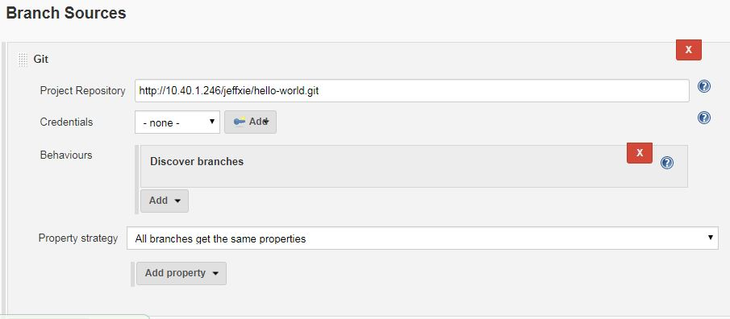

新增完成後，應該會看到 master 的 branch ，然後 jenkins 會掃描 git project 裡的 Jenkinsfile，然後根據 Jenkinsfile 進行 pipeline

* 假如沒有掃描，可以點選 master → 左方的馬上建置

### 建置專案 <a id="&#x5EFA;&#x7F6E;&#x5C08;&#x6848;"></a>

* 開始建置後，可以看到左下方的slave 被建立

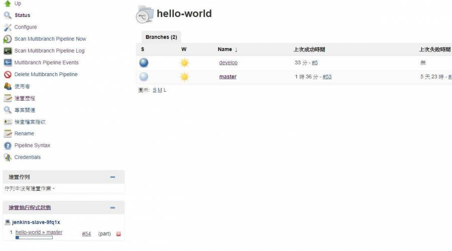

* 可以使用 kubectl get pod 看到 slave

```text
# kubectl get pod 
NAME                                   READY   STATUS    RESTARTS   AGE
jenkins-slave-9fq1x                    2/2     Running   0          3m
jenkins-tzfry-57fc5b6fd5-ls6fk         1/1     Running   0          7d
```

* 建置中可以點選 master，點選後左側有建置次數，以及建置的 stage

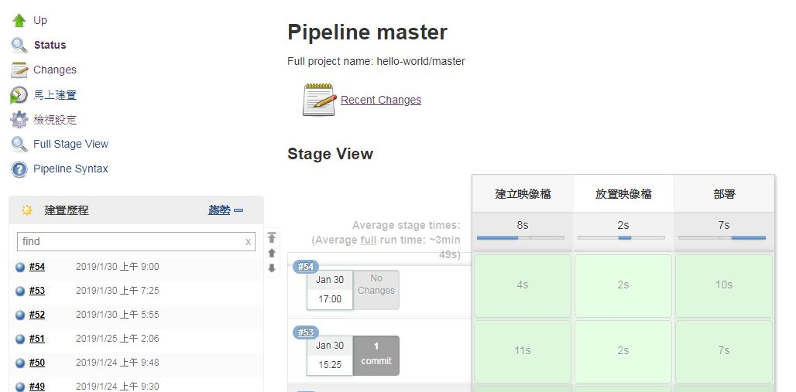

* 點選左方的某次的建置，進入後點選 console output，可以看見建置過程的 output，可以用來查看建置失敗原因

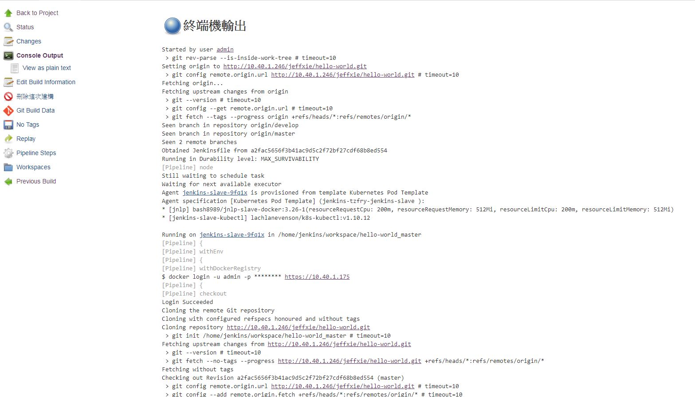

## 測試應用程式

* pipeline流程成功後，可以查看範例程式 hello-world 是否成功佈署

  ```text
  # kubectl get pod -n jenkins
  NAME                                  READY   STATUS    RESTARTS   AGE
  example-helloserver-757987775-hmwms   1/1     Running   0          15m
  jenkins-tzfry-57fc5b6fd5-ls6fk        1/1     Running   0          7d

  # kubectl get svc -n jenkins
  NAME                  TYPE           CLUSTER-IP      EXTERNAL-IP   PORT(S)          AGE
  helloserver-service   NodePort       10.43.109.250   <none>        80:32464/TCP     5d
  jenkins-tzfry         LoadBalancer   10.43.26.57     10.50.2.21    8080:30074/TCP   7d
  jenkins-tzfry-agent   ClusterIP      10.43.92.235    <none>        50000/TCP        7d
  ```

* 根據你 k8s 節點 IP，在瀏覽器輸入 IP:port\(這裡是32464\)，即看到應用程式

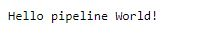

## 設定 gitlab trigger

* 當 gitlab 有新的 commit 時，會自動觸發 pipeline 流程，需要建立 webhook token 點選 master，左側檢視設定 → Build Triggers → 右下方進階 → Secret token → generate

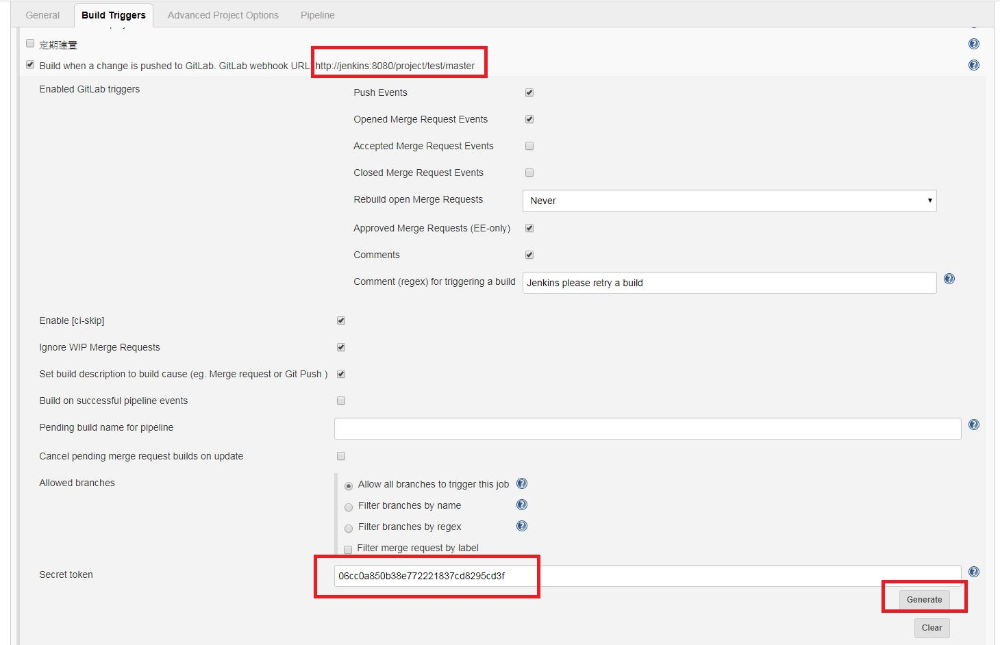

* 複製 token，以及 上面紅框 webhook URL: [http://jenkins:8080/project/test/master](http://jenkins:8080/project/test/master) ， 但是要注意 webhook 的網址要根據你如何存取 jenkins 服務做修改，這裡是用 Loadbalancer 的方式，所以 webhook 應該是: [http://10.50.2.21:8080//project/hello-word/master](http://10.50.2.21:8080//project/hello-word/master)
* 回到 gitlab 的專案，選擇左下 settings → Intergrations，填入 webhook 和 token，可以勾選你想觸發的方式，下方 SSL 請不要打勾 ，完成後按 add webhook

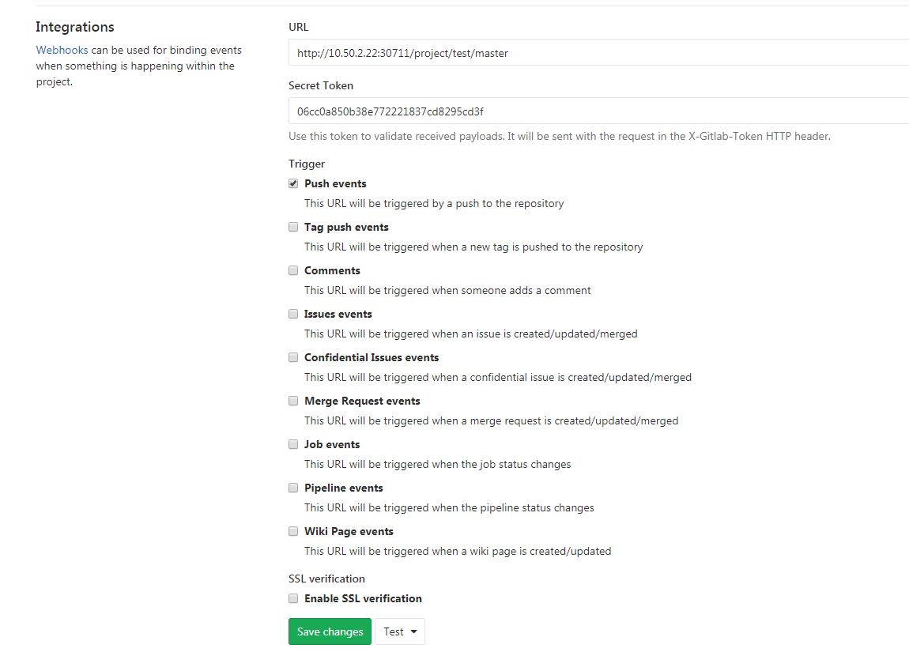

* 修改 git project 的 main.go，將文字改成 Hello OpenStack World

  ```text
  const webContent = "Hello OpenStack World!"
  ```

* 存檔然後 commit 和 push ，就會看到 jenkins 自己開始建置了，
* 建置完成後，可以看到應用程式已更新

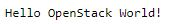


## 備註

* jenkins 可以透過兩種方法撰寫 pipeline 流程
  * Jenkinsfile: 範例的 Jenkinsfile 裡面有:
    * 建立映像檔: 使用 docker build 指令和 tag，這裡 tag 版號是用 jenkins 建置第幾次為版號
    * 放置映像檔: 使用 docker push 指令
    * 佈署: 先用 sed 取代 deployment.yml 裡面的 images 的版號，然後使用 kubectl 佈署程式
  * pipeline script: 使用 Groovy 撰寫
* docker registry: 可以查看 jenkins 是否有 push images 到 registry，有的話應該會如下圖，沒有的話可以看 console output 處理錯誤

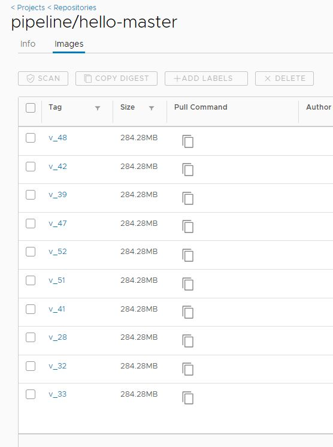

