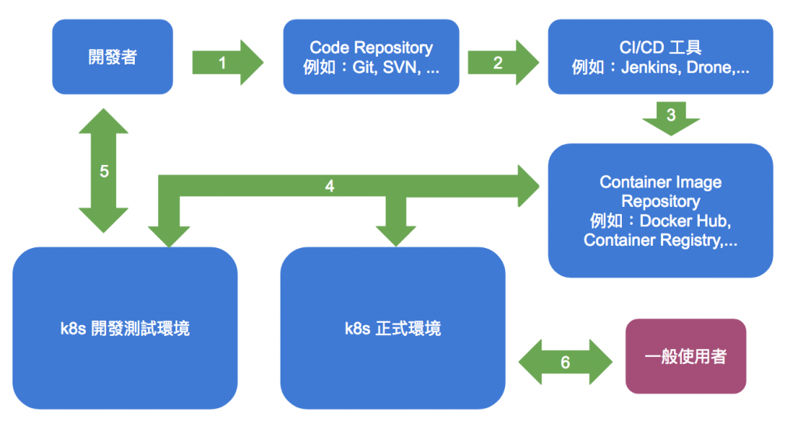

# Kubernetes 建立 pipeline


本文紀錄時間為2019/01/30，內容請斟酌參考


## 前言

當初使用 Rancher2.0 時，發現有pipeline功能，於是抱著嘗試的心態玩看看，發現也太神奇了吧，然後就看看Rancher2.0是怎麼建立pipeline的流程，於是就參考他所有的架構，仿造出一個pipeline。

* 以下範例使用Jenkins、gitlab和私有docker registry。
* 也就是當 git 有新的 commit，就會自動打包成 docker images，並上傳到私有docker registry， 然後再用 k8s 佈署所做好的 images 至 pod。

建立流程如下:



簡單的說就是開發者只需要 commit程式到 git，你的程式就會自動佈署到指定的環境，不要再去管其他事情啦

## 事前準備

* 請先建立好 k8s，此篇不說明如何安裝 k8s
* 此篇的 k8s 和 OpenStack 介接，使用 cinder 的 StorageClass 來動態產生儲存區，如果沒有和OpenStack 介接，請自行使用 PV 和 PVC 建立儲存區
* 與 OpenStack 介接，需在/etc/kubernetes/cloud-config裡設定OpenStack

```text
[Global]
auth-url    = http://10.50.2.10:5001/v3
username    = k8s
password    = openstack
tenant-id   = 5d1a1f6823a149dab1d32391376a4fd1
domain-name = default

[LoadBalancer]
subnet-id           = 91782201-7436-4ae1-b83e-24ecfe6f3f1c
floating-network-id = d0456ee8-c9a9-4e0c-8be1-0974f1d13ac0

[BlockStorage]
bs-version       = v2
ignore-volume-az = true

[Route]
router-id = 30532231-9971-4c08-9c3f-4d6e58b65417

[Metadata]
```

