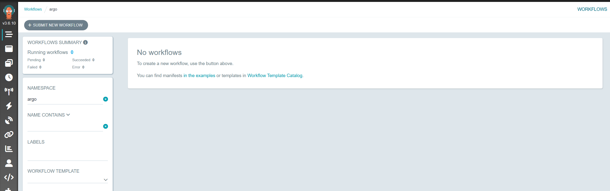
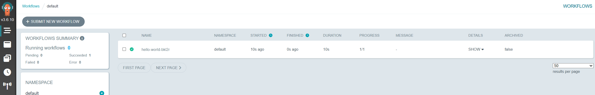
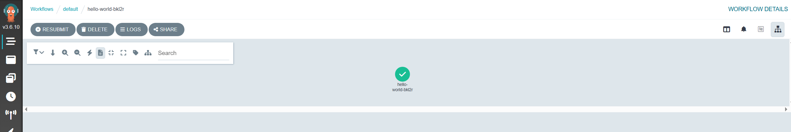
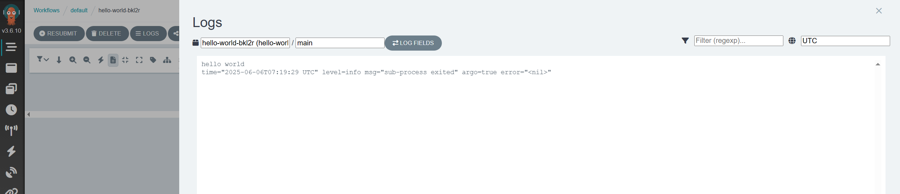
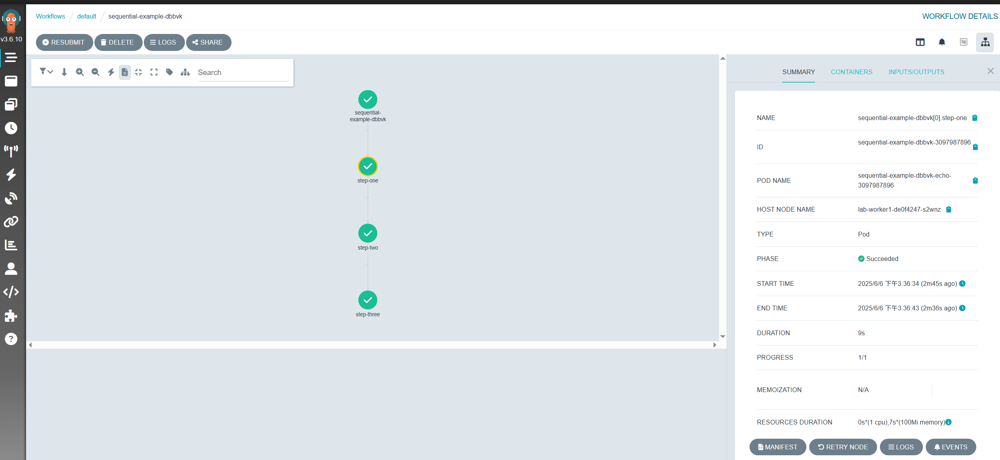
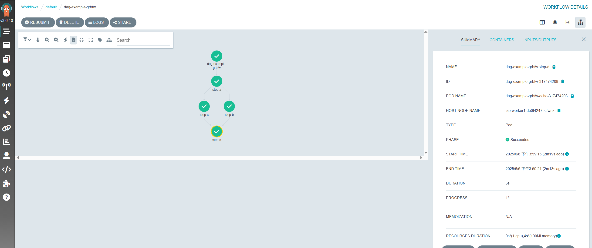
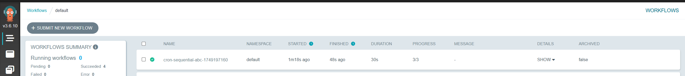
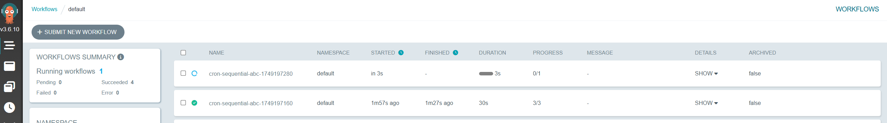
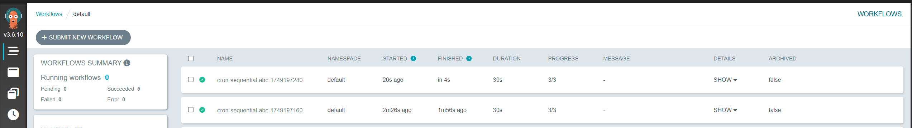

# Argo Workflows 教學指南


本文轉寫時間為 2025年06月06日，內容可能會有變動，僅記錄


## 介紹

Argo Workflows 是一個 Kubernetes-native 的工作流引擎，專門用於執行批次處理任務（batch jobs）、機器學習流程（ML Pipelines）、資料處理等任務。它允許你以 YAML 格式定義一系列任務的執行邏輯，並支援順序（steps）與 DAG（有向無環圖）兩種執行模式。

---

## 安裝

### 1. 使用 Helm 安裝 Controller 與 Server

```bash
helm repo add argo https://argoproj.github.io/argo-helm
```

編輯 `values.yaml` 以設定 ServiceAccount 與 Namespace 權限範圍：

```yaml
workflow:
  serviceAccount:
    create: true
    name: "argo-workflow"
  rbac:
    create: true
controller:
  workflowNamespaces:
    - default
    - foo
    - bar
```

安裝 Argo Workflows：

```bash
helm install --create-namespace -n argo argo-workflows argo/argo-workflows -f values.yaml
```

檢查服務是否正常運作：

```bash
$ kubectl get all -n argo
NAME                                                      READY   STATUS    RESTARTS   AGE
pod/argo-workflows-server-6c9dd44ccf-cppf2                1/1     Running   0          71m
pod/argo-workflows-workflow-controller-584f978655-r62gp   1/1     Running   0          71m

NAME                            TYPE        CLUSTER-IP      EXTERNAL-IP   PORT(S)    AGE
service/argo-workflows-server   ClusterIP   10.43.137.201   <none>        2746/TCP   71m

NAME                                                 READY   UP-TO-DATE   AVAILABLE   AGE
deployment.apps/argo-workflows-server                1/1     1            1           71m
deployment.apps/argo-workflows-workflow-controller   1/1     1            1           71m

NAME                                                            DESIRED   CURRENT   READY   AGE
replicaset.apps/argo-workflows-server-6c9dd44ccf                1         1         1       71m
replicaset.apps/argo-workflows-workflow-controller-584f978655   1         1         1       71m

```

若有啟用 Ingress，可透過瀏覽器進入 UI：&#x20;

<figure><figcaption></figcaption></figure>

---

## 建立範例

### 單一工作

```yaml
apiVersion: argoproj.io/v1alpha1
kind: Workflow
metadata:
  generateName: hello-world-
spec:
  entrypoint: hello-world
  serviceAccountName: argo-workflow
  templates:
    - name: hello-world
      container:
        image: busybox
        command: [ echo ]
        args: [ "hello world" ]
        resources:
          limits:
            memory: 32Mi
            cpu: 100m
```
建立 Workflow
```bash
kubectl create -f demo.yaml
```

UI 可看到成功畫面與日誌：&#x20;

<figure><figcaption></figcaption></figure>

<figure><figcaption></figcaption></figure>

<figure><figcaption></figcaption></figure>

---

### 有序步驟 (Steps)

```yaml
apiVersion: argoproj.io/v1alpha1
kind: Workflow
metadata:
  generateName: sequential-example-
spec:
  entrypoint: sequential-steps
  serviceAccountName: argo-workflow
  templates:
  - name: sequential-steps
    steps:
    - - name: step-one
        template: echo
        arguments:
          parameters:
            - name: message
              value: "Step 1: Start workflow"
    - - name: step-two
        template: echo
        arguments:
          parameters:
            - name: message
              value: "Step 2: Do some work"
    - - name: step-three
        template: echo
        arguments:
          parameters:
            - name: message
              value: "Step 3: Done"

  - name: echo
    inputs:
      parameters:
        - name: message
    container:
      image: alpine
      command: [sh, -c]
      args: ["echo {{inputs.parameters.message}}"]
```
建立 Workflow
```bash
kubectl create -f simple-sequential.yaml
```

UI 顯示執行流程：&#x20;

<figure><figcaption></figcaption></figure>

如需使用不同 container，需定義多個 template：

```yaml
- name: ubuntu-step
  container:
    image: ubuntu
    command: [sh, -c]
    args: ["echo Hello from Ubuntu"]
```

---

## DAG 模式
在 Argo Workflows 中，DAG 模式（Directed Acyclic Graph，有向無環圖） 是一種用來描述步驟之間「相依性」的模式。這與 steps 模式的主要差別是：

| 比較項目 | steps 模式 | dag 模式        |
| ---- | -------- | ------------- |
| 結構   | 線性步驟     | 任務與依賴關係構圖     |
| 並行支援 | 較少       | 支援並行（無依賴即可並行） |
| 適用情境 | 簡單流程     | 複雜依賴的任務       |

**範例：**
* 簡單的 DAG 工作流：

    1. A 最先執行
    2. B 和 C 要等 A 完成
    3. D 要等 B 和 C 都完成

```yaml
apiVersion: argoproj.io/v1alpha1
kind: Workflow
metadata:
  generateName: dag-example-
spec:
  entrypoint: dag-demo
  serviceAccountName: argo-workflow
  templates:
  - name: dag-demo
    dag:
      tasks:
      - name: step-a
        template: echo
        arguments:
          parameters: [{ name: msg, value: "Step A" }]

      - name: step-b
        dependencies: [step-a]
        template: echo
        arguments:
          parameters: [{ name: msg, value: "Step B (after A)" }]

      - name: step-c
        dependencies: [step-a]
        template: echo
        arguments:
          parameters: [{ name: msg, value: "Step C (after A)" }]

      - name: step-d
        dependencies: [step-b, step-c]
        template: echo
        arguments:
          parameters: [{ name: msg, value: "Step D (after B and C)" }]

  - name: echo
    inputs:
      parameters:
        - name: msg
    container:
      image: alpine
      command: [sh, -c]
      args: ["echo '{{inputs.parameters.msg}}'"]
```
建立 dag workflow
```bash
kubectl create -f dag.yaml
```

<figure><figcaption></figcaption></figure>

---

## CronWorkflow 定時排程

`CronWorkflow` 類似於 Linux 的 `cron job`，用來定期執行工作流。

| 欄位                        | 說明                                             |
| ------------------------- | ---------------------------------------------- |
| `schedule`                | crontab 格式的排程設定，如 `0 * * * *` 表示每小時 0 分執行一次    |
| `timezone`                | 指定排程的時區（預設是 UTC）                               |
| `concurrencyPolicy`       | 控制是否允許重複執行，例如 `"Forbid"`、`"Replace"`、`"Allow"` |
| `workflowSpec`            | 與一般 Workflow 相同，定義實際的任務執行邏輯                    |
| `startingDeadlineSeconds` | 最長容忍延遲啟動的秒數，超過後就跳過這次執行                         |


**範例：每 2 分鐘執行一次的 A→B→C 工作流**

```yaml
apiVersion: argoproj.io/v1alpha1
kind: CronWorkflow
metadata:
  name: cron-sequential-abc
spec:
  schedule: "*/2 * * * *"         # 每 2 分鐘執行
  timezone: "Asia/Taipei"         # 自行調整時區
  concurrencyPolicy: "Forbid"     # 若上一次還在跑，就不啟動新的
  successfulJobsHistoryLimit: 2
  failedJobsHistoryLimit: 1
  startingDeadlineSeconds: 30
  workflowSpec:
    entrypoint: sequential-abc
    serviceAccountName: argo-workflow
    templates:
    - name: sequential-abc
      steps:
      - - name: step-a
          template: echo
          arguments:
            parameters: [{ name: msg, value: "Step A" }]
      - - name: step-b
          template: echo
          arguments:
            parameters: [{ name: msg, value: "Step B" }]
      - - name: step-c
          template: echo
          arguments:
            parameters: [{ name: msg, value: "Step C" }]

    - name: echo
      inputs:
        parameters:
          - name: msg
      container:
        image: alpine
        command: [sh, -c]
        args: ["echo '{{inputs.parameters.msg}}'"]
``` 
建立 CronWorkflow
```bash
kubectl apply -f cron-abc.yaml
```

UI 中可觀察週期性觸發的 Workflow 執行紀錄：&#x20;

<figure><figcaption></figcaption></figure>

<figure><figcaption></figcaption></figure>

<figure><figcaption></figcaption></figure>

---

若需進一步整合 S3 Artifact、Parameter Passing、WorkflowTemplate 與 ClusterWorkflowTemplate 等進階功能，可再擴充。

>  提示：確保 cluster 中的 `argo-workflow` ServiceAccount 具備必要權限，例如存取 ConfigMap、Secret、Pod、Workflow CRD 等資源。
