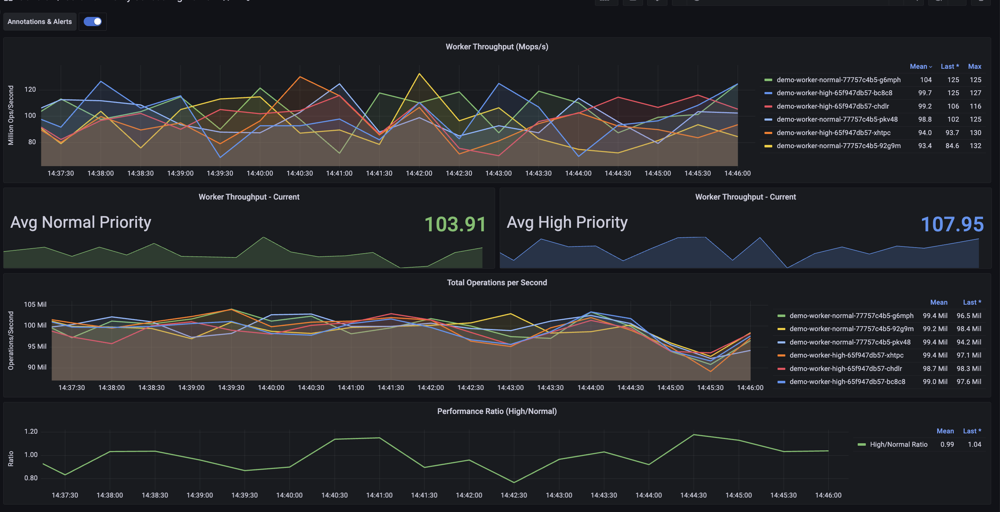
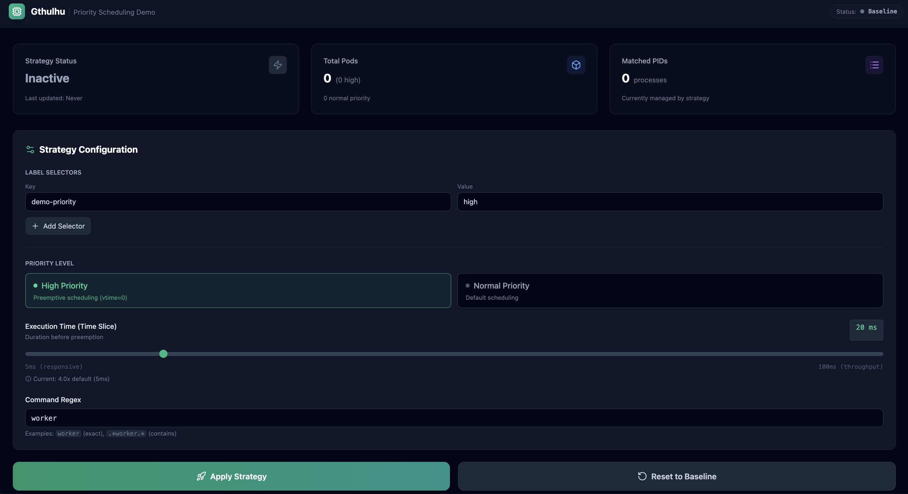
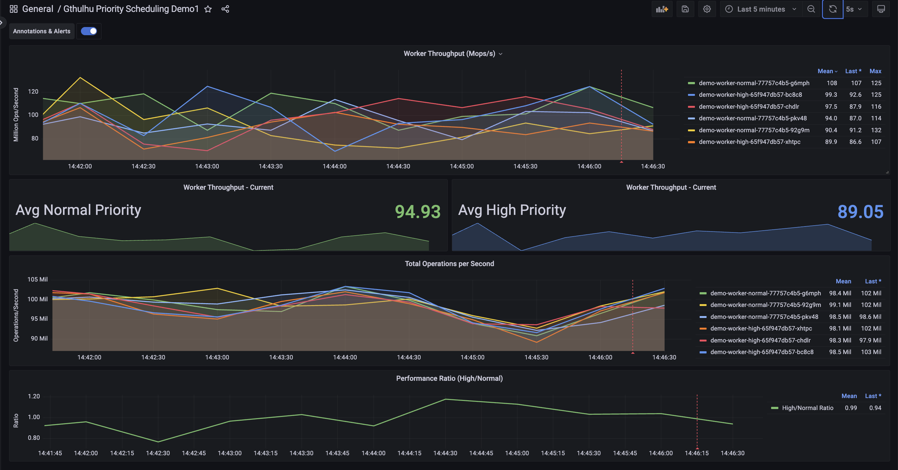
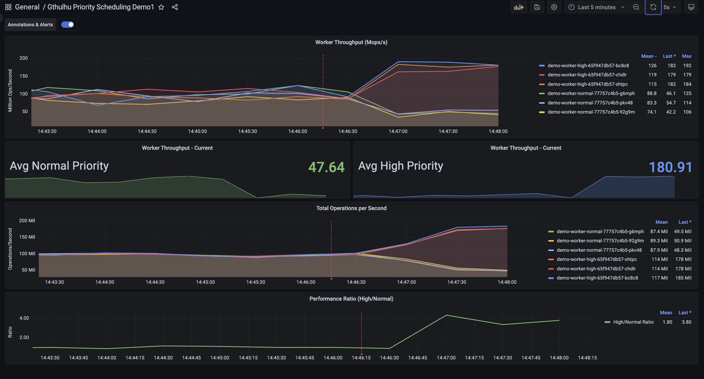
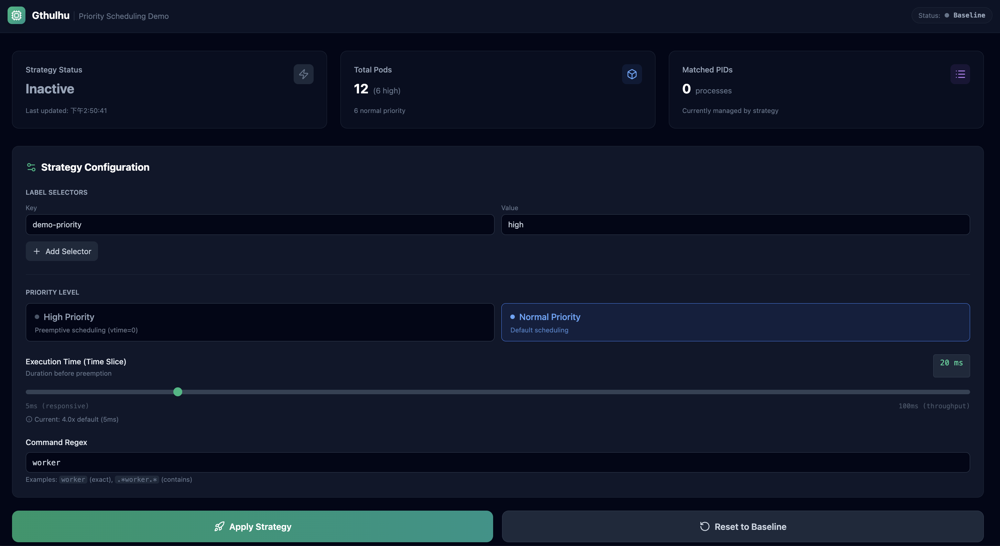
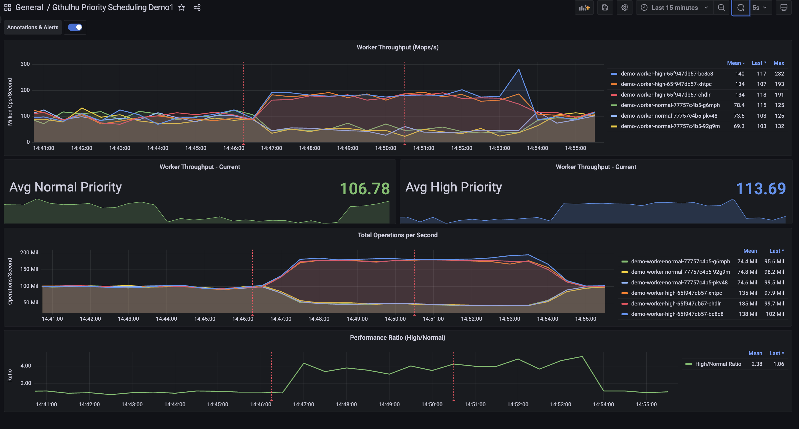

# Gthulhu 優先權排程測試


本文轉寫時間為 2025年12月05日，內容可能會有變動，僅記錄


## 介紹

Gthulhu 是一個雲原生調度器，把工作分成兩個地方做：系統核心裡的 BPF 組件處理基礎任務，一般程式裡的 Go 調度器做聰明決定，調度器會智能地選擇哪個 CPU 核心來執行任務，考慮 CPU 的快取記憶體關係，讓程式執行更快，基於虛擬運行時間的調度策略，讓延遲敏感的任務優先執行，並根據任務重要性動態調整執行時間。

## 測試目標

本測試旨在驗證 Gthulhu eBPF 排程器在 Kubernetes 環境中的動態優先權調整能力。透過部署兩組 CPU 密集型運算程式,模擬資源競爭場景,並使用 Gthulhu 動態調整特定 Pod (標籤為 `demo-priority=high`) 的排程優先權,觀察以下效果:

1. **高優先權 Pod**: 觀察運算吞吐量是否提升
2. **一般優先權 Pod**: 觀察是否因 CPU 時間分配減少而導致吞吐量下降
3. **可逆性驗證**: 確認恢復預設策略後,兩組 Pod 回到公平競爭狀態

## 測試環境

### 測試負載 (Workload)

使用自製 Go 程式 ([`demo_workload.go`](../demo_workload.go)) 作為測試負載:

- **運算特性**: 執行 CPU 密集型運算 (無限迴圈執行浮點數開根號運算)
- **效能指標**: 即時輸出運算吞吐量,單位為 **Mops/s** (百萬次運算/秒)
- **監控整合**: 透過 Prometheus Metrics 介面輸出指標,適用於 Kubernetes 環境
- **部署配置**:
  - 高優先權組: 3 個 Pod,標籤 `demo-priority=high`
  - 一般優先權組: 3 個 Pod,標籤 `demo-priority=normal`

### 操作介面

透過自製 Gthulhu UI 呼叫 Gthulhu API 執行優先權設定,並使用 Grafana 進行即時監控和視覺化分析。

## 測試步驟與結果

### 步驟 1: 基線測試 - 觀察預設排程行為

首先進入 Grafana Dashboard 觀察兩組 Pod 在預設排程策略下的表現。

**觀察結果**:

- 兩組 Pod (high 與 normal) 的運算吞吐量 (Mops/s) 接近
- 這證明在預設的策略下,CPU 資源被公平分配

<figure><figcaption></figcaption></figure>

---

### 步驟 2: 啟用優先權排程策略

透過 Gthulhu UI 設定優先權排程策略:

**設定參數**:

- **目標 Pod 選擇器**: `demo-priority=high`
- **優先權等級**: High Priority (高優先權)
- **Execution Time**: 20ms (預設值)

<figure><figcaption></figcaption></figure>

**執行動作**:

1. 在 UI 中選擇策略參數
2. 點擊「Apply Strategy」按鈕
3. 系統自動呼叫 Gthulhu API,將策略寫入 eBPF Map
4. 同時在 Grafana 建立 Annotation 標記策略生效時間點

---

### 步驟 3: 觀察優先權調整效果

回到 Grafana Dashboard 觀察策略生效後的變化。

**立即觀察**:

- 圖表中出現**紅色垂直線** (Annotation),標記優先權策略啟用時間點

<figure><figcaption></figcaption></figure>

**持續觀察 (等待數十秒後)**:

- **高優先權組** (`demo-priority=high`): Mops/s **顯著提升**
  - 原因: 獲得更多 CPU 執行時間片段
- **一般優先權組** (`demo-priority=normal`): Mops/s **相對下降**
  - 原因: CPU 時間被高優先權 Pod 搶占

<figure><figcaption></figcaption></figure>

**結論**: Gthulhu 成功實現動態優先權調整,高優先權 Pod 獲得更多運算資源。

---

### 步驟 4: 恢復預設排程策略

回到 Gthulhu UI,將排程策略重置為預設 (公平排程)。

**操作**:

- 點擊「Reset to Default」按鈕
- 清除所有自訂優先權設定
- 系統恢復使用預設行為

<figure><figcaption></figcaption></figure>

**觀察結果**:

- Grafana 中出現**第二條紅色垂直線**,標記策略重置時間點
- 等待一段時間後 (約數十秒),兩組 Pod 的 Mops/s 逐漸**恢復平衡**
- 證明優先權調整具有**可逆性**,不會對系統造成永久影響

<figure><figcaption></figcaption></figure>

---

## 測試結論

本次測試成功驗證了 Gthulhu eBPF 排程器的以下能力:

###  核心功能驗證

1. **動態優先權調整**: 能夠在不重啟 Pod 的情況下,即時調整排程優先權
2. **標籤選擇器支援**: 透過 Kubernetes Label 精準選擇目標 Pod
3. **可觀測性**: 整合 Grafana Annotation,清楚標記策略變更時間點
4. **可逆性**: 策略重置後,系統能恢復到預設公平排程狀態

###  效能影響

- **高優先權 Pod**: 運算吞吐量顯著提升 (視覺上可見差異)
- **一般優先權 Pod**: 吞吐量相應下降,符合預期
- **策略切換延遲**: 約數十秒內完全生效

###  應用場景

此功能適用於以下場景:

- **關鍵任務優先保障**: 確保重要服務在資源競爭時獲得優先執行
- **差異化服務等級 (SLA)**: 為不同等級客戶提供差異化運算資源
- **動態資源調度**: 根據業務需求即時調整 Pod 優先權,無需重新部署

###  技術特點

- **零侵入性**: 使用 eBPF sched_ext 框架,無需修改 Kernel 或應用程式
- **低延遲**: 策略透過 eBPF Map 直接生效,無需系統呼叫
- **細粒度控制**: 支援 Process-level 的優先權設定 (透過 PID/Command 匹配)
