# Chaos Mesh


本文轉寫時間為 2024年9月20日，內容可能會有變動，請以官方文件為主


## 介紹

提到 chaos-mesh 前，要先提到混沌工程，混沌工程是一種方法論，而chaos-mesh 是實現混沌工程的工具

### 混沌工程

混沌工程簡單的說「故意在系統裡製造可控的壞事」，來驗證你的分散式系統和 Kubernetes 在出包時撐不撐得住、監控的告警不告得出來 大致有以下幾個概念

1. 定義系統穩定狀態
   * 先決定「系統正常時」要看的指標是什麼，例如整體 QPS、錯誤率、P95 latency。 這些指標就是你判斷「有沒有被搞壞」的基準線
2. 建立假設
   * 寫一句有點像科學實驗的話： 「在某某故障發生時，上面那些穩態指標應該還維持在某個範圍內。」，看看你對系統目前掌握度如何，例如：「如果隨機一個 pod 掛掉，整體錯誤率仍應低於 1%。」
3. 注入真實世界的故障
   * 要動手「搞事」，但要盡量貼近真實會遇到的事件：
     * server / pod 掛掉
     * 磁碟壞軌或 I/O 變慢
     * 網路延遲、封包遺失、斷線
     * 下游服務超時或回應 5xx
   * 也可以是「非故障事件」例如流量暴衝、pod memory 滿載、擴縮容時的 jitter
4. 優先在生產環境驗證
   * 混沌實驗如果能在 production 執行，價值最高，因為流量與依賴都最真實。如果無法做到，盡量還是在 staging 或 pre-prod 執行，模擬真實的流量和情況。
   * 但前提是：你已經知道系統在該情境下「至少有一定容錯能力」，不會一下就資損。
   * 如果事前就很清楚：系統在某種故障下完全沒容災，那就不要硬在 production 做那種實驗，不然你可能會被抓去填坑。
5. 要持續的做混沌工程
   * 混沌工程不是做一次、寫一篇報告就結案。
   * 要自動化、排程化，讓實驗可以週期性地重跑。
   * 系統會演進、依賴會改變，新 bug 也會被引入，持續跑實驗才能持續壓低故障復發率、提早發現新問題。
6. 控制好爆炸半徑（Impact / Blast Radius）
   * 很關鍵的一點是「影響面」要控制好，避免實驗變成真正的事故。
   * 可以透過：
     * 環境隔離（例如先在灰度、特定 tenant、某個 region 跑）
     * 故障注入工具本身的粒度設定（只打某個 namespace、某組 label、少量實例）
   * 目標是：在可接受的風險範圍內找到問題，而不是真的把生產炸爛。
7. 觀察、分析、改進
   * 實驗過程中要密切觀察系統的指標、日誌、告警，看看是否有異常。
   * 實驗結束後要分析結果，看看假設對不對？系統表現如何？有沒有發現新的問題？需要改進什麼？
   * 最後把學到的東西反饋到系統設計、實施、監控等各個環節，讓整個系統變得更健壯。

### Chaos Mesh

Chaos Mesh 是一個基於 Kubernetes 的混沌工程平台，旨在幫助開發人員和運維人員測試和提高系統的韌性。它提供了一套工具和功能，使您能夠在 Kubernetes 環境中模擬各種故障和異常情況，以驗證系統在面對這些挑戰時的表現。

## 安裝 chaos-mesh

1. 增加 helm repo

```
helm repo add chaos-mesh https://charts.chaos-mesh.org
```

2. 新增 namespaces

```
kubectl create ns chaos-mesh
```

3. 下載 helm values.yaml 檔案

```
wget https://github.com/chaos-mesh/chaos-mesh/blob/master/helm/chaos-mesh/values.yaml
```

4. 編輯values.yaml，根據 K8S 使用的container runtime 做設定 此範例使用的是 docker

```
runtime: docker
socketPath: /var/run/docker.sock
```

5. 透過 helm 安裝

```
helm install chaos-mesh chaos-mesh/chaos-mesh -n=chaos-mesh -f values.yaml
```

6. 透過 NodePort 進入 dashboard

```
kubectl get svc -n chaos-mesh | grep dashboard
chaos-dashboard                 NodePort    10.43.147.66    <none>        2333:31252/TCP,2334:30208/TCP
```

7.  進入 dashboard 需要透過 token，可以透過 Click here 取得建立token 步驟&#x20;

    <figure>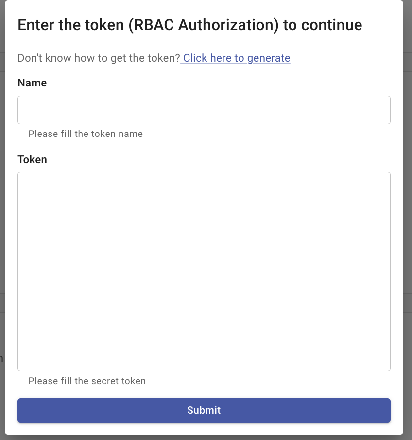<figcaption></figcaption></figure>
8.  根據所需權限，選擇namespace或是整個 Cluster，並按照步驟建立rbac 和 token&#x20;

    <figure>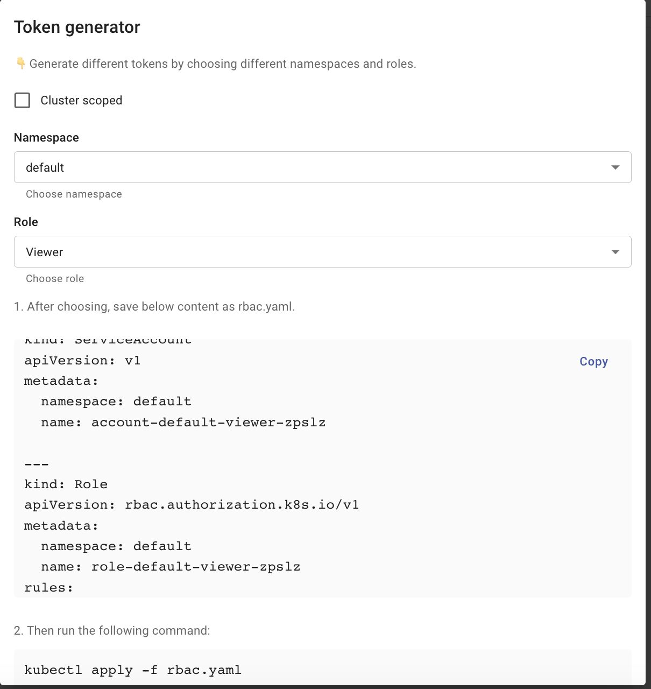<figcaption></figcaption></figure>
9.  取得token後輸入，即可登入\
    &#x20;

    <figure>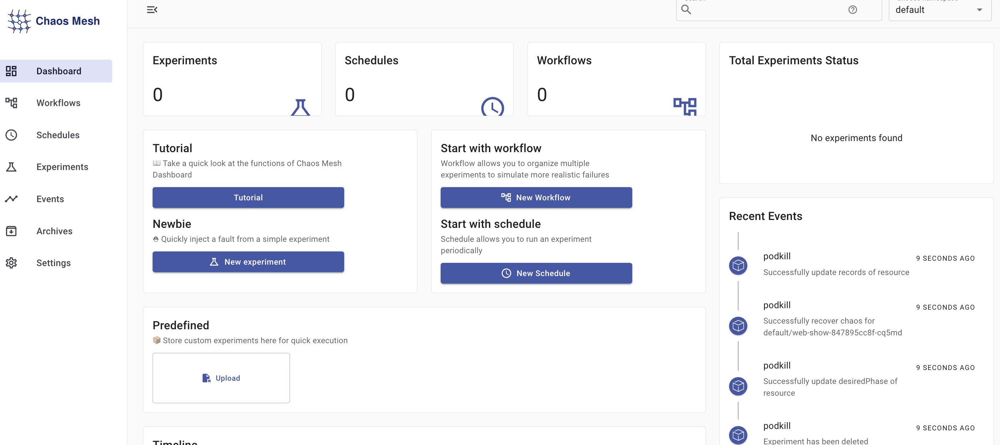<figcaption></figcaption></figure>

## 建立測試程式

建立名為 web-show 的測試程式，此程式可以在網頁上看到 ping kube-system pod 的結果圖表

1. 到 chaos-mesh 的 github 取得範例

```
https://github.com/chaos-mesh/chaos-mesh/tree/master/examples/web-show
```

2. 執行 deploy.sh
3.  建立完成後，從 NodePort 進入web-show&#x20;

    <figure>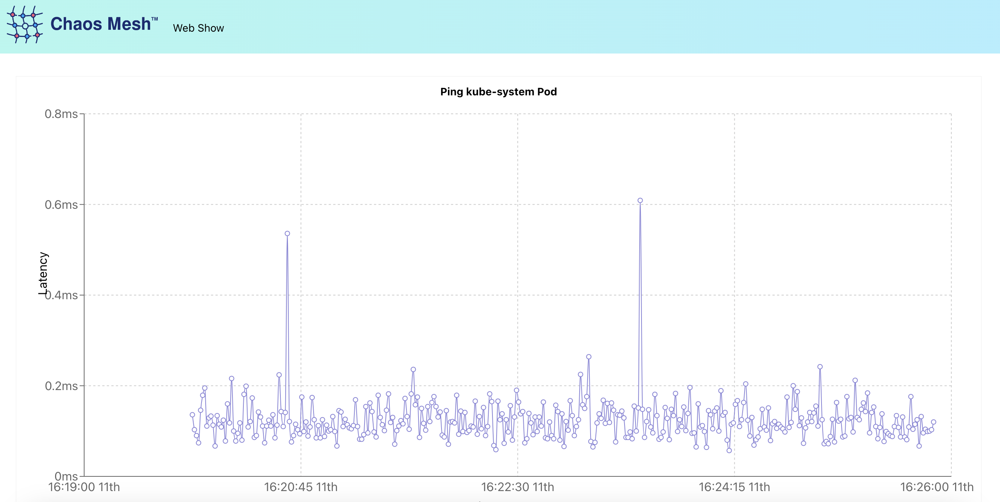<figcaption></figcaption></figure>

## 建立網路延遲實驗

1.  建立一個實驗，類型為網路攻擊的延遲，設為 10ms&#x20;

    <figure>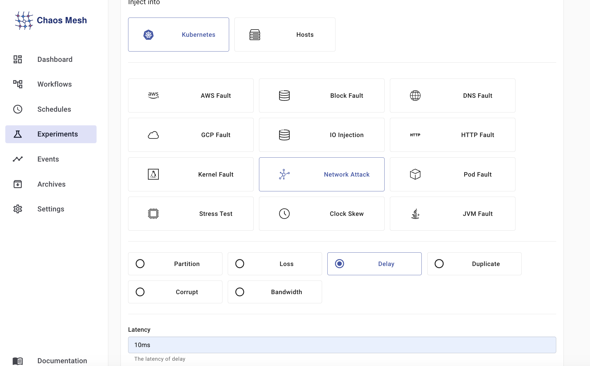<figcaption></figcaption></figure>
2.  目標設定為 web-show pod，持續 10s，然後建立&#x20;

    <figure>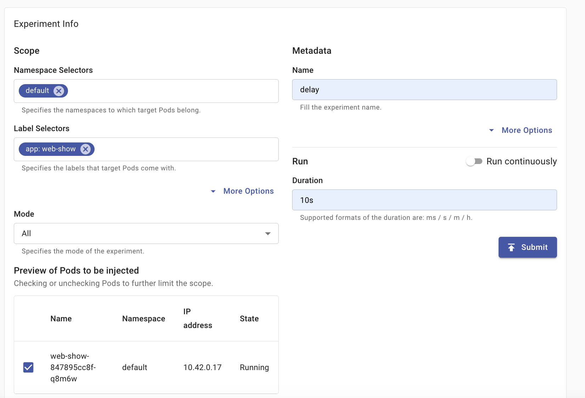<figcaption></figcaption></figure>
3.  查看web-show 發現 ping 的封包確實有持續10s延遲&#x20;

    <figure>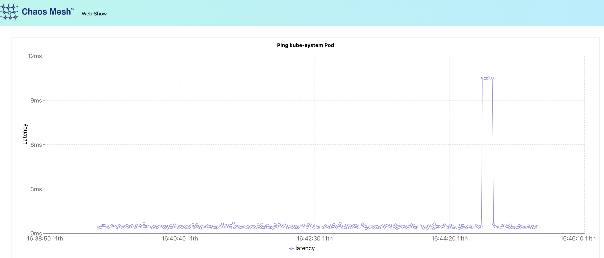<figcaption></figcaption></figure>
4.  回到實驗頁面，看到實驗已執行完成&#x20;

    <figure>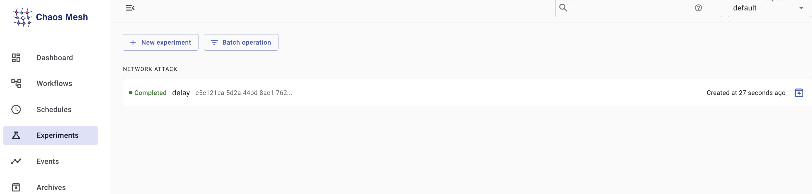<figcaption></figcaption></figure>

## 建立網路封包遺失實驗

1.  建立一個實驗，類型為網路封包遺失，遺失率為 100%&#x20;

    <figure>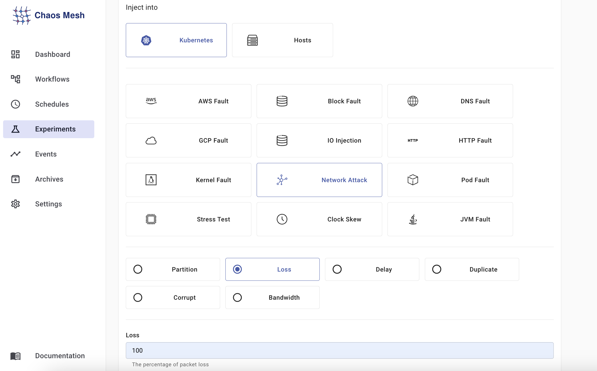<figcaption></figcaption></figure>
2.  目標設定為 web-show pod，持續 10s，然後建立&#x20;

    <figure>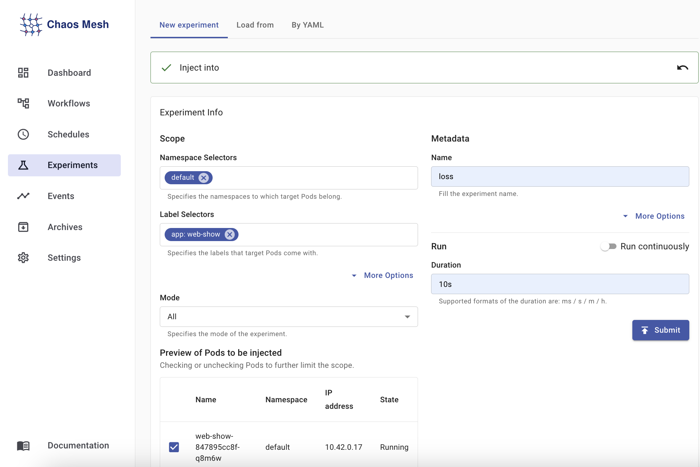<figcaption></figcaption></figure>
3.  查看 web-show，確定封包有遺失&#x20;

    <figure>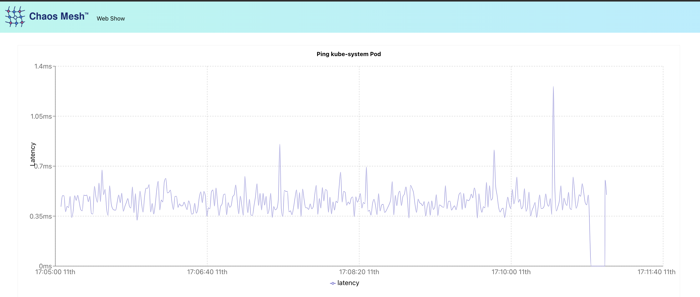<figcaption></figcaption></figure>

## 建立 Pod Failure 實驗

1.  建立 Pod Fault 類型的 pod Failure 實驗&#x20;

    <figure>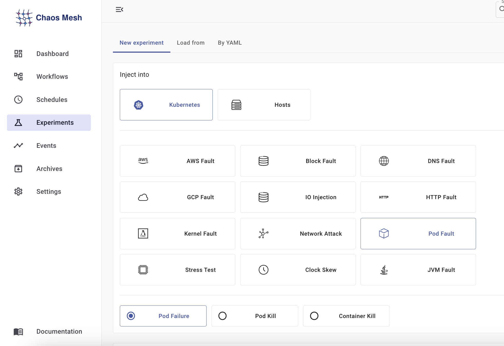<figcaption></figcaption></figure>
2.  選定 web-show pod，持續時間為永久，送出實驗&#x20;

    <figure>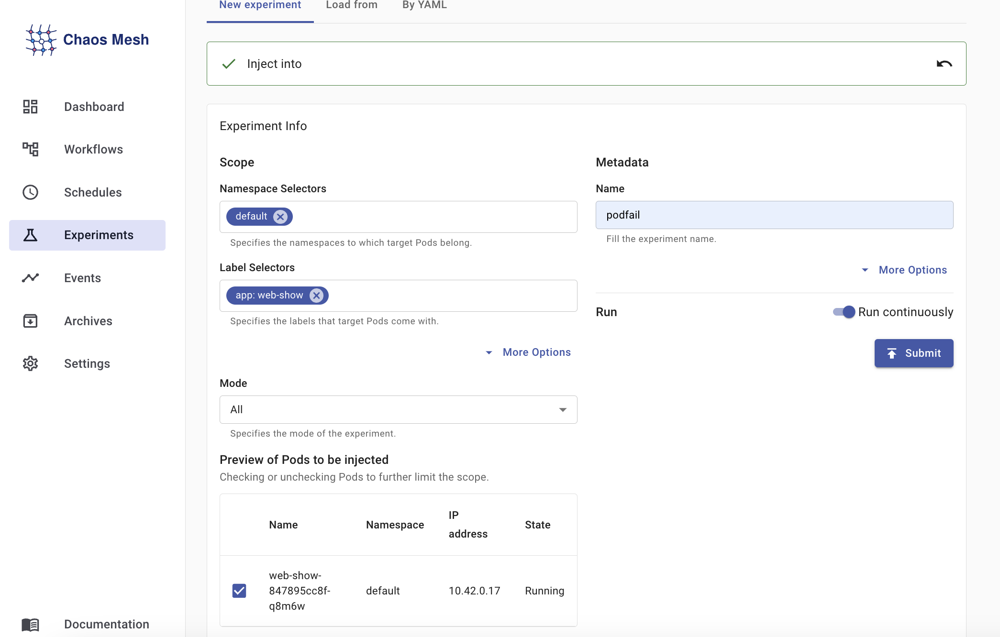<figcaption></figcaption></figure>
3.  查看 pod 狀態&#x20;

    <figure>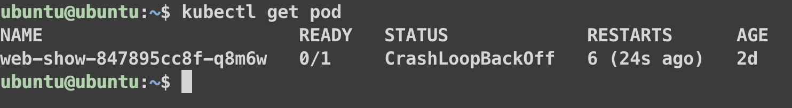<figcaption></figcaption></figure>
4.  查看實驗狀態&#x20;

    <figure>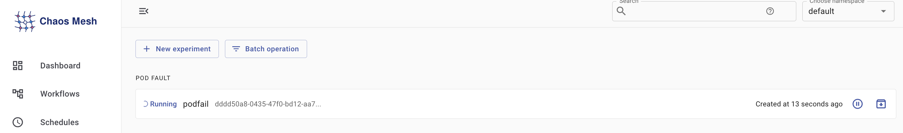<figcaption></figcaption></figure>
5.  停止實驗，確認 pod 恢復正常&#x20;

    <figure>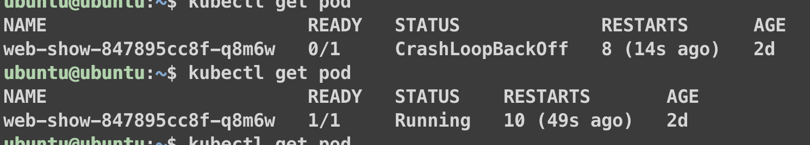<figcaption></figcaption></figure>

## 建立 Pod CPU Memory 壓力測試實驗

1.  建立 Stress Test 實驗，讓 Pod CPU 和 Memory 滿載&#x20;

    <figure>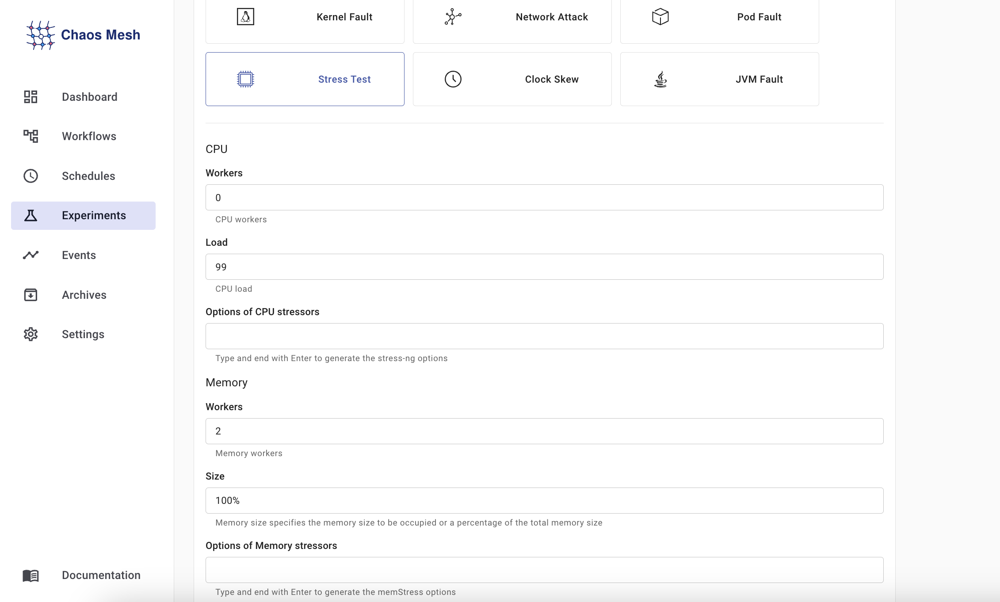<figcaption></figcaption></figure>
2.  選定 web-show pod，持續時間為永久，送出實驗&#x20;

    <figure>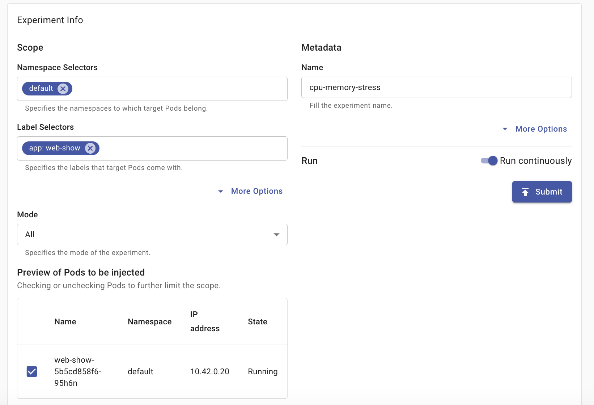<figcaption></figcaption></figure>
3.  此範例程式的資源 limit 為 cpu 0.3 core memort 20Mi

    <figure>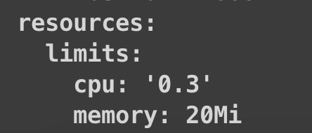<figcaption></figcaption></figure>
4.  查看pod監控值，CPU Memory都滿載&#x20;

    <figure><figcaption></figcaption></figure>

## 建立多個混沌實驗(workflow)

除了建立單一實驗外，還可以建立多個實驗，多個實驗可以同時進行，或是依序進行，接下來範例建立一個workflow，內容為執行

```
network delay 10ms 持續20s -> 暫停 5s -> network loss 100% 持續20s
```

可以透過 UI 來制定 workflow  不過以下範例是透過 yaml 來制定

<figure>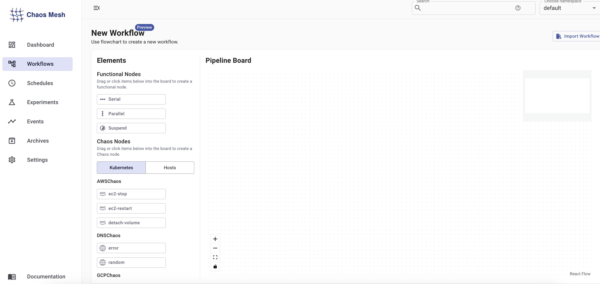<figcaption></figcaption></figure>

1.建立workflow yaml 檔

```
apiVersion: chaos-mesh.org/v1alpha1
kind: Workflow
metadata:
  name: network-workflow-serial
spec:
  entry: network-entry
  templates:
    - name: network-entry
      templateType: Serial
      deadline: 240s
      children:
        - workflow-network-delay-chaos
        - suffix-suspending
        - workflow-network-loss-chaos
    - name: workflow-network-delay-chaos
      templateType: NetworkChaos
      deadline: 20s
      networkChaos:
        direction: to
        action: delay
        mode: all
        selector:
          labelSelectors:
            "app": "web-show"
        delay:
          latency: "10ms"
          correlation: "100"
          jitter: "0ms"
    - name: workflow-network-loss-chaos
      templateType: NetworkChaos
      deadline: 20s
      networkChaos:
        direction: to
        action: loss
        mode: all
        selector:
          labelSelectors:
            "app": "web-show"
        loss:
          loss: '100'
          correlation: "100"
    - name: suffix-suspending
      templateType: Suspend
      deadline: 5s
```

2. 使用 kubectl apply 建立 workflow
3.  查看 web-show 結果，確實先 delay，暫停，再 loss&#x20;

    <figure>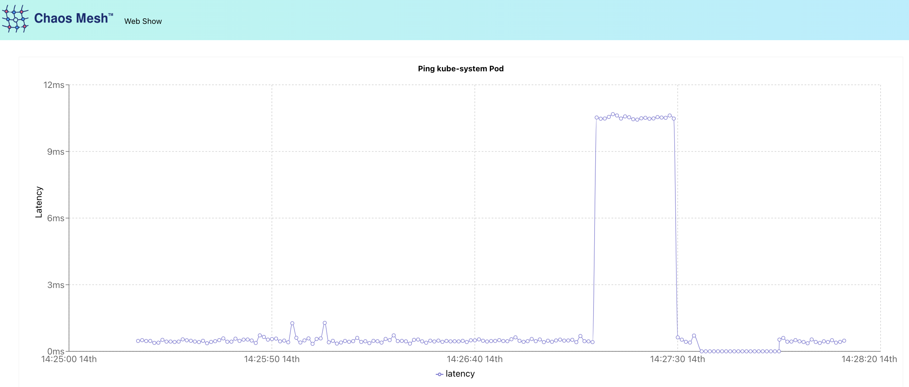<figcaption></figcaption></figure>
4.  查看 workflow 頁面的實驗拓墣圖&#x20;

    <figure>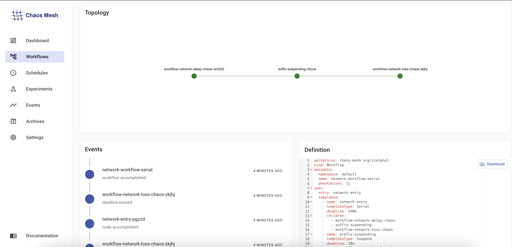<figcaption></figcaption></figure>

## DNS Chaos

安裝 Chaos DNS service

```
helm upgrade chaos-mesh chaos-mesh/chaos-mesh --namespace=chaos-mesh --set dnsServer.create=true
```

這是 Core-DNS 的 plugin ，目前測試不影響原有的 Core-DNS

安裝 Chaos DNS Service 後，才會看到 DNS的錯誤實驗 可以選擇 error

先測試解析錯誤，測試解析到 google.com 有錯誤  指定服務 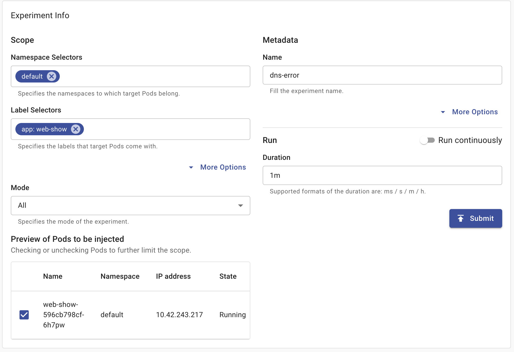

<figure>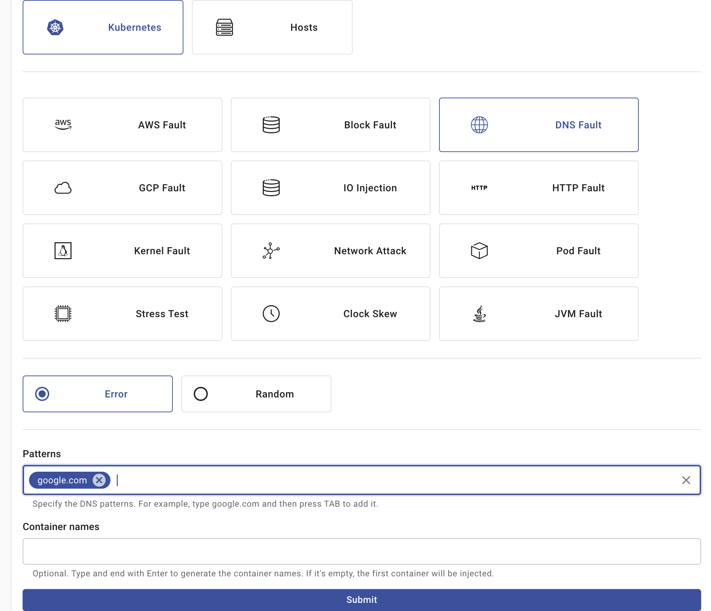<figcaption></figcaption></figure>

這是在注入 DNS 錯誤前，從pod 內部 ping google.com ，可以解析&#x20;

<figure>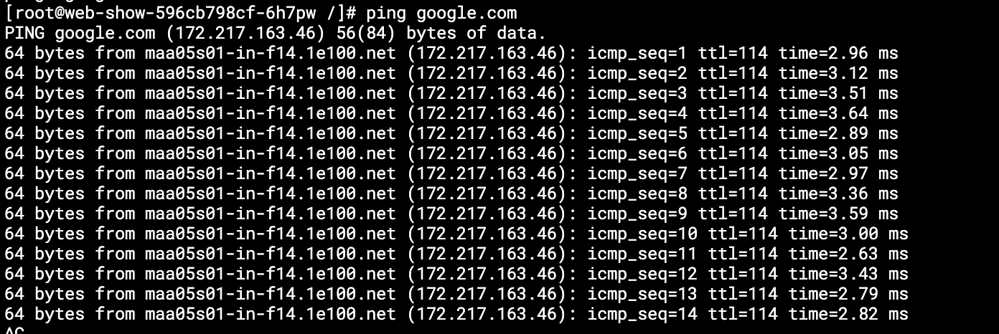<figcaption></figcaption></figure>

注入錯誤後，就無法解析了&#x20;

<figure>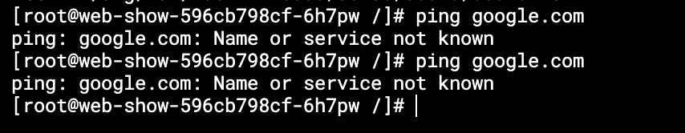<figcaption></figcaption></figure>

測試 DNS Random 返回 IP，這次輸入\*，所有的 domain name 會隨機返回 IP  指定服務&#x20;

<figure>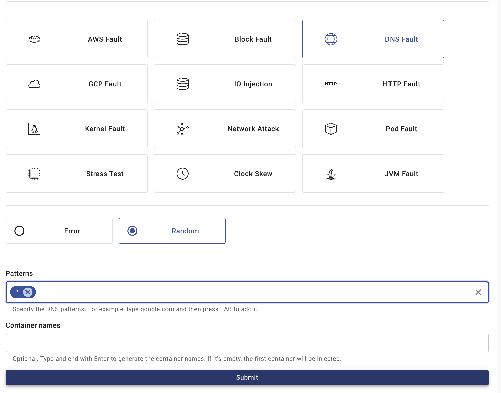<figcaption></figcaption></figure>

<figure>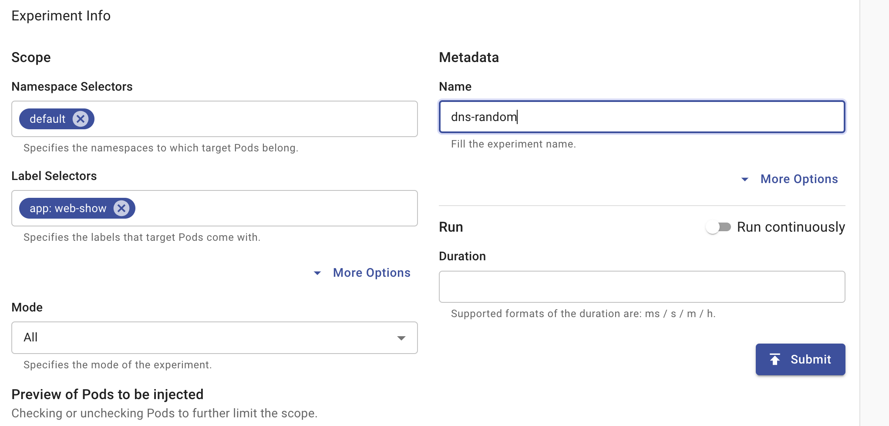<figcaption></figcaption></figure>

從pod ping 測試，可以看到不論是 cluster 內部或外部的 domain name 解析，都會隨機返回 IP

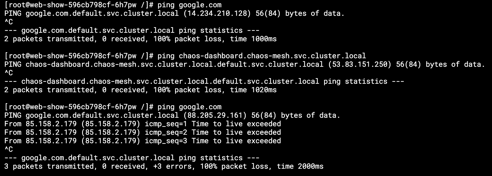

## 總結

透過chaos-mesh，可以直接對pod 注入網路問題，或是壓力測試等等，其實還有很多種類的錯誤可以來玩，像是時間錯誤和 http request 的問題，透過問題的注入，來檢視系統服務的韌性以及目前的告警機制和log系統是否能察覺問題發生的原因，從而讓平台跟系統變得越來越強大

## Chaosd

Chaosd 是由 Chaos Mesh 提供的混沌工程測試工具。您需要單獨下載並部署它（請參閱下載和部署）。它用於將故障注入到物理機器環境中，並且還可以恢復故障。

Chaosd 具有以下核心優勢：

易於使用：您只需要在 Chaosd 中執行簡單的命令即可創建和管理混沌實驗。 各種故障類型：Chaosd 提供各種故障類型，可以注入到不同級別的物理機器中，包括進程、網絡、壓力、磁盤、主機等。將添加更多的故障類型。 多種工作模式：Chaosd 可以作為命令行工具和服務使用，以滿足不同場景的需求。 支持的故障類型 您可以使用 Chaosd 模擬以下故障類型：

進程：將故障注入到進程中。支持操作如終止進程或停止進程等。 網絡：將故障注入到物理機器的網絡中。支持操作如增加網絡延遲、丟包和損壞包等。 壓力：對物理機器的 CPU 或內存施加壓力。 磁盤：將故障注入到物理機器的磁盤中。支持操作如增加讀寫磁盤負載和填充磁盤等。 主機：對物理機器施加故障。支持操作如關閉物理機器等。

***

chaos mesh 對應 chasod 版本

| Chaos Mesh version | Chaosd version |
| ------------------ | -------------- |
| v2.1.x             | v1.1.x         |
| v2.2.x             | v1.2.x         |

##

1.  安裝chaosctl

    ```
    $ curl -sSL https://mirrors.chaos-mesh.org/latest/chaosctl -O
    $ chmod +x chaosctl
    $ mv chaosctl /usr/local/bin/
    ```
2.  透過 chaosctl 產生 TLS 憑證，並註冊至 chaos-mesh 執行 Chaosctl 的機器可以存取Kubernetes 叢集，並且可以使用SSH 工具連接到實體機。 以下操作會產生Chaosd 所需的證書，並把證書存到對應的實體機上，並在Kubernetes 叢集中建立對應的PhysicalMachine資源。 `chaosctl pm init PHYSICALMACHINE_NAME -n NAMESPACE --ip REMOTEIP -l key1=value1,key2=value2`

    ```
    $ chaosctl pm init worker2 --ip=192.168.1.22 --ssh-user=ubuntu -l node=worker2 -n chaos-mesh --path chaosd/pki
    ```

    參數補充說明:

    * path: 目標機器存放憑證位置
    * ssh-user: 指定 ssh 使用者
    * l: 設定label
    * n: chaos-mesh 安裝的 namespace
3.  檢查叢集的 crd 中的 physicalmachines 是否有被建立

    ```
    $ kubectl get  physicalmachines -n chaos-mesh
    ```

    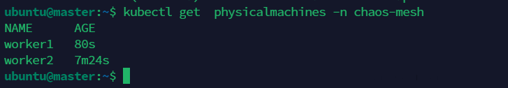
4.  到各個標機器下載 chasod，最新版本請看 https://github.com/chaos-mesh/chaosd/releases

    ```
    $ export CHAOSD_VERSION=v1.4.0
    $ curl -fsSLO https://mirrors.chaos-mesh.org/chaosd-$CHAOSD_VERSION-linux-amd64.tar.gz
    $ tar zxvf chaosd-$CHAOSD_VERSION-linux-amd64.tar.gz && sudo mv chaosd-$CHAOSD_VERSION-linux-amd64 /usr/local/
    ```
5.  將 Chaosd 資料夾加到環境變數 PATH 中

    ```
    $ export PATH=/usr/local/chaosd-v1.4.0-linux-amd64:$PATH
    ```
6.  啟動 chaosd，指定憑證，預設 port 為 31768

    ```
    $ chaosd server --https-port 31768 --CA=/home/ubuntu/chaosd/pki/ca.crt --cert=/home/ubuntu/chaosd/pki/chaosd.crt --key=/home/ubuntu/chaosd/pki/chaosd.key
    ```

    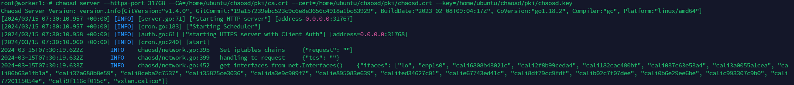

### 測試實驗

如果要在實驗中選擇目標機器，請開啟 Use new PhysicalMachine CRD

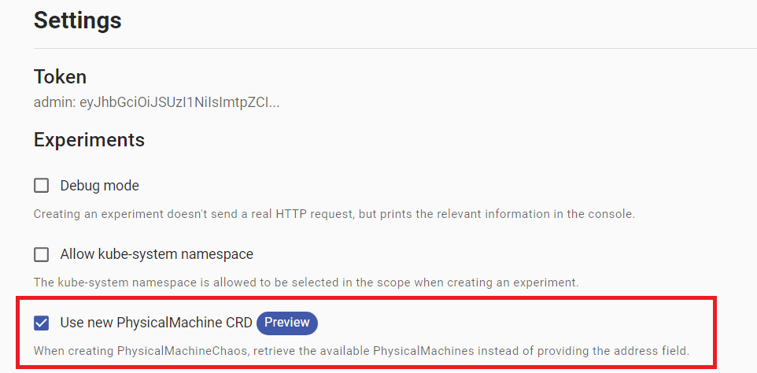

#### CPU 壓力

1.  選擇 Hosts -> Stress Test -> CPU，設定壓力&#x20;

    <figure>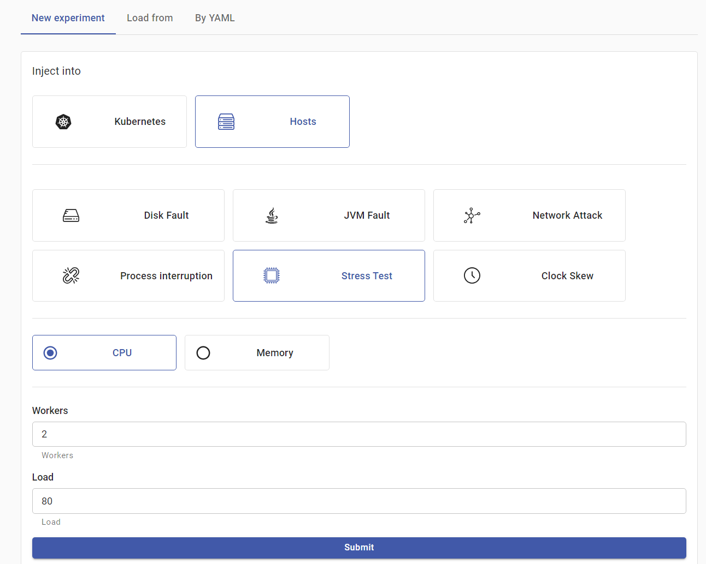<figcaption></figcaption></figure>
2. 選擇目標機器，設定持續時間，送出

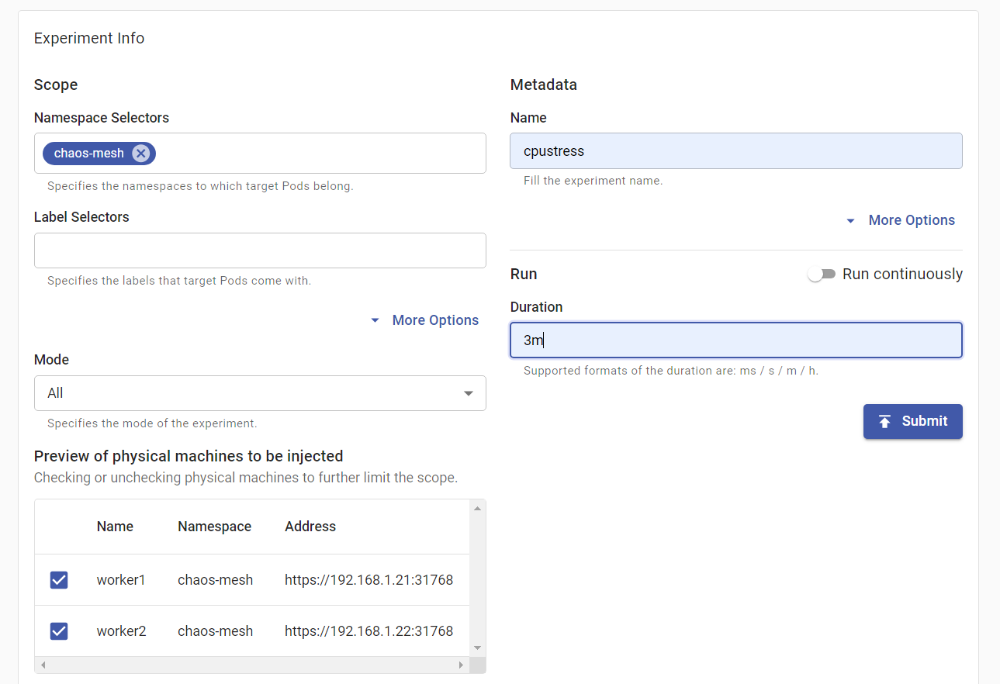

3.  到目標機器，可以看到 chaosd 被呼叫了建立實驗 API  查看機器的 cpu，確實有被加壓到80%&#x20;

    <figure>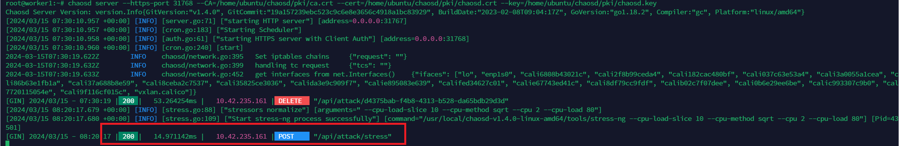<figcaption></figcaption></figure>

    <figure>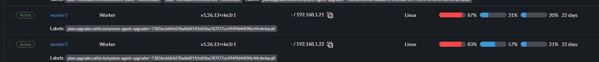<figcaption></figcaption></figure>

#### Network dekay

1.  選擇 Hosts -> Network Attack -> delay&#x20;

    <figure>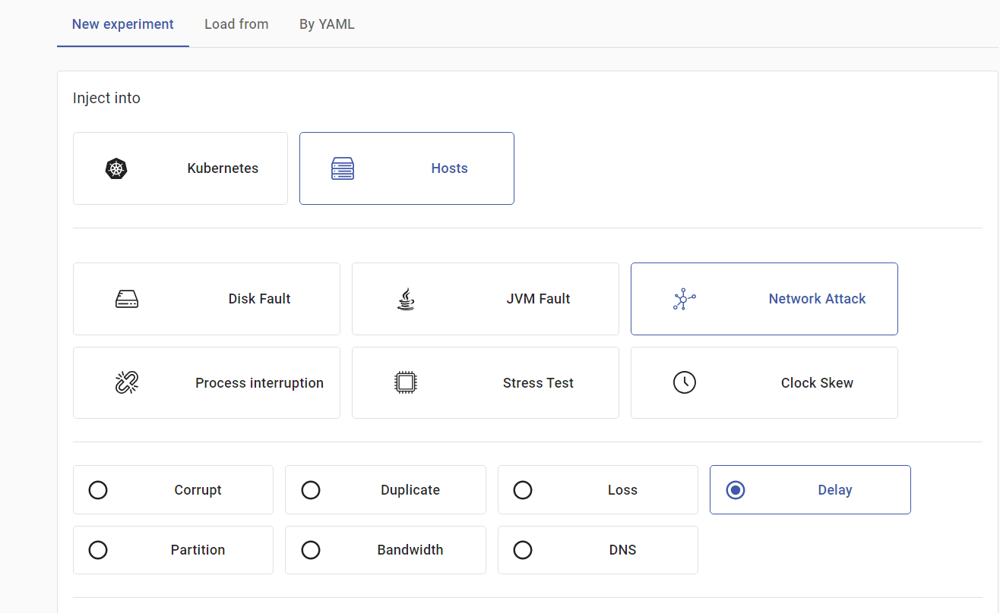<figcaption></figcaption></figure>
2.  設定延遲，指定網卡，這裡設定往 192.168.1.20(master)和192.168.1.21(worker1)的網路延遲10000ms&#x20;

    <figure><figcaption></figcaption></figure>

3.選擇目標機器，設定持續時間，送出&#x20;

<figure>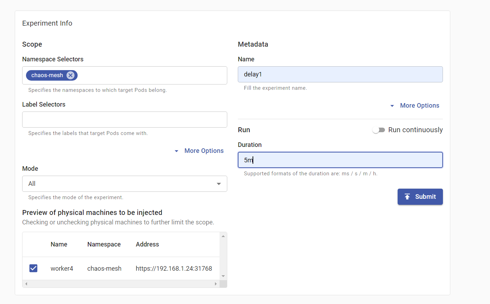<figcaption></figcaption></figure>

4. 以上的結果會是 讓 worker4 送往(或收到) master 和 worker1 的網路延遲 10000ms
5.  查看 k8s 的 節點狀態，可以看到 worker4有問題&#x20;

    <figure>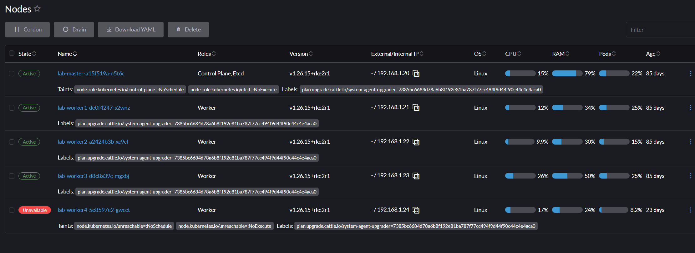<figcaption></figcaption></figure>

當然可以再設定長一點的延遲或是持續時間，觀察在worker4上面的pod 會有什麼狀況，或是觸發告警等等，把狀況記錄下來

#### Network 封包 loss

1.  選擇 Hosts -> Network Attack&#x20;

    <figure>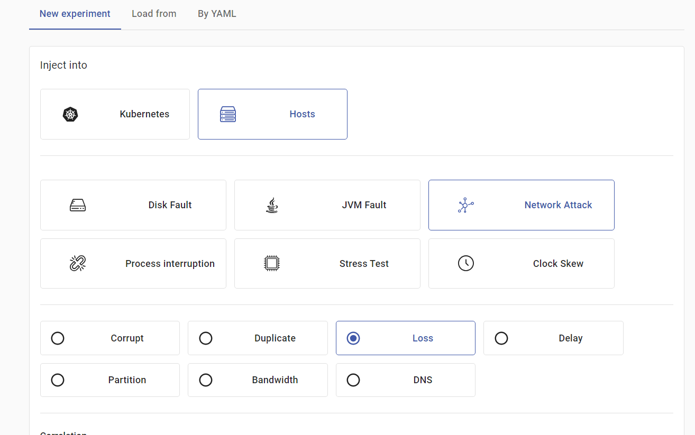<figcaption></figcaption></figure>
2.  設定封包遺失率，指定網卡，這裡設定從 192.168.1.19 來的封包(或送出)，遺失率50%，其餘設定請看官網&#x20;

    <figure>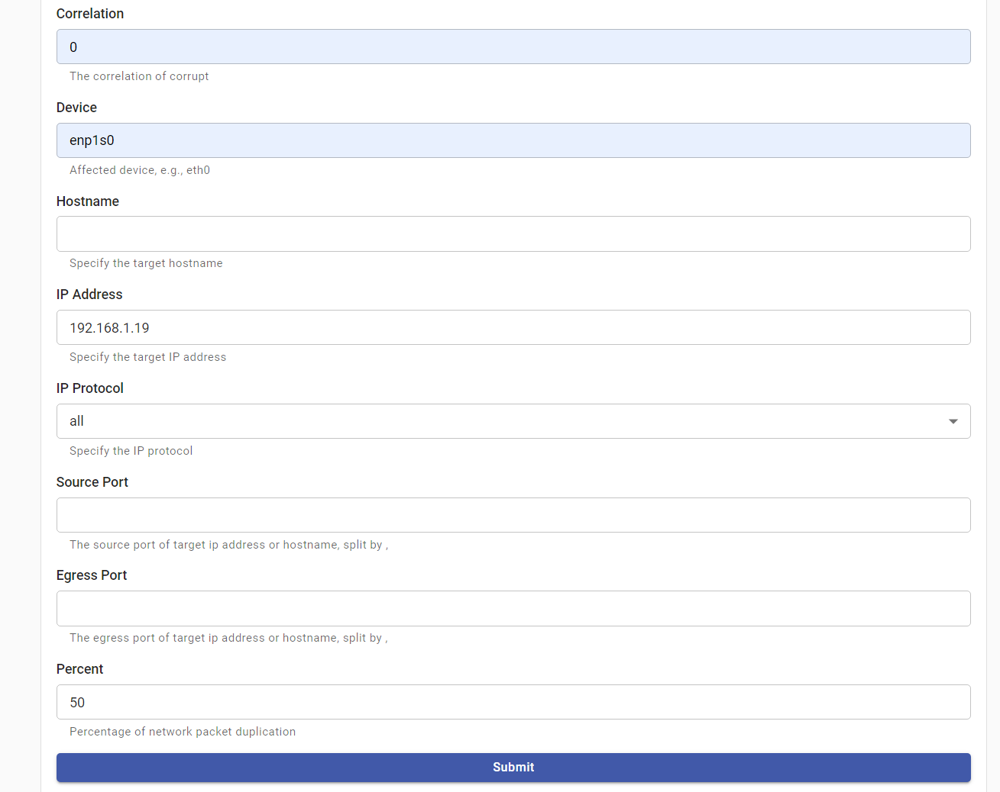<figcaption></figcaption></figure>
3.  選擇目標機器，設定持續時間，送出&#x20;

    <figure>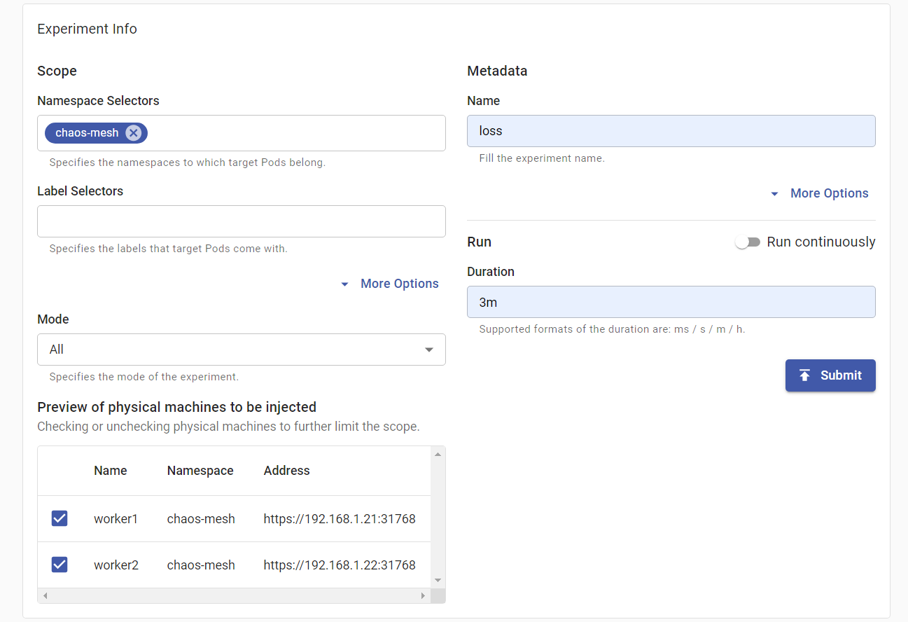<figcaption></figcaption></figure>
4. 從 192.168.1.19　測試　ping 目標機器，發現封包會掉包

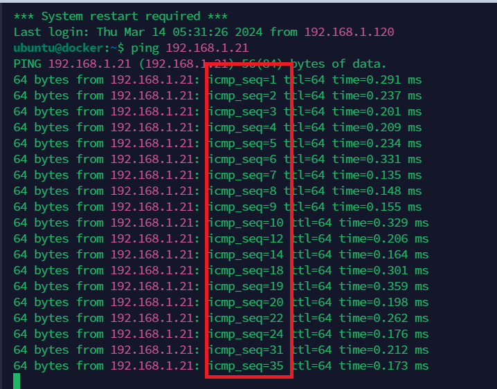

從頁面看會卡 Injecting，但實際上是有作用，問題待解&#x20;

<figure>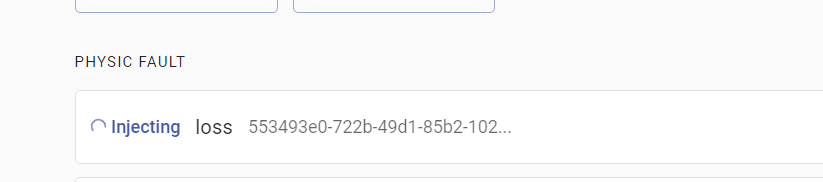<figcaption></figcaption></figure>
