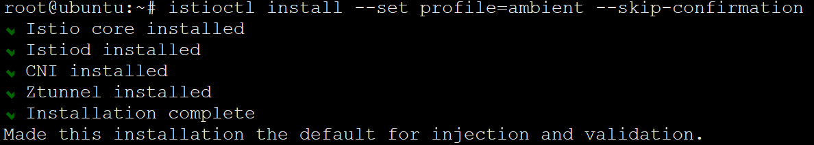
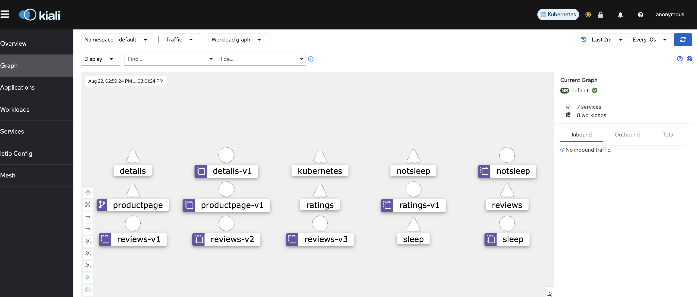
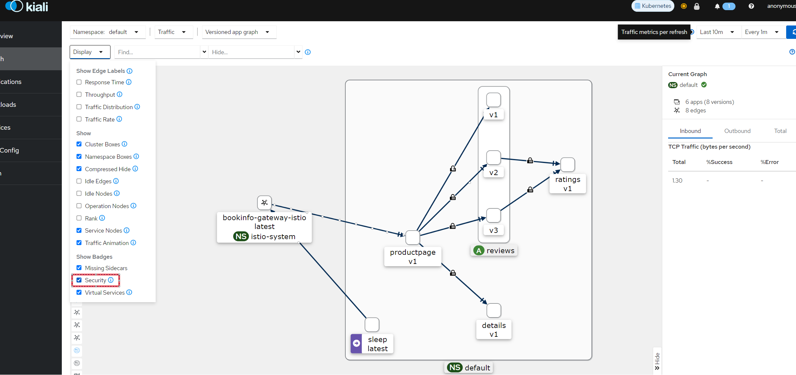
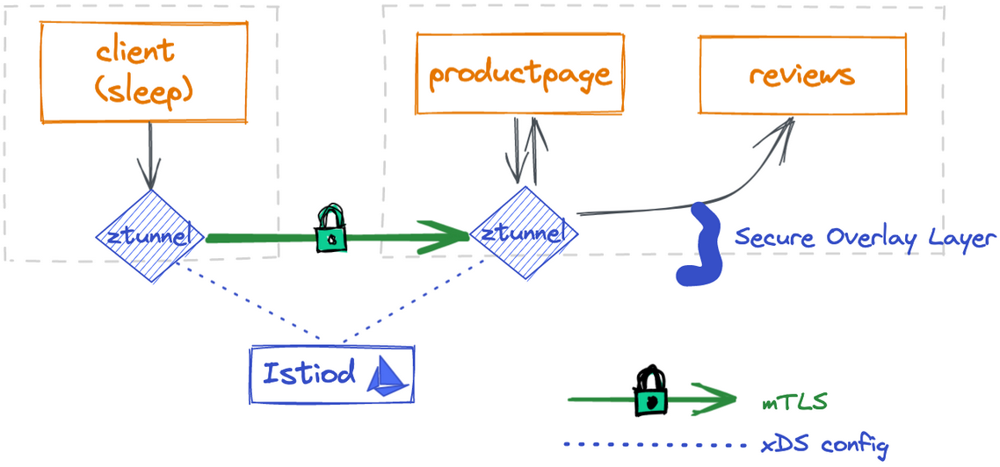
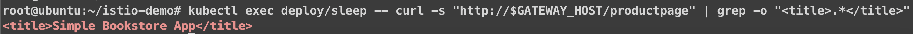
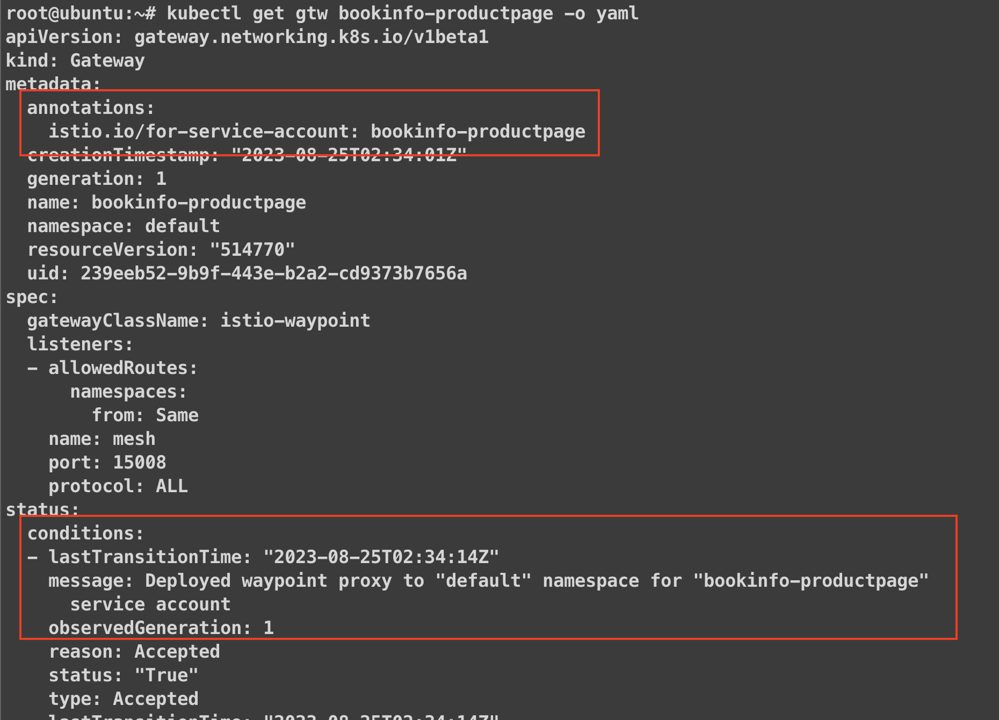
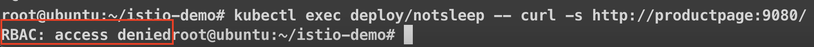
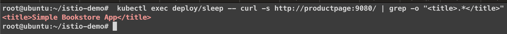
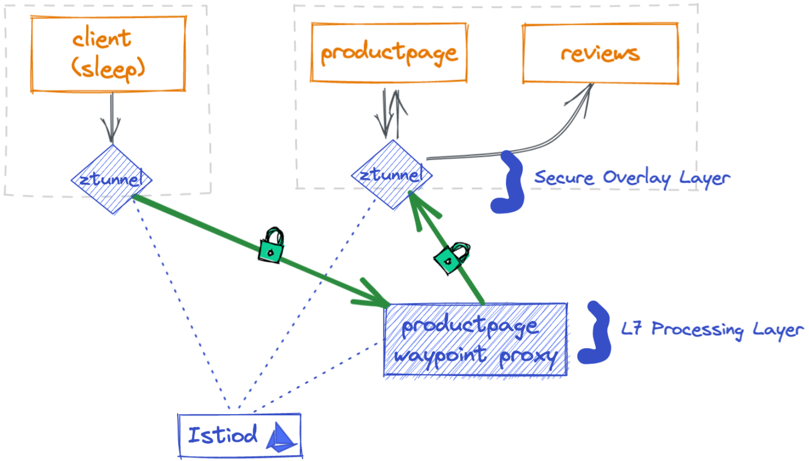

# istio ambient Mode


本文轉寫時間為 2023年8月28日，內容可能會有變動，僅記錄


## 安裝 Gateway API CRD
Ref: https://gateway-api.sigs.k8s.io/guides/#installing-a-gateway-controller

Kubernetes Gateway 介紹
https://gateway-api.sigs.k8s.io/
```
$ kubectl get crd gateways.gateway.networking.k8s.io &> /dev/null || \
  { kubectl kustomize "github.com/kubernetes-sigs/gateway-api/config/crd/experimental?ref=v0.6.1" | kubectl apply -f -; }
```

## 安裝 istio ambient

1. 下載 [istioctl](https://github.com/istio/istio/releases)
2. 安裝 istio 使用 ambient
    ```
    istioctl install --set profile=ambient --skip-confirmation
    ```
    <figure><figcaption></figcaption></figure>

3. 安裝後檢查pod是否正常
    ```
    $ kubectl get pods -n istio-system
    NAME                                     READY   STATUS    RESTARTS   AGE
    istio-cni-node-hp8fz                     1/1     Running   0          82m
    istio-cni-node-qxxqk                     1/1     Running   0          82m
    istio-cni-node-vhw8r                     1/1     Running   0          82m
    istiod-f5b64fbc5-qvnnq                   1/1     Running   0          83m
    ztunnel-d74d6                            1/1     Running   0          83m
    ztunnel-kjx9m                            1/1     Running   0          83m
    ztunnel-w4ths                            1/1     Running   0          83m
    ```
    ```
    $ kubectl get daemonset -n istio-system
    NAME             DESIRED   CURRENT   READY   UP-TO-DATE   AVAILABLE   NODE SELECTOR            AGE
    istio-cni-node   3         3         3       3            3           kubernetes.io/os=linux   86m
    ztunnel          3         3         3       3            3           <none>                   87m
    ```
4. 從官方的 github 下載範例
   ```
   git clone https://github.com/istio/istio.git --single-branch
   ```
5. 安裝 kiali 和 prometheus
   ```
   $ cd istio/samples/addons
   $ kubectl apply -f kiali.yaml
   $ kubectl apply -f prometheus.yaml
   ```
6. 請將 kiali 的 svc 改為 nodeport，方便查看

## 部署範例
1. 部署 bookinfo 範例
    ```
    $ cd istio/
    $ kubectl apply -f samples/bookinfo/platform/kube/bookinfo.yaml
    ```
2. 部署 sleep 和 notsleep，方便等等透過進入pod 使用 curl 測試
    ```
    $ kubectl apply -f samples/sleep/sleep.yaml
    $ kubectl apply -f samples/sleep/notsleep.yaml
    ```
3. 建立 Kubernetes Gateway 和 HTTPRoute
   ```
    $ sed -e 's/from: Same/from: All/'\
          -e '/^  name: bookinfo-gateway/a\
      namespace: istio-system\
    '     -e '/^  - name: bookinfo-gateway/a\
        namespace: istio-system\
    ' samples/bookinfo/gateway-api/bookinfo-gateway.yaml | kubectl apply -f -
    ```
    Gateway 和 HTTPRoute 內容如下
   * Gateway
       ```
       apiVersion: gateway.networking.k8s.io/v1beta1
        kind: Gateway
        metadata:
          name: bookinfo-gateway
          namespace: istio-system

        spec:
          gatewayClassName: istio
          listeners:
          - name: http
            port: 80
            protocol: HTTP
            allowedRoutes:
              namespaces:
                from: All
       ```
    * HTTPRoute
      ```
        apiVersion: gateway.networking.k8s.io/v1beta1
        kind: HTTPRoute
        metadata:
          name: bookinfo
        spec:
          parentRefs:
          - name: bookinfo-gateway
            namespace: istio-system

          rules:
          - matches:
            - path:
                type: Exact
                value: /productpage
            - path:
                type: PathPrefix
                value: /static
            - path:
                type: Exact
                value: /login
            - path:
                type: Exact
                value: /logout
            - path:
                type: PathPrefix
                value: /api/v1/products
            backendRefs:
            - name: productpage
              port: 9080
      ```
    
4. 等待部署完成以及設定環境變數，方便等等使用
    ```
    $ kubectl wait --for=condition=programmed gtw/bookinfo-gateway -n istio-system
    $ export GATEWAY_HOST=bookinfo-gateway-istio.istio-system
    $ export GATEWAY_SERVICE_ACCOUNT=ns/istio-system/sa/bookinfo-gateway-istio
    ```
5. 使用sleep 和 notsleep pod 內的 curl cmd 到 gateway 或是內部的 productpage 存取服務，應該都要正常
    ```
    $ kubectl exec deploy/sleep -- curl -s "http://$GATEWAY_HOST/productpage" | grep -o "<title>.*</title>"
    <title>Simple Bookstore App</title>
    
    $ kubectl exec deploy/sleep -- curl -s $http://productpage:9080/ | grep -o "<title>.*</title>"
    <title>Simple Bookstore App</title>
    
    $ kubectl exec deploy/notsleep -- curl -s http://productpage:9080/ | grep -o "<title>.*</title>"
    <title>Simple Bookstore App</title>
    ```
    <figure><figcaption></figcaption></figure>

6. 進入 Kiali console ，查看 Graph，此時沒有看到服務之間的關聯，因為沒有把 default 的 namespace 啟用 istio ambient&#x20;

    <figure><figcaption></figcaption></figure>

## 啟用 Ambient
1. 將 default 的 namespace 啟用 ambient，因為 bookinfo 範例建在 default namespace
    ```
    $ kubectl label namespace default istio.io/dataplane-mode=ambient
    ```
    和之前sidecar模式比，ambient不需要重新部署服務
2. 啟用後，再次從 pod 打API，回到 Kaili Graph，可以看到流量走向了(左方display 選取Security，可以看到有 mTLS加密了)
<figure><figcaption></figcaption></figure>

<figure><figcaption></figcaption></figure>

採用安全覆蓋層從 sleep 到 `productpage` 以及從 `productpage` 到 reviews 的進入請求


## 測試 L4 授權政策
下面的 policy 只允許 **sleep pod** 和 **istio ingress gateway** 存取 **productpage**。
(從下面的principals可以看到允許得serviceaccount)

```
apiVersion: security.istio.io/v1beta1
kind: AuthorizationPolicy
metadata:
 name: productpage-viewer
 namespace: default
spec:
 selector:
   matchLabels:
     app: productpage
 action: ALLOW
 rules:
 - from:
   - source:
       principals:
       - cluster.local/ns/default/sa/sleep
       - cluster.local/ns/istio-system/sa/bookinfo-gateway-istio
```
測試 policy
1. 在 sleep pod 呼叫 api，從 istio-ingress-gateway 進入
成功回應，符合預期
<figure><figcaption></figcaption></figure>

2. 在 sleep pod 呼叫 api，從 productpage 進入
成功回應，符合預期
<figure><figcaption></figcaption></figure>

3. 在 notsleep pod 呼叫 api，從 productpage 進入
失敗，符合預期
<figure><figcaption></figcaption></figure>


## 測試 L7 授權政策
使用 Gateway API 為 productpage服務部署一個waypoint proxy，並使用bookinfo-productpage的服務帳戶。
所有經過productpage服務的流量將受到L7 proxy 的調解、執行和監視。

1. 建立 waypoint porxy 給 productpage 服務
```
＄ istioctl x waypoint apply --service-account bookinfo-productpage
```
上述指令其實就是在 bookinfo-productpage 的 gateway 新增 annotations，並指定 service acount
<figure><figcaption></figcaption></figure>


2. 更新剛剛設定的 L4 授權政策，加上 只允許用 GET 方法存取 productpage 服務
```
apiVersion: security.istio.io/v1beta1
kind: AuthorizationPolicy
metadata:
 name: productpage-viewer
 namespace: default
spec:
 selector:
   matchLabels:
     istio.io/gateway-name: bookinfo-productpage
 action: ALLOW
 rules:
 - from:
   - source:
       principals:
       - cluster.local/ns/default/sa/sleep
       - cluster.local/ns/istio-system/sa/bookinfo-gateway-istio
   to:
   - operation:
       methods: ["GET"]
```

3. 在 sleep pod 呼叫 api，從 istio-ingress-gateway 進入，並使用 DELETE 的 方法，失敗，因為只能使用 GET 方法，符合預期
    <figure><figcaption></figcaption></figure>

    
4. 在 notsleep pod 呼叫 api，從 productpage，進入，並使用 GET 的 方法，失敗，因為沒有允許notsleep sa的權限
<figure><figcaption></figcaption></figure>

5. 在 sleep pod 呼叫 api ，從 istio-ingress-gateway 進入，並使用 GET 的 方法，成功，符合預期
<figure><figcaption></figcaption></figure>

<figure><figcaption></figcaption></figure>

## 控制流量
使用 bookinfo-review service account 為 review 服務部署 waypoint proxy，因此流向 review 服務的所有流量都將由 waypoint proxy 進行調整。

```
kubectl apply -f - <<EOF
apiVersion: gateway.networking.k8s.io/v1alpha2
kind: Gateway
metadata:
 name: reviews
 annotations:
   istio.io/service-account: bookinfo-reviews
spec:
 gatewayClassName: istio-mesh
EOF
```

建立 reviews DestinationRule 和 virtual-service以控制 90% 流量到 reviews v1，而 10% 流量到 reviews v2

```
kubectl apply -f samples/bookinfo/networking/virtual-service-reviews-90-10.yaml
```
VirtualService 內容如下
```
apiVersion: networking.istio.io/v1alpha3
kind: VirtualService
metadata:
  name: reviews
spec:
  hosts:
    - reviews
  http:
  - route:
    - destination:
        host: reviews
        subset: v1
      weight: 90
    - destination:
        host: reviews
        subset: v2
      weight: 10

```
```
kubectl apply -f samples/bookinfo/networking/destination-rule-reviews.yaml
```
DestinationRule 內容如下
```
apiVersion: networking.istio.io/v1alpha3
kind: DestinationRule
metadata:
  name: reviews
spec:
  host: reviews
  trafficPolicy:
    loadBalancer:
      simple: RANDOM
  subsets:
  - name: v1
    labels:
      version: v1
  - name: v2
    labels:
      version: v2
  - name: v3
    labels:
      version: v3

```
確認 100 個請求中大致有 10% 流量流向 reviews-v2
```
$ kubectl exec deploy/sleep -- sh -c "for i in \$(seq 1 100); do curl -s http://$GATEWAY_HOST/productpage | grep reviews-v.-; done"
```