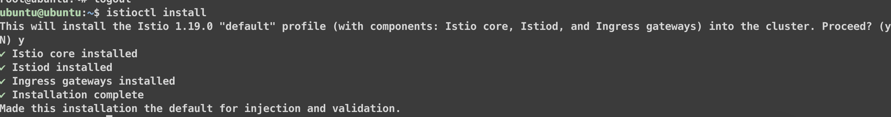
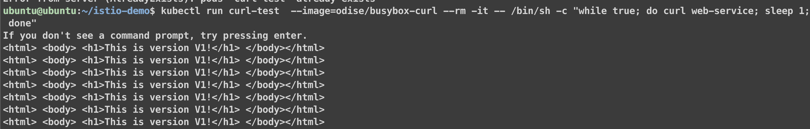
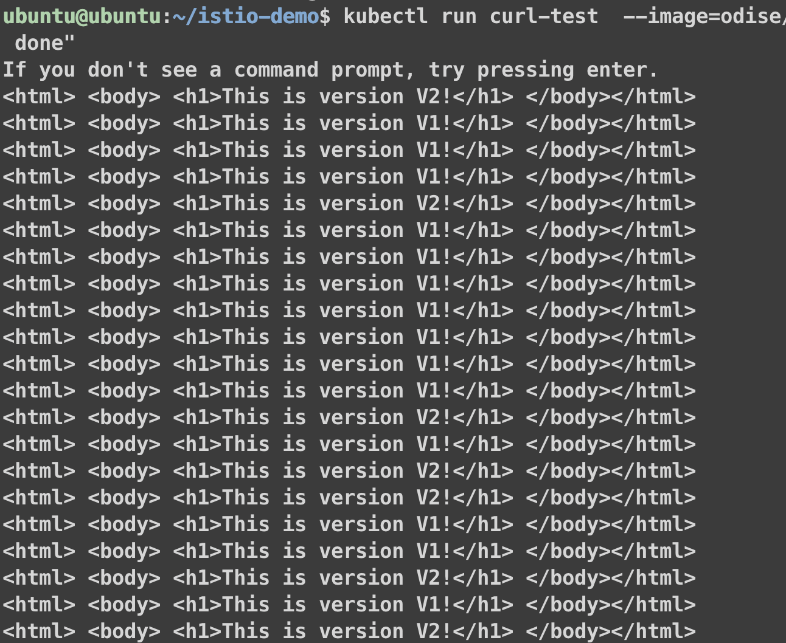
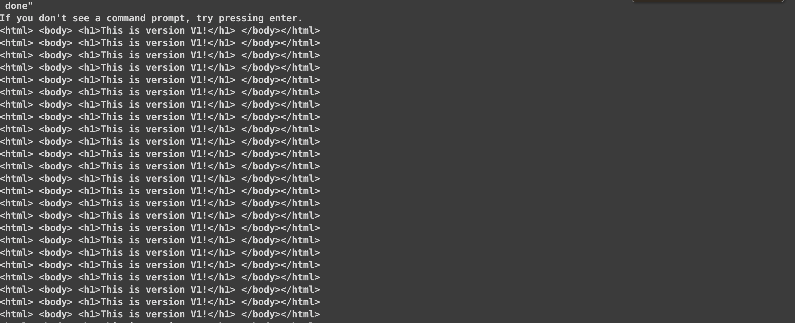
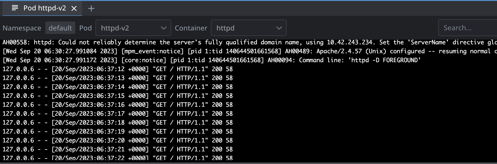
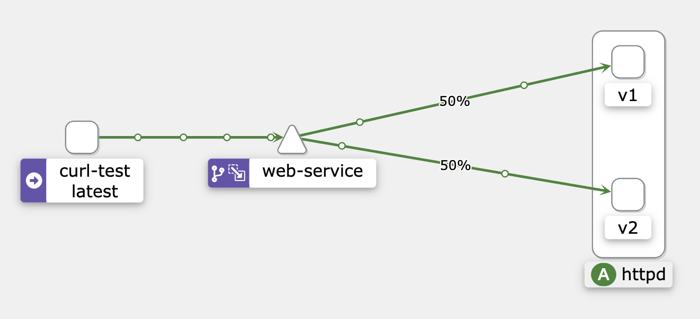
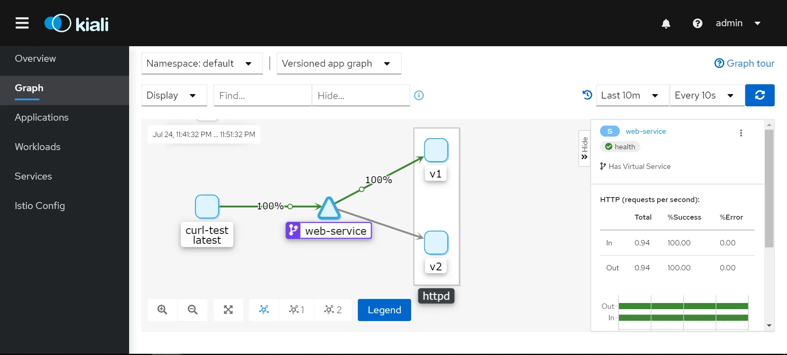
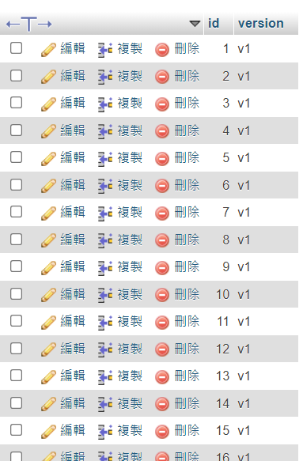
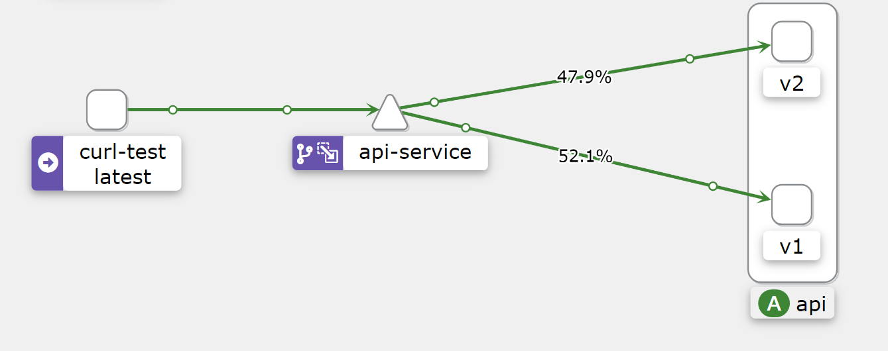
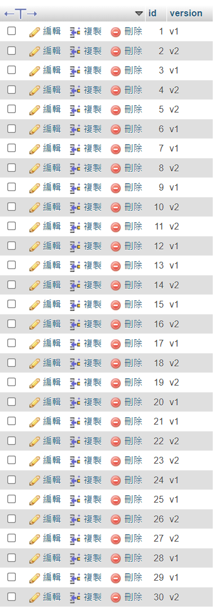

# Istio Mirroring traffic


本文轉寫時間為 2023年10月05日，內容可能會有變動，僅記錄


## 安裝 istio 

1. 下載 [istioctl](https://github.com/istio/istio/releases)
2. 安裝 istio 使用 預設設定
    ```
    istioctl install
    ```
    <figure><figcaption></figcaption></figure>

    安裝 kiali 和 prometheus
    ```
    kubectl apply -f https://raw.githubusercontent.com/istio/istio/release-1.19/samples/addons/kiali.yaml
    kubectl apply -f https://raw.githubusercontent.com/istio/istio/release-1.19/samples/addons/prometheus.yaml
    ```
3. namespace 預設注入 sidecar
   ```
   kubectl label namespace default istio-injection=enabled
   ```

4. 建立測試程式 v1 版本
```
apiVersion: v1
kind: Pod
metadata:
  labels:
    app: httpd
    version: v1
  name: httpd-v1
  namespace: default
spec:
  containers:
  - image: httpd
    name: httpd
    resources: {}
    volumeMounts:
    - mountPath: /usr/local/apache2/htdocs
      name: index-html
  dnsPolicy: ClusterFirst
  initContainers:
  - command:
    - sh
    - -c
    - mkdir /usr/local/apache2/htdocs;( echo '<html> <body> <h1>This is version V1!</h1>
      </body></html>' ) > /usr/local/apache2/htdocs/index.html
    image: busybox
    name: busybox
    volumeMounts:
    - mountPath: /usr/local/apache2/htdocs
      name: index-html
  restartPolicy: Always
  volumes:
  - emptyDir: {}
    name: index-html
---
apiVersion: v1
kind: Service
metadata:
  labels:
    app: web-service
  name: web-service
spec:
  ports:
  - name: http-port
    port: 80
    protocol: TCP
    targetPort: 80
  selector:
    app: httpd
  type: ClusterIP
```

5. 透過 curl 測試 web-service 服務是否正常，此k8s service 會導流量到 v1 pod
   ```
    kubectl run curl-test  --image=odise/busybox-curl --rm -it -- /bin/sh -c "while true; do curl web-service; sleep 1; done"
    ```
    <figure><figcaption></figcaption></figure>


6. 建立測試程式 v2 版本

```
apiVersion: v1
kind: Pod
metadata:
  labels:
    app: httpd
    version: v2
  name: httpd-v2
  namespace: default
spec:
  containers:
  - image: httpd
    name: httpd
    resources: {}
    volumeMounts:
    - mountPath: /usr/local/apache2/htdocs
      name: index-html
  dnsPolicy: ClusterFirst
  initContainers:
  - command:
    - sh
    - -c
    - "mkdir /usr/local/apache2/htdocs;(
echo '<html>
<body>
<h1>This is version V2!</h1>
</body></html>'
) > /usr/local/apache2/htdocs/index.html"
    name: busybox
    image: busybox
    volumeMounts:
    - mountPath: /usr/local/apache2/htdocs
      name: index-html
  restartPolicy: Always
  volumes:
  - emptyDir: {}
    name: index-html
```

7. 接下來再次輸入流量到 web-service

```
kubectl run curl-test  --image=odise/busybox-curl --rm -it -- /bin/sh -c "while true; do curl web-service; sleep 1; done"
```

8. 從回應來看會被 loadbalance (透過 k8s 的 service) 到 v1 v2 版本，符合預期，因為 v1 v2 pod 的 lable 都有 app: httpd

<figure><figcaption></figcaption></figure>

9. 設定 VirtualService 和 DestinationRule
    關於 VirtualService 和 DestinationRule 說明，請看以下文章
    https://ithelp.ithome.com.tw/articles/10294645

    建立 VirtualService 和 DestinationRule

    以下設定有：
     * 流量只導流到 v1
     * 把 v1 的版本流量 mirror 到 v2

    ```
    apiVersion: networking.istio.io/v1alpha3
    kind: VirtualService
    metadata:
      name: web-mirror-vs
    spec:
      hosts:
        - web-service.default.svc.cluster.local
      http:
      - route:
        - destination:
            host: web-service.default.svc.cluster.local
            subset: v1
          weight: 100
        mirror:
          host: web-service.default.svc.cluster.local
          subset: v2
        mirror_percent: 100
    --- 
    apiVersion: networking.istio.io/v1beta1
    kind: DestinationRule
    metadata:
      name: web-destinationrule
    spec:
      host: web-service.default.svc.cluster.local
      subsets:
      - name: v1
        labels:
          version: v1
      - name: v2
        labels:
          version: v2
    ```

    VirtualService 要注意的欄位是：

    * destination.subset: 設定流量只導到 v1 版本
    * mirror：要 mirror 的目的服務，這裡mirror 到 v2版本
    * mirror_percent： 要mirror流量的百分比


10. 接下來再次輸入流量到 web-service (k8s service)

```
kubectl run curl-test  --image=odise/busybox-curl --rm -it -- /bin/sh -c "while true; do curl web-service; sleep 1; done"
```

確定所有流量都到 v1

<figure><figcaption></figcaption></figure>


查看 v2 pod 的 log，確實也有流量

<figure><figcaption></figcaption></figure>


11. 從 kiali 查看
這裡跟文章的 kiali 顯示的流量權重不一樣，這裡實驗看到的是 v1 50%，v2 50%，個人認為表示不太準確，因為所有流量都是到 v1， v1 應該顯示 100%，v2 也是 100％，因為是 mirror v1 的流量，雖然在web-service 的 icon 有 mirror的圖案，但還是不直觀

這次實驗圖
<figure><figcaption></figcaption></figure>

文章的圖
<figure><figcaption></figcaption></figure>


12. 文章範例是使用 get 的請求，接下來測試mirror POST 的請求
   這個測試程式呼叫app v1一次就會把v1的值寫到資料庫，呼叫app v2就v2的值寫到資料庫
 
13. 輸入流量到app v1
```
kubectl run curl-test  --image=odise/busybox-curl --rm -it -- /bin/sh -c "while true; do curl -X POST api-service:5000/insert_version; sleep 1; done"
```

  進資料庫確認為 v1 版本
  <figure><figcaption></figcaption></figure>

14. 建立 app v2後，也跟上述步驟一樣建立VirtualService 和 DestinationRule，並 mirror 流量

15. 再次輸入流量到 api-service，從kiali看到有 mirror 的圖示，也確定有mirror 流量
```
kubectl run curl-test  --image=odise/busybox-curl --rm -it -- /bin/sh -c "while true; do curl -X POST api-service:5000/insert_version; sleep 1; done"
```
<figure><figcaption></figcaption></figure>

  從資料庫看 mirror 也有 v2 的資料被寫入

<figure><figcaption></figcaption></figure>


# 結論
mirror 流量感覺只能用在查詢的功能，測試新版本上線是否符合預期
如果mirror 流量的功能是新增修改刪除類的，可能要評估一下