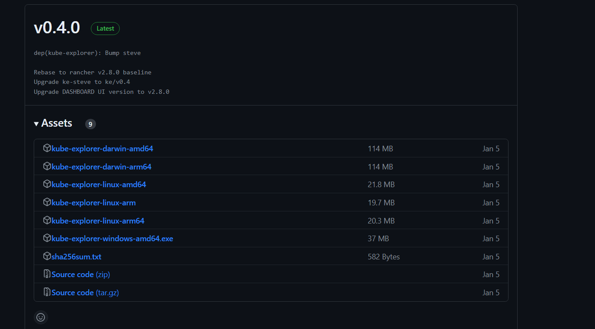
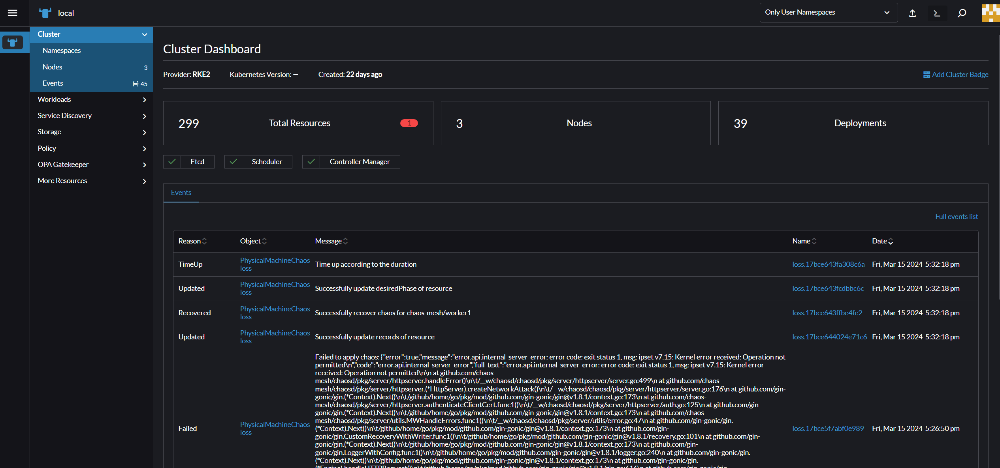
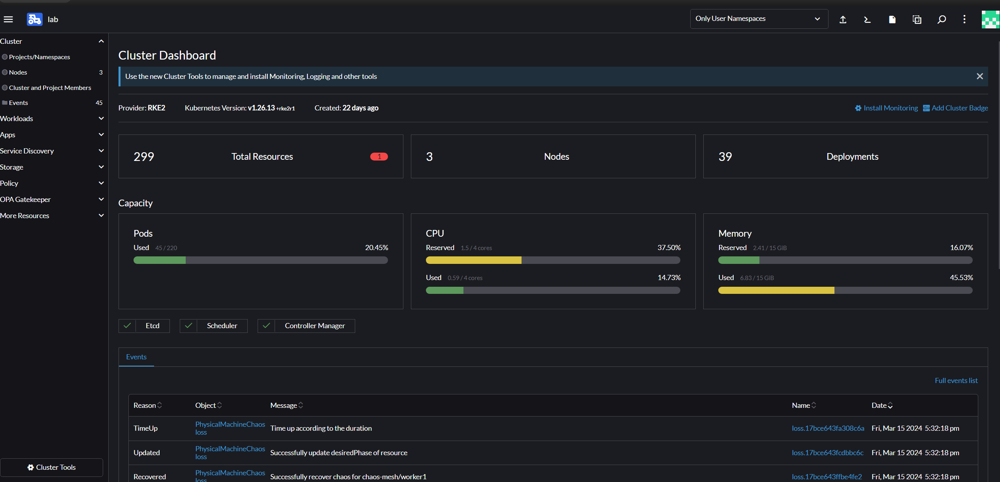
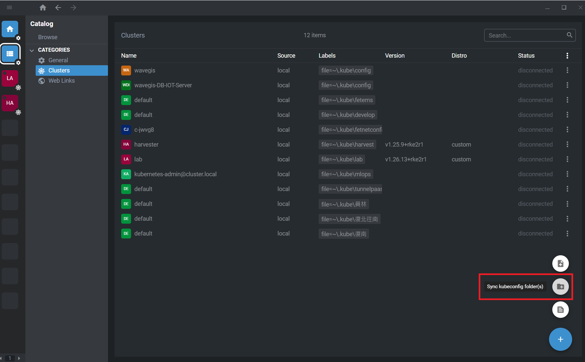
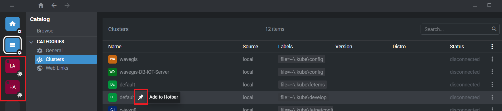
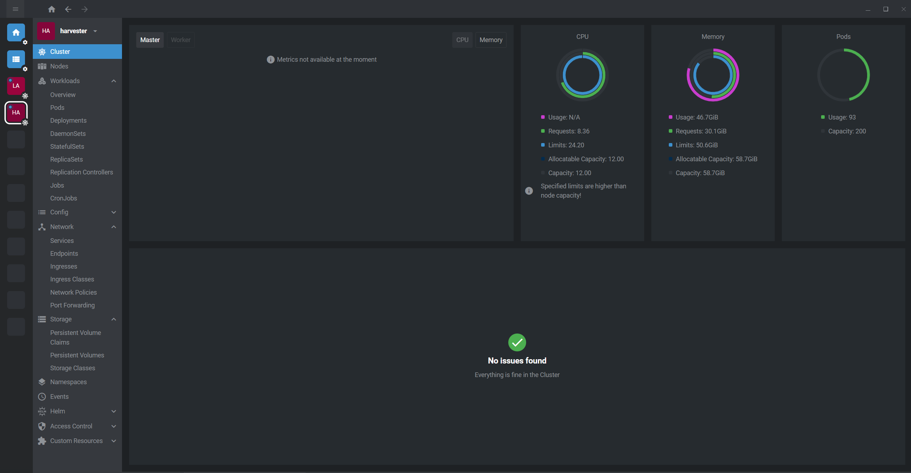
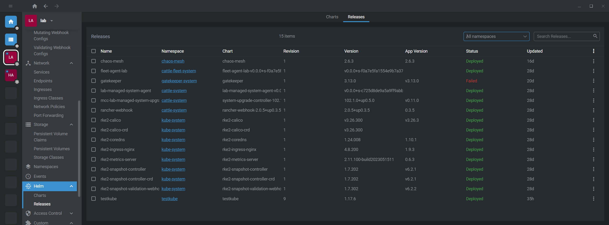
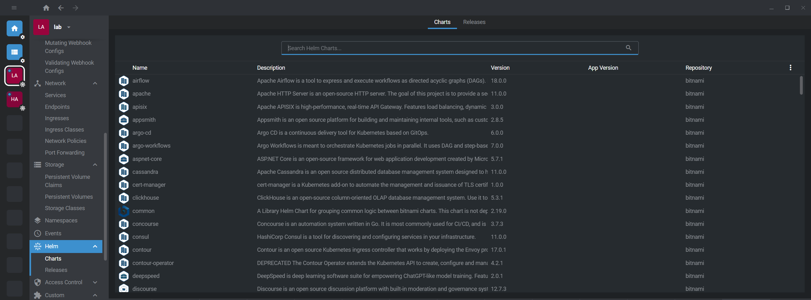
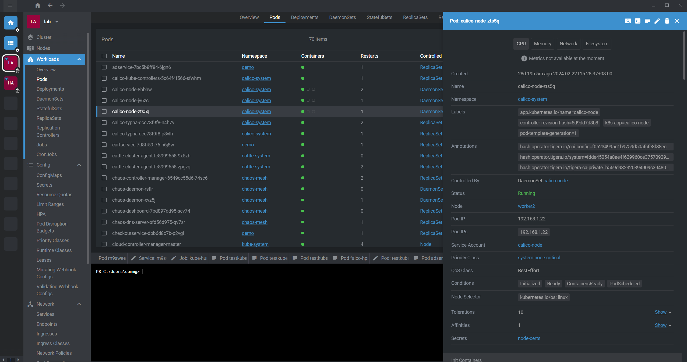

# Kube-explorer


本文轉寫時間為 2024年03月22日，內容可能會有變動，僅記錄


## 介紹
kube-explorer 是一個可攜帶的 Kubernetes 管理器，不依賴於任何其他軟體。
它整合了 Rancher steve 框架及其儀表板，並進行了重新編譯、打包、壓縮，提供了幾乎完全無狀態的 Kubernetes 資源管理器。

## 下載啟動

1. 至 github 下載執行檔，請根據作業系統選擇，https://github.com/cnrancher/kube-explorer/releases

    <figure><figcaption></figcaption></figure>

2. 執行檔案，請提供 kubeconfig 位置，此時會執行一個 webserver
    ```
    $ ./kube-explorer --kubeconfig=xxxx --http-listen-port=9898 --https-listen-port=0
    ```

3. 瀏覽器輸入 IP:9898，即可進入管理介面

    <figure><figcaption></figcaption></figure>


如果有使用過 Rancher 管理介面的人，應該完全不陌生，這就是 Rancher 的管理介面，以下是 Rancher 的管理介面
    <figure><figcaption></figcaption></figure>


## Kube-explorer 和 Rancher 管理差異

雖然都是 Rancher 出的，介面差不多，但根據使用場景還是有不一樣

* Kube-explorer: **適合管理單一 已經建立好的 k8s 叢集**，只需要提供 kubeconfig　即可，**非常適合 lab 做使用**，不然以往想使用 Rancher 的 UI 介面管理做 lab 用的 k8s ，會需要起一個 Rancher container，再做一些設定，有點麻煩


* Rancher: **適合管理多個已經建立好的 k8s 叢集**，**或是想建立新的 k8s 叢集**，都可以使用，雖然兩個管理介面差不多，但是 Rancher 還是有多許多功能，像是有使用者管理機制，以及 APP 頁面可以快速建立 helm chart的內容等等，**較適合組織或團隊使用**


| 情境          | Kube-explorer |  Rancher   |
| ------------- |:-------------:|:----------:|
| 單座 K8s 管理 |      可       |     可     |
| 多座 K8s 管理 |     不可      |     可     |
| 資源耗用      |      少       |     多     |
| 建立 K8s      |     不可      |     可     |
| 功能多寡      |     基本      |     多     |
| 適合場景      |   個人 lab    | 組織或團隊 |


## 另一款 K8S IDE  OpenLens
OpenLens: https://github.com/MuhammedKalkan/OpenLens

OpenLens 是源自於 [Lens](https://k8slens.dev/)，Mirantis 從 Kontena 購買了 Lens ，後來將其開源並免費提供，但是新的版本卻開始收費，所以後來從 完全開源的 Lens 版本中 分出了 Openlens，不過部分功能被移除，需要補裝 extensions

OpenLens 是一個應用程式，可以透過讀取本機的資料夾內的 kubeconfig，達到多叢集管理

* Sync kubeconfig 資料夾，選擇資料夾後，可以看到所有偵測到的 kubeconfig
<figure><figcaption></figcaption></figure>

* 可以定選叢集至左側Hotbar，以便快速切換
 <figure><figcaption></figcaption></figure>

* 點選叢集後，可以看到管理介面，改有的功能都有，監控的圖表依照管理的叢集是否安裝prometheus-operator
<figure><figcaption></figcaption></figure>

* 其中包含了安裝在叢集內的 helm release 或是要安裝的chart也可以管理
<figure><figcaption></figcaption></figure>
<figure><figcaption></figcaption></figure>

* Pod 管理
<figure><figcaption></figcaption></figure>


這套工具我從len開源一直用到付費，又轉到 OpenLens，真的是非常好用的管理工具，使用上也非常直觀，非常推薦