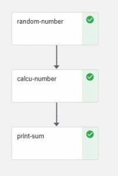
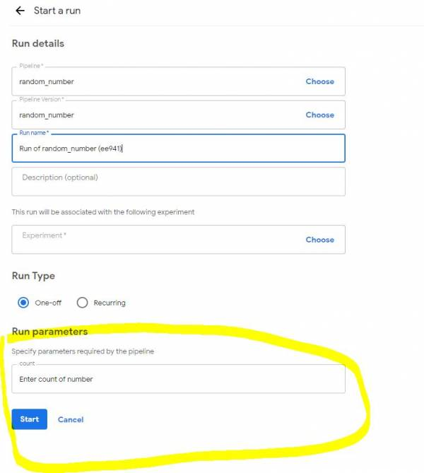
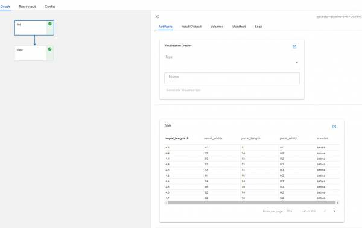
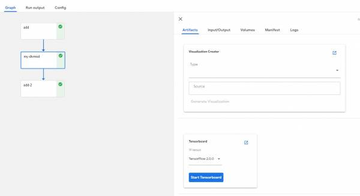
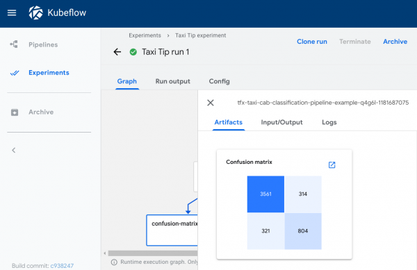
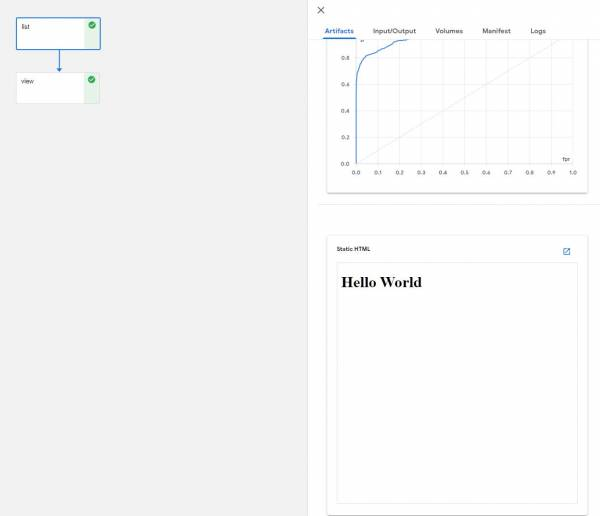
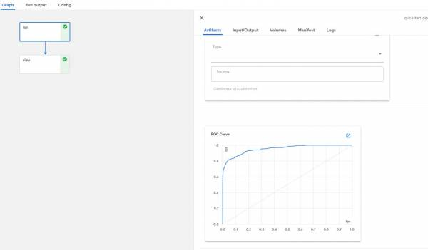
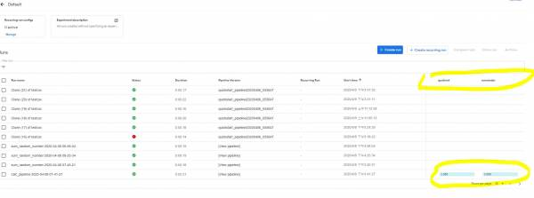

# Kubeflow Pipelines


紀錄時間為 2020/04/09，內容可能過時，請斟酌參考


一個完全不懂 AI 的工程師被迫研究 Kubeflow，**內容不保證正確，看看就好**XD  
研究完也沒有要使用，所以純粹紀錄

## 簡單介紹

說明如何撰寫 pipeline 的 components，並串起 components，組成一個 workflow

下圖為一個簡單的 pipeline 範例  
[](http://10.50.0.12/wiki/lib/exe/detail.php?id=project%3Aopenstack%3Acontainer%3Akubeflow_pipelines&media=project:openstack:container:pipeline.jpg)



* 每一格方框叫做 component，每一個 component 都是 container
* component 可以輸出資料跟輸入資料
* 寫 component 的方法有很多種:
  1. function to component
  2. container to component
  3. yaml to component
* 以下範例都是在 kubeflow 的 notebook server 中使用

## Function to component

* 寫 python function ，將 function 變成 component
* 在 notebook 環境中 安裝 kfp

  ```text
  !pip3 install kfp
  ```

* 載入 kfp 相關套件

  ```text
  import kfp
  from kfp.components import InputPath, OutputPath
  from kfp.components import func_to_container_op
  ```

### 第一個 component

* 給定 一個\(count\)數字，產出 count 個數的 1到99隨機數字，寫入到file，並存到minio
* output\_text\_path: 將結果儲存至 minio，並輸出可以存取 minio 物件的路徑\(字串\)

  ```text
  @func_to_container_op
  def random_number(count: int,  output_text_path: OutputPath(str)):
      import random
      with open(output_text_path, 'w') as writer:
          for i in range(count):
              writer.write(str(random.randrange(0,100)) + '\n')
  ```

### 第二個 component

* 取得 input 檔案的路徑，從minio下載後，開啟檔案，計算檔案內所有的數字總和，再寫入到file，並存到minio
* text\_path: InputPath\(str\) 這參數會自動從 minio 下載檔案，所以 text\_path 就是下載檔案後的路徑
* InputPath 可以指定類型，像是CSV檔案， InputPath\('CSV'\) [說明](https://tinyurl.com/qlq9anb)

  ```text
  @func_to_container_op
  def calcu_number(text_path: InputPath(str),  output_text_path: OutputPath(str)):
      sum = 0
      with open(text_path, 'r') as reader:
          for line in reader:
              sum = sum + int(line)
      with open(output_text_path, 'w') as writer:
           writer.write(str(sum))
  ```

### 第三個 component

* 取得 input 檔案的路徑，從minio下載後，開啟檔案，讀取資料後，print出資料

  ```text
  @func_to_container_op    
  def print_sum(text_path: InputPath(str)):
       with open(text_path, 'r') as reader:
          for line in reader:
              print(line)
  ```

### 組合 component 成 pipeline

* 定義 pipeline，也就是串接 component

  ```text
  def sum_random_number():
      # 第一個 component 為 random_number，傳入數字50參數
      random_number_task = random_number(50)
    
      # 第二個 component 接收第一個 component的輸出
      # 這裡要使用 random_number_task.outputs['output_text'] 取得輸出，output_text的來由是 random_number的 output_text_path，但是 kubeflow 會省略 _path 和 _file，所以變成 output_text
      calcu_number_task = calcu_number(random_number_task.outputs['output_text'])
    
      #  第三個 component 接收第二個 component的輸出，print出總和
      print_sum_task = print_sum(calcu_number_task.outputs['output_text'])
  ```

* 啟動 pipline，arguments 可以帶入參數

  ```text
  kfp.Client().create_run_from_pipeline_func(sum_random_number, arguments={})
  ```

* 若沒有錯誤可以看到 輸出 Experiment link here 跟 Run link here，點here可以看到結果

## Component yaml

* 此方式利用 yaml 檔來定義 component
* 需要先寫完程式，並包成 container
* 以下範例有 2個 component
  1. 產生出N個 0~100的數字
  2. 計算上面產生出的N個數字和

### 第一個 Component 程式

* 產生出N個 0~100的數字
* 接受 count 的參數，產生出 count 個數的 0~100數字
* 接受 output\_path，將產生出的數字寫到此路徑
* 請使用 argparse 接受參數
* 以下為程式碼

  ```text
  import argparse
  import os
  import random
  # Parse agruments.
  parser = argparse.ArgumentParser()
  parser.add_argument('--count', type=int, required=True, help='Random count of 0~100.')
  parser.add_argument('--output_path', type=str, required=True)
  args = parser.parse_args()
  count = args.count
  output_path = args.output_path
  print(output_path)

  os.makedirs(os.path.dirname(output_path), exist_ok=True)
  with open(output_path, 'w') as writer:
      for i in range(count):
          writer.write(str(random.randrange(0,100)) + '\n')
  ```

* 程式寫完後，打包成 container

### 第一個 Component yaml

* 指定 input output
* 指定 container 的 image
* 指定 要接收的參數
* 輸出的檔案路徑

  ```text
  name: random_number
  description: Random count of 0~100

  inputs:
    # 設定要接受的參數
    # 接收 Count，為整數
    - name: Count
      type: int

  outputs:
    # 設定 output 名稱
    - name: Show Number
  
  implementation:
    container:
      # 指定包好的 container
      image: iservcloud/random_number:latest
      command: [python, /app/app.py]
      # 這裡就會接收上面的 input 參數
      args: [
          --count, {inputValue: Count},
          --output_path, {outputPath: Show Number}
      ]
      # fileOutputs 會輸出檔案到 minio
      # 所以這裡的 Show Number 要跟 outputs 的 Show Number名稱一致
      # 冒號後面就是 container 內部的檔案路徑，就會在 pipline的 Output artifacts 看到你的輸出
      fileOutputs:
        Show Number: /blobs.txt
  ```

### 第二個 Component 程式

* 指定 input path \(這裡要注意\)
* 指定 output path
* 指定 container 的 image
* 指定 要接收的參數
* 輸出的檔案路徑

  ```text
  import argparse
  # Parse agruments.
  parser = argparse.ArgumentParser()
  parser.add_argument('--input_path', type=str, required=True, help='Get number file')
  parser.add_argument('--output_path', type=str, required=True)
  args = parser.parse_args()
  input_path = args.input_path
  output_path = args.output_path
  print(input_path)
  sum = 0

  # 這裡得到 input_path 的參數，也就是讀取這路徑的檔案
  with open(input_path, 'r') as reader:
      line = reader.read()
      num_list = line.split('\n')

  print(num_list)
  for i in range((len(num_list)-1)):
      sum = sum + int(num_list[i])

  with open(output_path, 'w') as writer:
      writer.write(str(sum) + '\n')
  ```

### 第二個 Component yaml

* 指定 inputs outputs

  ```text
  name: calcu_number
  description: sum of number

  inputs:
    - name: Input path
      type: String
    - name: Output path
      type: String

  outputs:
    - name: Show Number
  
  implementation:
    container:
      image: iservcloud/calcu_number:latest
      command: [python, /app/app.py]
      args: [
          --input_path, {inputPath: Input path},
          --output_path, {inputValue: Output path}
      ]
      fileOutputs:
        Show Number: /blobs.txt
  ```

yaml 檔的 args 這裡要注意，input有2種參數  
\* inputPath: 會傳一個路徑的字串  
\* inputValue: 會傳一個字串參數如果程式是需要讀檔的方式，yaml檔的 input 就要用 inputPath 的類型，這樣程式接收到的 input\_path 參數就會是 檔案的路徑， 因此可以使用讀檔編輯此段

### 組合 component 成 pipeline

* 載入 kfp

  ```text
  import kfp
  from kfp.components import load_component_from_file
  ```

* 讀取 yaml 檔

  ```text
  random_number_op = load_component_from_file('./random_number_component.yaml')
  calcu_number_op = load_component_from_file('./calcu_number_component.yaml')
  ```

* 建立 pipeline

  ```text
  def sum_random_number():
      # 建立 component
      random_number_task = random_number_op(count=10, output_path='/blobs.txt')
      # 取得 component 的 output，outputs['show_number'] 的 show_number 來自上面 yaml 檔的 outputs name 的 Show Number，kubeflow 會自動變為小寫，並把空格換成_(底線)
      inputPath = random_number_task.outputs['show_number']
      print(inputPath)
      calcu_number_task = calcu_number_op(input_path=inputPath, output_path='/blobs.txt')
    
  kfp.Client().create_run_from_pipeline_func(sum_random_number, arguments={})
  ```

## 建立可重複使用的 pipeline

* 上面的方式只能在程式內執行 pipeline，如果要在 kubeflow UI 上重複使用，必須匯出pipeline的壓縮檔

  ```text
  import kfp
  # 透過 kfp.dsl.pipeline 定義 pipeline
  @kfp.dsl.pipeline(
    name='random_number',
    description='Random number and calcu sum'
  )

  # 定義 pipeline 所組成的 component，這裡的 count='Enter count of number'，就會在 kubeflow pipeline UI 上看到的 Input 變數
  def sum_random_number(count='Enter count of number'):
      random_number_task = random_number_op(count)
      inputPath = random_number_task.outputs['show_number']
      calcu_number_task = calcu_number_op(input_path=inputPath)

  # 將pipeline 匯出成壓縮檔，再從 kubeflow UI 上傳，即可重複使用    
  import kfp.compiler as compiler
  import datetime
  # Compile the pipeline to a file.
  filename = 'random_number{dt:%Y%m%d_%H%M%S}.pipeline.tar.gz'.format(
      dt=datetime.datetime.now())
  compiler.Compiler().compile(sum_random_number, filename)
  ```

* 上傳後，可以建立此 pipeline 的 run ，可以看到有 input 的欄位，就是上面的 count='Enter count of number'，這裡就可以設計成輸入 dataset



## Kubeflow Pipeline Metadata 可視化 <a id="kubeflow_pipeline_metadata_&#x53EF;&#x8996;&#x5316;"></a>

* pipeline 的 component 除了傳遞 metadata 之外，也可以將 metadata 輸出成可視化的狀態，方便觀察
* 目前支援的型態有:
  1. table \(用於 csv 檔\)
  2. tensorboard 格式
  3. confusion matrix \(實際上是 csv\)
  4. markdown 文件
  5. html 網頁
  6. ROC curve \(實際上是 csv\)
* 以上型態目前支援使用 local minio S3的有:
  1. csv 檔
  2. markdown 文件
  3. html 網頁
  4. ROC curve
* 其餘的支援 GCS

### 使用方式 <a id="&#x4F7F;&#x7528;&#x65B9;&#x5F0F;"></a>

* 在 container 內部寫入 /mlpipeline-ui-metadata.json 檔案
* 根據不同的形態，寫入的內容有所不同

### Table

* 必填欄位:
  * format
  * header
  * source
* source: 如果來源是 GCS 請填 gs://，來源是 kubeflow 內部的 minio，請填 minio://
* 如果來源是 minio，請把檔案壓縮成 tar 再上傳至 minio，如果是 gsc，就不用壓縮

  ```text
  metadata = {
    'outputs' : [{
      'type': 'table',
      'format': 'csv',
      'header': ['sepal_length', 'sepal_width', 'petal_length', 'petal_width', 'species',],
      'source': 'minio://test/iris.tar'
    }]
  }

  with open('/mlpipeline-ui-metadata.json', 'w') as f:
      json.dump(metadata, f)
  ```

* 結果



### Tensorboard

* 必填欄位:
  * source
* 目前只支援 gcs

  ```text
  metadata = {
        'outputs' : [{
          'type': 'tensorboard',
          'source': 'gs://ml-pipeline-playground/mnist',
        }]
      }

  with open('/mlpipeline-ui-metadata.json', 'w') as f:
      json.dump(metadata, f)
  ```

* 結果 [](http://10.50.0.12/wiki/lib/exe/detail.php?id=project%3Aopenstack%3Acontainer%3Akubeflow_pipelines&media=project:openstack:container:board1.jpg)



### Confusion matrix

* 必填欄位
  * format
  * labels
  * schema
  * source
* 使用schema解析數據
* labels 為x和y軸

  ```text
   metadata = {
      'outputs' : [{
        'type': 'confusion_matrix',
        'format': 'csv',
        'schema': [
          {'name': 'target', 'type': 'CATEGORY'},
          {'name': 'predicted', 'type': 'CATEGORY'},
          {'name': 'count', 'type': 'NUMBER'},
        ],
        'source': <CONFUSION_MATRIX_CSV_FILE>,
        # Convert vocab to string because for bealean values we want "True|False" to match csv data.
        'labels': list(map(str, vocab)),
      }]
    }
  
  with open('/mlpipeline-ui-metadata.json', 'w') as f:
      json.dump(metadata, f)
  ```

* 結果



### Markdown

* 必填欄位:
  * source
* storage 為選填，若填入 inline 的值，source 的內容可以直接為　markdown 語法
* source 為 minio，請將檔案壓縮成 tar檔

  ```text
  metadata = {
      'outputs' : [
      # Markdown that is hardcoded inline
      {
        'storage': 'inline',
        'source': '# Inline Markdown\n[A link](https://www.kubeflow.org/)',
        'type': 'markdown',
      },
      # Markdown that is read from a file
      {
        'source': 'minio://test/testmarkdown.tar',
        'type': 'markdown',
      }]
  }
  with open('/mlpipeline-ui-metadata.json', 'w') as f:
      json.dump(metadata, f)
  ```

* 結果


### Html

* 必填欄位:
  * source
* storage 為選填，若填入 inline 的值，source 的內容可以直接為　html 語法
* source 為 minio，請將檔案壓縮成 tar檔

  ```text
  metadata = {
      'outputs': [{
        'type': 'web-app',
        'source': 'minio://test/hello.tar',
      }]
  }
  ```

* 結果



### ROC

* 必填欄位:
  * format
  * schema
  * source
* source 為 minio，請將檔案壓縮成 tar檔

  ```text
  metadata = {
      'outputs': [{
        'type': 'roc',
        'format': 'csv',
        'schema': [
          {'name': 'fpr', 'type': 'NUMBER'},
          {'name': 'tpr', 'type': 'NUMBER'},
          {'name': 'thresholds', 'type': 'NUMBER'},
        ],
        'source': 'minio://test/roc.tar'
      }]
  }
  ```

* 結果



## 指定 output

* 除了在 container 內部寫入mlpipeline-ui-metadata.json 之外， 還需要在 component 定義 output
* 如果使用 kfp.dsl.ContainerOp，請加入output\_artifact\_paths參數，並指定值為  
  {'mlpipeline-ui-metadata': '/mlpipeline-ui-metadata.json'}

  ```text
  def list_gcs_blobs_op(name, bucket):
    return kfp.dsl.ContainerOp(
        name=name,
        image='iservcloud/list-minio:latest',
        command=['python', '/app/app.py'],
        arguments=['--bucket', bucket],
        file_outputs={'blobs': '/blobs.txt'},
        output_artifact_paths={'mlpipeline-ui-metadata': '/mlpipeline-ui-metadata.json'},
    )
  ```

* 如果是用 load yaml 檔的話，請在 yaml 檔指定以下
* outputs，名為 MLPipeline UI metadata ， type 為 UI metadata
* fileOutputs，值為 MLPipeline UI metadata: /mlpipeline-ui-metadata.json

  ```text
  name: random_number
  description: Random count of 0~100

  inputs:
    - name: Count
      type: int

  outputs:
    - name: Show Number
    - name: MLPipeline UI metadata
      type: UI metadata
  
  implementation:
    container:
      image: iservcloud/random_number:latest
      command: [python, /app/app.py]
      args: [
          --count, {inputValue: Count},
          --output_path, {outputPath: Show Number}
      ]
      fileOutputs:
         MLPipeline UI metadata: /mlpipeline-ui-metadata.json
  ```

## 監控輸出值 <a id="&#x76E3;&#x63A7;&#x8F38;&#x51FA;&#x503C;"></a>

* 除了 metadata 之外，也可以輸出值，像是準確率等等，以方便觀察
* 將內容寫入至 /mlpipeline-metrics.json
* 內容如下

  ```text
  metrics = {
      'metrics': [{
        # 監測的名稱，須符合正規式 ^[a-z]([-a-z0-9]{0,62}[a-z0-9])?$
        'name': 'accuracy-score', 
        # 監測的值，須為數字，可以用變數帶入
        'numberValue':  accuracy, 
        # format 為可選， 值只支援 PERCENTAGE 和 RAW
        'format': "PERCENTAGE",
      }]
    }
  ```

* 寫入 container 以外，也要指定output
* 和上面的 指定 output 段落一樣，只是依據使用方式將內容改成
* 使用 kfp.dsl.ContainerOp ，output\_artifact\_paths 的值為 'mlpipeline-metrics': '/mlpipeline-metrics.json'

  ```text
  output_artifact_paths={'mlpipeline-ui-metadata': '/mlpipeline-ui-metadata.json', 'mlpipeline-metrics': '/mlpipeline-metrics.json'}
  ```

* 使用 load yaml 修改以下
* outputs，名為 MLPipeline Metrics ， type 為 Metrics
* fileOutputs，值為 MLPipeline Metrics: /mlpipeline-metrics.json

  ```text
  name: random_number
  description: Random count of 0~100

  inputs:
    - name: Count
      type: int

  outputs:
    - name: Show Number
    - name: MLPipeline UI metadata
      type: UI metadata
    - name: MLPipeline Metrics
      type: Metrics
  implementation:
    container:
      image: iservcloud/random_number:latest
      command: [python, /app/app.py]
      args: [
          --count, {inputValue: Count},
          --output_path, {outputPath: Show Number}
      ]
      fileOutputs:
         MLPipeline UI metadata: /mlpipeline-ui-metadata.json
         MLPipeline Metrics:     /mlpipeline-metrics.json
  ```

* 結果 根據 key 的值和數量不同，會有變化



