# 透過 Kubekey 建立 Kubernetes 和 Kubersphere
% hint style="info" %}
紀錄時間為 2023/10/12，內容可時，僅記錄


**2023/10 目前使用3.0.10版本安裝會有問題，請使用3.0.8版本**
**kubesphere 3.3.0 最高只支援到 k8s v1.24.x**

* 使用kubeadm安裝k8s
* 安裝KubeSphere腳本則是使用ansible(包在ks-installer container 內)

---

1. 前置安裝
    ```
    apt install socat conntrack ebtables ipset -y
    ```
2. 下載kubekey cli
    ```
    curl -sfL https://get-kk.kubesphere.io | VERSION=v3.0.8 sh -
    ```
3. 查詢可安裝k8s 版本
    ```
    ./kk version --show-supported-k8s

    root@ubuntu:~# ./kk version --show-supported-k8s
    v1.19.0
    ...
    v1.24.14
    ........
    v1.26.0

    ```
4. 安裝，簡單確認環境，按yes安裝
    ```
    ./kk create cluster --with-kubernetes v1.24.14 --with-kubesphere v3.3.0 --container-manager containerd

     _   __      _          _   __           
    | | / /     | |        | | / /           
    | |/ / _   _| |__   ___| |/ /  ___ _   _ 
    |    \| | | | '_ \ / _ \    \ / _ \ | | |
    | |\  \ |_| | |_) |  __/ |\  \  __/ |_| |
    \_| \_/\__,_|_.__/ \___\_| \_/\___|\__, |
                                        __/ |
                                       |___/

    11:42:15 UTC [GreetingsModule] Greetings
    11:42:15 UTC message: [ubuntu]
    Greetings, KubeKey!
    11:42:15 UTC success: [ubuntu]
    11:42:15 UTC [NodePreCheckModule] A pre-check on nodes
    11:42:15 UTC success: [ubuntu]
    11:42:15 UTC [ConfirmModule] Display confirmation form
    +--------+------+------+---------+----------+-------+-------+---------+-----------+--------+--------+------------+------------+-------------+------------------+--------------+
    | name   | sudo | curl | openssl | ebtables | socat | ipset | ipvsadm | conntrack | chrony | docker | containerd | nfs client | ceph client | glusterfs client | time         |
    +--------+------+------+---------+----------+-------+-------+---------+-----------+--------+--------+------------+------------+-------------+------------------+--------------+
    | ubuntu | y    | y    | y       | y        | y     | y     |         | y         |        |        |            |            |             |                  | UTC 11:42:15 |
    +--------+------+------+---------+----------+-------+-------+---------+-----------+--------+--------+------------+------------+-------------+------------------+--------------+

    This is a simple check of your environment.
    Before installation, ensure that your machines meet all requirements specified at
    https://github.com/kubesphere/kubekey#requirements-and-recommendations

    Continue this installation? [yes/no]: yes

    ```

5. 安裝完成
    ```
    clusterconfiguration.installer.kubesphere.io/ks-installer created
    13:17:25 UTC success: [ubuntu]
    #####################################################
    ###              Welcome to KubeSphere!           ###
    #####################################################

    Console: http://192.168.1.112:30880
    Account: admin
    Password: P@88w0rd

    NOTES：
      1. After you log into the console, please check the
         monitoring status of service components in
         "Cluster Management". If any service is not
         ready, please wait patiently until all components 
         are up and running.
      2. Please change the default password after login.

    #####################################################
    https://kubesphere.io             2023-10-11 13:24:17
    #####################################################
    13:24:19 UTC success: [ubuntu]
    13:24:19 UTC Pipeline[CreateClusterPipeline] execute successfully
    Installation is complete.

    ```

6. 登入畫面\
  &#x20;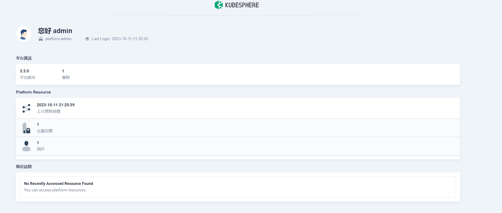

1. 針對管理，有分三大項目\
  &#x20;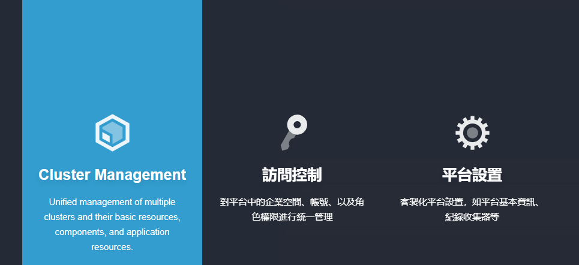

1. Cluster Management
 * 管理 k8s cluster 相關資源\
    &#x20;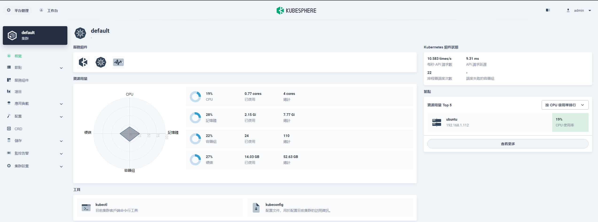

 * KubeSphere的安裝包含監控\
 &#x20;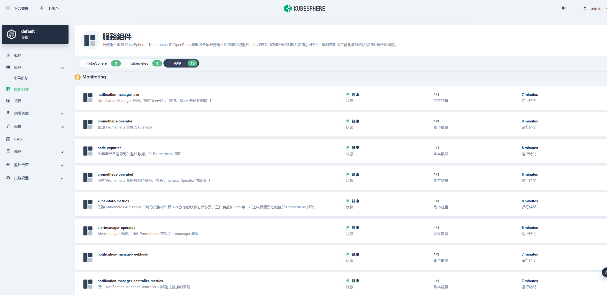
 * Cluster 監控 overview\
 &#x20;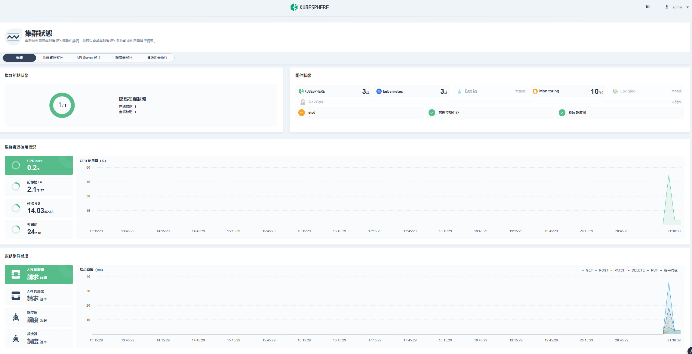
 * 節點資源\
 &#x20;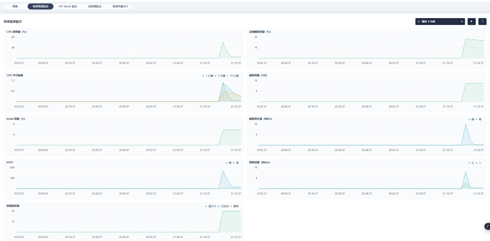
 * API Server 監控\
 &#x20;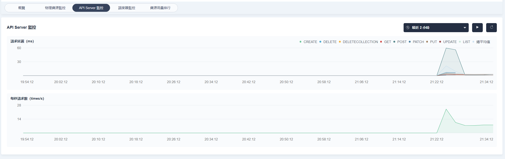
 * scheduler 監控\
 &#x20;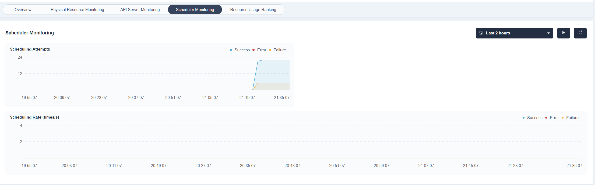
 * 資源使用排行，多節點時可以根據資源使用量做排序顯示\
 &#x20;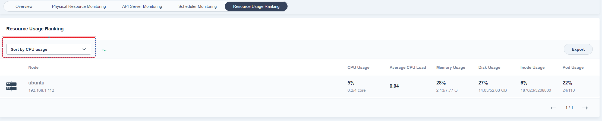
 * workload 監控\
 &#x20;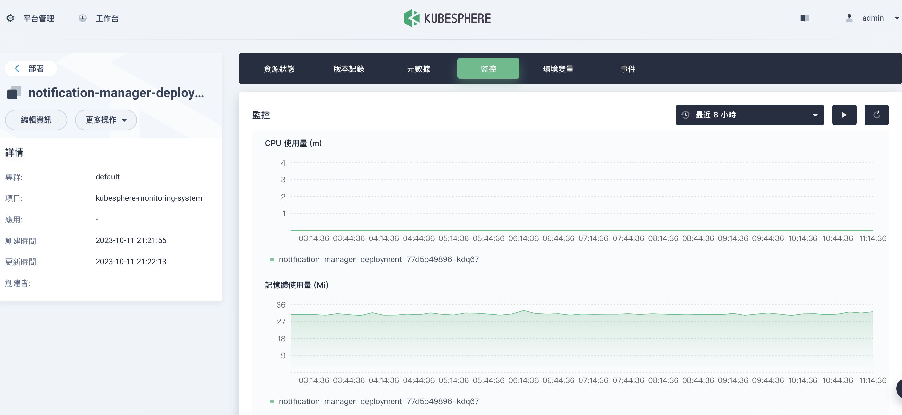\
 &#x20;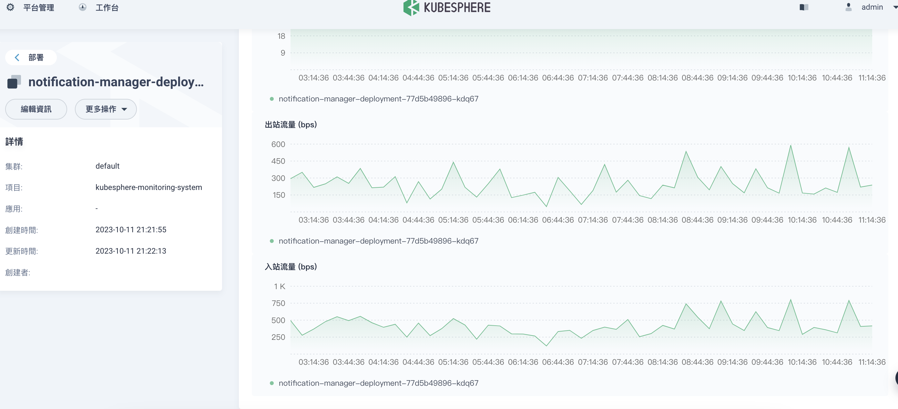


9. 權限管理\
  &#x20;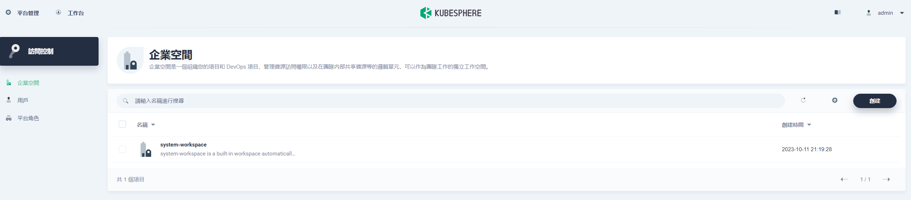
  * 主要設定是 kubesphere 平台相關的權限
    * 叢集權限\
    &#x20;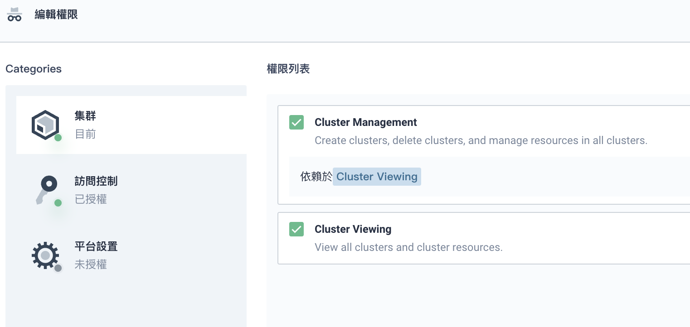
    * 平台角色\
    &#x20;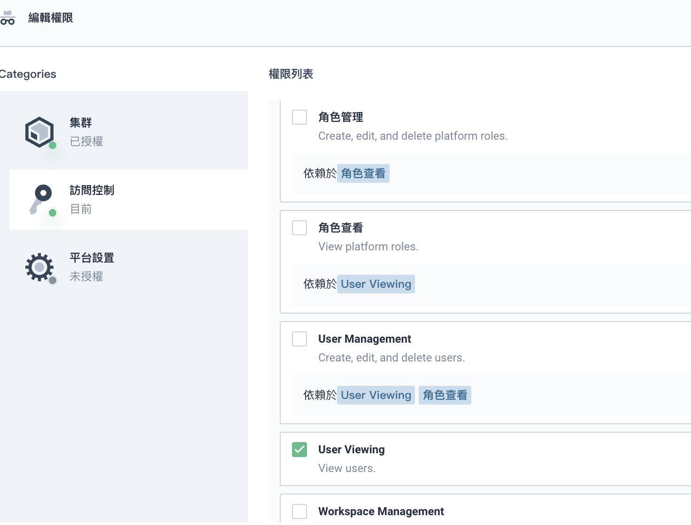
    * 是否可操作 Kubesphere 平台\
    &#x20;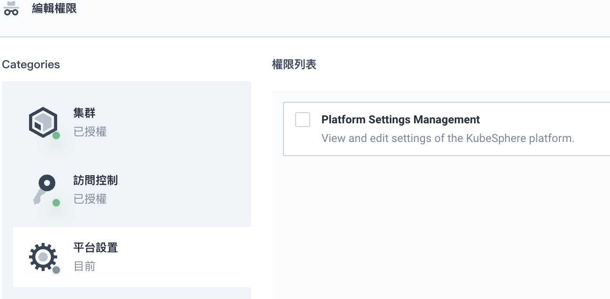


10. 平台設定
    * 主要是設定平台通知相關\
    &#x20;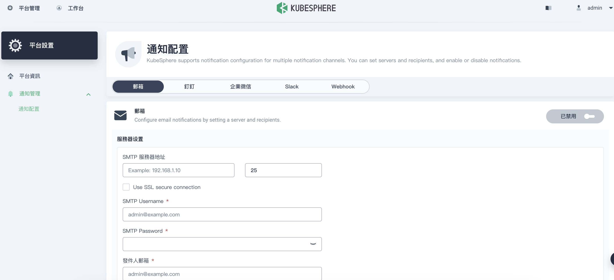

## Kubesphere Plugin
有支援很多plugin，[請看官網](https://kubesphere.io/zh/docs/v3.3/pluggable-components/)
* KubeSphere 應用程式商店
* KubeSphere DevOps
* KubeSphere 日誌系統
* KubeSphere 事件系統
* KubeSphere 警報系統
* KubeSphere 稽核日誌
* KubeSphere 服務網格
* 網路策略
* Metrics Server
* 服務拓樸圖
* 容器組 IP 池
* KubeEdge

有試過啟用 服務拓墣圖(weave-scpoe) 但是失敗，對於 plugin 的設定項目太少，覺得有待加強，像我的環境是使用 containerd ，但是這個plugin kubersphere 卻設定成 docker，還沒有提供其他參數設置，還不如直接用官方安裝方式比較快

---

以下範例啟用應用商店

1. 進入CRD 搜尋 clusterconfiguration\
  &#x20;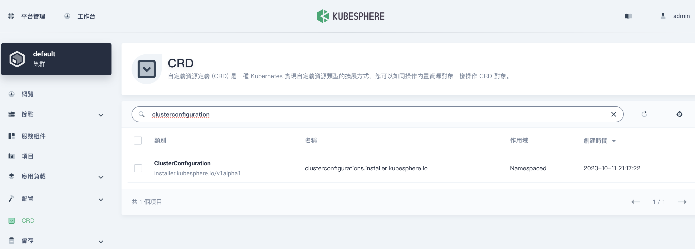

2. 點選 ks-install，編輯yaml\
  &#x20;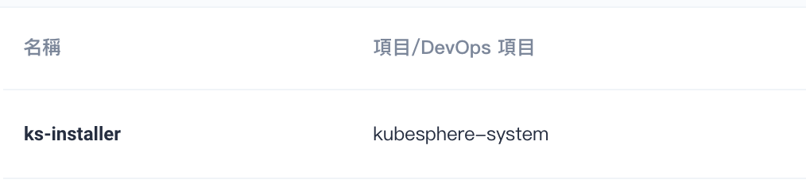
  找到 openpitrix.store.enabled 設定 true\
  &#x20;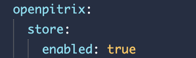

3. 查看安裝過程
    ```
    kubectl logs -n kubesphere-system $(kubectl get pod -n kubesphere-system -l 'app in (ks-install, ks-installer)' -o jsonpath='{.items[0].metadata.name}') -f
    ```

4. 完成在 kubesphere 頁面可以看到應用商店\
  &#x20;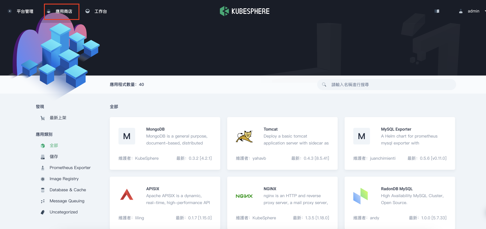
