# m9sweeper

:::info 本文轉寫時間為 2024年3月1日，內容可能會有變動，請以官方文件為主 :::

## 介紹

m9sweeper 是一個免費且易於使用的 Kubernetes 安全平台。它將行業標準的開源工具整合到一個集大成的 Kubernetes 安全工具中，可協助大多數 Kubernetes 管理員保護 Kubernetes 集群以及集群上運行的應用程序。

m9sweeper提供以下功能，使集群安全易于管理：

* CVE Scanning
* Enforcement of CVE Scanning Rules
* Reports and Dashboards, including historical reporting to see how your security posture has changed over time
* CIS Security Benchmarking
* Pen Testing
* Deployment Coaching
* Intrusion Detection
* Gatekeeper Policy Management

m9sweeper 整合以下免費的資安工具

* Trivy: CVE Scanner
* Kubesec: Deployment Best Practices
* kube-bench: CIS Benchmarks
* OPA Gatekeeper: Compliance and Security Policies
* kube-hunter: Cluster Penetration Testing
* Project Falco: Intrusion Detection

## 安裝

1. 加入 helm repo

```
$ helm repo add m9sweeper https://m9sweeper.github.io/m9sweeper && \
$ helm repo update && \
```

2. 設定 values.yaml

```
$ wget https://raw.githubusercontent.com/m9sweeper/m9sweeper/main/manifests/charts/m9sweeper/values.yaml

$ vim values.yaml
```

設定以下內容

```
global:
  jwtSecret: "prodjwtsecrt"
  apiKey: "prodapikey"
dash:
  init:
    superAdminEmail: "admin@gmail.com"
    superAdminPassword: "admin"
```

安裝

```
$ kubectl create ns m9sweeper-system
$ helm install m9sweeper m9sweeper/m9sweeper --namespace m9sweeper-system -f values.yaml
```

完成後輸入網址即可看到登入畫面

&#x20;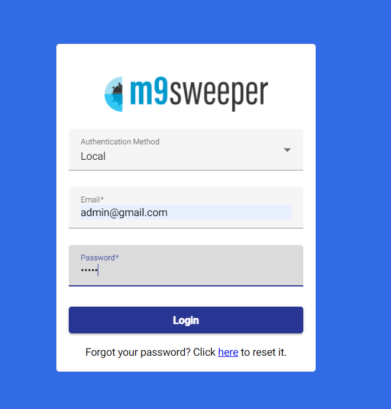

## 首頁

* 首頁可以看到總覽，包含有多少個正在跑的 pod ，以及runtime image 漏洞，以及歷史 Vulnerability\
  &#x20;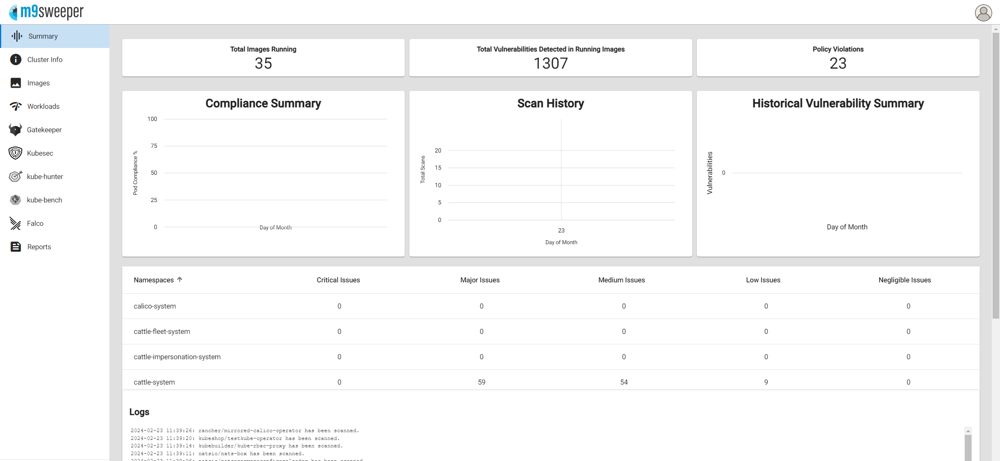

### Image 掃描

* overview:
  * 可以列出 cluster 上存在的 image，並顯示弱點風險的數目，如果都無風險，會在Compliant打勾\
    &#x20;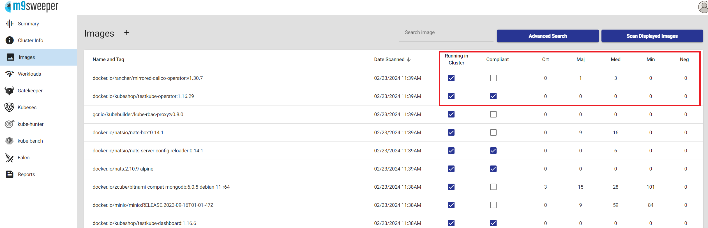
* detail:
  * 點選image，可以查看該 image的掃描詳細結果\
    &#x20;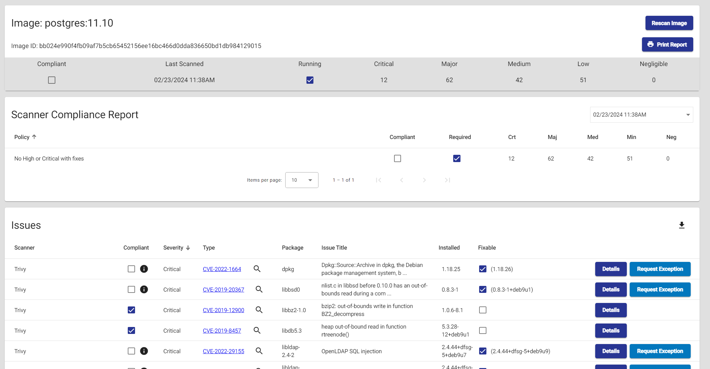
  * 點選下方 issue 的 CVE，可以到外部網站看CVE的詳細說明 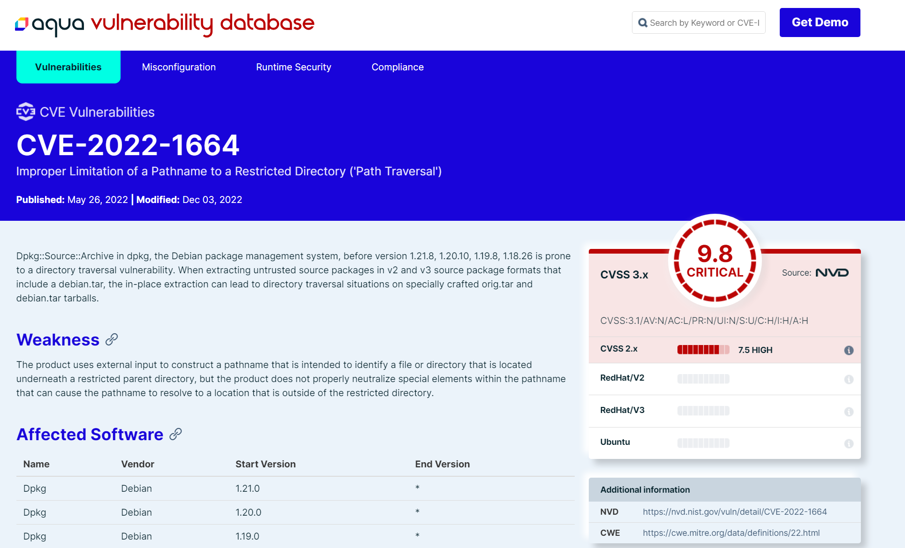
  * 點選右方 detail，可以直接看簡略的說明\
    &#x20;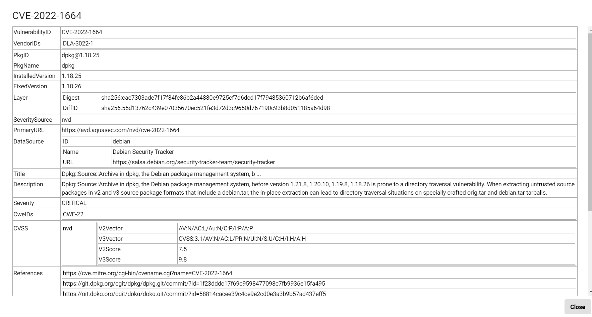
  * 點選右方 Request Exception，可以把該CVE建立例外，並指定一個時間區間，並且可以把此 exception 加到已存在的 policy \
    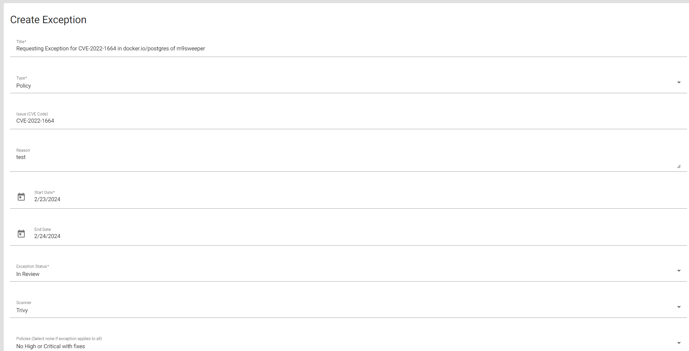
  * 預設會有個 policy，叫做 No High or Critical with fixes，可以點選左下方 Organization Settings -> Policies \
    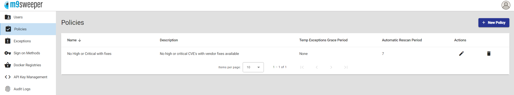 \
    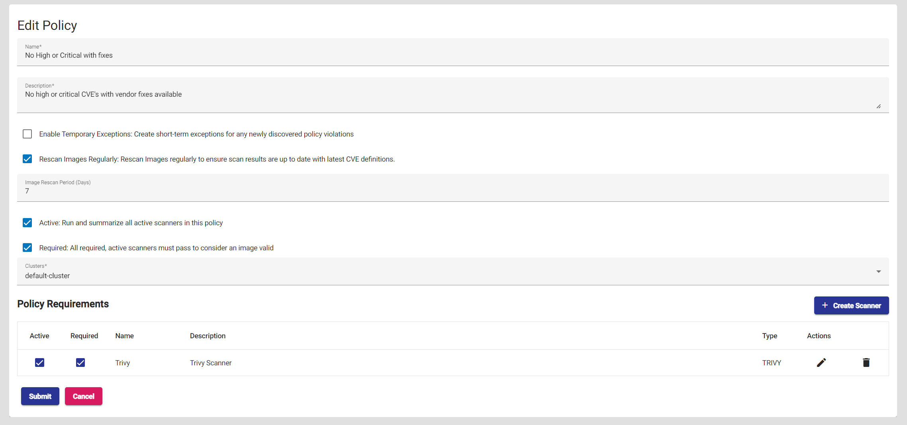
* 掃描外部 image:
  * 如果要掃描外部的 image，點選上方+，輸入 image 網址 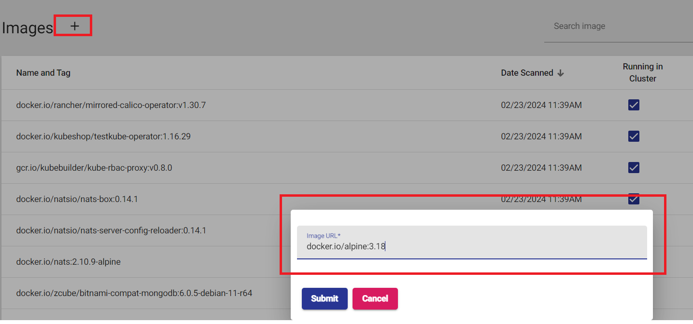\
    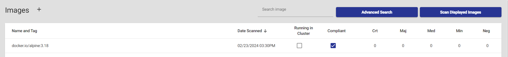

### kube-bench

kube-bench是由Aqua Security開發的工具，旨在通過運行CIS Kubernetes基準中記錄的檢查來檢查Kubernetes是否以安全的方式部署。m9sweeper與kube-bench整合，允許您輕鬆運行掃描，無論是一次性還是重複運行。一旦運行了掃描，m9sweeper還提供了用於查看報告的UI，這樣您就可以更輕鬆地採取措施來糾正發現的問題

* 執行掃描: 右上角執行掃描，根據你的k8s 環境選擇\
  &#x20;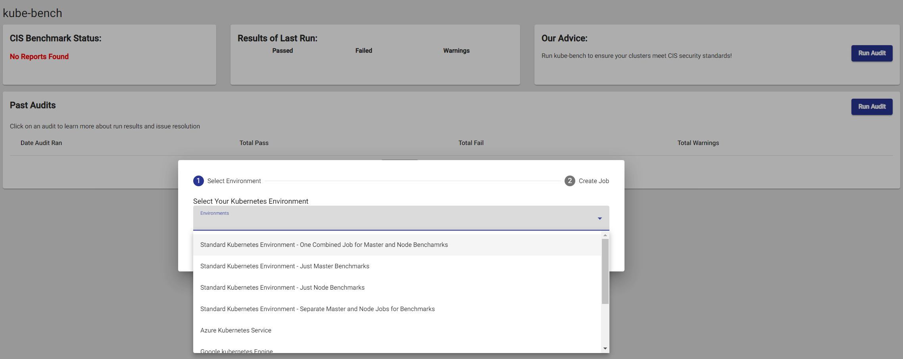 \
  可以設定單次掃描或是定期掃描，這裡先測試單次掃描，複製 cli後執行 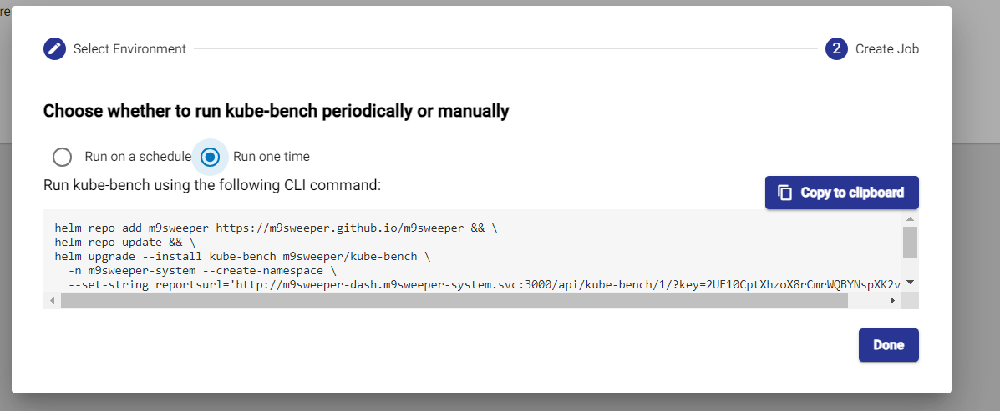
* 掃描結果 執行後可以看到掃描結果 \
  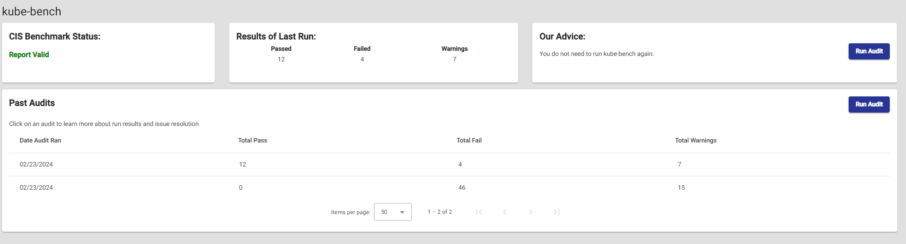&#x20;
* 點選掃描結果，可以看到詳細的結果，結果根據編號分類，點選可展開，並可以看到沒有通過的audit的原因\
  &#x20;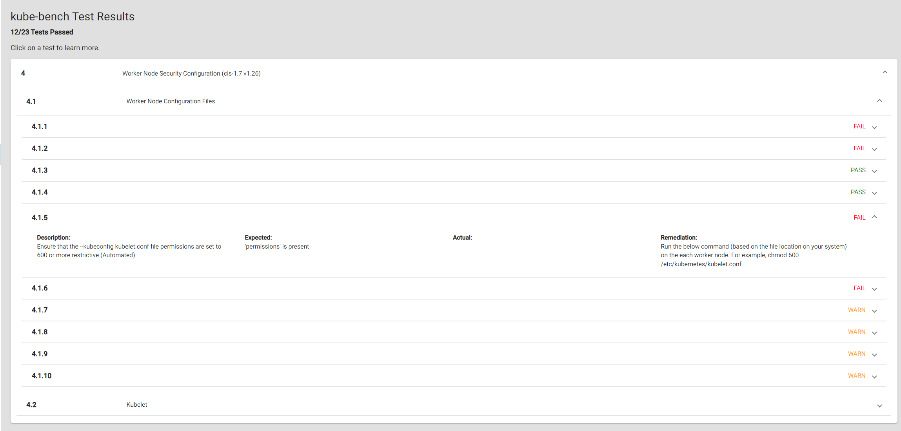

### Kubesec

Kubesec 是由 controlplane 開發的工具，旨在掃描您集群中運行的 Pod，通過執行一系列安全風險分析掃描來幫助定位安全風險。m9sweeper 內建整合，可以直接在其使用者界面中運行和查看 Kubesec 報告。

* 選擇 Pod 掃描 可以上傳 yaml 掃描，或是指定掃描cluster 內 namespace 的 pod，或是全掃 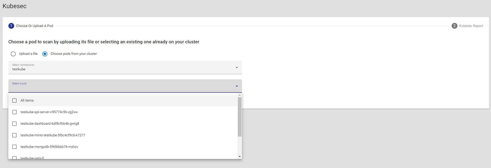
* 查看掃描結果\
  &#x20;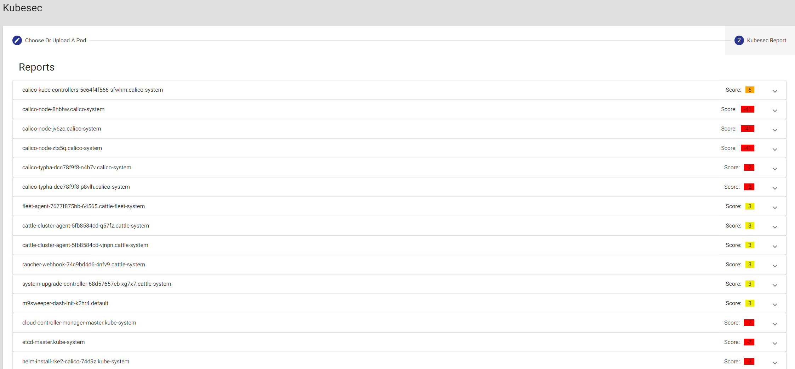&#x20;
* 選擇要看的 pod，展開詳細結果，分數越高越好，結果大約分成 Passed、Critical Issues、Advice \
  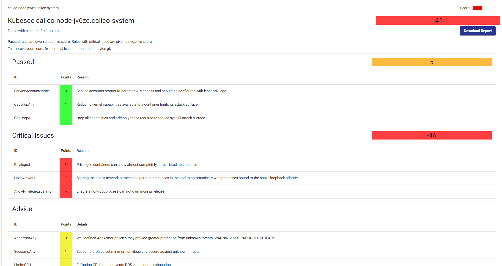

### kube-hunter

kube-hunter 是由 Aqua Security 開發的工具，旨在通過對您的集群運行各種滲透測試來檢查Kubernetes 是否以安全方式部署。m9sweeper與kube-hunter 整合，可以輕鬆執行掃描，可以是一次性的或重複執行的。掃描運行後，m9sweeper還提供了用於查看報告的UI，這樣您就可以更輕鬆地採取措施來修復發現的問題

> **但是根據此專案來看，kube-hunter不再處於積極開發階段。要掃描已知漏洞的Kubernetes集群，我們建議使用Trivy**，請看 https://github.com/aquasecurity/kube-hunter

* 執行掃描，可選擇單次或是排程，這裡先測試單次掃描，複製 cli後執行 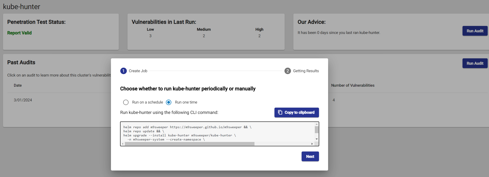
* 查看掃描結果，詳細的說明要點右方的連結，到網站查看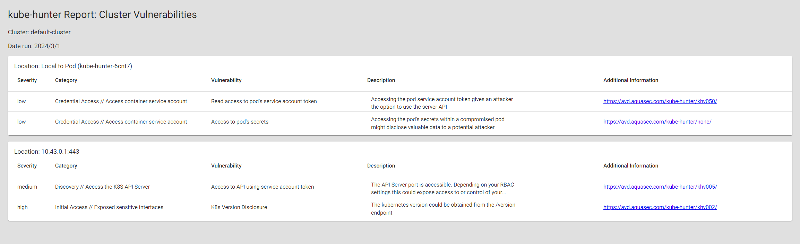\
  &#x20;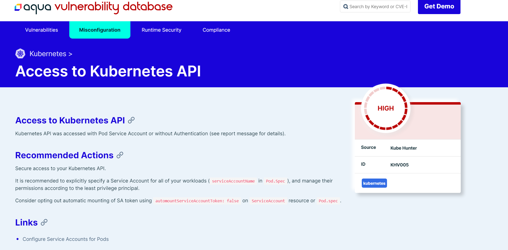

### Falco

針對主機、容器、Kubernetes和雲端的運行時安全性的開源解決方案。Falco 允許查看異常行為和潛在的安全威脅、入侵以及數據竊取或違規違例情況，並應用自定義規則將數據進行豐富化，以提供即時警報。m9sweeper與 Falco整合，以便更輕鬆地管理您的集群安全性。

*   安裝Falco，Minimum Priority的設定是指包含/排除的警報等級。一旦設定後，所有優先級比該級別更嚴格的規則都將被執行。複製 cli後執行

    警報等級依序為

    * Emergency
    * Alert
    * Critical
    * Error
    * Warning
    * Notice
    * Info
    * Debug\
      &#x20;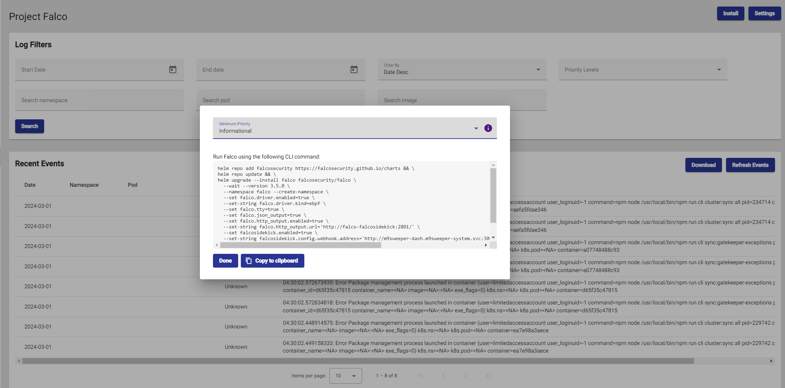
* 執行後，可以看到Falco 抓到的log，由於剛剛設定的是info等級，所以可以看到結果會抓取 info 以上等級的 log\
  &#x20;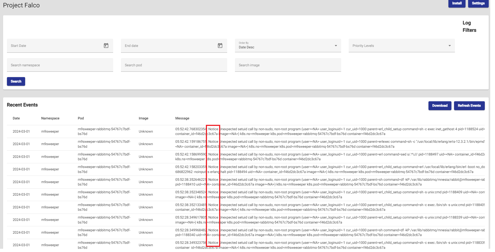
* 點選 log 可以再展開內容\
  &#x20;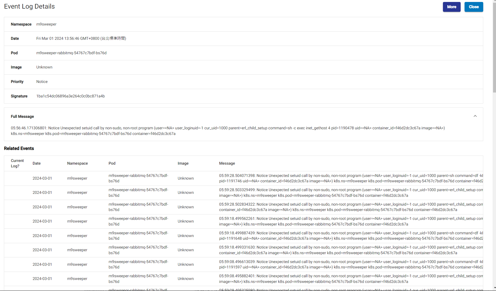
* 右上角 setting，可以設定通知的對象和log等級\
  &#x20;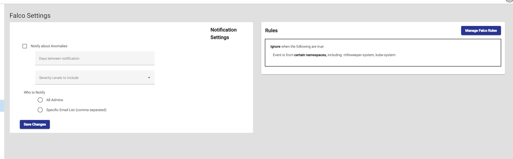
* 也可以自定 rule\
  &#x20;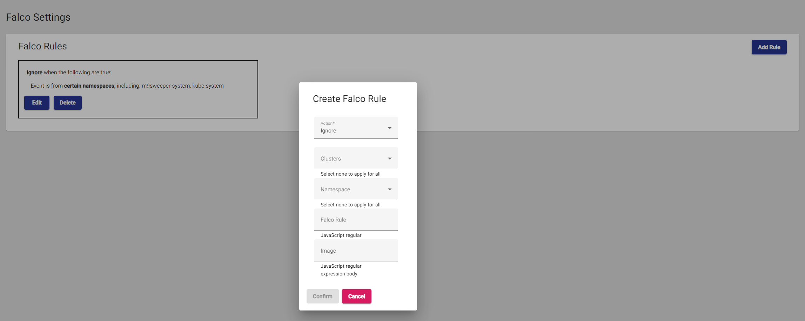

### Gatekeeper

Gatekeeper 是一個擴展 OpenPolicyAgent 項目功能的工具。該項目將策略的概念引入 Kubernetes，允許管理員決定他們想要在集群上擁有什麼、誰可以部署到其中，以及許多其他事情。m9sweeper提供了與Gatekeeper的整合，以及預設多個 template，可以用來啟動您的策略。

* 安裝 Gatekeeper，根據 k8s 的版本，選擇合適的 Gatekeeper 版本，複製 cli後執行 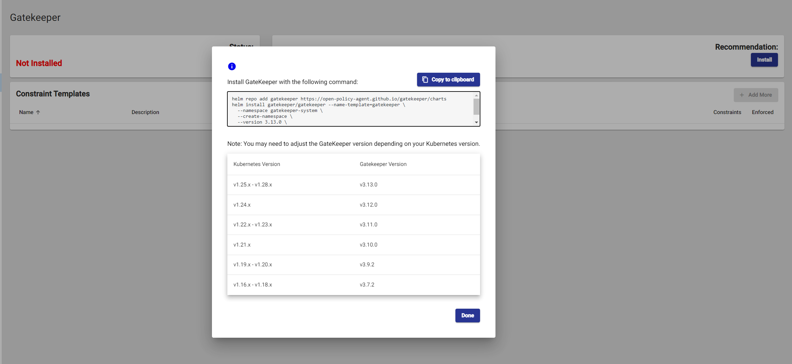
* 安裝後，請按setup 設定，可以看到預設的template\
  &#x20;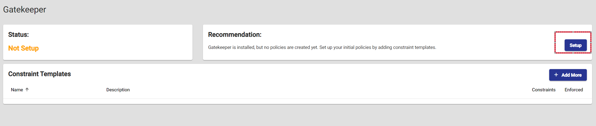\
  &#x20;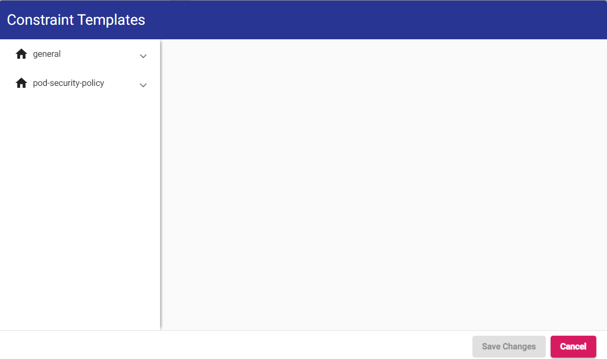
* 下面範例，我們選擇限制容器的資源使用量\
  &#x20;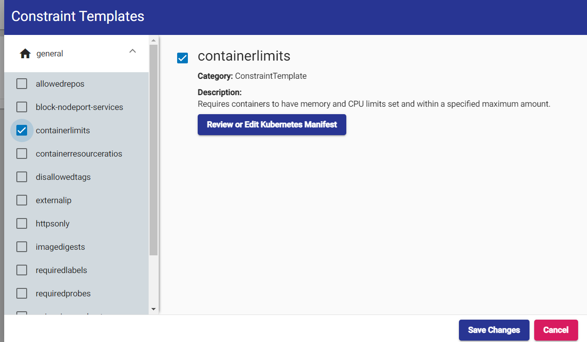\
  &#x20;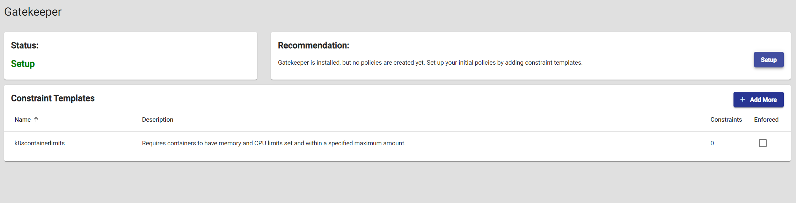
* 進入剛剛新增的 k8scontainerlimits，點選右方 addd more，輸入新增的 Constraint，這裡我們設定限制的資源為 CPU 2000m 或 Memory 4G，存檔 \
  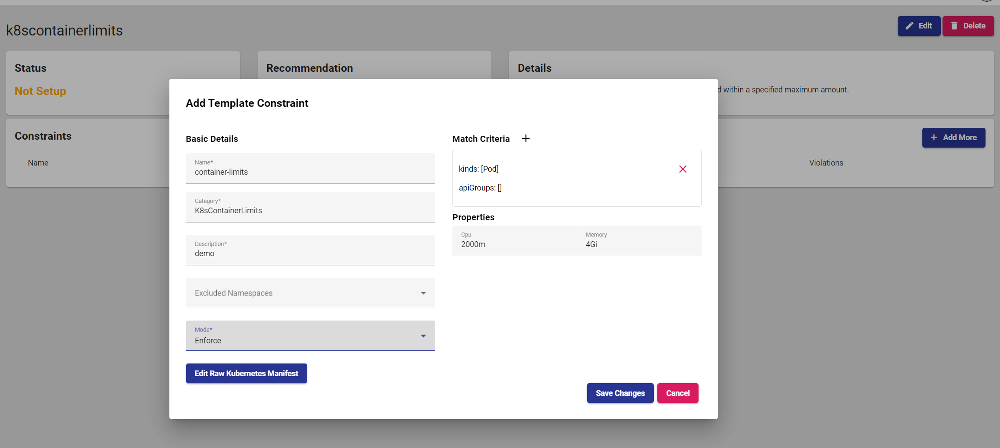
* 測試policy 是否生效，建立一個pod，資源需求為5G的 memory，可以看到已被拒絕建立 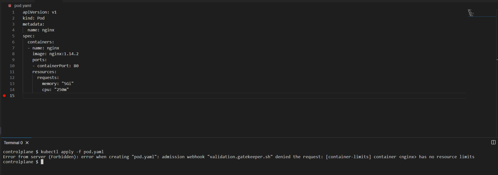
