# Microshift 安裝


本文轉寫時間為 2024年01月02日，內容可能會有變動，僅記錄


## 什麼是 MicroShift？

MicroShift 的 Red Hat® 版本是一個輕量級的 Kubernetes 容器編排解決方案，由 Red Hat® OpenShift® 的邊緣功能構建，基於同名的開源社區項目。作為 Red Hat Device Edge 的一部分，它具有特意構建的最小占地面積，結合了運行在由 Red Hat Enterprise Linux 構建的邊緣優化操作系統上的 MicroShift 企業就緒發行版。MicroShift 將 Kubernetes 的強大和可擴展性帶到邊緣，作為 OpenShift 環境的自然擴展，使應用程序只需編寫一次，就能在需要的地方運行 - 靠近數據源或終端用戶。基本上，這是一個微型的 Kubernetes。

## 第一種安裝 透過 CentOS 8
### 需求
* os: Centos 8 Stream
* CPU: 2core
* Memory: 2GB
### 步驟
1. 安裝 cri-o
    ```
    exoprt OS=CentOS_8_Stream
    export VERSION=1.24

    curl -L -o /etc/yum.repos.d/devel:kubic:libcontainers:stable.repo https://download.opensuse.org/repositories/devel:/kubic:/libcontainers:/stable/$OS/devel:kubic:libcontainers:stable.repo
    curl -L -o /etc/yum.repos.d/devel:kubic:libcontainers:stable:cri-o:$VERSION.repo https://download.opensuse.org/repositories/devel:kubic:libcontainers:stable:cri-o:$VERSION/$OS/devel:kubic:libcontainers:stable:cri-o:$VERSION.repo

    yum install cri-o cri-tools
    systemctl enable crio --now
    ```
2. 由於centos8和cri-o 1.24 有Bug 需要修改 /etc/containers/policy.json ，需修改 keyPaths 為以下內容

    ```
    "keyPath": "/etc/pki/rpm-gpg/RPM-GPG-KEY-redhat-release"
    ```
3. 關閉防火牆
    ```
    systemctl stop firewalld.service
    systemctl disable firewalld.service
    ```
4. 安裝 mircoshift
    ```
    yum copr enable  -y @redhat-et/microshift
    yum install -y microshift
    systemctl enable microshift --now
    ```
5. 下載 oc cli

    ```
    wget https://mirror.openshift.com/pub/openshift-v4/x86_64/clients/ocp/4.8.30/openshift-client-linux.tar.gz

    tar -xvf openshift-client-linux.tar.gz

    mv openshift-client-linux/oc /usr/local/bin
    ```

6. 取得 kubeconfig
    ```
    mkdir .kube
    cp /var/lib/microshift/resources/kubeadmin/kubeconfig .kube/config
    ```


7. 使用 oc 確認狀態
    ```
     oc get pod -A

    NAMESPACE                       NAME                                  READY   STATUS    RESTARTS   AGE
    kube-system                     kube-flannel-ds-rb4fx                 1/1     Running   0          130m
    kubevirt-hostpath-provisioner   kubevirt-hostpath-provisioner-kgzdq   1/1     Running   0          127m
    openshift-dns                   dns-default-6sf47                     2/2     Running   0          123m
    openshift-dns                   node-resolver-kwws6                   1/1     Running   0          169m
    openshift-ingress               router-default-6c96f6bc66-gjdg6       1/1     Running   0          169m
    openshift-service-ca            service-ca-7bffb6f6bf-k42km           1/1     Running   0          169m
    ```
    
    
## 第二種安裝 透過 Rhel 9.2
### 需求
* os: Rhel 9.2 
* CPU: 2core
* Memory: 2GB
### 步驟
1. 註冊 [redhat](https://access.redhat.com/) 帳號
https://tinyl.io/9yyw

2. 登入 [Red Hat Developer ](https://developers.redhat.com/)，到[RHEL 下載頁面](https://developers.redhat.com/products/rhel/download#rhel-new-product-download-list-61451)

<figure>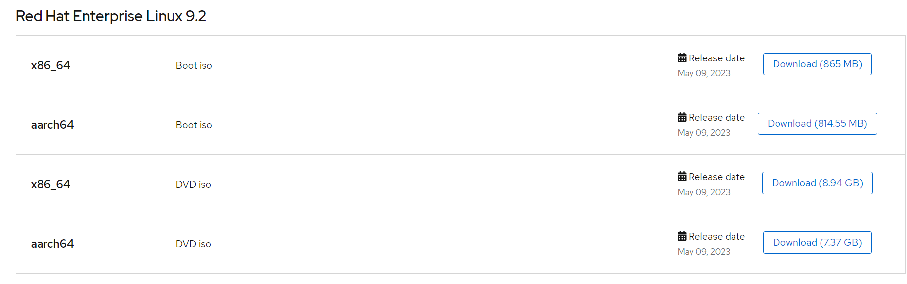<figcaption></figcaption></figure>


3. 下載rhel 9.2 ISO

4. 安裝rhel，請安裝 GUI，還有過程中需要輸入redhat 帳號註冊
    <figure>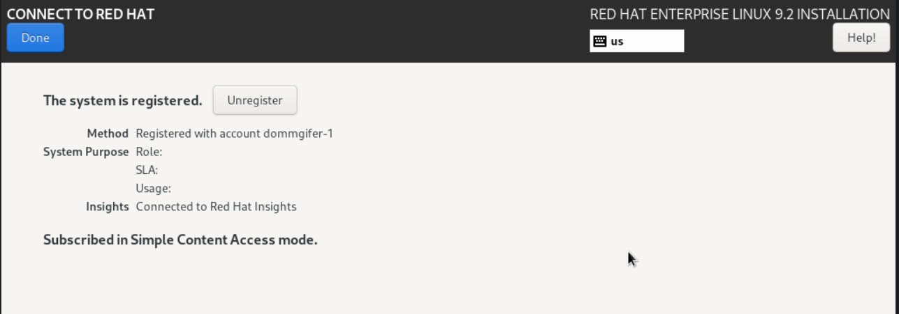<figcaption></figcaption></figure>

5. 安裝完成後進入 OS
    <figure>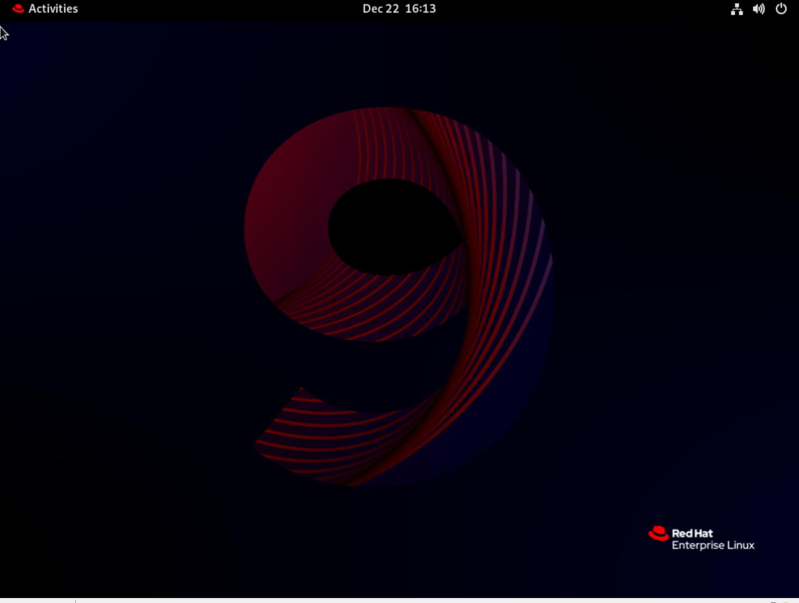<figcaption></figcaption></figure>

6. 安裝 Flatpak
    ```
    sudo yum install flatpak
    ```


8. 啟用 Red Hat build of MicroShift repositories
    ```
    sudo subscription-manager repos \
    --enable rhocp-4.13-for-rhel-9-$(uname -m)-rpms \
    --enable fast-datapath-for-rhel-9-$(uname -m)-rpms
    ```
9. 安裝 microshift
    ```
    sudo dnf install -y microshift
    ```
10. 從 [Red Hat Hybrid Cloud Console](https://console.redhat.com/openshift/install/pull-secret) 下載 pull-secret 到暫存目錄 $HOME/openshift-pull-secret，這個 pull-secret 可允許對container image 進行身份驗證，該image 由 MicroShift 的 Red Hat 版本使用的 container registry 提供。
   <figure>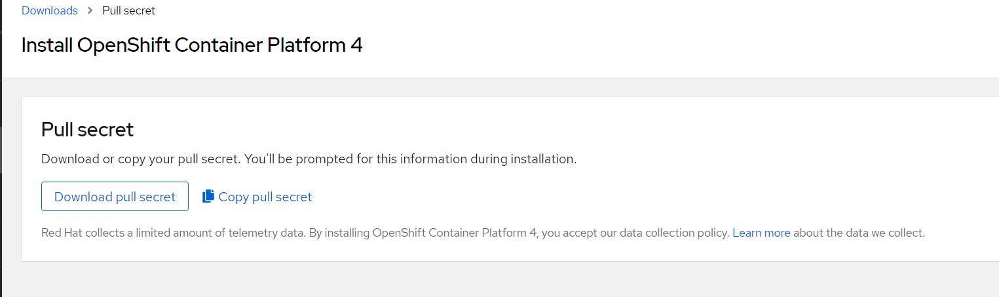<figcaption></figcaption></figure>

11. 複製 pull-secret 到 /etc/crio
    ```
    sudo cp $HOME/openshift-pull-secret /etc/crio/openshift-pull-secret
    ```
12. 修改 /etc/crio/openshift-pull-secret 的使用者為 root 和 600 權限

   ```
   sudo chown root:root /etc/crio/openshift-pull-secret
   sudo chmod 600 /etc/crio/openshift-pull-secret
   ```
13. 設定 firewall
   ```
   sudo firewall-cmd --permanent --zone=trusted --add-source=10.42.0.0/16
   sudo firewall-cmd --permanent --zone=trusted --add-source=169.254.169.1
   sudo firewall-cmd --permanent --zone=public --add-port=6443/tcp
   sudo firewall-cmd --permanent --zone=public --add-port=443/tcp
   sudo firewall-cmd --permanent --zone=public --add-port=80/tcp
   sudo firewall-cmd --reload
   ```
14. 啟動 microshift
   ```
   sudo systemctl enable microshift
   sudo systemctl start microshift
   ```
15. 取得 kubeconfig
    ```
    mkdir .kube
    sudo cat /var/lib/microshift/resources/kubeadmin/kubeconfig > ~/.kube/config
    chmod go-r ~/.kube/config
    ```
16. 確認服務是否正常
    ```
    $ oc get all -A
    NAMESPACE                  NAME                                     READY   STATUS    RESTARTS        AGE
    openshift-dns              pod/dns-default-vmwp5                    2/2     Running   0               2m19s
    openshift-dns              pod/node-resolver-m7vzc                  1/1     Running   0               3m13s
    openshift-ingress          pod/router-default-585fbf8f56-nmjnd      1/1     Running   0               3m13s
    openshift-ovn-kubernetes   pod/ovnkube-master-5xfxw                 4/4     Running   0               3m13s
    openshift-ovn-kubernetes   pod/ovnkube-node-5828h                   1/1     Running   1 (2m20s ago)   3m13s
    openshift-service-ca       pod/service-ca-9584fb648-5s75k           1/1     Running   0               3m13s
    openshift-storage          pod/topolvm-controller-f58fcd7cb-whxvh   4/4     Running   0               3m13s
    openshift-storage          pod/topolvm-node-fdd5t                   4/4     Running   0               2m19s

    NAMESPACE           NAME                              TYPE        CLUSTER-IP     EXTERNAL-IP   PORT(S)                   AGE
    default             service/kubernetes                ClusterIP   10.43.0.1      <none>        443/TCP                   3m46s
    openshift-dns       service/dns-default               ClusterIP   10.43.0.10     <none>        53/UDP,53/TCP,9154/TCP    3m13s
    openshift-ingress   service/router-internal-default   ClusterIP   10.43.65.171   <none>        80/TCP,443/TCP,1936/TCP   3m13s

    NAMESPACE                  NAME                            DESIRED   CURRENT   READY   UP-TO-DATE   AVAILABLE   NODE SELECTOR            AGE
    openshift-dns              daemonset.apps/dns-default      1         1         1       1            1           kubernetes.io/os=linux   3m13s
    openshift-dns              daemonset.apps/node-resolver    1         1         1       1            1           kubernetes.io/os=linux   3m13s
    openshift-ovn-kubernetes   daemonset.apps/ovnkube-master   1         1         1       1            1           kubernetes.io/os=linux   3m13s
    openshift-ovn-kubernetes   daemonset.apps/ovnkube-node     1         1         1       1            1           kubernetes.io/os=linux   3m13s
    openshift-storage          daemonset.apps/topolvm-node     1         1         1       1            1           <none>                   3m13s

    NAMESPACE              NAME                                 READY   UP-TO-DATE   AVAILABLE   AGE
    openshift-ingress      deployment.apps/router-default       1/1     1            1           3m13s
    openshift-service-ca   deployment.apps/service-ca           1/1     1            1           3m19s
    openshift-storage      deployment.apps/topolvm-controller   1/1     1            1           3m13s

    NAMESPACE              NAME                                           DESIRED   CURRENT   READY   AGE
    openshift-ingress      replicaset.apps/router-default-585fbf8f56      1         1         1       3m13s
    openshift-service-ca   replicaset.apps/service-ca-9584fb648           1         1         1       3m13s
    openshift-storage      replicaset.apps/topolvm-controller-f58fcd7cb   1         1         1       3m13s

    ```


## Podman integration microshift

https://www.opensourcerers.org/2023/11/13/podman-desktop-integration-with-microshift-in-a-rhel-virtual-machine/


### 安裝podman Desktop
1. 安裝podman Desktop
    ```
    $ flatpak remote-add --if-not-exists --user flathub https://flathub.org/repo/flathub.flatpakrepo


    $ flatpak install --user flathub io.podman_desktop.PodmanDesktop
    Looking for matches…
    Required runtime for io.podman_desktop.PodmanDesktop/x86_64/stable (runtime/org.freedesktop.Platform/x86_64/23.08) found in remote flathub
    Do you want to install it? [Y/n]: Y

    io.podman_desktop.PodmanDesktop permissions:
        ipc     network     x11     dri    file access [1]    dbus access [2]

        [1] /run/docker.sock, home, xdg-run/podman:create
        [2] org.freedesktop.Flatpak, org.freedesktop.Notifications, org.kde.StatusNotifierWatcher


            ID                                             Branch                 Op            Remote             Download
     1.     org.freedesktop.Platform.GL.default            23.08                  i             flathub            < 162.2 MB
     2.     org.freedesktop.Platform.GL.default            23.08-extra            i             flathub            < 162.2 MB
     3.     org.freedesktop.Platform.Locale                23.08                  i             flathub            < 355.9 MB (partial)
     4.     org.freedesktop.Platform.openh264              2.2.0                  i             flathub            < 944.3 kB
     5.     org.freedesktop.Platform                       23.08                  i             flathub            < 225.2 MB
     6.     io.podman_desktop.PodmanDesktop                stable                 i             flathub            < 117.2 MB

    Proceed with these changes to the user installation? [Y/n]: Y
    ```

  安裝完成後，可以啟動 podman Desktop
  <figure>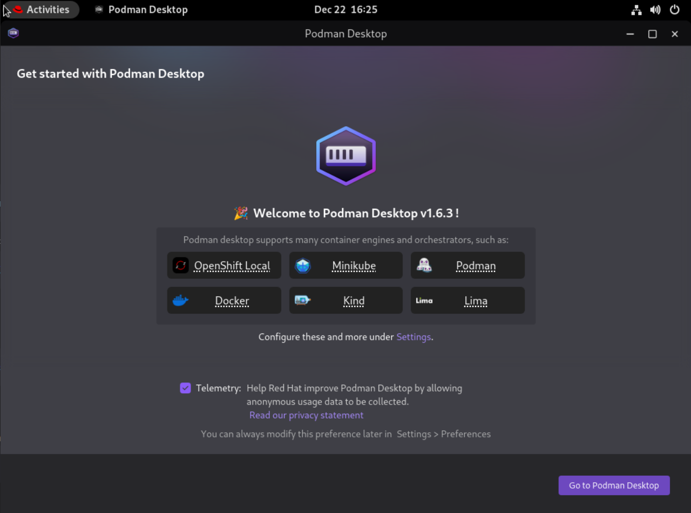<figcaption></figcaption></figure>
  
### 透過podman 佈署 pod

1. 重啟 podman Desktop，會看到下方出現 microshift
    <figure>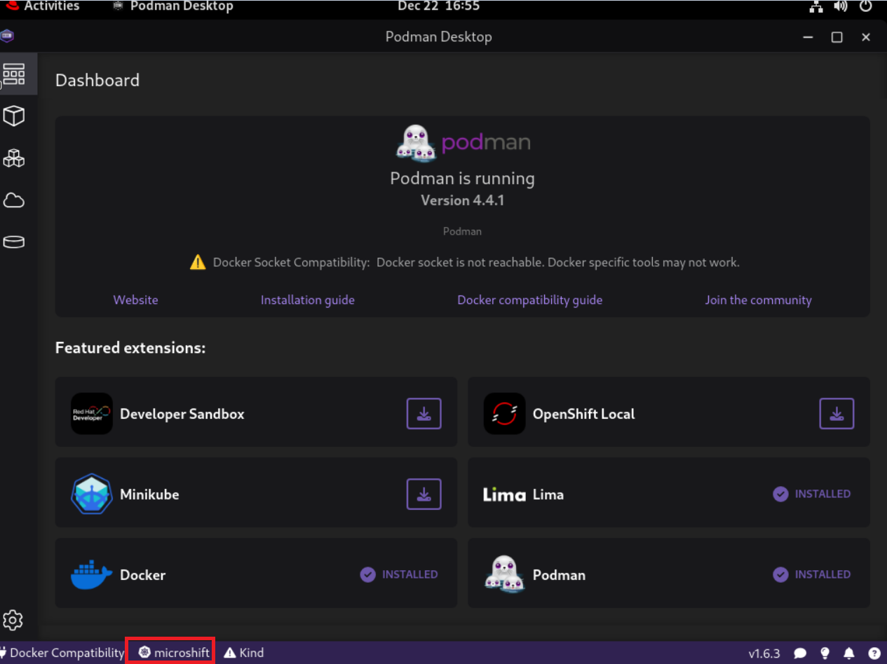<figcaption></figcaption></figure>
2. 如果要看到其他 namespace 的 pod 請修改 .kube/config 內的 namespace 名稱，這裡我們保持使用 default namespace

3. 接下來透過 podman Desktop 佈署服務到 MicroShift ，下載 nginx image
    <figure>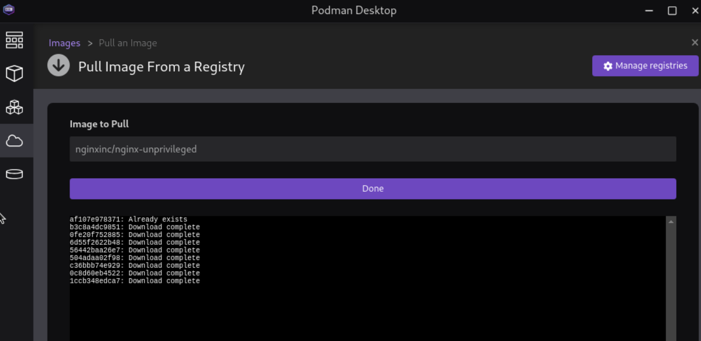<figcaption></figcaption></figure>

    <figure>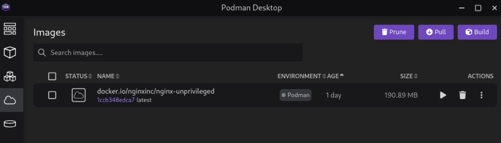<figcaption></figcaption></figure>
    
4. 這裡可以先建一個 container (由 podman 管理) 
    
    <figure>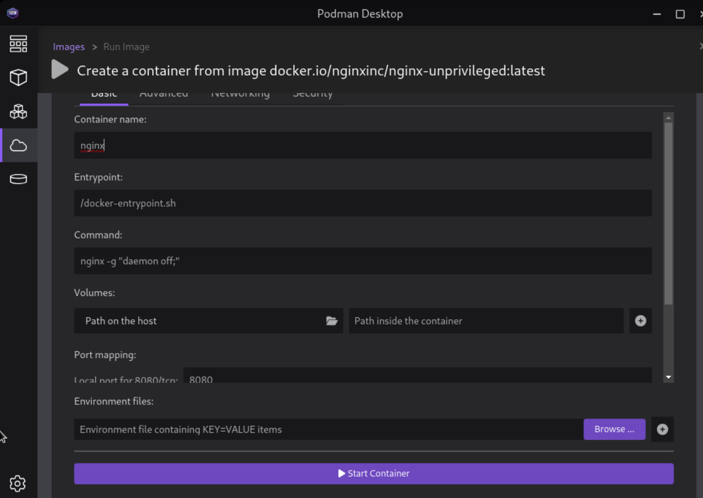<figcaption></figcaption></figure>

    佈署後可以看到 container
    <figure>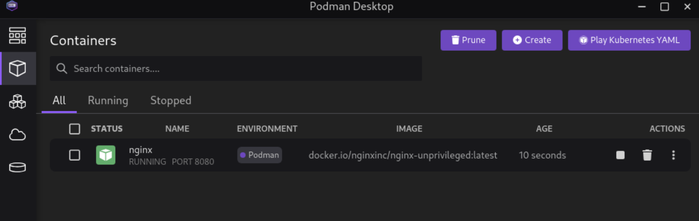<figcaption></figcaption></figure>

5. 從剛剛的 container 選擇 Deploy to kubernetes
    <figure>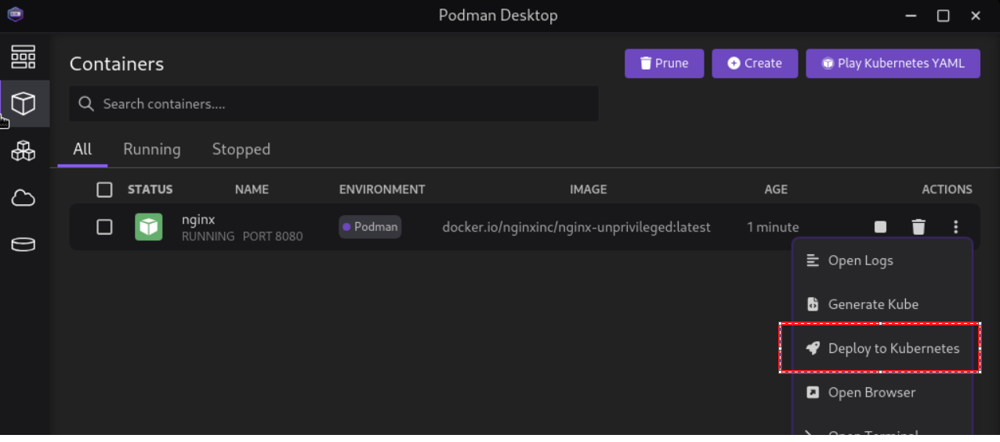<figcaption></figcaption></figure>

    選項需勾選 security context
    <figure>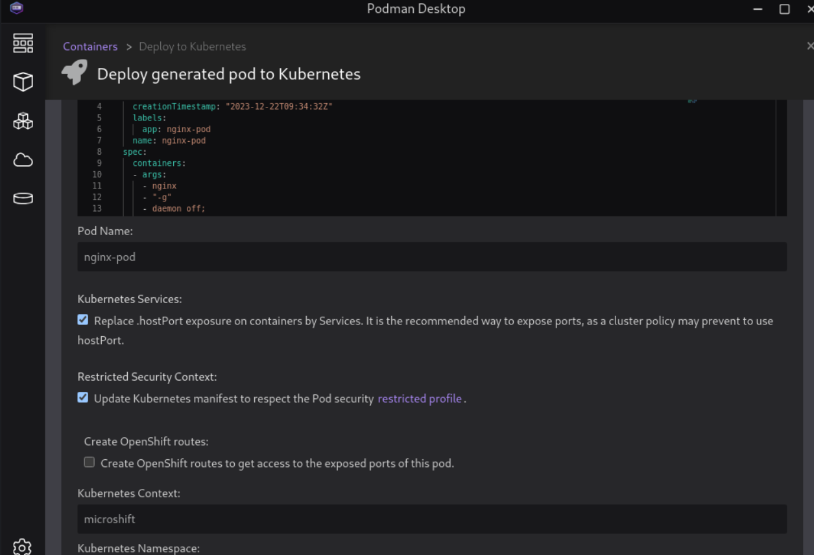<figcaption></figcaption></figure>


6. 回到 microshift 使用 oc cli 查看pod，可以看到都pod svc 都有建立
    ```
    $ oc get all
    NAME            READY   STATUS    RESTARTS   AGE
    pod/nginx-pod   1/1     Running   0          31s

    NAME                     TYPE        CLUSTER-IP     EXTERNAL-IP   PORT(S)    AGE
    service/kubernetes       ClusterIP   10.43.0.1      <none>        443/TCP    50m
    service/nginx-pod-8080   ClusterIP   10.43.59.115   <none>        8080/TCP   93s
    ```

7. 透過瀏覽器存取 svc IP，成功連到 nginx

    <figure>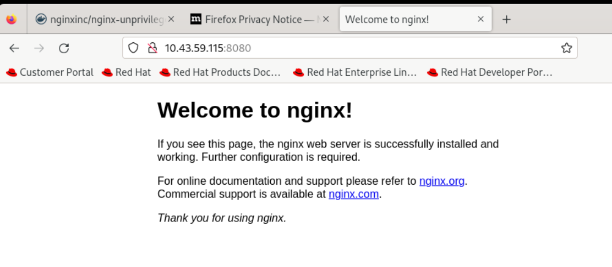<figcaption></figcaption></figure>