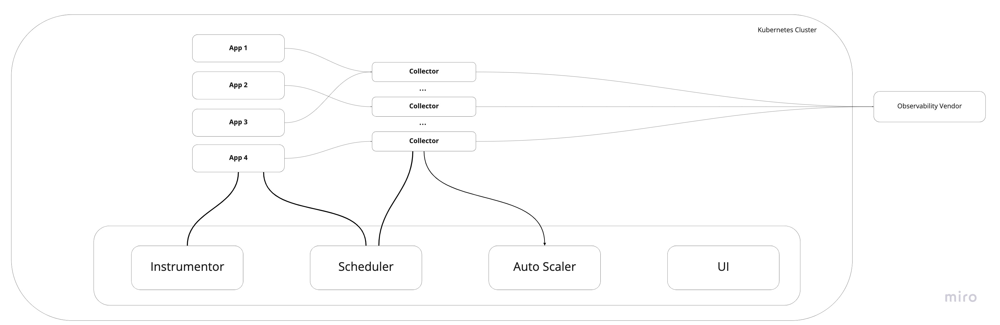
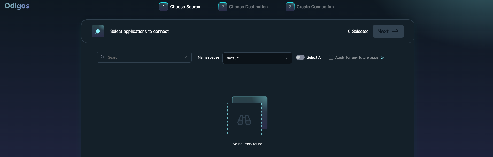
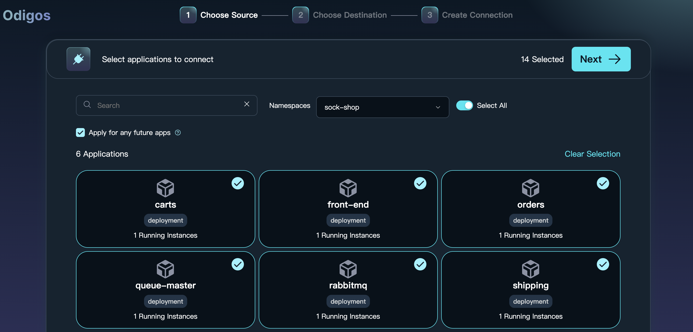
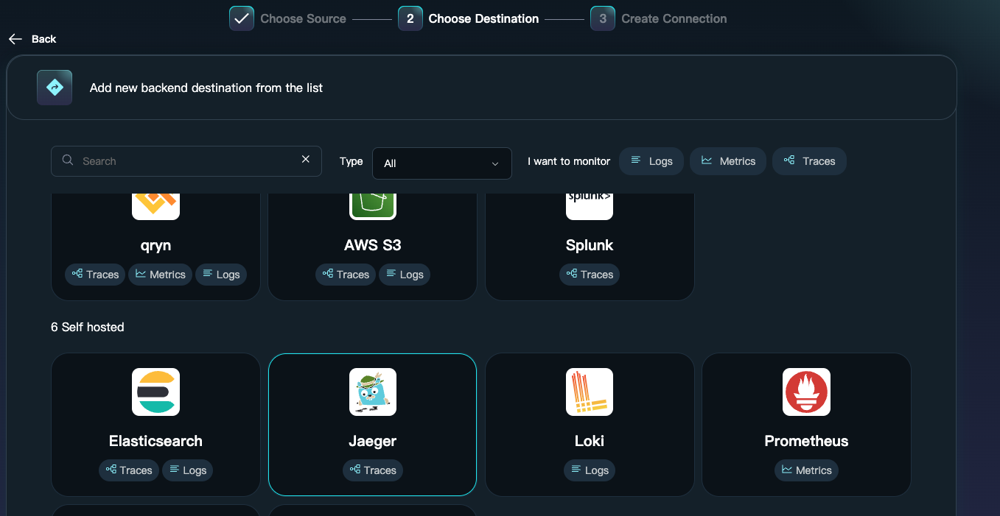
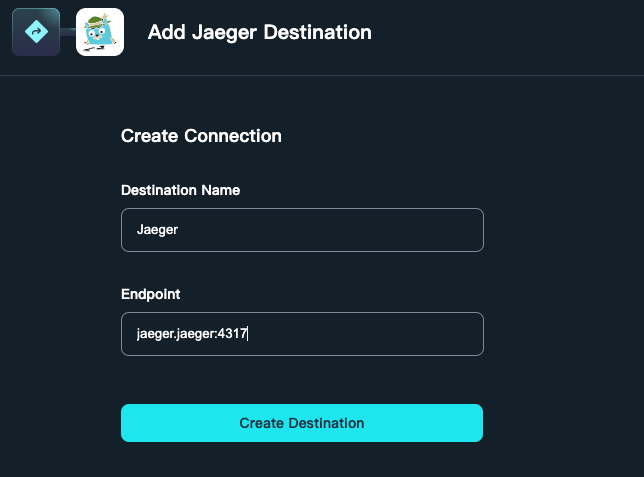
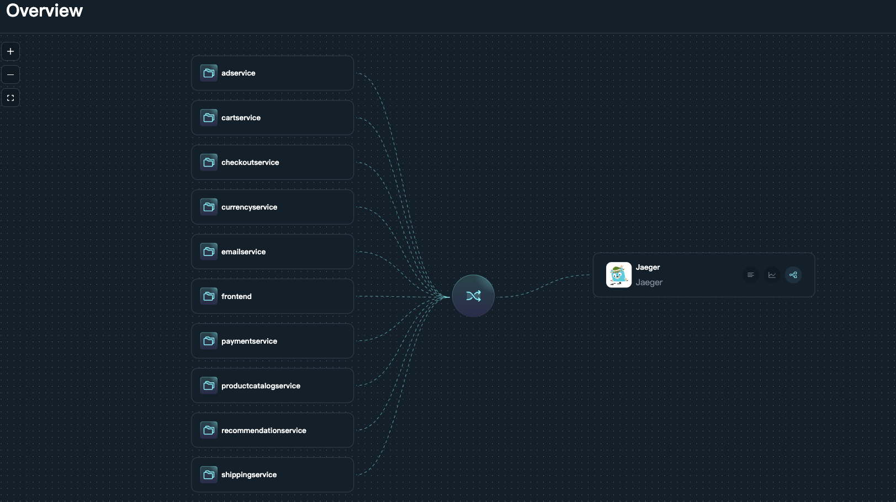
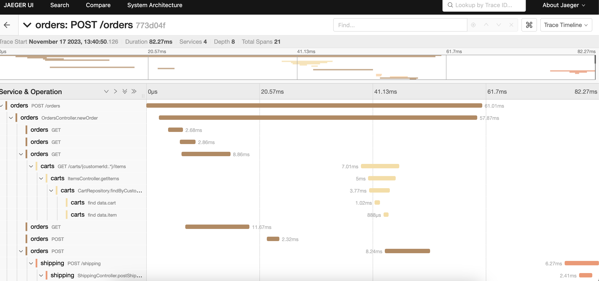

# Odigos 安裝使用


本文轉寫時間為 2023年11月20日，內容可能會有變動，僅記錄


Odigos結合了OpenTelemetry和eBPF，自動為應用程式進行instrument，不須修改任何程式。使用Odigos，可獲得分散式追蹤、metric和log。此外Odigos能夠檢測每個正在運行的應用程式的編程語言，並使用最適合該編程語言的instrument技術。

Odigos使用eBPF來instrument應用程式。eBPF是一種kernel技術，對應用程式幾乎沒有任何額外影響。


Odigos 架構

<figure><figcaption></figcaption></figure>


1. 下載 odigos cli，請根據作業系統和架構選擇 https://github.com/keyval-dev/odigos/releases

    ```
    wget https://github.com/keyval-dev/odigos/releases/download/v1.0.0/cli_1.0.0_linux_amd64.tar.gz
    ```
    
2. 解壓縮
   ```
   tar -xvf cli_1.0.0_linux_amd64.tar.gz -C /usr/local/bin/
   ```
    
3. 確認kubeconfig 位置，此範例在預設位置 ~/.kube.config
4. 部屬範例程式，這裡不跟官網一樣，我選sock-shop　為範例，請修改yaml 內的mongodb image為 mongo:5.0.11
    ```
     wget https://raw.githubusercontent.com/microservices-demo/microservices-demo/master/deploy/kubernetes/complete-demo.yaml
     kubectl apply -f complete-demo.yaml
    ```
6. 安裝 Odigos
    ```
    odigos install
    ```
    ```
    [root@centos ~]# odigos install
    Installing Odigos version v1.0.0 in namespace odigos-system ...
    Creating namespace odigos-system                  ✔
    Creating CRDs                                     ✔
    Creating Odigos OdigosDeployment                  ✔
    Creating Odigos OdigosConfig                      ✔
    Creating Odigos OwnTelemetry Pipeline             ✔
    Creating Odigos DataCollection                    ✔
    Creating Odigos Instrumentor                      ✔
    Creating Odigos Scheduler                         ✔
    Creating Odigos Odiglet                           ✔
    Creating Odigos AutoScaler                        ✔
    Waiting for Odigos pods to be ready ...           ✔

    SUCCESS: Odigos installed.
    ```
5. 啟動UI頁面
    ```
    odigos ui --address 0.0.0.0
    ```
    ```
    [root@centos ~]# odigos ui --address 0.0.0.0
    Could not find UI binary, downloading latest release
    Downloading version 1.0.0 of Odigos UI ...
    2023/11/14 04:04:44 Starting Odigos UI...
    2023/11/14 04:04:44 Odigos UI is available at: http://0.0.0.0:3000
    ```
    輸入IP port 即可看到網頁&#x20;

    <figure><figcaption></figcaption></figure>

6. 部署範例
    ```
    kubectl apply -f https://raw.githubusercontent.com/keyval-dev/microservices-demo/master/release/kubernetes-manifests.yaml
    ```
    ```
    kubectl get pod -n sock-shop
    NAME                            READY   STATUS    RESTARTS      AGE
    carts-558f5f945-fbc42           1/1     Running   0             63m
    carts-db-5974b49587-89hhp       1/1     Running   0             55m
    catalogue-58df648779-sw7ph      1/1     Running   0             74m
    catalogue-db-6c8f958ddb-c7bhk   1/1     Running   0             74m
    front-end-75d46bf47d-d6h9n      1/1     Running   1 (61m ago)   63m
    orders-d65f77885-fvjl7          1/1     Running   0             63m
    orders-db-685cd48d69-b5cxz      1/1     Running   0             55m
    payment-76f87bbf6-sqwzd         1/1     Running   0             74m
    queue-master-f7fbfdf76-gjvbh    1/1     Running   0             63m
    rabbitmq-76477fdc-86vj4         2/2     Running   0             63m
    session-db-5576d886db-k4wpr     1/1     Running   0             74m
    shipping-5b9f57c79f-tdxqx       1/1     Running   0             63m
    user-5cd4dd89bb-fpl6d           1/1     Running   0             74m
    user-db-757d6f7456-775f7        1/1     Running   0             74m

    ```

7. 部署 all-in-one Jaeger
    ```
    kubectl create ns jaeger
    kubectl apply -f https://raw.githubusercontent.com/keyval-dev/opentelemetry-go-instrumentation/master/docs/getting-started/jaeger.yaml -n jaeger
    ```
    
8. 回到 odigos ui 重整頁面，namespace 選擇 sock-shop ，選擇要被 trace 的服務，這裡全選
    <figure><figcaption></figcaption></figure>


9. 下一步，選擇輸出的目的，這裡選擇剛剛建立的 jaeger
    <figure><figcaption></figcaption></figure>

    並輸入 jaeger 位置&#x20;

    <figure><figcaption></figcaption></figure>

10. 完成後可以看到所有服務透過 odigos 把trace 導入到 jaeger
    <figure><figcaption></figcaption></figure>

11. 回到範例程式頁面，並操作
 
12. 連到jaeger 頁面， http://localhost:16686，即可看到trace 結果
   ```
   kubectl port-forward -n jaeger svc/jaeger 16686:16686
   ```
   <figure><figcaption></figcaption></figure>


    


## 結論
可以不用重啟程式，透過UI介面就可以設定那些應用程式可以trace，使用起來非常方便，但是目前專案剛起步，使用上還太少客製化設定，像是採樣率還有政策等等，還有透過UI操作時有時候會一直無法加入trace，這個專案可以持續關注未來的發展，個人覺得有淺，但是社群也需要大力支持才能更強壯。