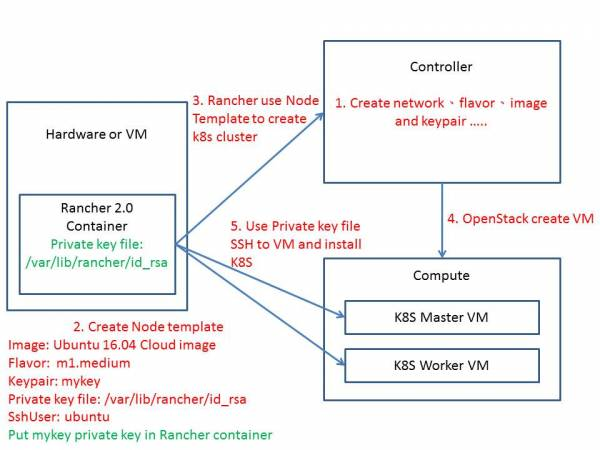

# Rancher 2.0 ssh to OpenStack VM


本篇為個人理解，如果有誤導之處，歡迎告知修改XD


## Rancher 2.0 建立 OpenStack VM 流程

Rancher 2.0可以幫使用者建立 OpenStack 上的 VM，並安裝 docker 及 k8s，這是怎麼做到的?

* 因為 Rancher2.0 使用了 docker-machine，docker-machine 可以幫你在遠端的機器安裝 docker，而 docker-machine 支援很多 provider， 像是: AWS、AZURE、OpenStack、GCE 和 VirtualBox 等等，每個 provider 所需的參數不同，以下用OpenStack 為例。
* 根據官方文件，可以看到[Provider為OpenStack](https://docs.docker.com/machine/drivers/openstack/#options)所需的參數跟 Rancher 的 Node Template 裡的 OpenStack 的參數是一樣的。
* Node Template 裡有 keypairName 欄位以及 privatekeyFile，因為 docker-machine 需要 ssh 進入 VM 安裝docker，所以需要private key， 所以必須要把 private key 丟到 rancher 裡面，並指定路徑才使用。
* 注意: docker-machine 不支援 OpenStack 所產生的 keypair 格式，所以只能用 ssh-keygen 指令產出 key， 再將public key\(id\_rsa.pub\) import 到 OpenStack 裡，之後 Rancher 再使用 private key\(id\_rsa\)。
* 以下為圖解:

  1. 在 OpenStack 建立 network, flavor, image 和 keypair 等等
  2. 在 Rancher 建立 Node Template \(以下只列出要說明的重點\)
     * Image: ubuntu 16.04 cloud image
     * Flavor: m1.medium
     * Keypair: mykey
     * Private key file: /var/lib/rancher/id\_rsa
     * Ssh user: ubuntu
     * 然後把 mykey 的 private key 放到 Rancher container裡的/var/lib/rancher/ ，然後名為id\_rsa
  3. Rancher 使用 Node Template 建立 k8s cluster，此時 docker-machine 呼叫 OpenStack API
  4. OpenStack 就建立所指定參數的VM
  5. VM 建立完成後，Rancher 就使用指定的 Private key file，SSH進入VM 安裝K8S



如果你沒有把 mykey 的 private key 放到 Rancher container 你所指定的Private key file路徑裡，  
Rancher會停在 **waiting for ssh to be available** 的狀態，因為他無法 SSH 到 VM 裡面安裝 K8S。

### Private key file 問題 <a id="private_key_file_&#x554F;&#x984C;"></a>

* Q: 這裡牽涉到安全問題，按照上面所述，每個使用者就需要把 Private key 交出來，給 Rancher 管理者放到 Rancher container 裡嗎?
* A: 這當然是不允許的，絕對不能要求使用者交出 Private key。
* Q: 如果不能讓使用者交出 Private key，那把所有人的 Key 固定，然後在 Rancher container放入這把 key 的 private key 不就好了? 
* A: 這樣使用者要進入 VM，就必須用剛剛所說的 Private key，所以 A 使用者可以用此 KEY 進入 B 使用者的 VM，因為大家的 key 都一樣阿，這樣不對吧?
* Q: 如果不能得到使用者的 Private key，那該怎麼辦?
* A: 目前有一種作法，前半步跟上一個問題一樣，大家都用一樣的 KEY，但是不會把 Private Key 給任何使用者，使用者不能透過 private key 登入，必須透過預設密碼登入，然後請使用者登入後記得改密碼，這樣就解決問題了。
* Q: 但是使用cloud image，要怎麼讓使用者不透過 private key 登入?
* A: 透過 userdata 設定，開啟 ssh 使用密碼認證，並且注入預設密碼，Rancher 有 userdata 的參數，所以先寫好userdata 的腳本，然後放到 Rancher container 裡面，然後指定 userdata 腳本的路徑，這樣當 OpenStack 建立 VM 後，就可以把 SSH 密碼認證開啟以及注入預設密碼，下面範例把預設的 ubuntu 使用者，預設密碼設為 openstack，並開啟 ssh 密碼認證，以下為 userdata.yml:

```text
#cloud-config
chpasswd:
  list: |
    ubuntu:openstack
  expire: false
ssh_pwauth: true
users:
  - default
```

