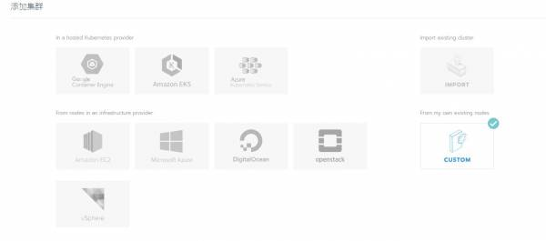
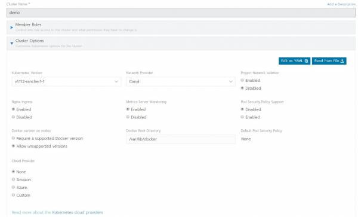
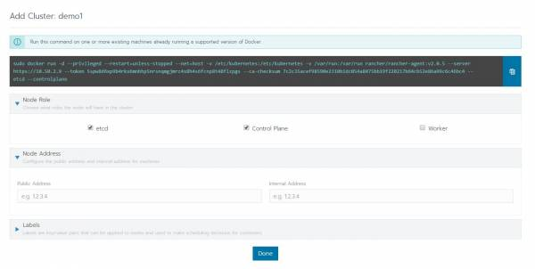
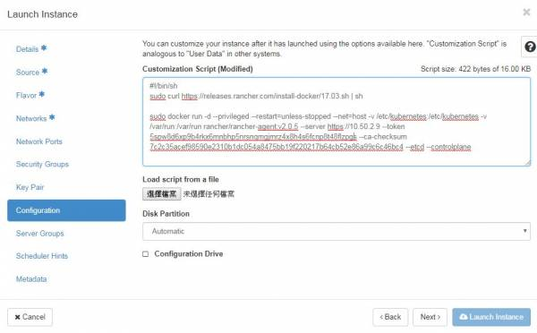
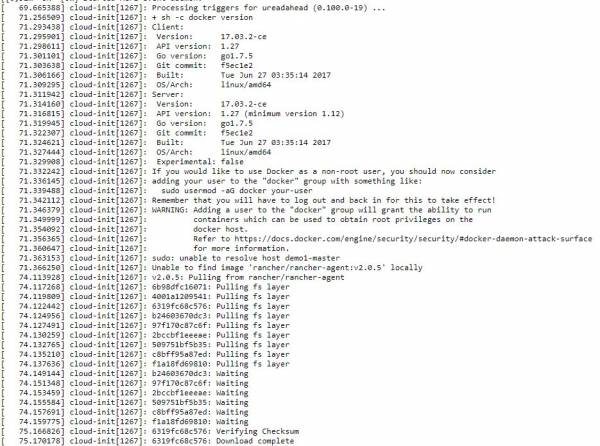
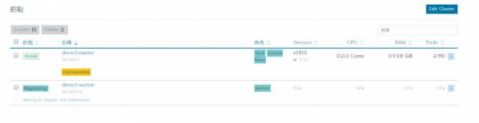

# Rancher 佈署 K8S 至 OpenStack 流程


此篇記錄時間為 2018/11/26，內容可能過時，請斟酌參考


OpenStack 本身有 Magnum 幫忙建立 Kubernetes，為什麼還要用Rancher?  
因為我在使用Magnum的時候，時常建立失敗，所以改用Rancher，不過還是推薦使用Magnum，與OpenStack整合比較方便。

## Rancher 端

建立 cluster，選擇 custom



輸入 cluster 名稱，選擇 k8s 版本，以及網路 Provider，完成後選擇下一步



此時會跳出command，要你輸入在被安裝 k8s 的機器上，腳色勾選 etcd 和 control plane，我們先稱呼為 Master 節點，將指令複製  
[](http://10.50.0.12/wiki/lib/exe/detail.php?id=project%3Aopenstack%3Acontainer%3Arancher_custom&media=project:openstack:container:3.jpg)



如果要建立 Worker ，步驟同上，只是腳色勾選 worker，並複製指令。

## OpenStack 端

### 建立 Master VM

建立 VM 前，請先設定安全群組，根據節點開啟port號

| etcd | master | worker |
| :--- | :--- | :--- |
| 443 TCP | 443 TCP | 443 TCP |
| 2379 TCP | 2379 TCP | 6443 TCP |
| 2380 TCP | 2380 TCP | 9099 TCP |
| 6443 TCP | 6443 TCP | 10254 TCP |
| 8472 UDP | 10250 TCP | 8472 UDP |
|  | 9099 TCP |  |
|  | 10254 TCP |  |
|  | 8472 UDP |  |

建立 Master VM ，image 選擇 ubuntu 16.04 cloud image，重點在於 Configuration，這裡輸入的腳本為cloud init的腳本，在 VM 第一次開機後，會按照腳本進行動作，我們在腳本內寫入兩件事:

1. 安裝docker
2. 安裝k8s master

安裝K8s master 就是在 Rancher 端複製的指令\(請替換成自己Rancher產生的指令\)，所以腳本內容為

```text
#!/bin/sh
sudo curl https://releases.rancher.com/install-docker/17.03.sh | sh

sudo docker run -d --privileged --restart=unless-stopped --net=host -v /etc/kubernetes:/etc/kubernetes -v /var/run:/var/run rancher/rancher-agent:v2.0.5 --server https://10.50.2.9 --token 5spw8d6xp9b4rkx6mnbhp5nrsnqmgjmrz4x8h4s6fcnp8t48flzpgs --ca-checksum 7c2c35acef98590e2310b1dc054a8475bb19f220217b64cb52e86a99c6c46bc4 --etcd --controlplane
```



VM 建立完成後，可以查看 VM 的開機 log，可以看到過程中會安裝docker，以及啟動rancher的agnet去安裝k8s maser



### 建立 Worker VM

步驟同上，只是在 Configuration 的腳本內，把安裝Master的指令換成，Rancher 端複製的 worker 指令

## 結果

在 VM 啟動了 rancher 的 agnet 後，可以在 Rancher 端的 cluster 看到節點正在安裝 k8s



都安裝完成後，可以 ssh 進入 master [安裝 kubectl後](https://kubernetes.io/docs/tasks/tools/install-kubectl/)，至 cluster 點選 kubeconfig，複製後，把檔案放到 ~/.kube/config，  
就可以用 kubectl 操作 k8s

```text
root@demo1-master:~# kubectl get node
NAME           STATUS   ROLES               AGE   VERSION
demo1-master   Ready    controlplane,etcd   39m   v1.10.5
demo1-worker   Ready    worker              25m   v1.10.5
```

