# Robusta KRR (Kubernetes Resource Recommendations)


本文轉寫時間為 2024年01月29日，內容可能會有變動，僅記錄


## 介紹
Robusta KRR 是一個針對 Kubernetes 叢集的命令行工具，其目的是優化資源分配。這個工具使用 Prometheus 收集 Pod 的使用數據，並根據這些數據提供對 CPU 和內存的請求（requests）和限制（limits）的建議。這有助於降低成本並提升性能。

簡單來說，Robusta KRR 可以幫助 Kubernetes 使用者更有效地配置資源，確保應用程式在叢集中獲得足夠的資源，同時避免浪費不必要的資源。
## 需求
*  Prometheus 
*  kube-state-metrics.
*  需要以下監控值
    * container_cpu_usage_seconds_total
    * container_memory_working_set_bytes
    * kube_replicaset_owner
    * kube_pod_owner
    * kube_pod_status_phase
>    注意：如果最後三個指標中的其中一個缺少，KRR 會繼續運作，但只會在計算建議時考慮當前正在運行的 pod。不存在於叢集中的歷史性 pod 將不被考慮。

## 安裝
1. 取得  kube-prometheus-stack Helm Repository 
    ```
    $  helm repo add prometheus-community https://prometheus-community.github.io/helm-charts
    $  helm repo update
    ```
2. 根據需求更改values.yaml
    ```
    $  wget https://raw.githubusercontent.com/prometheus-community/helm-charts/main/charts/kube-prometheus-stack/values.yaml

    $  vim values.yaml
    ```
3. 安裝 prometheus-stack
    ```
    $  kubectl create ns prometheus-stack

    $  helm install prometheus-stack --namespace prometheus-stack prometheus-community/kube-prometheus-stack -f values.yaml
    ```
    
4. KRR 指令 Linux提供兩種安裝方式，一個是透過homebrew 套件管理安裝，一個是 從source安裝，以下透過 homebrew 安裝
    * 安裝 homebrew
        ```
        $ sudo apt-get install build-essential
        $ /bin/bash -c "$(curl -fsSL https://raw.githubusercontent.com/Homebrew/install/HEAD/install.sh)"
        $ (echo; echo 'eval "$(/home/linuxbrew/.linuxbrew/bin/brew shellenv)"') >> /home/ubuntu/.bashrc
        $ eval "$(/home/linuxbrew/.linuxbrew/bin/brew shellenv)"
        $ brew install gcc
        ```
    * 安裝 KRR
      ```
      $ brew tap robusta-dev/homebrew-krr
      $ brew install krr
      ```
    * 確認 KRR
      ```
      $ krr --help
      ```
> 如果透過 homebrew和source安裝都失敗，又不想處理環境問題，可以透過 docker 啟動 krr 指令，可以把 kubeconifg 掛載到container 內

5. 執行krr
    ```
    krr simple --kubeconfig=/.kube/config
    ```

    <figure>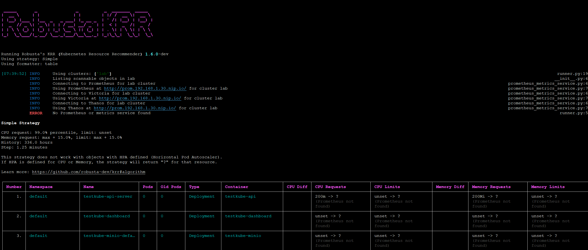<figcaption></figcaption></figure>

  * krr 會根據以下 label 找到 cluster 內部的 prometheus
    * app=kube-prometheus-stack-prometheus
    * app=prometheus,component=server
    * app=prometheus-server
    * app=prometheus-operator-prometheus
    * app=prometheus-msteams
    * app=rancher-monitoring-prometheus
    * app=prometheus-prometheus
  
  * krr 相關參數，包含要顯示的 namespace 或是資源 等等

    <figure>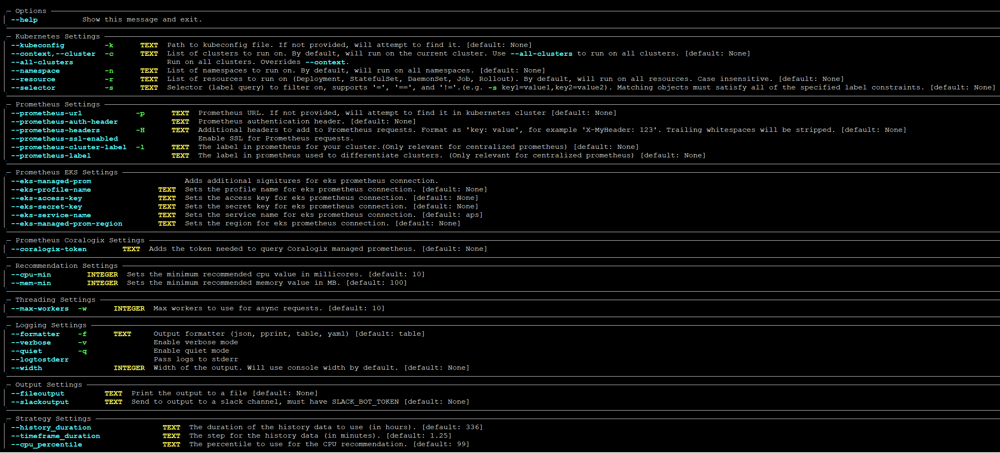<figcaption></figcaption></figure>

  * 如果 cluster 內的 prometheus 不是以上的label，可以透過 -p 指定 prometheus的 url
    ```
    krr simple --kubeconfig=/.kube/config -p http://10.43.62.167:9090
    ```

    <figure>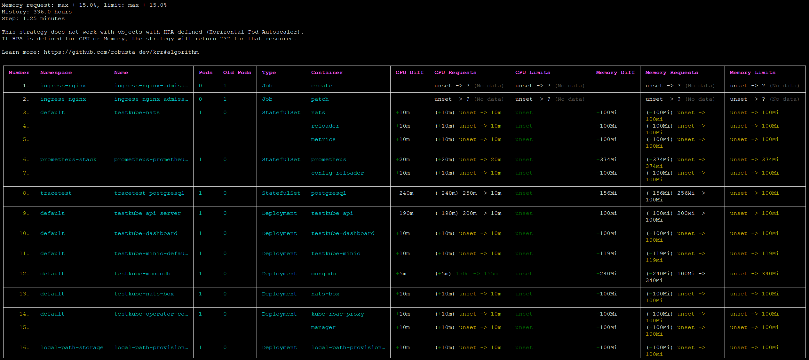<figcaption></figcaption></figure>
    
    在 CPU 和 Memory 的欄位，可以看到黃色的建議值，這是根據prometheus 的歷史資料算出的

    <figure>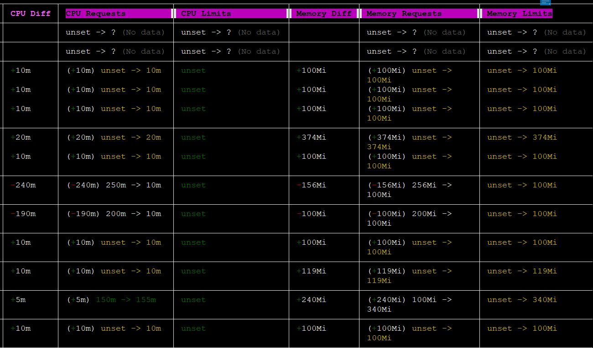<figcaption></figcaption></figure>

## 使用 Robusta UI 管理 Kubernetes

1. 使用docker 啟動 robusta cli，產生helm的values.yaml
    ```
    $ mkdir robusta
    $ cd robusta
    $ curl -fsSL -o robusta https://docs.robusta.dev/master/_static/robusta
    $ chmod +x robusta
    $ ./robusta gen-config --no-enable-prometheus-stack

    ```
    輸入 Y 和 slack 整合，會產生連接 slack的 URL

    <figure>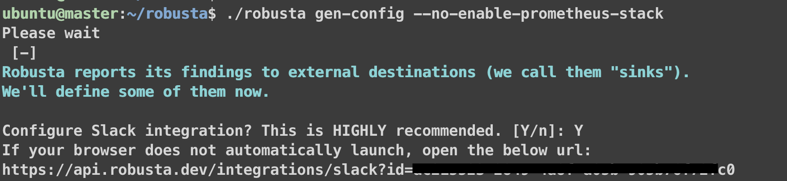<figcaption></figcaption></figure>

    


2. 打開瀏覽器，輸入上述顯示的網址，連接slack
    點選 Add to Slack

    <figure>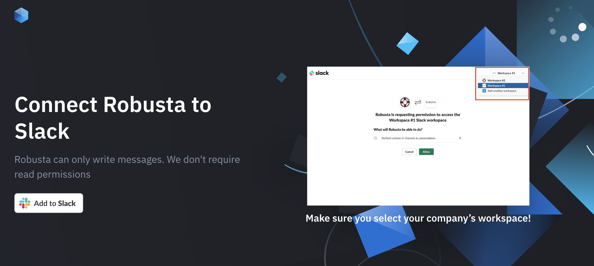<figcaption></figcaption></figure>
    
    點選Allow

    <figure>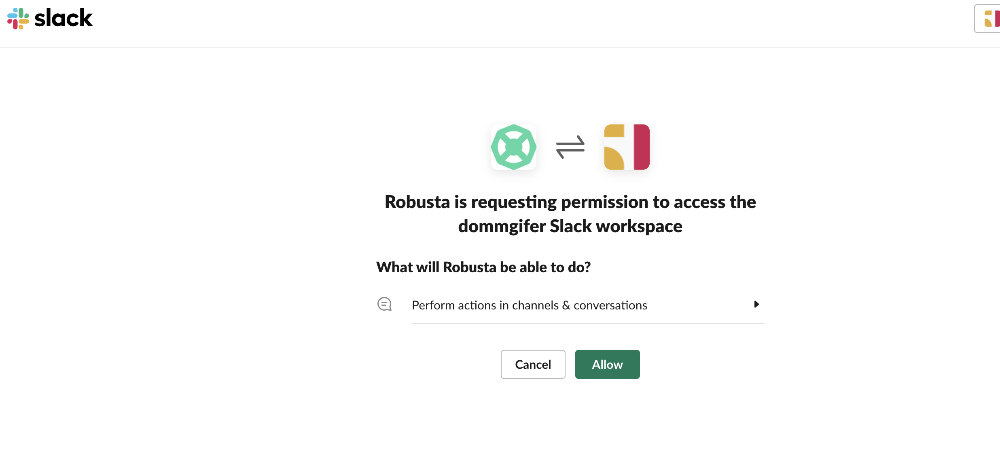<figcaption></figcaption></figure>
  
    完成，回到 terminal

    <figure>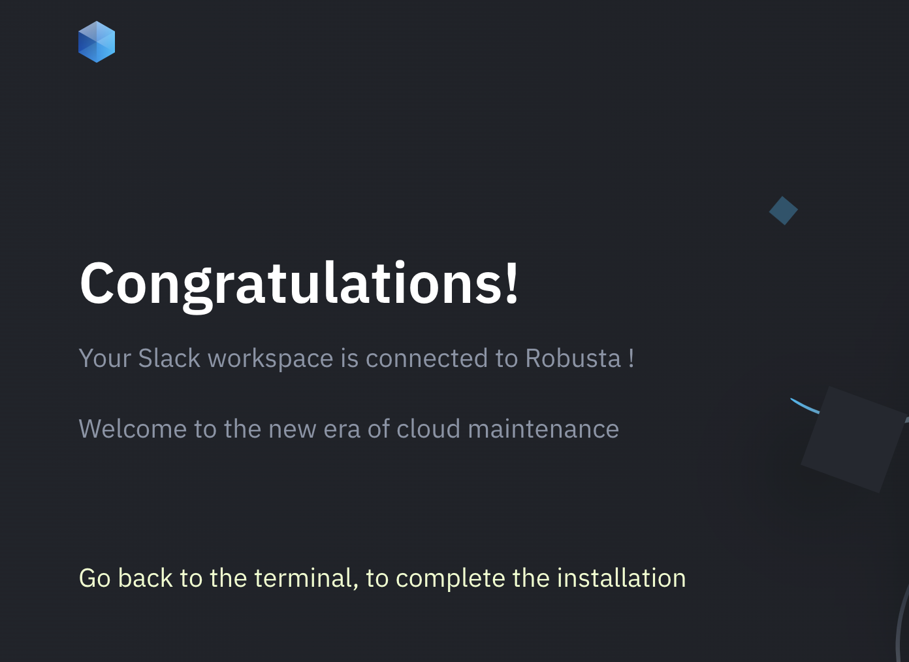<figcaption></figcaption></figure>


3. 繼續完成和 slack 相關的設定

    <figure>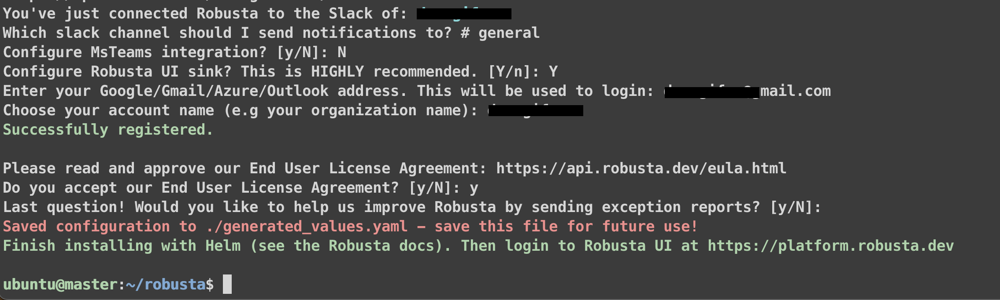<figcaption></figcaption></figure>

    產生 helm values.ymal，內容是和 slack 整合的資訊，也就是上面的回答
    
4. 透過 helm 安裝 Robusta
    ```
    $ helm repo add robusta https://robusta-charts.storage.googleapis.com && helm repo update
    $ kubectl create ns robusta
    $ helm install robusta robusta/robusta -f ./generated_values.yaml --namespace=robusta --set clusterName=lab

    NAME: robusta
    LAST DEPLOYED: Mon Jan 29 02:52:23 2024
    NAMESPACE: robusta
    STATUS: deployed
    REVISION: 1
    TEST SUITE: None
    NOTES:
    Thank you for installing Robusta 0.10.27

    As an open source project, we collect general usage statistics.
    This data is extremely limited and contains only general 
    .......

    Visit the web UI at: https://platform.robusta.dev/
    ```

5. 登入 UI，可以看到cluster 相關資料
   https://platform.robusta.dev/
   
   APP 狀態總覽&#x20;

    <figure>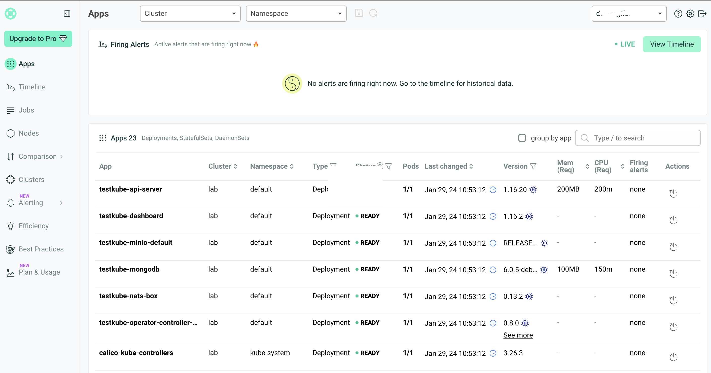<figcaption></figcaption></figure>

   單一 APP 狀態和監控&#x20;

    <figure>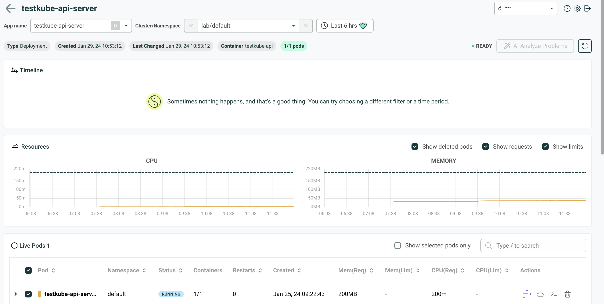<figcaption></figcaption></figure>

   
   節點狀況&#x20;

    <figure>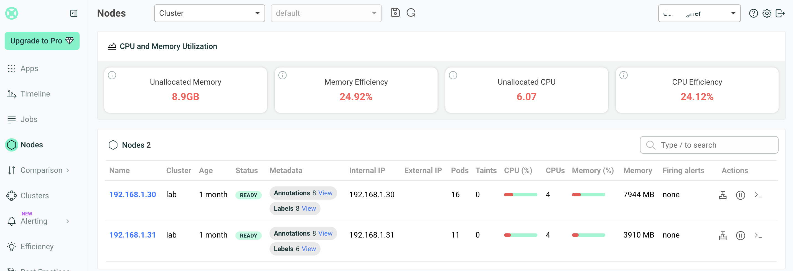<figcaption></figcaption></figure>

   單一節點狀況和監控&#x20;

    <figure>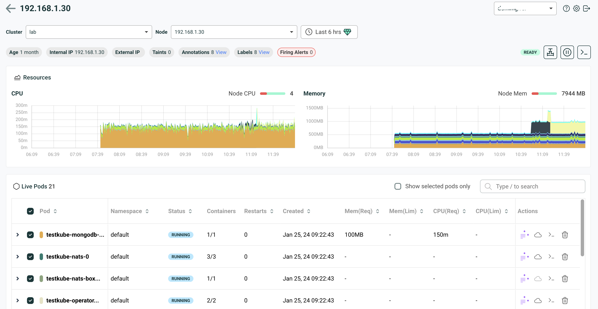<figcaption></figcaption></figure>

   比較不同的cluster 內的 APP 設定(如果有多個 cluster 連接到 robusta，右方紅恇處可以選擇另一作 cluster)&#x20;

    <figure>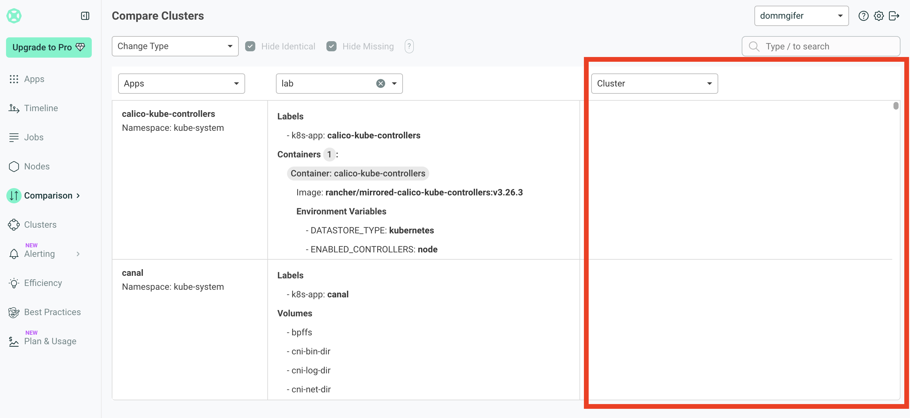<figcaption></figcaption></figure>

   查看 cluster 狀態&#x20;

    <figure>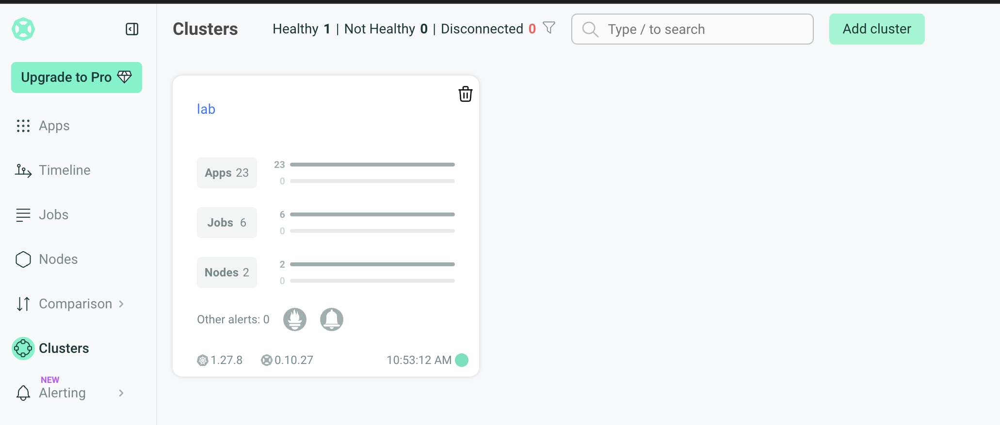<figcaption></figcaption></figure>

   目前 alert rule&#x20;

    <figure>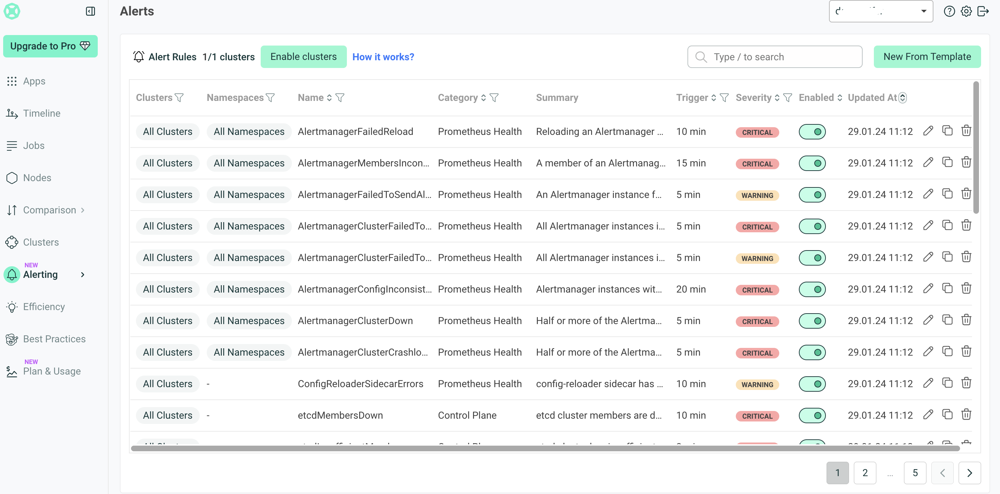<figcaption></figcaption></figure>

   提供promQL查詢監控值&#x20;

    <figure>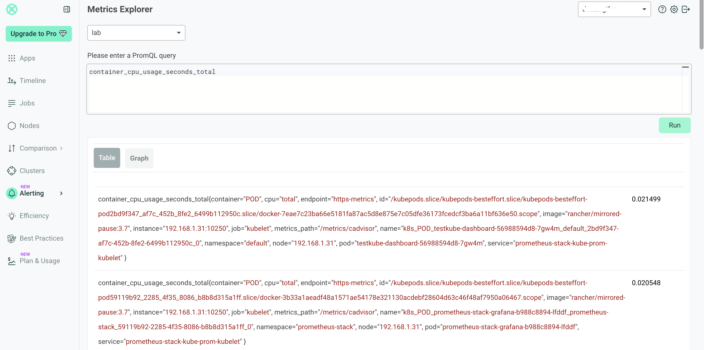<figcaption></figcaption></figure>

   資源調整建議值&#x20;

    <figure>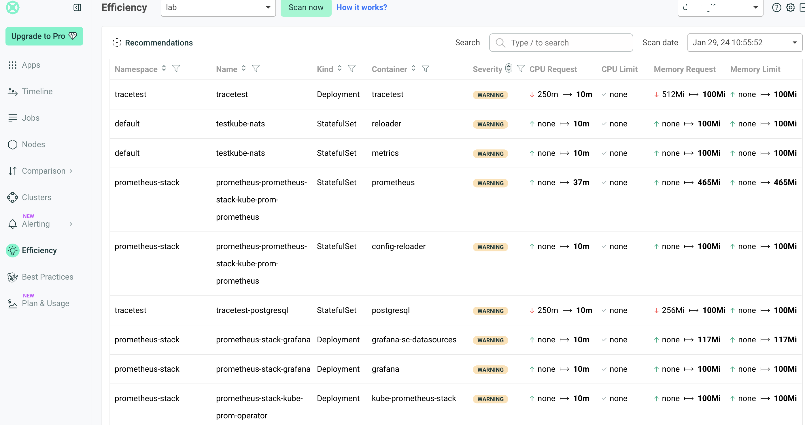<figcaption></figcaption></figure>

   服務設定檔檢查和建議&#x20;

    <figure>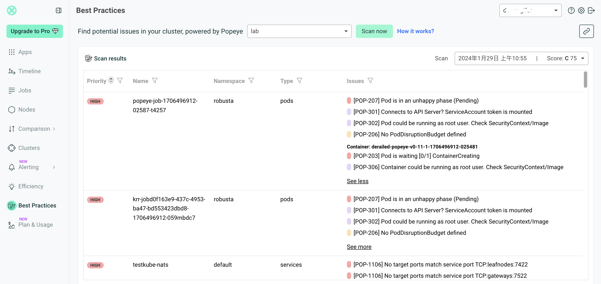<figcaption></figcaption></figure>

    <figure>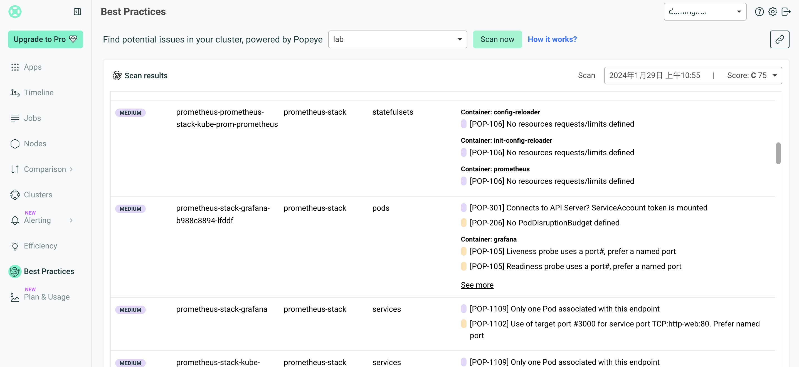<figcaption></figcaption></figure>

   AI 總結 Log&#x20;

    <figure>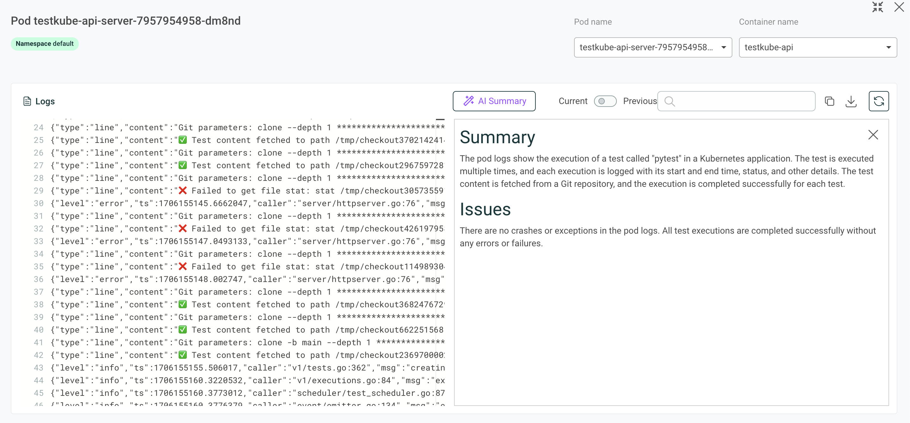<figcaption></figcaption></figure>


## 結論
Robusta KRR 提供了非 agent 的方式，只透過 cli 的方式連接現有的 prometheus，並根據歷史的使用數據，就可以計算出建議的資源調整，覺得還不錯，可以嘗試使用看看


Robusta UI 提供了管理 k8s 的 UI 介面，但是比較偏向資源監控的管理，像是監控告警，APP yaml 的設定檢查等等，不過需要埋入 agent