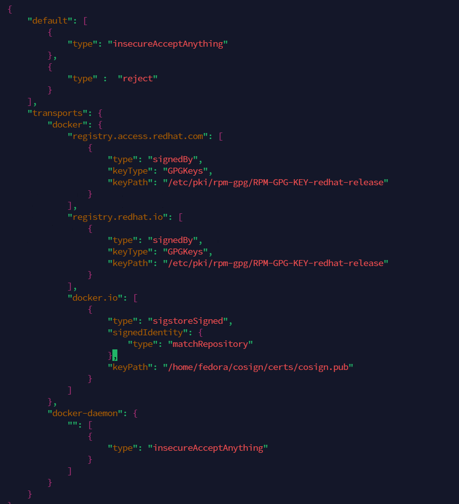
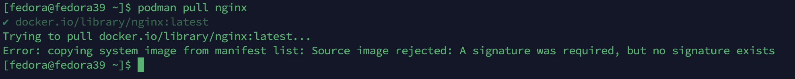
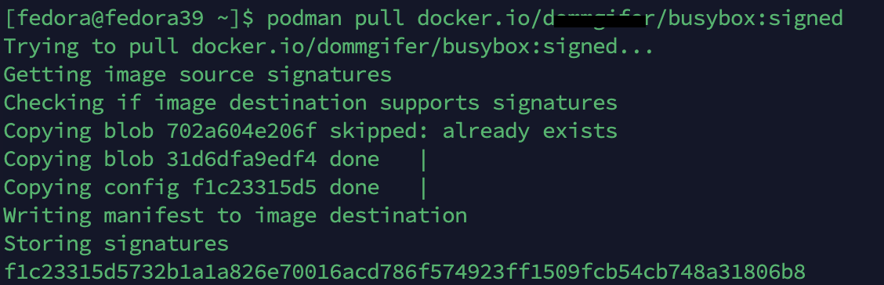
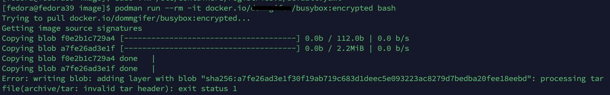
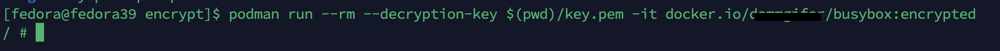
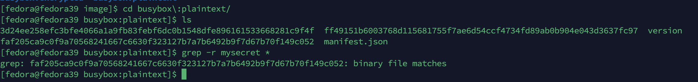
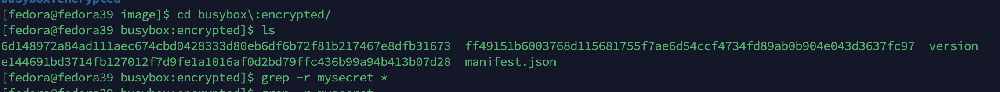

# Signed and Encrypted Container Images


本文轉寫時間為 2024年03月08日，內容可能會有變動，僅記錄


文章來源: https://itnext.io/securing-kubernetes-workloads-a-practical-approach-to-signed-and-encrypted-container-images-ff6e98b65bcd

文章內容主要在說明是

* 簽名容器image：通過實施加密簽名來確保映像的可信度，從而創建信任鏈。
* 加密容器image：增強容器化應用的安全性，並允許在public registry中使用敏感訊息或專有程式。


## 前置作業
* 安裝 podman 4.2 版本以上
* 請不要用 ubuntu ，因為安裝 podman 為 3.4.4版本
## 透過 podman 對 image 做簽名

1. Podman 支援使用 GPG 和共同簽署金鑰進行簽署，下載 cosign binary
```
$ wget https://github.com/sigstore/cosign/releases/download/v2.2.3/cosign-linux-amd64
$ chmod +x cosign-linux-amd64 
$ sudo mv cosign-linux-amd64 /usr/local/bin/cosign
```

2. 建立 cosign key pair
```
$ mkdir consign
$ cd consign/
$ mkdir certs
$ cd certs/
$ cosign generate-key-pair

Enter password for private key: 
Enter password for private key again: 
Private key written to cosign.key
Public key written to cosign.pub
```

3. 針對簽名的image，在 /etc/containers/registries.d/default.yaml 內的default-docker新增以下內容
```
$ sudo vim /etc/containers/registries.d/default.yaml

default-docker:
  use-sigstore-attachments: true
```

4. 建立一個檔案，儲存剛剛建立keypair的密碼，方便每次簽署時自動輸入，上面因為密碼是空的，所以下面密碼也是空的，請依照實際情況更換
```
$ echo ""> pass
```

5. 建立一個 測試用的 image，image repo名稱請換成自己的docker hub
```
$ cd ../
$ mkdir image
$ cd image
$  cat <<EOF > Dockerfile
FROM quay.io/bpradipt/busybox
RUN echo "my test image" > /image-description
EOF
$ podman build \
 -t docker.io/yourdockerrepo/busybox \
 -f Dockerfile .
 
STEP 1/2: FROM quay.io/bpradipt/busybox
Trying to pull quay.io/bpradipt/busybox:latest...
Getting image source signatures
Copying blob 92f5a971efb7 done  
Copying config a416a98b71 done  
Writing manifest to image destination
Storing signatures
STEP 2/2: RUN echo "my test image" > /image-description
COMMIT quay.io/bpradipt/busybox
--> c61cc83d51d
Successfully tagged quay.io/bpradipt/busybox:latest
c61cc83d51d3f04571a726a7b4105d845d1be29f7cd94b161373320c8e3130a0
```

6. 登入docker hub，建立簽名，推到docker hub
```
$ podman login docker.io
Username: 
Password:
Login Succeeded!

$ cd ..
$ podman push --sign-by-sigstore-private-key ./certs/cosign.key --sign-passphrase-file ./certs/pass docker.io/yourdockerrepo/busybox:signed

Getting image source signatures
Copying blob a21b8ccf031f done   | 
Copying blob 3d24ee258efc done   | 
Copying config f1c23315d5 done   | 
Writing manifest to image destination
Creating signature: Signing image using a sigstore signature
Storing signatures
```

7. 接下來驗證簽名，編輯 /etc/containers/policy.json，建立一個policy，使用public key 驗證從 docker hub 抓取的 image

<figure><figcaption></figcaption></figure>

8. 測試pull image 是否有驗證，下面測試 pull 官方的 nginx image 會被拒絕，因為官方的image 沒有使用我們的 key 簽名

    <figure><figcaption></figcaption></figure>
    
    pull 剛剛的簽名過的 image，可以成功
    <figure><figcaption></figcaption></figure>


## 在 Kubernetes 使用 podman 簽名的 image

1. kubernetes 建立 configmap，內容是上面的 policy.json
  ```
  $ kubectl create configmap --from-file=$(pwd)/policy.json policy-cm
  ```
2. kubernetes 建立 secret，內容是簽名的 public key
  ```
   $ kubectl create secret generic cosign-pub --from-file=$(pwd)/certs/cosign.pub
  ```
3. kubernetes 建立 configmap，內容是上面的 default.yaml
  ```
  $ kubectl create cm --from-file=$(pwd)/default.yaml reg-default-cm
  ```
4. 
5. 建立測試 pod，內容如下

  ```
  apiVersion: v1
kind: Pod
metadata:
 name: sign-pod
spec:
 initContainers:
  - name: copy-secret
    image: busybox:latest
    command: ['sh', '-c', 'cp /secrets/cosign.pub /certs/cosign.pub']
    volumeMounts:
    - name: secret-volume
      mountPath: /secrets
    - name: certs
      mountPath: /certs
 containers:
   - name: run-image
     image: quay.io/podman/stable
     command: ["sh", "-c"]
     args:
     -  podman run quay.io/bpradipt/busybox:signed sleep 1000000 
     securityContext:
       runAsUser: 1000      
       privileged: true
     volumeMounts:
     - name: certs
       mountPath: /certs
     - name: policy-cm
       mountPath: /etc/containers/policy.json
       subPath: policy.json
     - name: reg-cm
       mountPath: /etc/containers/registries.d/
 volumes:
 - name: certs
   emptyDir:
     medium: Memory
 - name: secret-volume
   secret:
     secretName: my-secret
 - name: policy-cm
   configMap:
     name: policy-cm
 - name: reg-cm
   configMap:
     name: reg-default-cm
  ```

這裡測試過後，確實可以驗證只有簽名 imgae 才可抓取，但是再詳細看這個實驗，會發現對於實際上的應用沒有什麼幫助，因為這個實驗只是把你在本機 podman 的環境設定，搬到container內，然後在container 執行 podman 指令拉 image，實務上不會這樣使用，應該搭配 kyverno 這樣的工具，來驗證 image 是否是簽名過


### 透過 podman 加密 image

1. 建立加密用的金鑰
```
$ mkdir encrypt
$ cd encrypt
$ openssl genrsa -out key.pem
$ openssl rsa -in key.pem -pubout -out pub.pem
```

2. 包 image，裡面有個 secret 檔案，放入機敏資料
```
$ mkdir image
$ cd image
$ cat <<EOF > Dockerfile
FROM quay.io/bpradipt/busybox
ADD ./secret /
EOF

$ echo "mysecret" > secret

$ podman build \
 -t docker.io/yourepo/busybox:plaintext \
 -f Dockerfile .
```

3. 加密 image ，並推到 docker hub，jwe 代表使用 JSON Web 加密，先指定要推的 image ，後面指定加密後的 image 名稱
 ```
 $ cd ..
 $ podman push \
--encryption-key jwe:$(pwd)/pub.pem docker.io/yourepo/busybox:plaintext docker.io/yourepo/busybox:encrypted
 ```
 
4. 拉取加密 image，沒有指定解密的金鑰，會發現拉取錯誤，無法解析 image
 ```
 $ podman run --rm -it docker.io/yourepo/busybox:encrypted
 ```
 <figure><figcaption></figcaption></figure>

5. 拉取加密 image，指定解密的金鑰，拉取成功並執行

    ```
     $ podman run --rm -it --decryption-key $(pwd)/key.pem docker.io/yourepo/busybox:encrypted
    ```
    <figure><figcaption></figcaption></figure>


6.  將 image 的 layer 層存放在資料夾，透過 grep 的指令，來查看看 是否可以從 layer 層找到 mysecret 的字串

    沒有加密的: 可以發現找了 mysecret 字串在某個layer
    ```
    $ podman push  docker.io/yourepo/busybox:plaintext dir:$HOME/image/busybox:plaintext
    $ cd $HOME/image/busybox\:plaintext
    $ grep -r mysecret *
    grep: faf205ca9c0f9a70568241667c6630f323127b7a7b6492b9f7d67b70f149c052: binary file matches
    ```

    <figure><figcaption></figcaption></figure>
    
    加密的: 找不到 mysecret 字串
     ```
    $ podman push  docker.io/yourepo/busybox:encrypted dir:$HOME/image/busybox:encrypted
    $ cd $HOME/image/busybox\:encrypted
    $ grep -r mysecret *
    ```
    <figure><figcaption></figcaption></figure>


7. 接下來文章的實作也是整個流程搬到 kubernetes pod 內的 podman ，實務上也不會這樣用，所以就不測試了，如果要在 k8s 內解密 image，可以從runtime 的設定下手