# Testkube 安裝及使用


本文轉寫時間為 2024年03月05日， 新版本內容已大幅變動，僅記錄


## 介紹
Testkube 是一個 Kubernetes 原生的測試框架，旨在簡化測試的執行和管理。它提供了一個統一的平台，讓開發人員和測試人員可以輕鬆地在 Kubernetes 環境中創建、執行和管理測試。Testkube 支援多種測試類型，包括單元測試、集成測試和端到端測試，並且可以與多種測試工具和框架集成，如 JUnit、K6、Postman 等。

# 離線安裝 testkube

1. 抓取 helm charts
    ```
    $ helm repo add kubeshop https://kubeshop.github.io/helm-charts
    $ helm repo update
    $ helm pull kubeshop/testkube
    ```

2. 解壓縮
   ```
   $ tar -xvf testkube-1.16.33.tgz
   ```
3. 進入 testkube 資料夾
   ```
   cd testkube
   ```
4. 編輯 values.yaml，以下說明僅基本該注意設定，請依實際情況做調整
  檢查所有需要的image，並從網路上抓取後放到私有 registry
  * global
      * global.imageRegistry: 填入私有 registry
      * 每個設定內的 .image.repository: 填入私有 registry 內的 repo 名稱
  * mongodb:
      * **mongodb.persistence.storageClass**: 給定storageclass，讓mongodb 可以資料儲存在volume，如果沒有這項目，請自行加入
      * **mongodb.image.repository**: 指定 image
      * **mongodb.image.tag**: 指定 tag
  
  * nats:
      * **nats.container.image.repository**: 指定 image ，這裡不會吃到上面的  **global.imageRegistry**，請填入完整名稱 ex: self-registery/repo/image，如果沒有這項目，請自行加入
       * **nats.nats.image.tag**: 填入 tag，如果沒有這項目，請自行加入
       * **nats.natsBox.container.image.repository**: 指定 image ，這裡不會吃到上面的  **global.imageRegistry**，請填入完整名稱 ex: self-registery/repo/image，如果沒有這項目，請自行加入
       * **nats.natsBox.container.image.tag**: 指定 tag
       * **nats.reloader.image.repository**: 同上
       * **nats.reloader.tag**: 同上

  * testkube-api
      * **testkube-api.image.repository**: 指定 image
      * **testkube-api.image.tag**: 指定 tag
      * **testkube-api.minio.enabled**: 是否安裝minio，儲存測試報告用的，如果填 true，請再根據下方的設定調整，如果minio已經安裝了，可以填 false，然後要指定已存在的minio，請看下方
      * **testkube-api.storage.endpoint**: 已存在的minio位置
      * **testkube-api.storage.endpoint_port**: 已存在的minio port號
      * **testkube-api.storage.accessKeyId**: 已存在的minio accesskey
      * **testkube-api.storage.accessKey**:  已存在的minio secretPasswordKey
      * **testkube-api.uiIngress.enabled**: 如果要使用 ingress(透過 domain 存取 api)，填 true
      * **testkube-api.uiIngress.path**: 改為 /
      * **testkube-api.uiIngress.hosts** : 填入domain
      * **testkube-api.uiIngress.tlsenabled**: 如果要啟用 tls ，填true
      * **testkube-api.uiIngress.tls**: 填入domain，請按照檔案內註解的格式填入
      * **testkube-api.resources.requests.cpu**: 設定 cpu request
      * **testkube-api.resources.requests.memory**: 設定 memory request
      * **testkube-api.resources.limits.cpu**: 設定 cpu limit
      * **testkube-api.resources.limits.memory**: 設定 memory limit
      * **testkube-api.testConnection.enabled**: 填入false
  * testkube-dashboard
      * **testkube-dashboard.enabled**: 啟用dashabord
      * **testkube-dashboard.image.repository**: 指定 image
      * **testkube-dashboard.image.tag**: 指定 tag
      * **testkube-dashboard.ingress.path** : 為 /
      * **testkube-dashboard.ingress.hosts** :填入domain
      * **testkube-dashboard.ingress.tlsenabled** :如果要啟用 tls ，填true
      * **testkube-dashboard.ingress.tls** :填入domain，請按照檔案內註解的格式填入
      * **testkube-dashboard.apiServerEndpoint**: 填入 testkube-api url，如果 api 有啟用 ingress，請填入domain
      * **testkube-dashboard.testConnection.enabled**: 填入false
      * **testkube-dashboard.resources**: 同上面 不多做說明
  * testkube-operator
      * **testkube-operator.enabled**: 啟用operator
      * **testkube-operator.image**: 同上面 不多做說明
      * **testkube-operator.proxy.image**: 同上面 不多做說明
      * **testkube-operator.resources**: 同上面 不多做說明
      * **testkube-operator.webhook.image**: 同上面 不多做說明
      * **testkube-operator.patch.image**: 同上面 不多做說明
      * **testkube-operator.testConnection.enabled**: 填入false
      * **testkube-operator.preUpgrade.image**: 同上面 不多做說明
5. 下載所需 image，並推到私有 registry， image 的清單在 
**charts/testkube-api/executors.json** 的內容

6. 更改所需 image 為私有 registry
   修改 **charts/testkube-api/executors.json** 內容，將所有 image 內容改為私有的repo，ex:
   ```
   "image": "kubeshop/testkube-jmeter-execurtor:1.16.29"
   ```
   改為
   ```
   "image": "私有repo名稱/testkube-jmeter-execurtor:1.16.29"
   ```

7. 安裝 testkube
    ```
    $ helm install testkube . --namespace testkube -f values.yaml
    
    NAME: testkube
    LAST DEPLOYED: Sat Feb 17 08:03:41 2024
    NAMESPACE: testkube
    STATUS: deployed
    REVISION: 1
    NOTES:
    Enjoy testing with Testkube!
    ```
6. 輸入testkube dashboard url，可看到登入畫面&#x20;

    <figure>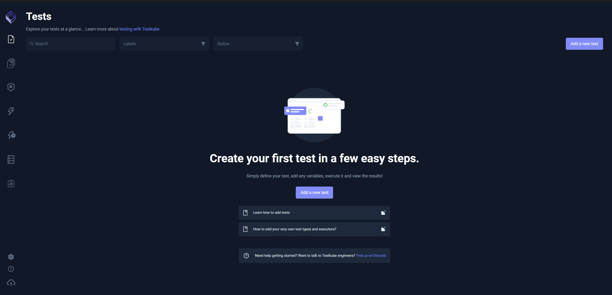<figcaption></figcaption></figure>
    
    

# 使用範例
## 執行官方預設 Executor - postman 

1. 準備好 postman 的collection 檔案
2. 建立新的 test
   * type: postman/collection
   * Source: 可選擇 Git、File 和 String
   * Labels: 為此測試加上 labels

   <figure>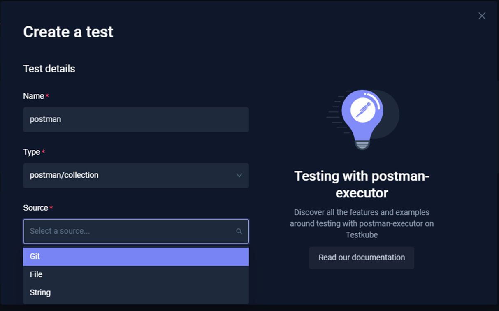<figcaption></figcaption></figure>
3. 此範例使用 file，內容是呼叫 testkube.demo 的api

    <figure>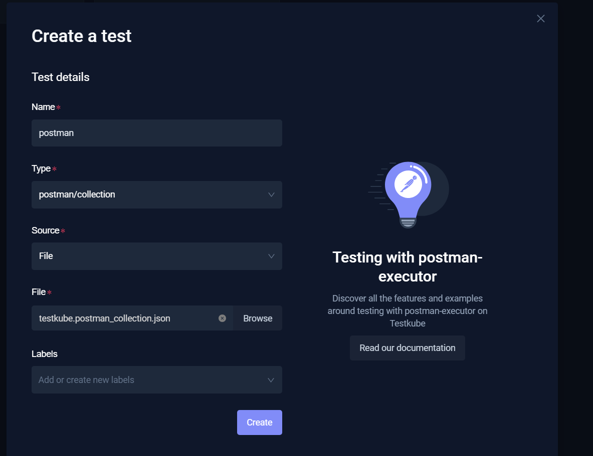<figcaption></figcaption></figure>
    以下是內容
    ```
        {
        "info": {
            "_postman_id": "7ff3406b-44ae-40cf-b7ac-8b03a8c0bda4",
            "name": "testkube",
            "schema": "https://schema.getpostman.com/json/collection/v2.1.0/collection.json",
            "_exporter_id": "661928"
        },
        "item": [
            {
                "name": "https://demo.testkube.io/results/v1/config",
                "request": {
                    "method": "GET",
                    "header": [],
                    "url": {
                        "raw": "https://{{url}}/results/v1/config",
                        "protocol": "https",
                        "host": [
                            "{{url}}"
                        ],
                        "path": [
                            "results",
                            "v1",
                            "config"
                        ]
                    }
                },
                "response": []
            }
        ]
    }
    ```

4. 建立後，到 settings 內的 Variables & Secrets，可以新增變數，變數類型有
    * Basic: 可以直接看到變數
    * Secret: 變數會隱藏
　
   此範例我的 postman collection檔內有個 url 的變數

  <figure>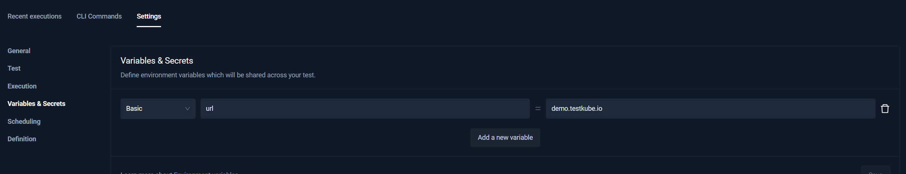<figcaption></figcaption></figure>
  下方的 Arguments 可以指定 postman 的執行參數，**postman 如果呼叫的 api 的SSL憑證是自簽的話，需要加上 --insecure**

  <figure>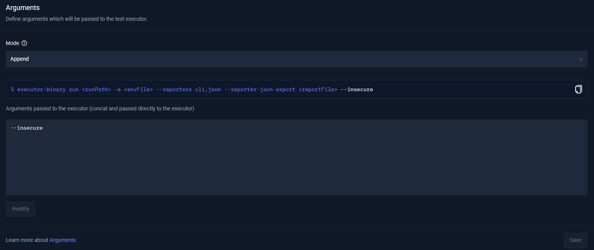<figcaption></figcaption></figure>


5. 右上角按下 run now 執行測試，可以看到測試已執行

   <figure>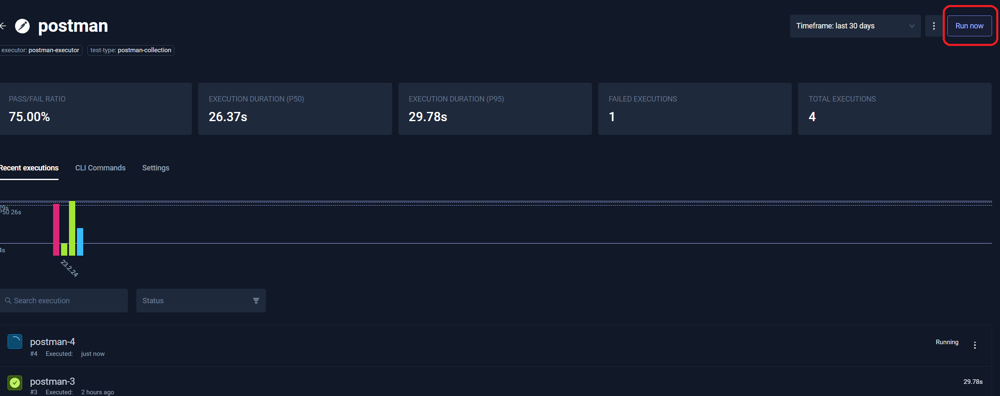<figcaption></figcaption></figure>
   點進去可以看到該次執行的 log


   <figure>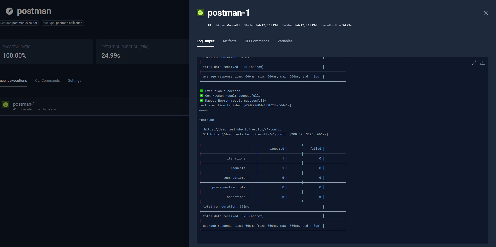<figcaption></figcaption></figure>

## 執行官方預設 Executor - jmeter  
1. 準備好 jmeter 的 jmx 檔案
2. 建立新的 test
   * type: jmeter/test
   * Source: 可選擇 Git、File 和 String
   * Labels: 為此測試加上 labels

   <figure>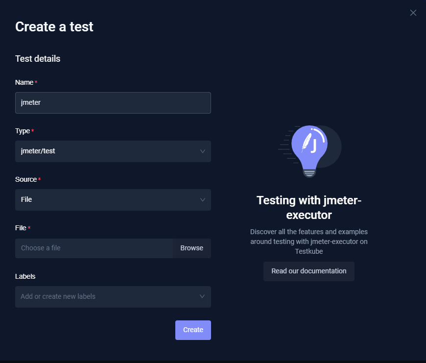<figcaption></figcaption></figure>

3. 此範例是會呼叫一個的 helloworld api

   <figure>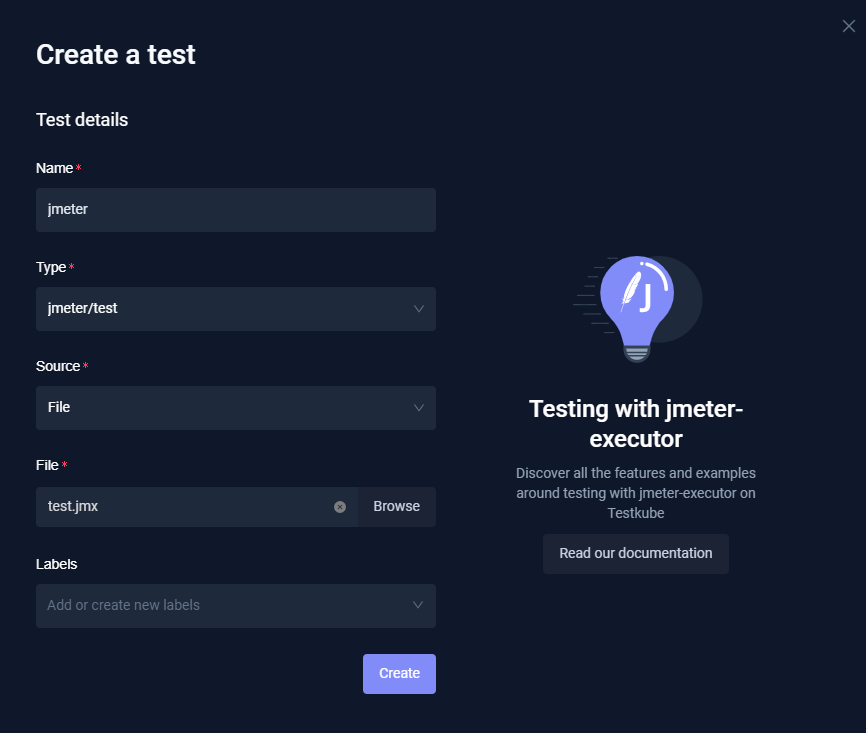<figcaption></figcaption></figure>
   
4. 建立後，到 settings 內的 Variables & Secrets，可以新增變數，根據你的 jmx 設計，填入所需的環境變數，變數類型有
　　* Basic: 可以直接看到變數
　　* Secret: 變數會隱藏

   <figure>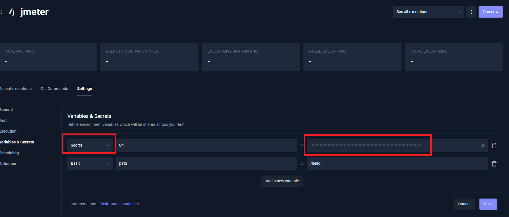<figcaption></figcaption></figure>
   下方的 Arguments 可以指定 jmeter 的執行參數

   <figure>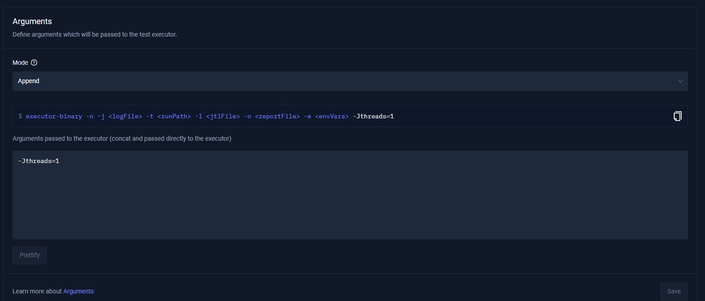<figcaption></figcaption></figure>

5. 右上角按下 run now 執行測試，可以看到測試已執行

   <figure>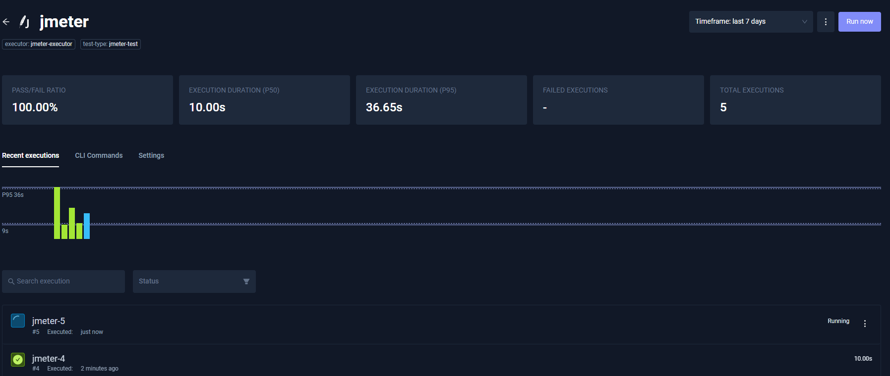<figcaption></figcaption></figure>
   點進去可以看到該次執行的 log

   <figure>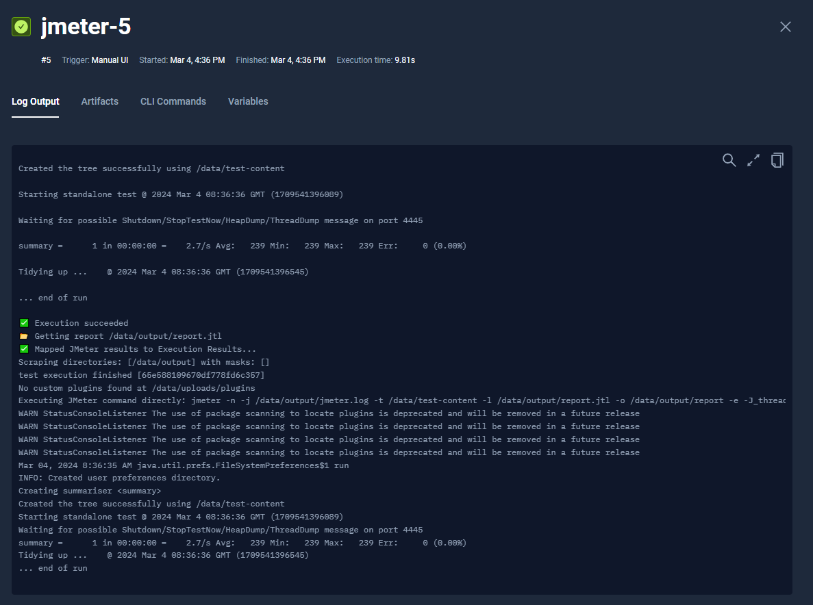<figcaption></figcaption></figure>

6. 選到 Artifacts ，可以下載 jmeter 報告

   <figure>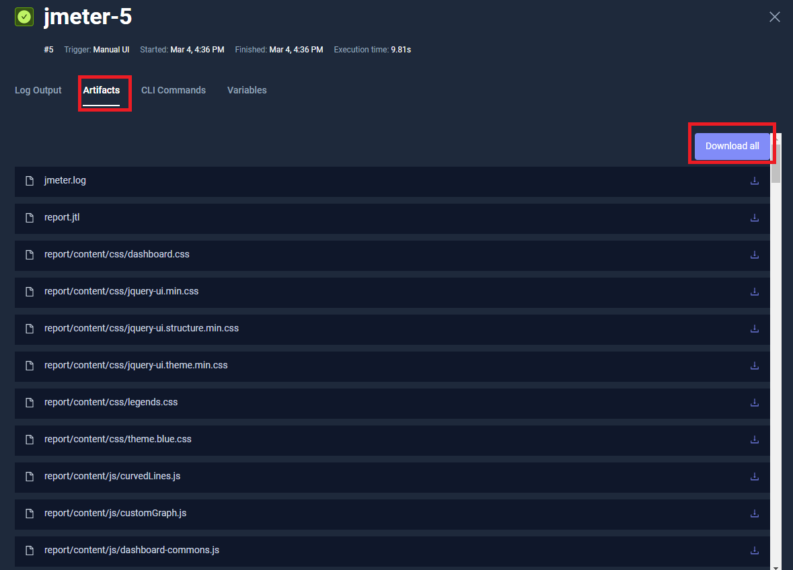<figcaption></figcaption></figure>


## 建立客製化 Executor
[官方說明](https://docs.testkube.io/test-types/container-executor/)

請先準備好客製化的測試 image

1. 左側選擇 Executor -> custom executor ，建立 executor

    <figure>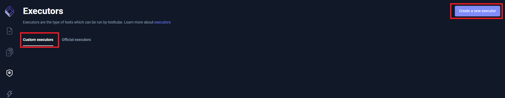<figcaption></figcaption></figure>

2. 輸入名稱，類型以及 image

    <figure>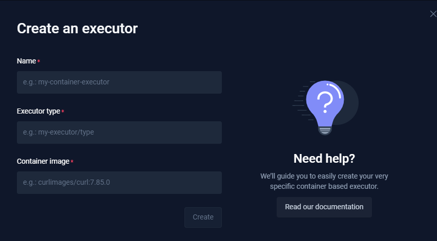<figcaption></figcaption></figure>
    建立後，可以點選進入，設定其他項目

    <figure>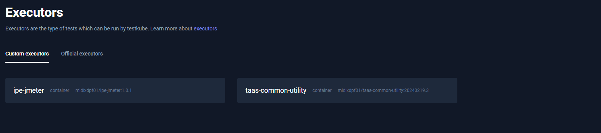<figcaption></figcaption></figure>

3. 如果此 executor 類型的測試會產生報告，請在 definition 加入 features.artifacts

    <figure>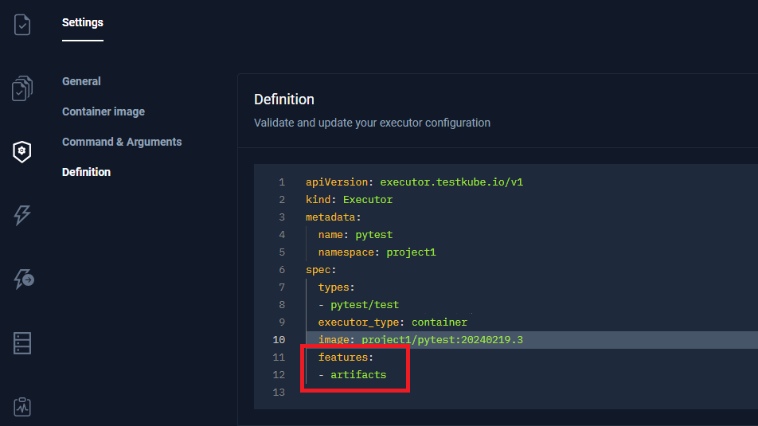<figcaption></figcaption></figure>


## 執行客製化 Executor - pytest
```
apiVersion: executor.testkube.io/v1
kind: Executor
metadata:
  name: container-executor-pytest
  namespace: testkube
spec:
  image: pytest-executor:latest
  executor_type: container
  types:
  - container-executor-pytest/test
```

