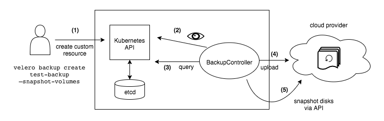
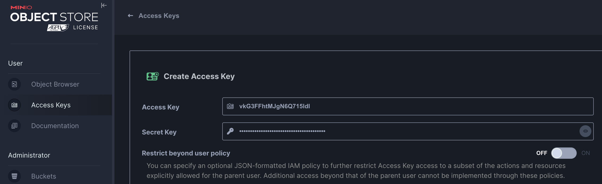
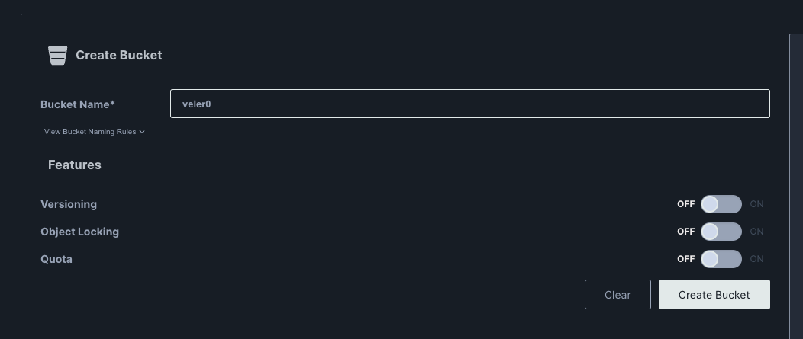
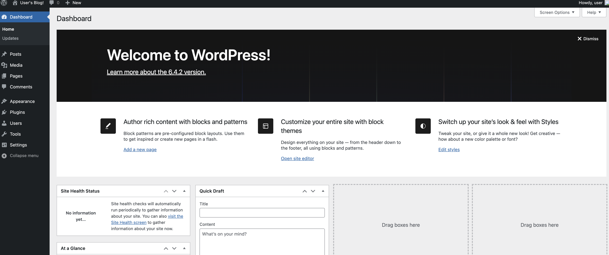
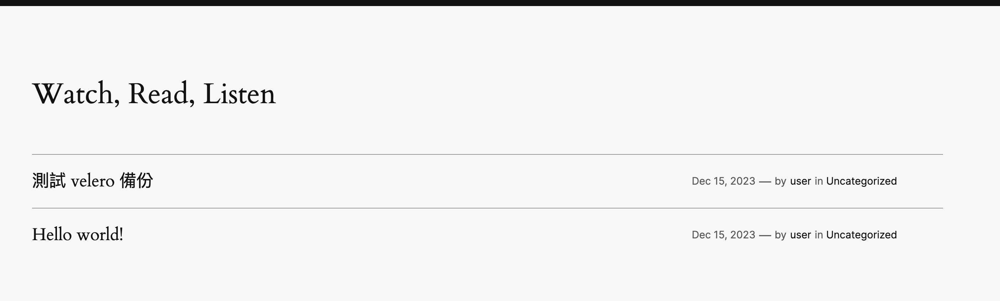
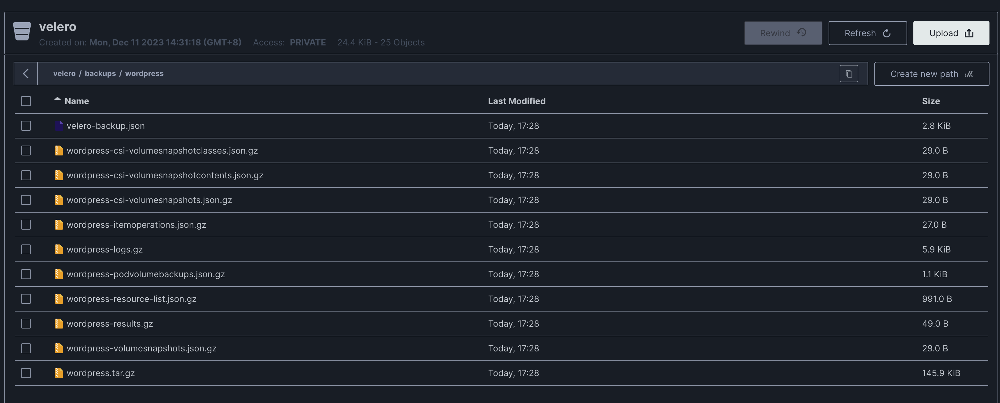
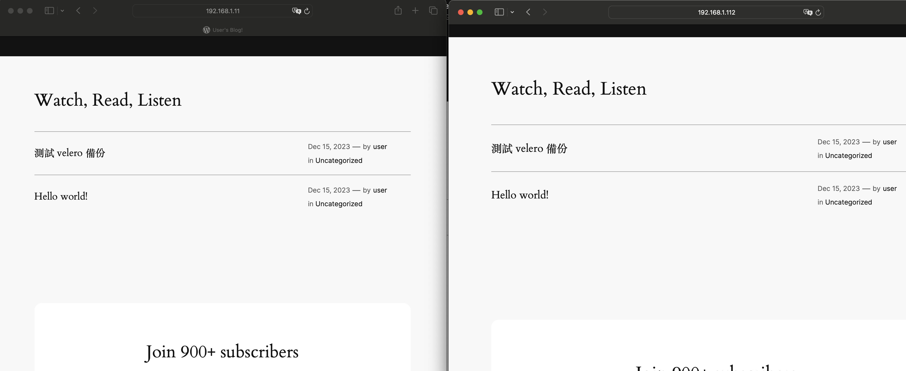

# Velero 備份 Kubernetes namespace


本文轉寫時間為 2023年12月15日，內容可能會有變動，僅記錄


## Velero 架構圖

<figure><figcaption></figcaption></figure>

Velero（前身為Heptio Ark）為您提供備份和還原Kubernetes集群資源和持久性卷的工具。您可以在雲端提供商或本地運行Velero。Velero讓您可以：

1. 備份集群，並在發生損失時進行還原。
2. 遷移集群資源到其他集群。
3. 將生產集群複製到開發和測試集群。
## 前置準備
  * 準備好 2座 Kubernetes
## 步驟
1. 啟動 minio server
    ```
    docker run -p 9000:9000 -p 9001:9001 -d -v $PWD/data:/data quay.io/minio/minio server /data --console-address ":9001"
    ```
2. 進入 minio 頁面，建立 access key 和 secret access key&#x20;

   <figure><figcaption></figcaption></figure>

3. 建立 Bucket&#x20;

   <figure><figcaption></figcaption></figure>

4. 建立 minio credentials 檔案
    ```
    [default]
    aws_access_key_id=<accessKey>
    aws_secret_access_key=<secretKey>
    ```

5. 下載 velero cli至兩座 kubernetes
    ```
    wget https://github.com/vmware-tanzu/velero/releases/download/v1.12.2/velero-v1.12.2-linux-amd64.tar.gz

    tar -xvf velero-v1.12.2-linux-amd64.tar.gz
    ```

6. 兩座 kubernetes 都透過 velero cli  安裝 velero服務
    ```
    velero install \
    --provider aws \
    --plugins velero/velero-plugin-for-aws:v1.8.2 \
    --bucket velero \
    --secret-file ./cred-minio \
    --uploader-type=restic \
    --backup-location-config region=minio,s3ForcePathStyle="true",s3Url=http://192.168.1.91:9000 \
    --use-volume-snapshots=false \
    --default-volumes-to-restic
    ```

7. 安裝CSI，這裡使用 csi-driver-host-path 測試
    ```
    git clone https://github.com/kubernetes-csi/csi-driver-host-path.git
    ./csi-driver-host-path/deploy/kubernetes-latest/deploy.sh
    kubectl apply -f csi-driver-host-path/examples/csi-storageclass.yaml
    ```

8. 檢查 storageclass
    ```
    kubectl get sc
    NAME              PROVISIONER             RECLAIMPOLICY   VOLUMEBINDINGMODE      ALLOWVOLUMEEXPANSION   AGE
    csi-hostpath-sc   hostpath.csi.k8s.io     Delete          Immediate              true                   27m
    ```

9. 建立要備份的範例，這裡用wordpress
    ```
    helm repo add bitnami https://charts.bitnami.com/bitnami
    helm install wordpress bitnami/wordpress \
      --namespace wordpress \
      --set mariadb.primary.persistence.storageClass=csi-hostpath-sc \
      --set mariadb.auth.rootPassword=openstack \
      --set mariadb.auth.password=openstack \
      --set persistence.storageClass=csi-hostpath-sc
    ```

10. 取得 wordpress 密碼和admin 網址
    ```
    echo "WordPress URL: http://$SERVICE_IP/"
    echo "WordPress Admin URL: http://$SERVICE_IP/admin"

    echo Username: user
    echo Password: $(kubectl get secret --namespace wordpress wordpress -o jsonpath="{.data.wordpress-password}" | base64 -d)
    ```

11. 登入 wordpress，建立一個post

<figure><figcaption></figcaption></figure>

<figure><figcaption></figcaption></figure>


12. 使用velero 備份 wordpress namespace，並查看備份結果
    ```
    velero backup create wordpress --include-namespaces wordpress --default-volumes-to-fs-backup

    velero get backup
    NAME              STATUS      ERRORS   WARNINGS   CREATED                         EXPIRES   STORAGE LOCATION   SELECTOR
    wordpress         Completed   0        0          2023-12-15 09:27:51 +0000 UTC   29d       default            <none>
    ```
    
13. 到minio bucket 頁面可以看到 備份的內容

<figure><figcaption></figcaption></figure>


14. 到另一座 k8s，回復 wordpress，--preserve-nodeports 是復原一樣的 nodeport 號
    ```
    $ velero restore create --from-backup wordpress --preserve-nodeports

    Restore request "wordpress-20231215094032" submitted successfully.
    Run `velero restore describe wordpress-20231215094032` or `velero restore logs wordpress-20231215094032` for more details.
    ```

15. 查看restore 細節，看到有 24個項目要restore
    ```
    velero restore describe wordpress-20231215094032

    Name:         wordpress-20231215094032
    Namespace:    velero
    Labels:       <none>
    Annotations:  <none>

    Phase:                       Completed
    Total items to be restored:  24
    Items restored:              24

    Started:    2023-12-15 09:40:32 +0000 UTC
    Completed:  2023-12-15 09:41:47 +0000 UTC

    Warnings:
      Velero:     <none>
      Cluster:    <none>
      Namespaces:
        wordpress:  could not restore, ConfigMap "kube-root-ca.crt" already exists. Warning: the in-cluster version is different than the backed-up version

    Backup:  wordpress
    ```

15. 查看 wordpress 是否正常運作
    ```
    $kubectl get pod -n wordpress
    NAME                         READY   STATUS    RESTARTS      AGE
    wordpress-6c9788449c-mnbkn   1/1     Running   1 (48s ago)   2m23s
    wordpress-mariadb-0          1/1     Running   0             2m23s
    ```

16. 查看被復原的wordpress，是否資料也復原成功
    左邊是原始的 k8s cluster 的 wordpress，右邊是復原wordpress 的 k8s cluster，可以看到資料是完整被復原的 

    <figure><figcaption></figcaption></figure>
