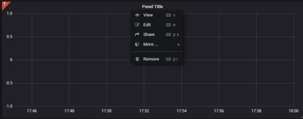

# Grafana 安裝及使用

### 安裝 <a id="&#x5B89;&#x88DD;"></a>

* Download package and install:

  ```text
  # wget https://s3-us-west-2.amazonaws.com/grafana-releases/release/grafana_5.1.0_amd64.deb
  # sudo apt-get install -y adduser libfontconfig
  # sudo dpkg -i grafana_5.1.0_amd64.deb
  ```

* Start Grafana by running:

  ```text
  # sudo service grafana-server start
  ```

* To configure the Grafana server to start at boot time:

  ```text
  # sudo update-rc.d grafana-server defaults
  ```

* Create database for grafana:

  ```text
  # mysql -u root -p
  ```

* Create the grafana database:

  ```text
  # CREATE DATABASE grafana ;
  ```

* Grant proper access to the grafana database:

  ```text
  GRANT ALL PRIVILEGES ON grafana.* TO 'novaadmin'@'localhost' IDENTIFIED BY 'openstack';
  GRANT ALL PRIVILEGES ON grafana.* TO 'novaadmin'@'%' IDENTIFIED BY 'openstack';
  ```

* Edit /etc/grafana/grafana.ini file:

  ```text
  [database]
  type = mysql
  host = 10.50.2.10:3306
  name = grafana
  user = novaadmin
  password = openstack
  ```

* Service restart

  ```text
  # service grafana-server restart
  ```

* Configure **keystone.conf** and **gnocchi.conf**

  ```text
  [cors]
  allowed_origin = http://10.50.2.10:3000
  ```

* Service restart

  ```text
  # service apache2 restart
  # service gnocchi-metricd restart
  ```

* Installation gnocchi-datasource via grafana.net

  ```text
  sudo grafana-cli plugins install gnocchixyz-gnocchi-datasource
  ```

* Restart Grafana by running:

  ```text
  # service grafana-server restart
  ```

* Access grafana dashboard:

  ```text
  # http://grafana_host:3000
  ```

Dashboard 帳密皆admin


登入後點選 create data source後，Type選擇gnocchi，之後設定依照下圖:  
[](http://10.50.0.12/wiki/lib/exe/detail.php?id=project%3Aopenstack%3Aopentack_auto_scaling%3Agrafana&media=project:openstack:opentack_auto_scaling:grafana_gnocchi.jpg)


設定完後，至左邊工具列點選 create→dashboard，選擇圖表類型，這裡使用Graph  
[](http://10.50.0.12/wiki/lib/exe/detail.php?id=project%3Aopenstack%3Aopentack_auto_scaling%3Agrafana&media=project:openstack:opentack_auto_scaling:grafana_add.jpg)


新增後，點選上方Panel Title→ edit  
[](http://10.50.0.12/wiki/lib/exe/detail.php?id=project%3Aopenstack%3Aopentack_auto_scaling%3Agrafana&media=project:openstack:opentack_auto_scaling:grafana_edit.jpg)



根據下圖設定，**query的original**_**resource**_**id為VM的ID**，**Metric name為要監測項目**，  
**Aggregator為顯示值得方式\(平均、最大等等\)**，**Granularity為間隔時間**，**Label為圖表上摺線的名稱**，紅框處還可以設定更多，不贅述，下圖為VM的cpu使用率圖表:


最後新增完後的總覽:


為了使用方便，可以直接 import 別人寫好的 dasboard，[可以在 grafana 官網搜尋](https://grafana.com/dashboards?dataSource=gnocchixyz-gnocchi-datasource&panelType=graph&search=openstack)，以下是我從官網找到的 **Openstack-Gnocchi instance metrics**，並修改監測 memory 參數後的 dashboard，[複製連結內的 json，點選 import 後，貼上 json，並選擇 load](https://github.com/dommgifer/config/blob/master/openstack-gnocchi-instance-metrics_rev1.json)。


選擇 datasource 為 gnocchi

import dashboard 完成，可以從紅框處選擇要查看的 VM


