# Apple Container


本文轉寫時間為 2025年06月27日，內容可能會有變動，僅記錄


## 專案介紹：Containerization

這是 Apple 開源的一個完整容器執行系統，特色在於「每個容器就是一個 VM」的架構（VM-per-container）。也就是說，每一個 Linux 容器不再共用一個主機，而是自己跑在一個獨立、輕量的虛擬機上。這讓你在 macOS 上跑容器時，有更強的隔離性與彈性。

它提供的功能包含：

* **OCI 映像管理**：支援拉取、推送遠端容器映像。
* **EXT4 檔案系統生成**：幫容器產出一個真正的 EXT4 根檔案系統。
* **VM 管理**：透過 macOS 的 Virtualization.framework 來創建、控制 VM。
* **容器進程執行**：在虛擬環境中啟動並管理 container process。

---

## 為什麼要做這個？

Apple 這個專案的核心目標，是讓 macOS 上的容器環境更接近原生 Linux，同時又保有安全性和效能。

具體來說：

* **啟動超快**：經過調整的 Linux kernel + 最小 rootfs，啟動幾乎是秒開。Kernel 使用說明（簡化版）
* **安全性更高**：不像傳統容器共用 host kernel，這邊每個容器都有獨立 VM，隔離性明顯更強。
* **網路簡化**：每個容器都有自己的 IP，不用再搞一堆 port mapping。
* **跨架構支援**：Apple Silicon 上也能跑 x86\_64 容器，靠 Rosetta 2 轉譯，幾乎無痛。

>[!NOTE]
>Apple Container 專案預設是使用 Kata Containers 提供的容器專用 kernel（vmlinux.container），這顆 kernel 已內建 VIRTIO 驅動、啟動快又相容性高。可以直接從 Kata Containers 的 release 下載使用

---

## 解決什麼痛點？

這個系統主要針對 macOS 開發者在跑 Linux container 時會遇到的幾個痛點做了解法：

* **安全隔離不足？** → 每個 container 都是獨立 VM，不再共用 host kernel。
* **效能差？** → 啟動只需亞秒級，靠的是輕量 VM 和特製 init (`vminitd`)。
* **Apple Silicon 無法跑 x86 映像？** → Rosetta 2 讓你能無縫跑 linux/amd64 容器。
* **網路設定太複雜？** → 容器自己就有 IP，不用再設 `-p` port mapping，那些可以通通省略。

---

# 安裝 contaienr CLI

1. [下載cli](https://github.com/apple/container/releases/tag/0.1.0)，透過點擊安裝包安裝
2. 啟動服務

    ```bash
    container system start
    ```

    <figure>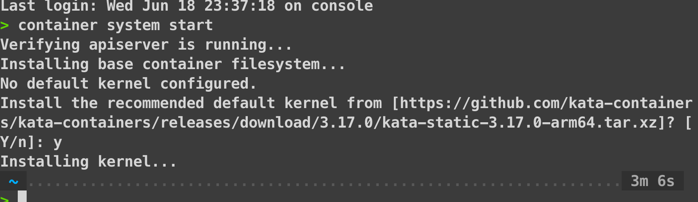<figcaption></figcaption></figure>

# 使用 container

1. 透過 `container ls` 確認指令正常

<figure>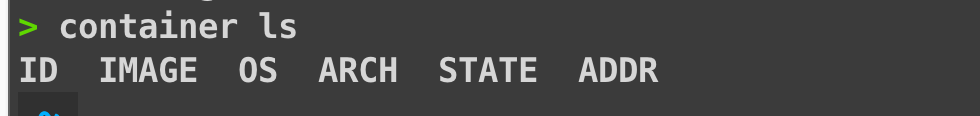<figcaption></figcaption></figure>

1. 透過 `container --help` 查看可用指令，基本上跟一般的容器指令差不多

<figure>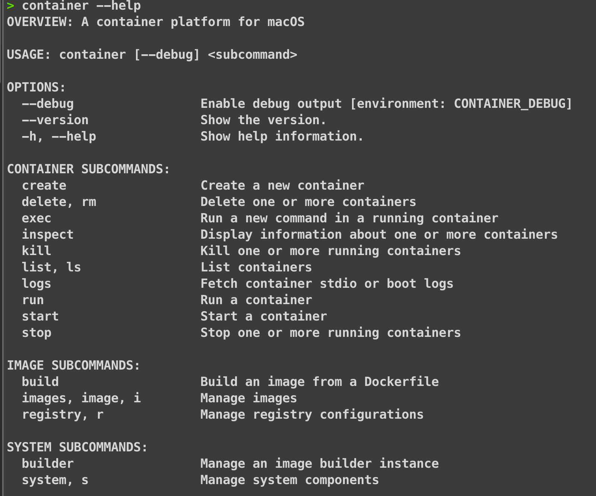<figcaption></figcaption></figure>

## 設定 local DNS domain (可選)

 **「local DNS domain（本機 DNS 網域）」**
   可以設定一個domain `*.lab` 的固定後綴，所有以 `.lab` 為結尾的本機名稱都會透過這個 DNS 解析。不需要再去修改 `/etc/hosts` 去做domain 和 IP 對應。

1. `sudo container system dns create lab`

   * 這條命令會啟用 Container 的內建 DNS 服務，並註冊一個域名後綴 `lab`。
   * 在 macOS 上，安裝後這會在系統裡放一個解析設定（通常是 `/etc/resolver/lab`），告訴系統：只要查 `*.lab` 的域名，就找容器 DNS。

2. `container system dns default set lab`

   * 設定 `lab` 為你的預設 container DNS domain。
   * 也就是說，以後除非另行指定，所有容器的 DNS 解析都會套用這個域。

## 啟動容器

1. 執行 nginx 並查看

    ```bash
    container run -d --rm --name nginx nginx
    ```

    ```bash
    > container ls
    ID     IMAGE                           OS     ARCH   STATE    ADDR
    nginx  docker.io/library/nginx:latest  linux  arm64  running  192.168.64.3
    ```

    可以看到容器 IP，可以透過 IP 存取 nginx

2. 測試連線
    * 透過 Contaienr IP
        <figure>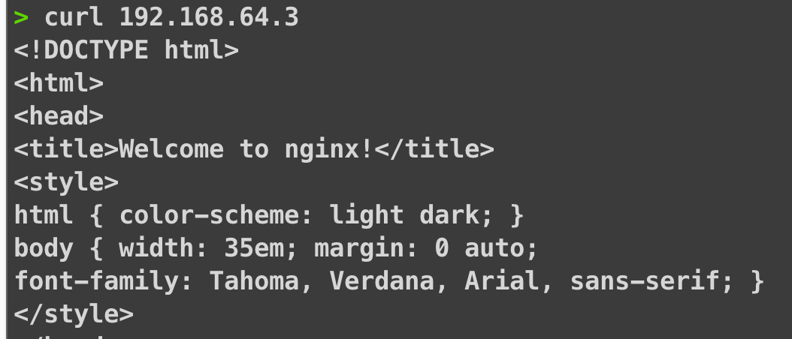<figcaption></figcaption></figure>
    * 透過 Domain `nginx.lab`
        <figure>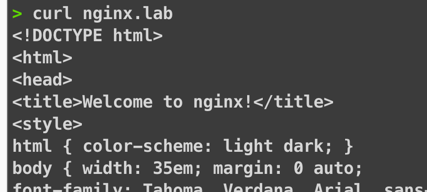<figcaption></figcaption></figure>

* 這裡有沒有發現一般的docker 和 podman 執行contaienr 時，指令有少了1個參數?
  就是`-p`，為什麼不需要 `-p` 呢?
    >[!NOTE]
    >[官方文件](https://github.com/apple/containerization?tab=readme-ov-file#design)有提到：
    > Containerization executes each Linux container inside of its own lightweight virtual machine. Clients can create dedicated IP addresses for every container to remove the need for individual port forwarding. Containers achieve sub-second start times using an optimized Linux kernel configuration and a minimal root filesystem with a lightweight init system.

* 每個容器就是一台 VM
  每個容器運行在獨立的輕量級 VM 裡，而不是像 Docker 那樣共享一個 host kernel。

* 專屬 IP、無需 port forward
  每台 VM（所以每個容器）都會被分配自己的 IP 地址，不需要再透過 -p    hostPort:containerPort 來轉發，直接連 VM IP + 容器內 port 即可存取 。

* 快速啟動與專注架構
由於使用優化 Linux kernel、minimal root fs 和輕量 init 系統，因此 VM 啟動速度能在 sub-second，性能也很接近一般容器。

| 特點    | 傳統 Docker                       | Apple Containerization                       |
| ----- | ------------------------------- | -------------------------------------------- |
| VM 架構 | 多個容器共用一台 VM 或 host kernel       | 每個容器一台輕量 VM                                  |
| 網路隔離  | 通常需 DNAT/NAT，使用 `-p` 設定 port 映射 | 每 VM 自己 IP，不需 `-p`                           |
| 存取方式  | `localhost:hostPort`            | `VM_IP:containerPort` 或用 local DNS domain 名稱 |

## 啟動容器 amd64 架構

剛剛啟動的是 arm64架構的 container，所以 image 也是 arm64架構的，接下來啟動 x86 的 container

1. 使用 `-a` 指定架構

    ```bash
    container run -a amd64 -d --name nginx-amd64 --rm nginx
    ```

2. 查看 container，可以看到有不同架構的 nginx

```bash
> container ls
ID           IMAGE                           OS     ARCH   STATE    ADDR
nginx        docker.io/library/nginx:latest  linux  arm64  running  192.168.64.3
nginx-amd64  docker.io/library/nginx:latest  linux  amd64  running  192.168.64.2
```

1. 測試連線
    * 透過 Contaienr IP
      <figure>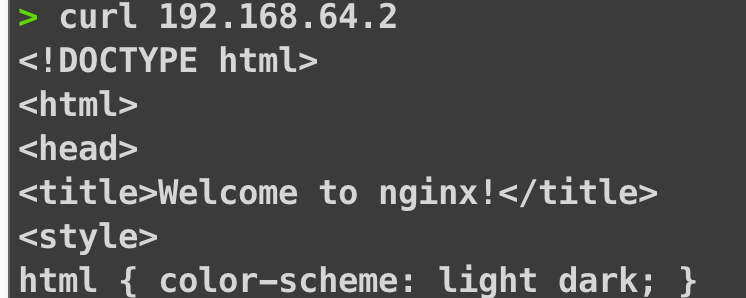<figcaption></figcaption></figure>
    * 透過 Domain `nginx-amd64.lab`
      <figure>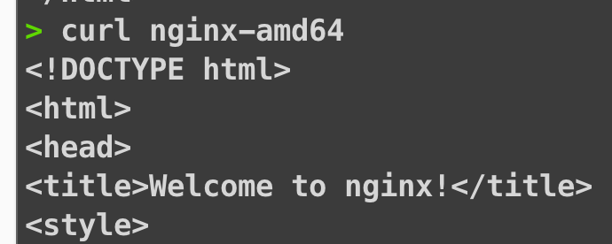<figcaption></figcaption></figure>

## Build Container Image

建立一個簡單的 Python 網頁伺服器，用 Dockerfile 來產生映像檔，命名為 `web-test`。

* 建一個資料夾叫 `web-test`，把需要的檔案都放這裡：

    ```bash
    mkdir web-test
    cd web-test
    ```

* 接著在這個資料夾裡建立一個 `Dockerfile`，內容如下：

    ```dockerfile
    FROM docker.io/python:alpine
    WORKDIR /content
    RUN apk add curl
    RUN echo '<!DOCTYPE html><html><head><title>Hello</title></head><body><h1>Hello, world!</h1></body></html>' > index.html
    CMD ["python3", "-m", "http.server", "80", "--bind", "0.0.0.0"]
    ```

* 建立 image (arm64)

    ```bash
    container build --tag web-test --file Dockerfile .
    ```

    <figure>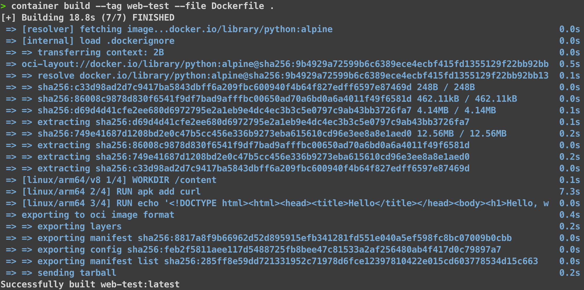<figcaption></figcaption></figure>

* 建立 image (arm64)，使用 `--arch` 指定

    ```bash
    container build --tag web-test-amd64 --arch amd64 --file Dockerfile .
    ```

    <figure>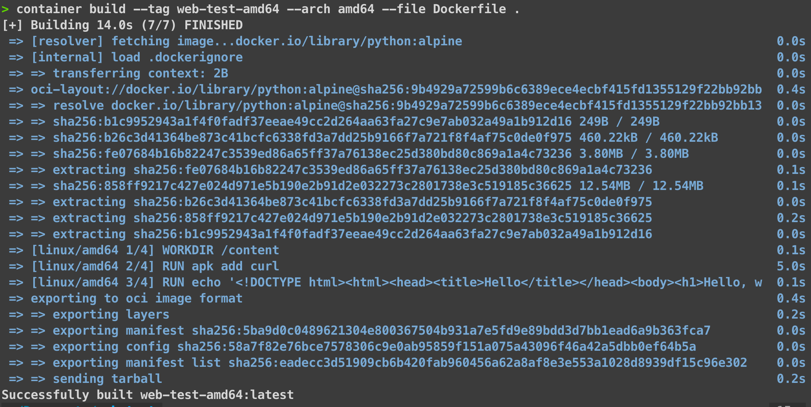<figcaption></figcaption></figure>

* 列出 container，可以看到剛剛建立的image 的 ARCH欄位有 arm64 和 amd64

  ```bash
  > container images ls --verbose
    NAME            TAG     INDEX DIGEST                 OS     ARCH   VARIANT  SIZE     CREATED               MANIFEST DIGEST
    nginx           latest  dc53c8f25a10f9109190ed5b...  linux  amd64           72.2 MB  2025-06-24T20:52:14Z  29cf9892ca1103e0b8c97db8...
    nginx           latest  dc53c8f25a10f9109190ed5b...  linux  arm64  v8       68.7 MB  2025-06-24T20:52:14Z  7370034f21795400bbaa52af...
    python          alpine  9b4929a72599b6c6389ece4e...  linux  amd64           16.8 MB  2025-06-11T21:49:27Z  1e58d36e5c24f88877f10b5f...
    python          alpine  9b4929a72599b6c6389ece4e...  linux  arm64  v8       17.2 MB  2025-06-11T21:49:27Z  1f759c1a6a2da639f07683ca...
    web-test-amd64  latest  eadecc3d51909cb6b420fab9...  linux  amd64           21.8 MB  2025-06-11T21:49:27Z  5ba9d0c0489621304e800367...
    web-test        latest  285ff8e59dd721331952c719...  linux  arm64           22.2 MB  2025-06-11T21:49:27Z  8817a8f9b66962d52d895915...
  ```
  
* 測試啟動 image
  * arm64

        ```bash
        container run -d --name my-web-server web-test
        ```

        <figure>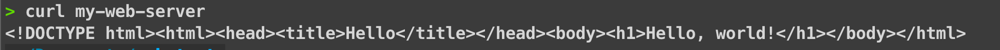<figcaption></figcaption></figure>

  * amd64
       記得加上 `-a amd64`，不然會出現`Error: unsupported: "Platform linux/arm64"`，因為預設會用arm64架構啟動，然後你使用 amd64架構的image，所以會出現錯誤

       ```bash
       container run -d -a amd64 --name my-web-server-amd64 web-test-amd64
       ```

       <figure>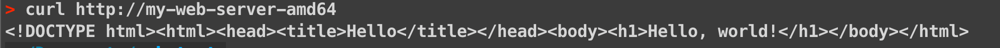<figcaption></figcaption></figure>

## 執行Container 內其他 command

```bash
> container exec my-web-server ls /content
index.html
```

## 進入 Container

```bash
> container exec -it my-web-server sh
/content # uname -a
Linux my-web-server 6.12.28 #1 SMP Tue May 20 15:19:05 UTC 2025 aarch64 Linux
```

* 測試連到剛剛建立的 amd64 的 container，確認container 內部也可通過 container name 溝通

```bash
/content # curl my-web-server-amd64
<!DOCTYPE html><html><head><title>Hello</title></head><body><h1>Hello, world!</h1></body></html>
```

## 登入 Registry

- 指定要登入的 Container Registry，這裡用 docker hub 做範例

    ```bash
    > container registry login docker.io
    Provide registry username docker.io: 你的使用者名稱
    Provide registry password:
    Login succeeded
    ```

- 重新標記 tag 並推送 image

    ```bash
    > container images tag web-test 你的使用者名稱/web-test:latest
    > container images push 你的使用者名稱/web-test:latest
    ```

## 結論

Apple 這個 Container 專案，等於是為 M 系列晶片（ARM 架構）提供了一個跑 x86 容器的原生解法。雖然現在越來越多應用程式已經提供 ARM 對應的 container image，但實務上很多開發者和工具鏈還是主要跑在 x86 架構上，缺 image 的情況仍不時會遇到。

這個專案借鑑 Kata Containers 的做法，把每個 container 包裝成獨立 VM，讓 macOS 上的開發體驗更接近原生 Linux，特別適合對「安全隔離」和「效能」有要求的使用者。

目前功能以啟動 container 和 image 管理為主，尚未支援 volume 掛載與進階的 container 網路設定。如果未來能加入像 Docker Compose 那樣的編排能力、支援 volume 掛載與更完整的網路設定，就能讓多容器應用開發更順手

說不定哪天 Apple 真的會推出一個「Apple Kubernetes」的本地開發環境也說不定。
