# Blackbox exporter


本文轉寫時間為 2024年02月29日，內容可能會有變動，僅記錄


## 介紹
Blackbox Exporter 是一個由 Prometheus 團隊開發的工具，用於監控應用程式、服務或網路設備的可用性。它主要用於透過進行定期的健康檢查（probes），來確保目標系統的正常運作。

以下是一些 Blackbox Exporter 的主要特點和使用方式：

1. 健康檢查（Probes）： Blackbox Exporter 使用健康檢查機制來確認目標系統的可用性。這包括 HTTP、TCP、ICMP 等不同類型的探測，可以根據需求進行配置。

2. Metrics 支援： 它生成 Prometheus 支援的指標（metrics），這些指標可以提供有關健康檢查的詳細信息，包括成功或失敗的次數、探測的持續時間等。

3. 配置靈活性： Blackbox Exporter 具有靈活的配置選項，可以根據不同的需求和場景進行調整。你可以定義多個 probe，並針對每個 probe 配置相應的參數。

4. HTTP、HTTPS 支援： 支援對 HTTP 和 HTTPS 站點的健康檢查，並能夠驗證 SSL/TLS 憑證，確保通信的安全性。

## 白盒（WhiteBox）與黑盒（Blackbox）監控
* 白盒監控（WhiteBox Monitoring）：
    定義： 白盒監控是一種基於內部結構和程式碼的監控方法。在這種監控中，監控系統能夠深入了解應用程式或系統的內部運作，包括程式碼、資料庫、伺服器運行狀態等。

    特點： 白盒監控通常需要在應用程式或系統中嵌入監控代碼或使用特定的軟體代理，以收集更多內部資訊。這種方法通常能夠提供更詳細、更精確的性能和運行時數據，並能夠用於進行性能調優和優化。

    例子： 監控應用程式的內存使用、CPU使用率、程式碼錯誤率、資料庫查詢效能等。

* 黑盒監控（BlackBox Monitoring）：
    定義： 黑盒監控是一種基於外部觀察和結果的監控方法。在這種監控中，監控系統僅檢查應用程式或系統的輸出，而不了解內部的實現細節。

    特點： 黑盒監控通常通過模擬外部使用者的行為或測試外部系統的可用性和回應時間。這種方法可以提供一個全面的視角，模擬真實用戶的經歷，但缺點是不能提供詳細的內部運作信息。

    例子： 監控網站的可用性、網路連通性、API 回應時間等。
## 架構
1. Blackbox exporter　根據指定的目標，持續透過 Probes 來偵測服務，並產生 metrics

2. Prometheus 再去 Blackbox exporter 收集 metrics


<figure>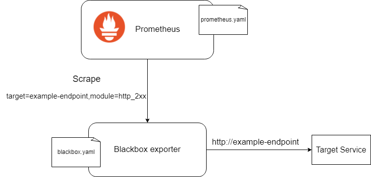<figcaption></figcaption></figure>

## Blackbox exporter 模組
Blackbox exporter 提供多個偵測模組，目前有
* http
* tcp
* dns
* icmp
* grpc

blackbox 預設模組為 http，可以從 blackbox.yaml 查看，以下是預設模組
```
modules:
  http_2xx:
    http:
      follow_redirects: true
      preferred_ip_protocol: ip4
      valid_http_versions:
      - HTTP/1.1
      - HTTP/2.0
    prober: http
    timeout: 5s
```
以下是說明

* modules： 這是 Blackbox Exporter 配置文件的一個部分，它包含一個或多個探測模組的定義。
    * http_2xx： 這是具體的探測模組的名稱(模組名稱可自訂)。在這個例子中，它表示 HTTP 請求返回預期為 2xx 狀態碼的模組。
        * http： 這裡是探測模組的配置，指定了 HTTP 探測的相關參數。
        * follow_redirects: true： 表示要跟隨重定向。如果目標返回重定向狀態碼，則探測將繼續跟隨重定向直到獲得最終的 2xx 狀態碼或超過最大跟隨次數。
        * preferred_ip_protocol: ip4： 指定優先使用 IPv4 協議進行通信。這確保了在執行探測時首選使用 IPv4。
        * valid_http_versions: [HTTP/1.1, HTTP/2.0]： 指定有效的 HTTP 協議版本。在這裡，它限制了只有 HTTP/1.1 和 HTTP/2.0 是允許的版本。
* prober: http： 指定使用的具體探測器，這裡是 HTTP 探測器。Blackbox Exporter 支援不同的探測器，這取決於你要監控的目標的特性。
* timeout: 5s： 設定探測的超時時間。在這個例子中，超時時間為 5 秒。如果在指定的時間內未獲得預期的回應，則探測被視為失敗。

## 範例

各 module 詳細設定，請看 [github](https://github.com/prometheus/blackbox_exporter/blob/master/CONFIGURATION.md)
各 module 所取得的 metrics，請參考以下範例。

## http 探測
以下範例來探測 google.com

1. 建立 blackbox exporter 設定
```
$ mkdir blackbox-exporter
$ cd blackbox-exporter
$ vim blackbox.yml
```
設定檔內容
```
modules:
  http_2xx:
    http:
      follow_redirects: true
      preferred_ip_protocol: ip4
      valid_http_versions:
      - HTTP/1.1
      - HTTP/2.0
    prober: http
    timeout: 5s
```
2. 啟動 blackbox exporter
```
$ docker run --rm \
  -p 9115:9115 \
  --name blackbox_exporter \
  -v $(pwd):/config \
  quay.io/prometheus/blackbox-exporter:latest --config.file=/config/blackbox.yml
```

3. 檢查 blackbox exporter 頁面
瀏覽器輸入IP:9115
<figure>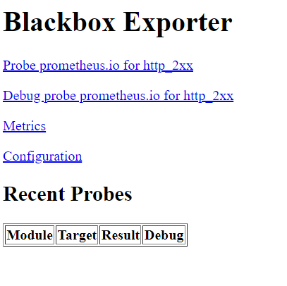<figcaption></figcaption></figure>

4. 設定 prometheus.yaml
增加以下內容

* replacement: 設定 blackbox exporter　位置
* static_configs.targets:　設定監控目標
```
scrape_configs:
  - job_name: blackbox-exporter
    params:
      module:
        - http_2xx
    scrape_interval: 1m
    scrape_timeout: 10s
    metrics_path: /probe
    scheme: http
    relabel_configs:
      - source_labels: [__address__]
        target_label: __param_target
      - source_labels: [__param_target]
        target_label: instance
      - target_label: __address__
        replacement: 192.168.1.120:9115
        action: replace
    static_configs:
      - targets:
          - https://google.com
        labels:
          environment: demo
```
5. 回到 blackbox 頁面，可以看到檢查結果，結果顯示 Success
<figure>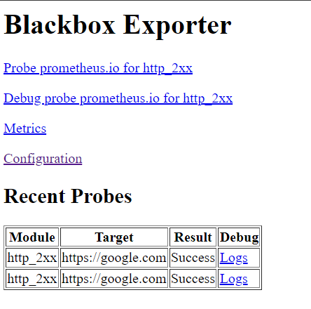<figcaption></figcaption></figure>
 
6. 點選 logs，可以看到當次的 metrics
<figure>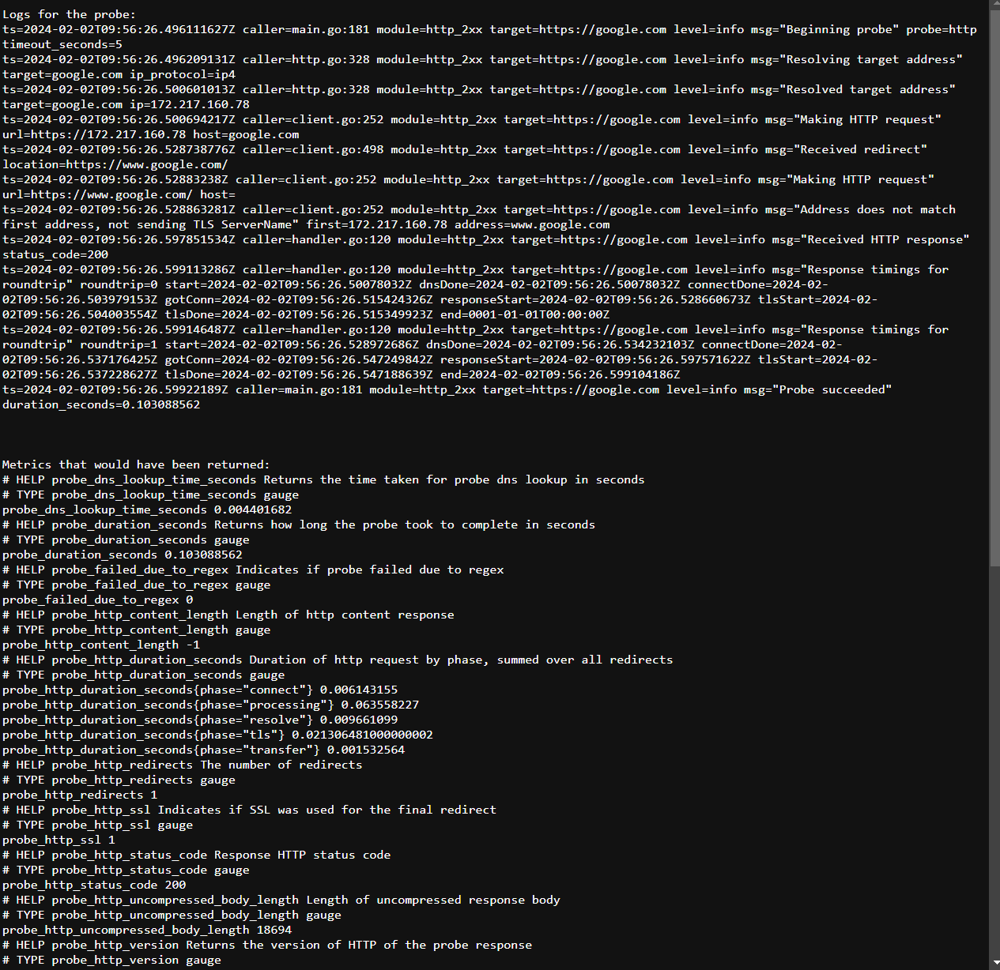<figcaption></figcaption></figure>

7. 回到 prometheus，可以透過 PromQL查詢 metric，先查詢 `probe_success`，可以看到回傳值都是1，代表 google.com 服務正常
<figure>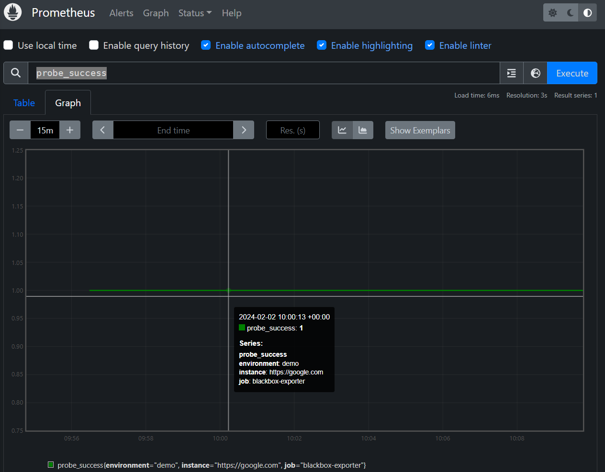<figcaption></figcaption></figure>

8. 再來搜尋 `probe_duration_seconds`，可以看到存取 google.com 服務的回應時間，可以當作一個 服務指標
<figure>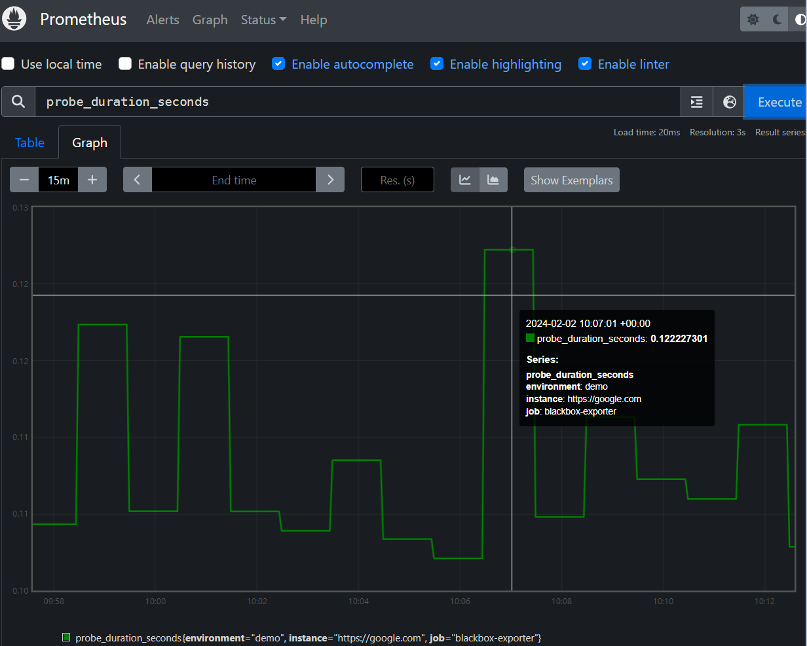<figcaption></figcaption></figure>

9. 也可以查看 ssl 憑證到期時間，metric 為 **probe_ssl_earliest_cert_expiry**，透過語法計算後可以得到剩餘時間，再配合建立憑證到期前的告警
    <figure>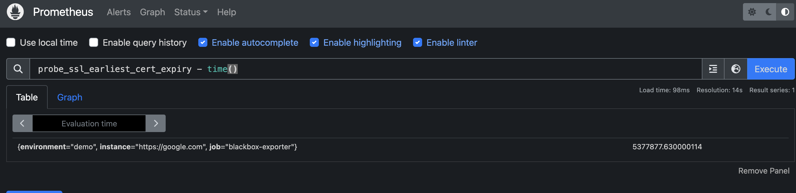<figcaption></figcaption></figure>
  配合 Grafana 面板
    <figure>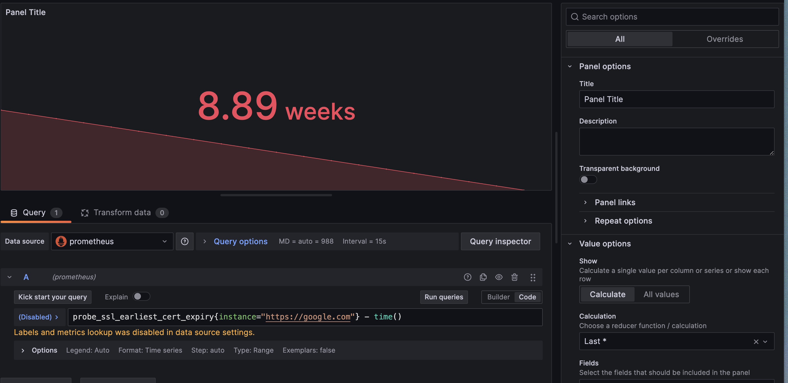<figcaption></figcaption></figure>


## Ping 探測

1. 在 blackbox.yml 內新增ping Module
```
modules:
  ping:
    prober: icmp
    timeout: 5s
    icmp:
      preferred_ip_protocol: "ip4"
```

2. prometheus.yml 新增 job，可以為每個targets加上 label
```
- job_name: 'ping_all'
  scrape_interval: 1m
  metrics_path: /probe
  params:
    module: [ping]
  static_configs:
    - targets:
        - 192.168.1.20
      labels:
        instance: master
    - targets:
        - 192.168.1.21
      labels:
        instance: worker1
  relabel_configs:
    - source_labels: [__address__]
      target_label: __param_target
    - target_label: __address__
      replacement: 192.168.1.19:9115
```
3. 回到　prometheus 頁面，確認target是否正常
    <figure>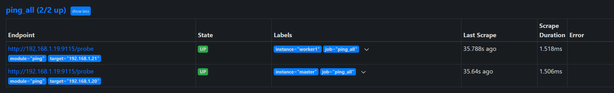<figcaption></figcaption></figure>

4. 透過promQL查詢 **probe_icmp_duration_seconds**，可以看到相關值，例如RTT(衡量網路延遲)
<figure>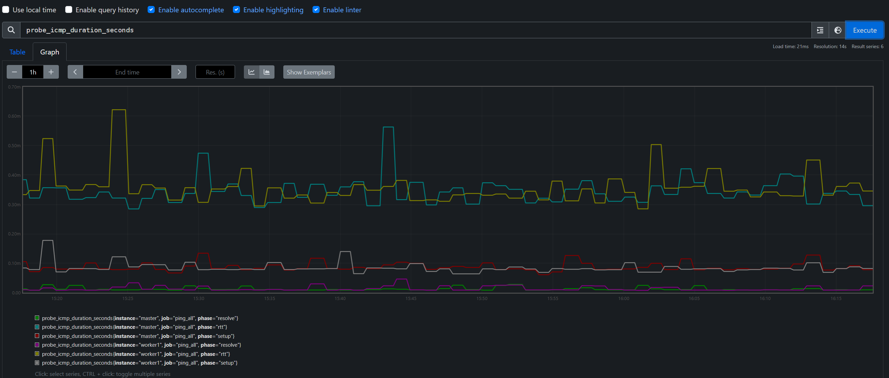<figcaption></figcaption></figure>


## dns 探測
透過指定的dns 來查詢要解析的domain 是否正常
1. 在 blackbox.yml 內新增 dns Module
這裡建立要探測的 domain ， 範例為 facebook
```
modules:
  dns_probe:
    prober: dns
    timeout: 5s
    dns:
      query_name: "facebook.com"
      query_type: "A"
      preferred_ip_protocol: "ip4"
```

2. prometheus.yaml 內加入以下內容
 
```
- job_name: 'blackbox-dns'
  metrics_path: /probe
  params:
    module: [dns_probe]
  static_configs:
    - targets:
        - 8.8.8.8
      labels:
        domain_name: facebook.com
  relabel_configs:
    - source_labels: [__address__]
      target_label: __param_target
    - source_labels: [__param_target]
      target_label: instance
    - target_label: __address__
      replacement: 192.168.1.19:9115
      action: replace
```
  根據 target 設定，要查詢 facebook.com，透過8.8.8.8查詢，其他依此類推
  
3. 回到 prometheus 的 target 頁面，確認target 是否正常
<figure>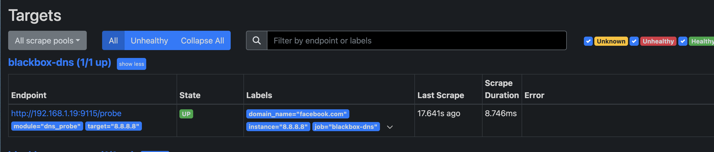<figcaption></figcaption></figure>


4. 透過 promQL 查詢相關 dns metric
<figure>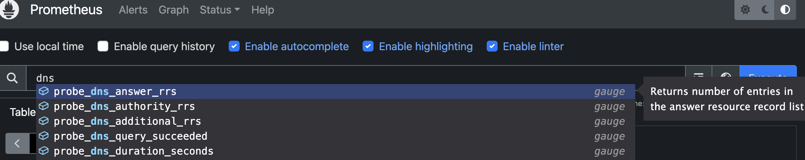<figcaption></figcaption></figure>
<figure>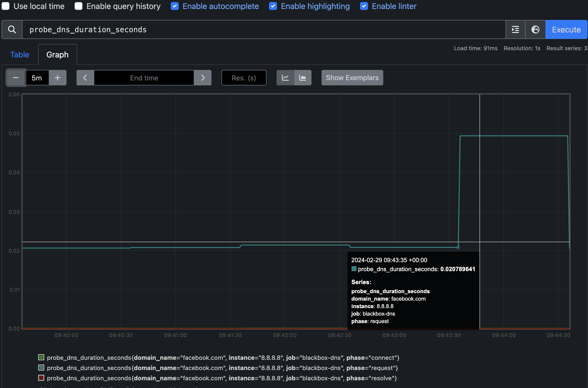<figcaption></figcaption></figure>
 