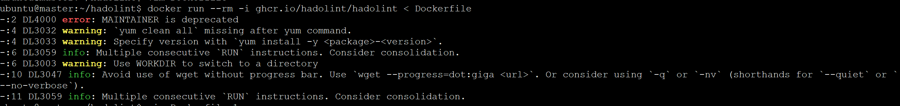
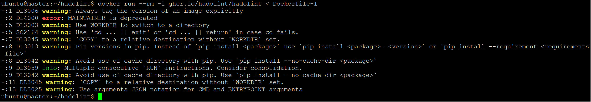
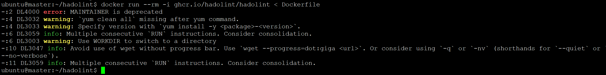
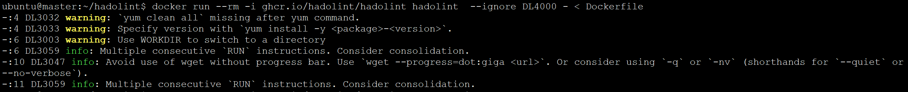
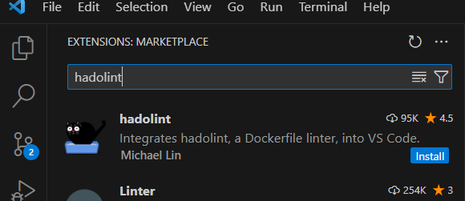
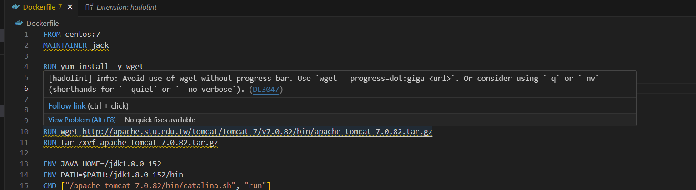

# hadolint


本文轉寫時間為 2024年02月17日，內容可能會有變動，僅記錄


## 介紹
hadolint 是一個用於檢查 Dockerfile 中的最佳實踐和潛在問題的工具。Dockerfile 是用於構建 Docker 映像的指令文件，而 hadolint 旨在提供靜態分析，以幫助開發人員和運維人員確保 Dockerfile 的品質和一致性。

以下是一些 hadolint 的主要特點和功能：

靜態分析： hadolint 使用內置的規則集，通過靜態分析 Dockerfile，檢查其中的指令，以確保它們符合最佳實踐和避免潛在的錯誤。

可自定義規則： 用戶可以透過 hadolint.yaml 定義 hadolint 的規則，以滿足其特定項目或組織的需求。

易於集成： 可以將 hadolint 集成到 CI/CD 管道中，以自動檢查新提交或建構的 Docker 映像。這有助於提前發現潛在的問題，加速開發和部署過程

## 安裝
1. 透過 homebrew 安裝
    ```
    $ brew install hadolint
    ```
   或是透過 docker 啟動，將 Dockerfile 輸入
    ```
    $ docker run --rm -i ghcr.io/hadolint/hadolint < Dockerfile
    ```

2. 檢查 Dockerfile，下面的[Dockerfile是從網路上找的](https://ithelp.ithome.com.tw/articles/10191016?sc=hot)，讓我們來檢查看看
   ```
    FROM centos:7
    MAINTAINER jack

    RUN yum install -y wget

    RUN cd /

    ADD jdk-8u152-linux-x64.tar.gz /

    RUN wget http://apache.stu.edu.tw/tomcat/tomcat-7/v7.0.82/bin/apache-tomcat-7.0.82.tar.gz
    RUN tar zxvf apache-tomcat-7.0.82.tar.gz

    ENV JAVA_HOME=/jdk1.8.0_152
    ENV PATH=$PATH:/jdk1.8.0_152/bin
    CMD ["/apache-tomcat-7.0.82/bin/catalina.sh", "run"]
   ```
3. 檢查 Dockerfile
    ```
    $ docker run --rm -i ghcr.io/hadolint/hadolint < Dockerfile
    -:2 DL4000 error: MAINTAINER is deprecated
    -:4 DL3032 warning: `yum clean all` missing after yum command.
    -:4 DL3033 warning: Specify version with `yum install -y <package>-<version>`.
    -:6 DL3059 info: Multiple consecutive `RUN` instructions. Consider consolidation.
    -:6 DL3003 warning: Use WORKDIR to switch to a directory
    -:10 DL3047 info: Avoid use of wget without progress bar. Use `wget --progress=dot:giga <url>`. Or consider using `-q` or `-nv` (shorthands for `--quiet` or `--no-verbose`).
    -:11 DL3059 info: Multiple consecutive `RUN` instructions. Consider consolidation.
    ```
    <figure><figcaption></figcaption></figure>

    針對結果大約說明一下
    * 第 2 行: DL4000 error: MAINTAINER is deprecated，意味著使用了不再推薦使用的 MAINTAINER 指令。建議改用 LABEL 來指定作者信息。
    * 第 4 行: DL3032 warning: 在 yum 命令後缺少 yum clean all。建議在使用 yum 安裝套件後添加清理命令，以減小生成的映像大小。
    * 第 4 行: DL3033 warning: 建議使用 yum install -y package-version 的形式指定套件的版本，以確保可重現性。
    * 第 6 行: DL3059 info: 多個連續的 RUN 指令。建議考慮合併這些指令，以減少映像層的數量。
    * 第 6 行: DL3003 warning: 建議使用 WORKDIR 來切換目錄，而不是在 RUN 指令中使用 cd。
    * 第 10 行: DL3047 info: 建議避免使用沒有進度條的 wget。可以使用 wget --progress=dot:giga url 或考慮使用 -q 或 -nv（--quiet 或 --no-verbose）。
    * 第 11 行: DL3059 info: 多個連續的 RUN 指令。建議考慮合併這些指令，以減少映像層的數量。
    
4. 再次檢查另外一個 [Dockerfile](https://medium.com/@seifeddinerajhi/creating-perfect-dockerfiles-with-hadolint-a-step-by-step-guide-to-image-optimization-25faec667884)
    ```
    FROM python
    MAINTAINER johndoe@gmail.com
    LABEL org.website="containiq.com"

    RUN mkdir app && cd app

    COPY requirements.txt ./
    RUN pip install --upgrade pip
    RUN pip install -r requirements.txt

    COPY . .

    CMD python manage.py runserver 0.0.0.0:80000
    ```
5. 察看結果
    ```
    $ docker run --rm -i ghcr.io/hadolint/hadolint < Dockerfile
    -:1 DL3006 warning: Always tag the version of an image explicitly
    -:2 DL4000 error: MAINTAINER is deprecated
    -:5 DL3003 warning: Use WORKDIR to switch to a directory
    -:5 SC2164 warning: Use 'cd ... || exit' or 'cd ... || return' in case cd fails.
    -:7 DL3045 warning: `COPY` to a relative destination without `WORKDIR` set.
    -:8 DL3013 warning: Pin versions in pip. Instead of `pip install <package>` use `pip install <package>==<version>` or `pip install --requirement <requirements file>`
    -:8 DL3042 warning: Avoid use of cache directory with pip. Use `pip install --no-cache-dir <package>`
    -:9 DL3059 info: Multiple consecutive `RUN` instructions. Consider consolidation.
    -:9 DL3042 warning: Avoid use of cache directory with pip. Use `pip install --no-cache-dir <package>`
    -:11 DL3045 warning: `COPY` to a relative destination without `WORKDIR` set.
    -:13 DL3025 warning: Use arguments JSON notation for CMD and ENTRYPOINT arguments
    ```
    
    <figure><figcaption></figcaption></figure>

    說明結果
    * 第 1 行: DL3006 warning: 建議始終明確標記映像的版本。即使在開發階段，也應該使用標記版本，以確保重現性。
    * 第 2 行: DL4000 error: MAINTAINER is deprecated，建議改用 LABEL 來指定作者信息。
    * 第 5 行: DL3003 warning: 建議使用 WORKDIR 來切換目錄，而不是在 RUN 指令中使用 cd。
    * 第 5 行: SC2164 warning: 建議在 cd 失敗的情況下使用 `cd ... || exit 或 cd ... || return`。
    * 第 7 行: DL3045 warning: 在未設置 WORKDIR 的情況下對相對目標進行 COPY 操作。建議在使用 COPY 命令之前使用 WORKDIR 來設置目錄。
    * 第 8 行: DL3013 warning: 建議使用 pip install package==version 或 pip install --requirement requirements file 來固定 pip 中套件的版本。
    * 第 8 行: DL3042 warning: 建議避免使用 pip 的緩存目錄，可以使用 pip install --no-cache-dir package。
    * 第 9 行: DL3059 info: 多個連續的 RUN 指令。建議考慮合併這些指令，以減少映像層的數量。
    * 第 9 行: DL3042 warning: 建議避免使用 pip 的緩存目錄，可以使用 pip install --no-cache-dir package。
    * 第 11 行: DL3045 warning: 在未設置 WORKDIR 的情況下對相對目標進行 COPY 操作。建議在使用 COPY 命令之前使用 WORKDIR 來設置目錄。
    * 第 13 行: DL3025 warning: 建議使用 JSON 記法來編寫 CMD 和 ENTRYPOINT 的引數。


## 規則
DL開頭的規則是hadolint的

SC開頭的規則是ShellChecke的

以下是常見的規則，其餘的請至[ github](https://github.com/hadolint/hadolint?tab=readme-ov-file#rules) 查看

| Rule                                                         | Default Severity | Description                                                                                                                                         |
| :----------------------------------------------------------- | :--------------- | :-------------------------------------------------------------------------------------------------------------------------------------------------- |
| [DL1001](https://github.com/hadolint/hadolint/wiki/DL1001)   | Ignore           | Please refrain from using inline ignore pragmas `# hadolint ignore=DLxxxx`.                                                                         |
| [DL3000](https://github.com/hadolint/hadolint/wiki/DL3000)   | Error            | Use absolute WORKDIR.                                                                                                                               |
| [DL3001](https://github.com/hadolint/hadolint/wiki/DL3001)   | Info             | For some bash commands it makes no sense running them in a Docker container like ssh, vim, shutdown, service, ps, free, top, kill, mount, ifconfig. |
| [DL3002](https://github.com/hadolint/hadolint/wiki/DL3002)   | Warning          | Last user should not be root.                                                                                                                       |
| [DL3003](https://github.com/hadolint/hadolint/wiki/DL3003)   | Warning          | Use WORKDIR to switch to a directory.                                                                                                               |
| [DL3004](https://github.com/hadolint/hadolint/wiki/DL3004)   | Error            | Do not use sudo as it leads to unpredictable behavior. Use a tool like gosu to enforce root.                                                        |
| [DL3006](https://github.com/hadolint/hadolint/wiki/DL3006)   | Warning          | Always tag the version of an image explicitly.                                                                                                      |
| [DL3007](https://github.com/hadolint/hadolint/wiki/DL3007)   | Warning          | Using latest is prone to errors if the image will ever update. Pin the version explicitly to a release tag.                                         |
| [DL3008](https://github.com/hadolint/hadolint/wiki/DL3008)   | Warning          | Pin versions in `apt-get install`.                                                                                                                  |
| [DL3009](https://github.com/hadolint/hadolint/wiki/DL3009)   | Info             | Delete the apt-get lists after installing something.                                                                                                |
| [DL3010](https://github.com/hadolint/hadolint/wiki/DL3010)   | Info             | Use ADD for extracting archives into an image.                                                                                                      |
| [DL3011](https://github.com/hadolint/hadolint/wiki/DL3011)   | Error            | Valid UNIX ports range from 0 to 65535.                                                                                                             |
| [DL3012](https://github.com/hadolint/hadolint/wiki/DL3012)   | Error            | Multiple `HEALTHCHECK` instructions.                                                                                                                |
| [DL3013](https://github.com/hadolint/hadolint/wiki/DL3013)   | Warning          | Pin versions in pip.                                                                                                                                |
| [SC1000](https://github.com/koalaman/shellcheck/wiki/SC1000) |                  | `$` is not used specially and should therefore be escaped.                                                                                          |
| [SC1001](https://github.com/koalaman/shellcheck/wiki/SC1001) |                  | This `\c` will be a regular `'c'` in this context.                                                                                                  |
| [SC1007](https://github.com/koalaman/shellcheck/wiki/SC1007) |                  | Remove space after `=` if trying to assign a value (or for empty string, use `var='' ...`).                                                         |
| [SC1010](https://github.com/koalaman/shellcheck/wiki/SC1010) |                  | Use semicolon or linefeed before `done` (or quote to make it literal).                                                                              |
| [SC1018](https://github.com/koalaman/shellcheck/wiki/SC1018) |                  | This is a unicode non-breaking space. Delete it and retype as space.                                                                                |
| [SC1035](https://github.com/koalaman/shellcheck/wiki/SC1035) |                  | You need a space here                                                                                                                               |
| [SC1045](https://github.com/koalaman/shellcheck/wiki/SC1045) |                  | It's not `foo &; bar`, just `foo & bar`.                                                                                                            |
| [SC1065](https://github.com/koalaman/shellcheck/wiki/SC1065) |                  | Trying to declare parameters? Don't. Use `()` and refer to params as `$1`, `$2` etc.                                                                |
| [SC1066](https://github.com/koalaman/shellcheck/wiki/SC1066) |                  | Don't use $ on the left side of assignments.                                                                                                        |
| [SC1068](https://github.com/koalaman/shellcheck/wiki/SC1068) |                  | Don't put spaces around the `=` in assignments.                                                                                                     |
| [SC1077](https://github.com/koalaman/shellcheck/wiki/SC1077) |                  | For command expansion, the tick should slant left (\` vs ´).                                                                                        |
| [SC1078](https://github.com/koalaman/shellcheck/wiki/SC1078) |                  | Did you forget to close this double-quoted string?                                                                                                  |
| [SC1079](https://github.com/koalaman/shellcheck/wiki/SC1079) |                  | This is actually an end quote, but due to next char, it looks suspect.                                                                              |
## 忽略規則

如果有些規則根據團隊的規則可以忽略，透過 hadolint.yaml 編寫要忽略的規則編號，yaml 檔的讀取位置順序為
* $PWD/.hadolint.yaml
* $XDG_CONFIG_HOME/hadolint.yaml
* $HOME/.config/hadolint.yaml
* $HOME/.hadolint/hadolint.yaml or $HOME/hadolint/config.yaml
* $HOME/.hadolint.yaml

上述的第一個範例的Dockerfile 內有DL4000的規則，此時我想忽略掉規則，可以在 yaml 檔裡寫入
```
ignored:
    - DL4000
```
然後執行，或是直接指定 confing 位置 `hadolint --config /path/to/config.yaml Dockerfile`

如果是使用 docker 執行的，可以直接指定要忽略的規則，或是 mount yaml 到 container 內，以下是比對忽略前後
* 忽略前&#x20;

    <figure><figcaption></figcaption></figure>

* 忽略後
    ```
    docker run --rm -i ghcr.io/hadolint/hadolint hadolint  --ignore DL4000 - < Dockerfile
    ```
    or
    ```
    docker run --rm -v ./hadolint.yaml:/.config/hadolint.yaml -i ghcr.io/hadolint/hadolint  < Dockerfile
    ```
    <figure><figcaption></figcaption></figure>

    可以看到 DL4000已沒有出現
    
除了規則以外，也可以自行加入認可的 registry 的來源，以及複寫規則的嚴重等級
```
ignored:
    - DL4000
    
trustedRegistries:
  - docker.io
  - my-company.com:5000
  - "*.gcr.io"
  
override:
  error:
    - DL3001
    - DL3002
  warning:
    - DL3042
    - DL3033
  info:
    - DL3032
  style:
    - DL3015
```
## vscode 外掛套件
這裡以 windows 為例
1. 安裝 scoop
    ```
    > Set-ExecutionPolicy -ExecutionPolicy RemoteSigned -Scope CurrentUser
    > Invoke-RestMethod -Uri https://get.scoop.sh | Invoke-Expression
    ```
2. 安裝 hadolint
    ```
     > scoop install hadolint
    Installing 'hadolint' (2.12.0) [64bit] from main bucket
    hadolint-Windows-x86_64.exe (7.0 MB) [========================================================================] 100%
    Checking hash of hadolint-Windows-x86_64.exe ... ok.
    Linking ~\scoop\apps\hadolint\current => ~\scoop\apps\hadolint\2.12.0
    Creating shim for 'hadolint'.
    'hadolint' (2.12.0) was installed successfully!
    ```
4. 搜尋 hadolint 並安裝
    <figure><figcaption></figcaption></figure>

5. 打開 Dockerfile，將滑鼠移至有底線的地方，可以看到建議，方便邊寫邊修改
    <figure><figcaption></figcaption></figure>
