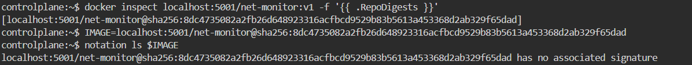
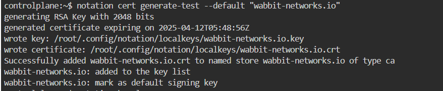
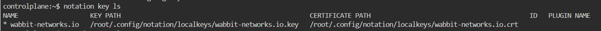
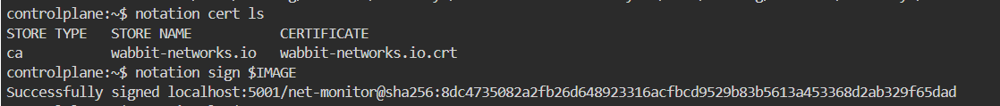
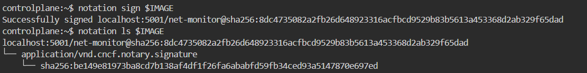
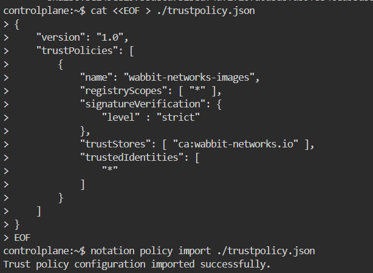
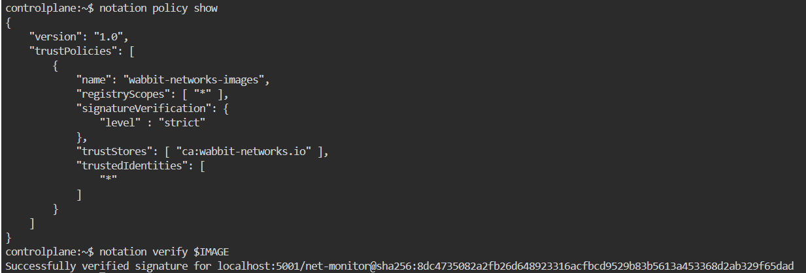

# Notary V2


本文轉寫時間為 2025年04月15日，內容可能會有變動，僅記錄


## 介紹
Notary V2 是由 CNCF（Cloud Native Computing Foundation）推動的開放標準，旨在為 OCI Artifact（如容器映像、Helm Charts 等）提供標準化的簽章與驗證機制，以提升軟體供應鏈的安全性與可信度。

它是 Notary Project 的新一代規範（相對於舊版的 Notary V1）：

- Notary V1 基於 TUF（The Update Framework），需要獨立的簽章伺服器與客戶端，曾用於 Docker Content Trust（DCT）。

-  Notary V2 捨棄 TUF 架構，採用 OCI Referrers 標準，將簽章物件直接儲存在 OCI 相容的 Registry 中，例如 Azure Container Registry (ACR)、AWS ECR、Harbor 等，無需額外伺服器架設，更加輕量、可攜與可整合。

## Notation 工具
Notation 是 Notary Project 的 CLI 工具，也是 Notary V2 規範的參考實作。你可以用 Notation：

- 簽署 OCI Artifact：notation sign
- 驗證簽章是否可信：notation verify
- 管理信任憑證與驗證政策：notation cert / notation policy

Notation 遵循 Notary V2 所定義的簽章格式、驗證流程與儲存規範，確保不同工具之間能互通使用。因此，Notary V2 定義標準，Notation 實作它。


## Notary V2 / Notation 簽名 OCI 映像，相關術語：
1. image 本體
    存在於 OCI 相容的 Registry（例如：ACR、ECR、Harbor）
    建議使用 digest 格式（<image>@sha256:...）來確認要簽名的 image
2. 簽署金鑰與對應的憑證（X.509）
    本地產生的金鑰（自簽或由企業 CA 簽發）
    使用 KMS / HSM 外掛（如 Azure Key Vault、AWS KMS）

   - notation 有快速產生測試憑證的指令
   `notation cert generate-test --default "your-name"`

3. Trust Store（信任憑證庫）
    存放你信任的根憑證或簽署者憑證（用來驗證簽章）
    路徑預設：
    Linux: `~/.config/notation/trust-store/`

    若不在驗證端加入，則簽章會被視為「無法信任」

4.  Trust Policy（信任策略）
    定義「哪些憑證是可信的」「要如何驗證簽章」
    常見驗證等級：
    - strict：最嚴格、所有檢查都強制
    - permissive：允許過期/吊銷但警告
    - audit：僅記錄、不拒絕

只要有「映像 + 憑證金鑰 + Trust Store + Trust Policy」，就能使用 Notation 對映像安全簽章並推送至 Registry

以下透過 Notation CLI 實際對Image簽名

---

# Notation image 簽章範例

## 1. 設定環境變數

請先設定欲下載的 Notation 版本（以下使用最新版 1.1.0 為例）：

```bash
export NOTATION_VERSION=1.1.0
```

## 2. 下載 Notation CLI

使用 `curl` 指令下載適用於 x86 平台的 Notation CLI：

```bash
curl -LO https://github.com/notaryproject/notation/releases/download/v$NOTATION_VERSION/notation_$NOTATION_VERSION\_linux_amd64.tar.gz
```

## 3. 驗證檔案完整性

下載 checksum 檔案並驗證：

```bash
curl -LO https://github.com/notaryproject/notation/releases/download/v$NOTATION_VERSION/notation_$NOTATION_VERSION\_checksums.txt
shasum --check notation_$NOTATION_VERSION\_checksums.txt | grep "notation_$NOTATION_VERSION\_linux_amd64.tar.gz"
```

## 4. 安裝 Notation

解壓縮並安裝至 `/usr/bin`：

```bash
tar xvzf notation_$NOTATION_VERSION\_linux_amd64.tar.gz -C /usr/bin/ notation
```

## 5. 驗證是否安裝成功

```bash
notation version
```

---

## 6. 建立測試用 OCI 相容的映像倉庫（Registry）

請確保已完成上述所有步驟。

啟動本地 Registry：

```bash
docker run -d -p 5001:5000 -e REGISTRY_STORAGE_DELETE_ENABLED=true --name registry registry
```

---

## 7. 建立並推送測試映像

```bash
docker build -t localhost:5001/net-monitor:v1 https://github.com/wabbit-networks/net-monitor.git#main
docker push localhost:5001/net-monitor:v1
```

---

## 8. 取得映像的 Digest 值

推送完成後會顯示 SHA256 digest，可記錄下來使用，或再次查詢：

```bash
docker inspect localhost:5001/net-monitor:v1 -f '{{ .RepoDigests }}'
```

設定環境變數（請將 `<digest>` 替換為實際值）：

```bash
export IMAGE=localhost:5001/net-monitor@sha256:<digest>
```

---

## 9. 檢查映像是否已有簽章

```bash
notation ls $IMAGE
```
可以看到 image 尚未簽名

<figure><figcaption></figcaption></figure>

---

## 10. 產生測試簽章金鑰與自簽憑證

此指令會：
- 建立 RSA 金鑰並設為預設簽章金鑰
- 建立自簽的 X.509 憑證
- 將憑證放入名為 `wabbit-networks.io` 的 trust store

```bash
notation cert generate-test --default "wabbit-networks.io"
```

<figure><figcaption></figcaption></figure>

確認金鑰是否正確設定：

```bash
notation key ls
```
<figure><figcaption></figcaption></figure>

確認憑證是否已儲存於 trust store：

```bash
notation cert ls
```
<figure><figcaption></figcaption></figure>

---

## 11. 簽署映像

使用預設簽章金鑰進行簽署：

```bash
notation sign $IMAGE
```

可以改用 COSE 格式簽章：

```bash
notation sign --signature-format cose $IMAGE
```

簽章成功後會推送至 Registry，並輸出該映像的 digest。

再次查看映像的簽章資訊：

```bash
notation ls $IMAGE
```

<figure><figcaption></figcaption></figure>

---

## 12. 建立信任政策（Trust Policy）

建立 `trustpolicy.json` 檔案內容如下：
    
意思是對所有 registry 中的 artifact，只要是由 `wabbit-networks.io` 這個 trust store 中的憑證所簽名的 artifact，就必須通過嚴格的簽章驗證，才能被接受。
```bash
cat <<EOF > ./trustpolicy.json
{
    "version": "1.0",
    "trustPolicies": [
        {
            "name": "wabbit-networks-images",
            "registryScopes": [ "*" ],
            "signatureVerification": {
                "level" : "strict"
            },
            "trustStores": [ "ca:wabbit-networks.io" ],
            "trustedIdentities": [
                "*"
            ]
        }
    ]
}
EOF
```


---

## 13. 匯入並查看信任政策

匯入剛建立的 `trustpolicy.json`：

```bash
notation policy import ./trustpolicy.json
```
<figure><figcaption></figcaption></figure>
查看目前套用的信任政策：

```bash
notation policy show
```

---

## 14. 驗證映像簽章

驗證是否為可信任的簽署者所簽署：

```bash
notation verify $IMAGE
```
<figure><figcaption></figcaption></figure>

---


## 以下是在使用簽章過程的步驟，可能會產生的疑問
  

###  Q：要對映像簽名，映像一定要先推到 Registry 上嗎？

 **A**：是的。Notation 必須針對已存在於 OCI 相容 Registry 中的映像（以 digest 方式引用）進行簽名，因為簽章會儲存在 registry，並與映像建立關聯。

---

###  Q：那 build 出來的 image 是不是要先確認沒問題，才可以 push 並簽名？

**A**：完全正確。團隊應該先確認映像的安全性與合規性**（如功能測試、CVE 掃描等），才進行 push 與簽章。簽名代表「我認可這張映像可以被信任與部署」。

---

###  Q：那有人亂 build image 推上 registry，不也可以被簽名嗎？

**A**：不會，只要你控管好簽章金鑰。只有持有簽署憑證與私鑰的人（通常是 CI/CD pipeline）才能執行 `notation sign`，亂 build 的映像不會自動被簽章，也不會被部署端接受（因為驗證端只信任特定簽署者）。

---

###  Q：簽名的目的到底是什麼？

**A**：簽名不是保證 image 很棒，**而是保證它「來自可信簽署者，內容完整未被竄改」** 它是一種身分背書與內容完整性保護，是映像供應鏈中的信任來源。

---


##  比較 Sigstore, Notary, and Docker Content Trust

來源: https://snyk.io/blog/signing-container-images/
###  **Sigstore Cosign**

- 建立於 [Sigstore 專案](https://sigstore.dev) 之上。
- 支援 **Keyless 簽章**，透過 OIDC（如 GitHub、Google）進行身份驗證。
- 使用 **Fulcio CA** 頒發臨時憑證、**Rekor** 公開日誌儲存簽章紀錄。
- 使用者無需管理私鑰，流程簡化。
- 適合追求無金鑰簽章、可稽核性高的場景。
- 目前在 GitHub 上已有超過 3,400 星，社群活躍。

---

###  **Docker Content Trust (DCT) / Notary v1**

- 由 Docker 在 2015 年開發，後捐給 CNCF，成為 Notary v1。
- 使用 TUF（The Update Framework）架構進行簽章與 key delegation。
- 將 public key 存入 registry，並用對應的 private key 對 image tag 簽章。
- 簽章為單一來源，**每個 image 只能有一組簽名**，限制靈活性。
- 不支援跨 registry，也難以支援多方驗證。
- **Docker 宣布將於 2025 起逐步淘汰，2028 完全移除於 ACR 中**。

---

###  **Notary v2 + Notation**

- 為解決 Notary v1 的侷限（如無法多重簽名、無法跨 registry），由 CNCF 社群自 2019 年起重新設計。
- 由 [Notation CLI](https://github.com/notaryproject/notation) 實作，是 Notary v2 的官方參考工具。
- 支援 **任意 OCI Artifact 的簽章與驗證**，如映像、SBOM、掃描報告等。
- 架構改為無需 TUF 伺服器，使用 OCI Registry 的 referrer 機制儲存簽章。
- 支援 **多簽章、多信任來源、跨 registry 部署**。
- 需使用自管金鑰或整合 KMS，但安全模型彈性高。
- 雖然功能仍在演進中，但已具備基本穩定性（v1.0.0 RC）。

---

##  容器映像簽章工具比較表：Cosign vs Notary v2 vs DCT (Notary v1)

| 項目                        | **Sigstore Cosign**                                                                 | **Notary v2 + Notation**                                                             | **Docker Content Trust (Notary v1)**                                     |
|-----------------------------|--------------------------------------------------------------------------------------|---------------------------------------------------------------------------------------|---------------------------------------------------------------------------|
| **開發背景**                | Sigstore 專案，支援 keyless 簽章                                                   | CNCF Notary Project，作為 v1 的演進與重構                                           | Docker 開發，後捐給 CNCF，屬於舊版 Notary                               |
| **簽章方式**                | 支援 keyless（OIDC 登入即簽名），也可使用自有私鑰                                 | 使用私鑰與憑證，透過 Notation CLI 簽署 OCI Artifact                                 | 使用離線私鑰簽名，公鑰註冊到 registry 中                                 |
| **信任模型**                | 去中心化信任（OIDC + Fulcio + Rekor 公開日誌）                                    | 階層式 trust store + trust policy，自定簽署者身份與憑證                             | 靠 repository key、root key 組合實作 TUF 架構                           |
| **是否支援多簽章**          |  支援                                                                               |  支援                                                                                 |  僅支援單一簽章                                                         |
| **跨 registry 相容性**     |  支援（OCI registry 相容即可）                                                    |  支援                                                                               |  不支援跨 registry                                                      |
| **儲存簽章位置**            | Rekor 公開透明日誌                                                                 | 簽章作為 OCI Artifact 儲存在 Registry                                                | Registry 中的 TUF metadata                                               |
| **金鑰管理方式**            | Keyless（自動產生）或 KMS、自管私鑰                                                | 自管金鑰或使用 KMS 外掛                                                             | 手動管理離線私鑰                                                         |
| **透明性與可稽核性**        | 非常高：Rekor 公開記錄每一次簽名事件                                               | 高：可用多簽章紀錄不同簽署者，可自行建立驗證鏈                                       | 低：只能有一個簽章，不支援額外註記                                       |
| **社群活躍度與採用率**      | 高：整合 Kubernetes/GitHub，支援 OIDC 無痛上手                                    | 中：功能完整、漸趨穩定（1.0.0 RC 發佈中），社群仍持續演進                           | 低：DCT 將被淘汰，未來會被 Notary v2 取代                               |
| **適用情境**                | 想快速導入 keyless 簽名、開源整合性高的場景                                       | 需要企業級信任鏈、可控簽署權限、支援多種 Artifact 的環境                           | 傳統 Docker Hub 流程，或維護舊系統使用                                   |

---

## 結論
雖然 Notary V2 是 OCI 官方標準並具備更高的彈性與供應鏈信任能力，但目前仍在持續發展中，使用上需要額外管理憑證、trust store 與 trust policy，導入與維運成本相對較高。
相較之下，Sigstore Cosign 已有穩定社群支援與成熟生態，具備 keyless 特性、整合 OIDC 與公開審計機制（Rekor），導入門檻低，適合快速實現映像簽名與驗證流程。
目前可以先繼續以 **Cosign** 為主要映像簽章方案

2021年有人比較了 Notary V2 and Cosign
https://dlorenc.medium.com/notary-v2-and-cosign-b816658f044d 

可以看看金鑰管理的部分
### 金鑰管理（Key Management）
- Notation： 使用 PKIX 簽章金鑰和 X.509 憑證。目前僅支援自簽憑證，這對於測試尚可，但在實際應用中缺乏安全價值。文章作者指出，除非憑證來自受信任的 CA，否則無法提供真正的安全保障。
- Cosign： 支援 keyless 簽章，透過 Sigstore 的 Fulcio CA 發行臨時憑證，並使用 Rekor 透明日誌記錄簽章事件。這種方式簡化了金鑰管理，並提高了透明度和可稽核性。